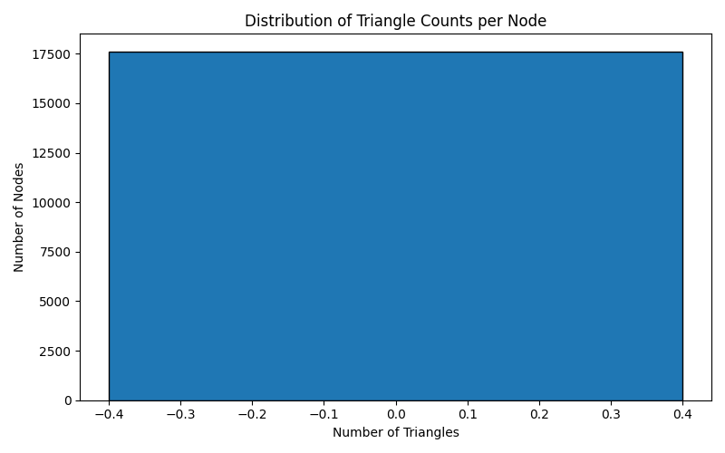

# Network Analysis Report

========================

**Author:** Mcrowther  

**Date:** 2025-07-04  

**Project:** Graph Metrics

## Graph Metrics

This section provides structural and topological insights into the graph. It includes statistics like node/edge counts, path metrics, clustering behavior, centrality measures, and node similarity — all of which help characterize how the network is organized and how it behaves.
### Basic Structure

This section provides an overview of the graph's size and basic structure, including the number of nodes and edges, as well as the number of isolated nodes (nodes with no relationships). These metrics give a quick sense of the graph's scale and connectivity.  
**Node Count** : 17625  
**Edge Count** : 16641  
**Isolated Nodes**
|Title|Id|
| :---: | :---: |
|C0067|http://www.nv_ontology.org/245d5be2-bfac-4799-986c-61694048b824|
|C0067|http://www.nv_ontology.org/c3c63bd9-a294-4c80-b1f1-cc6bff5ba337|
|C0067|http://www.nv_ontology.org/3ad39224-bd59-42bf-955a-a72643c00df9|

### Degree Distribution

The degree distribution shows how many connections each node has. It reveals the network's connectivity pattern — whether most nodes are evenly connected, or if there are hubs with disproportionately high degrees. A log-log scale is used to highlight scale-free or power-law characteristics commonly seen in real-world networks.  
**Minimum Degree** : 0  
**Maximum Degree** : 204  
**Mean Degree** : 1.888340425531915  
**Median Degree** : 2.0  
**Standard Deviation** : 2.835061673512782
### Connected Components

A connected component is a group of nodes where each node is reachable from any other node in the group. This section summarizes the number and size of connected components, which indicates how fragmented or cohesive the graph is. A well-integrated graph usually has a single large component containing most of the nodes.  
**Total Components** : 2232  
**Total Nodes** : 17625  
**Largest Component Size** : 1377  
**Smallest Component Size** : 1  
**Average Component Size** : 7.9  
**Singleton Components** : 3  
**Percent Node In Largest Component** : 7.81%
### Shortest Paths

This section summarizes global path-based properties of the network. It analyzes shortest paths between all pairs of nodes to calculate metrics such as diameter (the longest shortest path), average path length, and effective diameter (90th percentile). These measures reflect how efficiently information can spread across the network.  
**Minimum Shortest Path** : 1  
**Maximum Shortest Path** : 2  
**Median Shortest Path** : 1.0  
**Average Shortest Path Length** : 1.0308  
**Effective Diameter** : 1.0  
**Harmonic Mean Distance** : 0.9846
### Density

This section describes the network's edge structure in terms of density and reciprocity. **Density** measures how many of the possible connections between nodes are actually present. **Reciprocity** applies to directed graphs and indicates how often relationships are bidirectional.  
**Calculated Density** : 5.4e-05  
**Calculated Reciprocity** : 0.0
### Clustering Coefficient

Clustering coefficient measures the degree to which nodes in a graph tend to cluster together. It reflects how tightly knit the neighborhood of each node is. This section includes both the **global clustering coefficient**, which summarizes the overall tendency of the network to form triangles, and the **average local clustering coefficient**, which reflects the mean tendency of individual nodes to form clusters. High clustering often indicates redundant paths and community structure.

The global coefficient is computed as the ratio of the number of closed triplets (triangles) to the total number of triplets (both open and closed). The local coefficient for a node is based on the number of links between its neighbors.  
**Global Clustering Coefficient** : 0.0  
**Average Local Clustering Coefficient** : 0.0  
**Max Triangles Per Node** : 0  
**Mean Triangles Per Node** : 0.0  
**Median Triangles Per Node** : 0  

### Centrality Metrics

Centrality metrics quantify the relative importance or influence of individual nodes within the network. These measures are vital for understanding how information, influence, or control flows through the graph. Different centrality metrics capture different notions of influence — from local connectivity to global reach.
#### Degree Centrality

Measures the number of direct connections a node has. High degree centrality indicates a node is locally well-connected and potentially influential within its immediate neighborhood.  
* **Minimum** : 0.0  
* **Maximum** : 7.0  
* **Mean** : 0.9441702127659575  
* **Median** : 0.0  
* **Standard Deviation** : 1.0003988846827165  

**Top Nodes**
|Rank|Label|Id|Score|
| :---: | :---: | :---: | :---: |
|1|TranscriptionUnit|<ul><li>title:rbsDACBZKR</li><li>id:http://www.nv_ontology.org/54b678d1-4ebd-4b7a-b021-e6e7105fe5f8</li></ul>|7.00|
|2|TranscriptionUnit|<ul><li>title:rbsDACBZKR</li><li>id:http://www.nv_ontology.org/d4f47b2f-3151-488f-8351-03bdaf73df99</li></ul>|7.00|
|3|TranscriptionUnit|<ul><li>title:rbsDACBZKR</li><li>id:http://www.nv_ontology.org/10013608-8352-49c6-b789-6fa29b24cdc3</li></ul>|7.00|
|4|TranscriptionUnit|<ul><li>title:sufABCDSE</li><li>id:http://www.nv_ontology.org/a5979848-df36-4134-adce-95ac54fef466</li></ul>|6.00|
|5|TranscriptionUnit|<ul><li>title:sufABCDSE</li><li>id:http://www.nv_ontology.org/9ca65ff1-ae7a-4a47-80d8-74a4bd3140f2</li></ul>|6.00|
|6|TranscriptionUnit|<ul><li>title:sufABCDSE</li><li>id:http://www.nv_ontology.org/523a36af-8661-491b-bf2c-979987852944</li></ul>|6.00|
|7|TranscriptionUnit|<ul><li>title:gadEF-mdtEF</li><li>id:http://www.nv_ontology.org/ff059ade-5592-4710-bd62-86653c5cfe22</li></ul>|4.00|
|8|TranscriptionUnit|<ul><li>title:rpsF-priB-rpsR-rplI</li><li>id:http://www.nv_ontology.org/5f9d46ad-0006-4fe9-8d13-5cf21dadd148</li></ul>|4.00|
|9|Protein|<ul><li>title:DNA-binding transcriptional activator AaeR</li><li>id:http://www.nv_ontology.org/4ff668d4-f4ea-42a7-9b95-b83cf2255621</li></ul>|4.00|
|10|TranscriptionUnit|<ul><li>title:gadEF-mdtEF</li><li>id:http://www.nv_ontology.org/adcababc-9eee-4165-8a2a-78b6effe361d</li></ul>|4.00|

#### Betweenness Centrality

Captures how often a node lies on the shortest paths between other nodes. Nodes with high betweenness act as bridges or brokers, controlling the flow of information between different parts of the network.  
* **Minimum** : 0.0  
* **Maximum** : 7.0  
* **Mean** : 0.02995744680851064  
* **Median** : 0.0  
* **Standard Deviation** : 0.2518788933448576  

**Top Nodes**
|Rank|Label|Id|Score|
| :---: | :---: | :---: | :---: |
|1|TranscriptionUnit|<ul><li>title:rbsDACBZKR</li><li>id:http://www.nv_ontology.org/54b678d1-4ebd-4b7a-b021-e6e7105fe5f8</li></ul>|7.0000|
|2|TranscriptionUnit|<ul><li>title:rbsDACBZKR</li><li>id:http://www.nv_ontology.org/d4f47b2f-3151-488f-8351-03bdaf73df99</li></ul>|7.0000|
|3|TranscriptionUnit|<ul><li>title:rbsDACBZKR</li><li>id:http://www.nv_ontology.org/10013608-8352-49c6-b789-6fa29b24cdc3</li></ul>|7.0000|
|4|TranscriptionUnit|<ul><li>title:sufABCDSE</li><li>id:http://www.nv_ontology.org/a5979848-df36-4134-adce-95ac54fef466</li></ul>|6.0000|
|5|TranscriptionUnit|<ul><li>title:sufABCDSE</li><li>id:http://www.nv_ontology.org/9ca65ff1-ae7a-4a47-80d8-74a4bd3140f2</li></ul>|6.0000|
|6|TranscriptionUnit|<ul><li>title:sufABCDSE</li><li>id:http://www.nv_ontology.org/523a36af-8661-491b-bf2c-979987852944</li></ul>|6.0000|
|7|TranscriptionUnit|<ul><li>title:gadEF-mdtEF</li><li>id:http://www.nv_ontology.org/ff059ade-5592-4710-bd62-86653c5cfe22</li></ul>|4.0000|
|8|TranscriptionUnit|<ul><li>title:rpsF-priB-rpsR-rplI</li><li>id:http://www.nv_ontology.org/5f9d46ad-0006-4fe9-8d13-5cf21dadd148</li></ul>|4.0000|
|9|Protein|<ul><li>title:DNA-binding transcriptional activator AaeR</li><li>id:http://www.nv_ontology.org/4ff668d4-f4ea-42a7-9b95-b83cf2255621</li></ul>|4.0000|
|10|TranscriptionUnit|<ul><li>title:gadEF-mdtEF</li><li>id:http://www.nv_ontology.org/adcababc-9eee-4165-8a2a-78b6effe361d</li></ul>|4.0000|

#### Closeness Centrality

Reflects how close a node is to all other nodes in the network. Nodes with high closeness can quickly interact with all others and are typically efficient spreaders of information.  
* **Minimum** : 0.0  
* **Maximum** : 1.0  
* **Mean** : 0.5345013171225936  
* **Median** : 1.0  
* **Standard Deviation** : 0.49320192065252794  

**Top Nodes**
|Rank|Label|Id|Score|
| :---: | :---: | :---: | :---: |
|1|Gene|<ul><li>title:ftsW</li><li>id:http://www.nv_ontology.org/80602786-26e7-400e-81e2-d1d2b63a2846</li></ul>|1.0000|
|2|Promoter|<ul><li>title:fadLp</li><li>id:http://www.nv_ontology.org/771289eb-43cc-4012-80a1-7972f03dc291</li></ul>|1.0000|
|3|Gene|<ul><li>title:ryfD</li><li>id:http://www.nv_ontology.org/f688d7ce-6bbd-4357-92d9-28b3571649a0</li></ul>|1.0000|
|4|Promoter|<ul><li>title:lrpp</li><li>id:http://www.nv_ontology.org/5331b337-3336-46b4-885d-914d86fa823f</li></ul>|1.0000|
|5|Gene|<ul><li>title:mazF</li><li>id:http://www.nv_ontology.org/df868270-e8f5-4be7-a2ea-c3963c1af1f8</li></ul>|1.0000|
|6|Gene|<ul><li>title:hybG</li><li>id:http://www.nv_ontology.org/508ca9d8-a077-4fc1-a92e-ab6968768ec5</li></ul>|1.0000|
|7|Promoter|<ul><li>title:fiup</li><li>id:http://www.nv_ontology.org/ac234671-2d48-459e-bb21-8b0b1d5e287a</li></ul>|1.0000|
|8|Gene|<ul><li>title:valY</li><li>id:http://www.nv_ontology.org/8425d2d5-805b-48be-ae6b-c92533142fd8</li></ul>|1.0000|
|9|TranscriptionUnit|<ul><li>title:talA-tktB</li><li>id:http://www.nv_ontology.org/3157e001-a332-4889-a944-3ecb68bbf02f</li></ul>|1.0000|
|10|Gene|<ul><li>title:purA</li><li>id:http://www.nv_ontology.org/7657c90d-b68f-4fbe-a039-c83eb585ec47</li></ul>|1.0000|

#### Page Rank

A probability-based measure originally developed by Google to rank web pages. It evaluates the influence of a node based not just on its connections, but also on the importance of those it's connected to.  
* **Minimum** : 0.15000000000000002  
* **Maximum** : 13.154999999999953  
* **Mean** : 0.2121451276595745  
* **Median** : 0.21375000000000002  
* **Standard Deviation** : 0.18993664335826269  

**Top Nodes**
|Rank|Label|Id|Score|
| :---: | :---: | :---: | :---: |
|1|TranscriptionFactor|<ul><li>title:ppGpp</li><li>id:http://www.nv_ontology.org/6a0c6b7a-fca8-4ff1-a306-713a1310aa38</li></ul>|13.155000|
|2|TranscriptionFactor|<ul><li>title:ppGpp</li><li>id:http://www.nv_ontology.org/fca22d5e-ca34-40d2-ad07-c8e8b6570b72</li></ul>|13.155000|
|3|TranscriptionFactor|<ul><li>title:ppGpp</li><li>id:http://www.nv_ontology.org/42366ea1-8807-464b-ba4f-b74110f732f1</li></ul>|13.155000|
|4|Promoter|<ul><li>title:mraZp</li><li>id:http://www.nv_ontology.org/6aa35e6d-5c94-4de1-ab96-01aa2b60c33f</li></ul>|1.233750|
|5|Promoter|<ul><li>title:mraZp</li><li>id:http://www.nv_ontology.org/2efff0a5-9e98-4186-b6e0-f3f641d70e6b</li></ul>|1.233750|
|6|Promoter|<ul><li>title:mraZp</li><li>id:http://www.nv_ontology.org/dfec42de-9ba0-4af5-b082-c91ba2b6dfde</li></ul>|1.233750|
|7|Promoter|<ul><li>title:napFp1</li><li>id:http://www.nv_ontology.org/823bfee0-bbdb-4632-85e1-191463331d27</li></ul>|1.106250|
|8|Promoter|<ul><li>title:napFp2</li><li>id:http://www.nv_ontology.org/405be525-04ba-40fe-a14f-c9b8921c466e</li></ul>|1.106250|
|9|Promoter|<ul><li>title:napFp2</li><li>id:http://www.nv_ontology.org/d1791919-90da-454b-a10b-e4a9d20eb5e1</li></ul>|1.106250|
|10|Promoter|<ul><li>title:napFp2</li><li>id:http://www.nv_ontology.org/d2f10af0-ab3a-4819-83bf-0bd915f4463f</li></ul>|1.106250|

#### Eigenvector Centrality

Evaluates a node’s influence based on the principle that connections to high-scoring nodes contribute more to the score of the node. Unlike degree centrality, which counts all neighbors equally, eigenvector centrality gives more weight to connections with influential nodes.  
* **Minimum** : 7.203759123102939e-05  
* **Maximum** : 0.38064533957457936  
* **Mean** : 0.002502274282410627  
* **Median** : 0.0019375929931101878  
* **Standard Deviation** : 0.007104661291579609  

**Top Nodes**
|Rank|Label|Id|Score|
| :---: | :---: | :---: | :---: |
|1|TranscriptionFactor|<ul><li>title:ppGpp</li><li>id:http://www.nv_ontology.org/6a0c6b7a-fca8-4ff1-a306-713a1310aa38</li></ul>|0.380645|
|2|TranscriptionFactor|<ul><li>title:ppGpp</li><li>id:http://www.nv_ontology.org/fca22d5e-ca34-40d2-ad07-c8e8b6570b72</li></ul>|0.380645|
|3|TranscriptionFactor|<ul><li>title:ppGpp</li><li>id:http://www.nv_ontology.org/42366ea1-8807-464b-ba4f-b74110f732f1</li></ul>|0.380645|
|4|Gene|<ul><li>title:csrA</li><li>id:http://www.nv_ontology.org/5a751186-3590-46bb-999b-713ad920055b</li></ul>|0.078244|
|5|Gene|<ul><li>title:csrA</li><li>id:http://www.nv_ontology.org/283c83c3-5c7b-4833-9a9d-856871c784be</li></ul>|0.078244|
|6|Gene|<ul><li>title:csrA</li><li>id:http://www.nv_ontology.org/53651cfe-0968-41f1-9dd9-56738cdfd96b</li></ul>|0.078244|
|7|Gene|<ul><li>title:gadC</li><li>id:http://www.nv_ontology.org/d54653c2-e674-4482-ba98-57b478f1720e</li></ul>|0.074513|
|8|Gene|<ul><li>title:gadC</li><li>id:http://www.nv_ontology.org/e672ec3d-103d-4c89-9b8d-9f0be23cba99</li></ul>|0.074513|
|9|Gene|<ul><li>title:gadC</li><li>id:http://www.nv_ontology.org/a8535d21-f820-4d8b-aa00-2c6e82af95a0</li></ul>|0.074513|
|10|Gene|<ul><li>title:gabT</li><li>id:http://www.nv_ontology.org/f88f2096-20b9-436e-a3a9-97b2b29929d8</li></ul>|0.052187|

### Assortativity

Assortativity measures the similarity of connections in the network with respect to the node degree. **Degree assortativity** specifically quantifies whether nodes with similar numbers of connections tend to be linked. A positive assortativity coefficient indicates that nodes tend to connect with others of similar degree (assortative mixing), while a negative coefficient suggests connections between nodes of differing degree (disassortative mixing).  
**Degree Assortativity Coefficient** : -0.0233
### Node Similarity

This section explores similarity relationships between nodes based on structural or attribute-based features. Node similarity metrics are useful for tasks such as recommendation, clustering, link prediction, and entity resolution. We focus on structural similarity, which compares the neighborhoods of nodes to identify similar roles or positions in the graph.

Cosine similarity compares nodes based on the overlap of their neighbors. Each node is treated as a vector of connections, and the cosine of the angle between these vectors indicates similarity. This method is commonly used in recommendation systems and for detecting structural equivalence.  
**Pair Count** : 33201  
**Maximum Similarity** : 1.0  
**Minimum Similarity** : 0.125  
**Mean Similarity** : 0.3352  
**Median Similarity** : 0.3333  
**Standard Deviation** : 0.0371  
**Similar Node Pairs**
|Rank|Node A Label|Node A Id|Node B Label|Node B Id|Similarity Score|
| :---: | :---: | :---: | :---: | :---: | :---: |
|1|TranscriptionUnit|<ul><li>title:csrA</li><li>id:http://www.nv_ontology.org/40c3004e-6301-4d08-a87e-7b4f858961b6</li></ul>|TranscriptionUnit|<ul><li>title:csrA</li><li>id:http://www.nv_ontology.org/26e23068-b3fb-42e8-9ded-9d611f282697</li></ul>|1.0000|
|2|TranscriptionUnit|<ul><li>title:csrA</li><li>id:http://www.nv_ontology.org/40c3004e-6301-4d08-a87e-7b4f858961b6</li></ul>|TranscriptionUnit|<ul><li>title:csrA</li><li>id:http://www.nv_ontology.org/64711325-c62b-4423-ae1f-0f3f66b435f8</li></ul>|1.0000|
|3|TranscriptionUnit|<ul><li>title:gadBC</li><li>id:http://www.nv_ontology.org/c398a7ff-8057-4171-99c6-e9d48c007e17</li></ul>|TranscriptionUnit|<ul><li>title:gadBC</li><li>id:http://www.nv_ontology.org/12c6ed4b-7152-4d4d-a5ad-d33a3edb028c</li></ul>|1.0000|
|4|TranscriptionUnit|<ul><li>title:gadBC</li><li>id:http://www.nv_ontology.org/12c6ed4b-7152-4d4d-a5ad-d33a3edb028c</li></ul>|TranscriptionUnit|<ul><li>title:gadBC</li><li>id:http://www.nv_ontology.org/c398a7ff-8057-4171-99c6-e9d48c007e17</li></ul>|1.0000|
|5|TranscriptionUnit|<ul><li>title:hdeAB-yhiD</li><li>id:http://www.nv_ontology.org/3794c055-c7b6-4cea-8c00-e1281d9f6f1a</li></ul>|TranscriptionUnit|<ul><li>title:hdeAB-yhiD</li><li>id:http://www.nv_ontology.org/dd0dc58f-7f28-4417-a92c-b8976e4b9d27</li></ul>|1.0000|
|6|TranscriptionUnit|<ul><li>title:patA</li><li>id:http://www.nv_ontology.org/4b69b61a-d207-409b-8621-2a36f283a973</li></ul>|TranscriptionUnit|<ul><li>title:patA</li><li>id:http://www.nv_ontology.org/2742f33c-b682-4905-be5e-8ddc87218985</li></ul>|1.0000|
|7|TranscriptionUnit|<ul><li>title:hdeD</li><li>id:http://www.nv_ontology.org/c3519eb3-9946-4a18-8b74-d2e3dcac1742</li></ul>|TranscriptionUnit|<ul><li>title:hdeD</li><li>id:http://www.nv_ontology.org/1ee598d1-779e-4e79-90b3-18353a84aa26</li></ul>|1.0000|
|8|TranscriptionUnit|<ul><li>title:hdeD</li><li>id:http://www.nv_ontology.org/44594c95-84a8-47e8-a087-486071858b4b</li></ul>|TranscriptionUnit|<ul><li>title:hdeD</li><li>id:http://www.nv_ontology.org/d4da5e77-c078-4e24-b9c4-7a6fd360655e</li></ul>|1.0000|
|9|TranscriptionUnit|<ul><li>title:dps</li><li>id:http://www.nv_ontology.org/fabb2359-5ba7-4b66-af82-16529285d6d3</li></ul>|TranscriptionUnit|<ul><li>title:dps</li><li>id:http://www.nv_ontology.org/d1e3a8c0-ee37-4ced-8d43-b1af47e096c2</li></ul>|1.0000|
|10|TranscriptionUnit|<ul><li>title:osmY</li><li>id:http://www.nv_ontology.org/07f952ae-a169-4bd6-b104-2554d2d50da5</li></ul>|TranscriptionUnit|<ul><li>title:osmY</li><li>id:http://www.nv_ontology.org/580d72e8-e277-4db1-98bf-43cfa97bd45b</li></ul>|1.0000|

## Semantic Metrics

This section provides a high-level semantic summary of the graph, including node and relationship type distributions, their connectivity, and data coverage.
### Node Label Distribution

Nodes in the graph may belong to different conceptual categories (labels). This summarizes label frequency, the diversity of their relationship types, and property coverage per label to characterize semantic structure.  
**Groupings**
|Label|Node Count|Connected Relationship Types|Property Coverage|
| :---: | :---: | :---: | :---: |
|Transcription|7395|<ul><li>activated</li><li>activator</li></ul>|<ul><li>NCIT_C52469:100%</li><li>title:100%</li></ul>|
|Gene|5652|<ul></ul>|<ul><li>NCIT_C52469:100%</li><li>title:100%</li><li>hasSequence:0%</li></ul>|
|Promoter|3495|<ul></ul>|<ul><li>NCIT_C52469:100%</li><li>title:100%</li><li>hasSequence:92%</li></ul>|
|Activation|450|<ul><li>activated</li><li>activator</li></ul>|<ul><li>NCIT_C49020:100%</li><li>NCIT_C52469:100%</li><li>title:100%</li></ul>|
|TranscriptionUnit|363|<ul><li>hasPart</li></ul>|<ul><li>NCIT_C52469:100%</li><li>title:100%</li><li>NCIT_C49020:2%</li></ul>|
|Repression|186|<ul><li>repressed</li><li>repressor</li></ul>|<ul><li>NCIT_C49020:100%</li><li>NCIT_C52469:100%</li><li>title:100%</li></ul>|
|Protein|39|<ul><li>hasPart</li></ul>|<ul><li>NCIT_C52469:100%</li><li>title:100%</li><li>hasSequence:62%</li><li>role:8%</li></ul>|
|GeneticProduction|21|<ul><li>product</li><li>template</li></ul>|<ul><li>NCIT_C52469:100%</li><li>title:100%</li></ul>|
|TranscriptionFactor|9|<ul></ul>|<ul><li>NCIT_C52469:100%</li><li>title:100%</li><li>role:33%</li></ul>|
|Operon|9|<ul><li>hasPart</li></ul>|<ul><li>NCIT_C52469:100%</li><li>title:100%</li></ul>|
|RNA|6|<ul></ul>|<ul><li>NCIT_C52469:100%</li><li>title:100%</li></ul>|

### Relationship Type Semantics

This summarizes each relationship type by how often it appears, what node types it connects, and the most common label pairings.  
**Groupings**
|Relationship Type|Count|Source|Target|Label Pairs|
| :---: | :---: | :---: | :---: | :---: |
|activator|7845|<ul><li>Activation</li><li>Transcription</li></ul>|<ul><li>Promoter</li><li>TranscriptionFactor</li></ul>|<ul><li>Transcription→Promoter (7395)</li><li>Activation→TranscriptionFactor (450)</li></ul>|
|activated|7845|<ul><li>Activation</li><li>Transcription</li></ul>|<ul><li>Gene</li><li>Promoter</li><li>TranscriptionUnit</li></ul>|<ul><li>Transcription→Gene (7395)</li><li>Activation→TranscriptionUnit (315)</li><li>Activation→Promoter (135)</li></ul>|
|hasPart|537|<ul><li>Operon</li><li>Protein</li><li>TranscriptionUnit</li></ul>|<ul><li>Gene</li><li>Protein</li><li>TranscriptionUnit</li></ul>|<ul><li>TranscriptionUnit→Gene (504)</li><li>Protein→Protein (24)</li><li>Operon→TranscriptionUnit (9)</li></ul>|
|repressor|186|<ul><li>Repression</li></ul>|<ul><li>TranscriptionFactor</li></ul>|<ul><li>Repression→TranscriptionFactor (186)</li></ul>|
|repressed|186|<ul><li>Repression</li></ul>|<ul><li>Gene</li><li>Promoter</li><li>TranscriptionUnit</li></ul>|<ul><li>Repression→Promoter (135)</li><li>Repression→TranscriptionUnit (39)</li><li>Repression→Gene (12)</li></ul>|
|template|21|<ul><li>GeneticProduction</li></ul>|<ul><li>Gene</li></ul>|<ul><li>GeneticProduction→Gene (21)</li></ul>|
|product|21|<ul><li>GeneticProduction</li></ul>|<ul><li>Protein</li><li>RNA</li></ul>|<ul><li>GeneticProduction→Protein (15)</li><li>GeneticProduction→RNA (6)</li></ul>|

### Sequence Similarity

This section compares physical entity nodes by sequence. It identifies exact sequence matches across nodes and lists shared identifiers.  
**Shared Sequences**  

**Aaatgtatttctttttcgcgcaatgggtgatagaaaatcgctccaagtgataatgcttatcaaaattattatcactttcac**
|Title|Id|
| :---: | :---: |
|fiup|http://www.nv_ontology.org/ac234671-2d48-459e-bb21-8b0b1d5e287a|
|fiup|http://www.nv_ontology.org/fb0f4af7-72d7-4c1d-956d-adf5a79914fb|
|fiup|http://www.nv_ontology.org/fda83ac4-45e1-41a2-bf20-3840846e96f4|

  

**Ggtcatttttgagtgcaaaaagtgctgtaactctgaaaaagcgatggtagaatccatttttaagcaaacggtgattttgaa**
|Title|Id|
| :---: | :---: |
|purAp|http://www.nv_ontology.org/968caf67-ecd1-49d3-b320-7e59e6d361cc|
|purAp|http://www.nv_ontology.org/eca218ba-c52b-4b13-86b8-80d03519895a|
|purAp|http://www.nv_ontology.org/a2000c12-ca3c-4980-973d-fc4430a2233d|

  

**Gatacaatgcgataaaattgcccttgcgaaggtcattcgctttggttagtattcacacccgcttcagtgggaaagattaaa**
|Title|Id|
| :---: | :---: |
|secGp1|http://www.nv_ontology.org/35f83de6-fcd7-4904-99a8-a07752ad9c5a|
|secGp1|http://www.nv_ontology.org/c0f73688-7935-4d2e-af76-83fb3e4acd51|
|secGp1|http://www.nv_ontology.org/2c9e33d8-00d3-470d-9287-d9e51c62a010|

  

**Gaagtcaacctgttgctgcaaaaagcagcacaaggtgcatttcatggtatagttgactatacggaattgccgttggtctct**
|Title|Id|
| :---: | :---: |
|pgkp1|http://www.nv_ontology.org/2e98e0da-ee61-41fc-934a-2a6d14b1550c|
|pgkp1|http://www.nv_ontology.org/690df629-29ef-4735-bc4d-d237ae167b8c|
|pgkp1|http://www.nv_ontology.org/a05a5341-6cde-42cd-9e7f-41dfc8d462d0|

  

**Ctgcagatgatatttagcaaagtggtaagcgaagccggggaatctgagtaaaatagcgcggttcttttgtaccggagccgc**
|Title|Id|
| :---: | :---: |
|pabAp|http://www.nv_ontology.org/280ede38-d619-4771-b431-4f395ef4e56e|
|pabAp|http://www.nv_ontology.org/2ab60cfd-b955-4f40-a1b9-2e55dc999936|
|pabAp|http://www.nv_ontology.org/4e2e86d8-4467-41a6-a463-c823b7fca40b|

  

**Agatacgtaaaattaggtaaagggatggccttgttcttgaaggctatttagaatctcttcacttgctttttttctgctctg**
|Title|Id|
| :---: | :---: |
|ppiAp1|http://www.nv_ontology.org/387747c8-5959-490f-84e9-93b844e905bd|
|ppiAp1|http://www.nv_ontology.org/32f8dd69-014d-435a-a73a-d38dfc555f5c|
|ppiAp1|http://www.nv_ontology.org/98bf73b9-2d0b-4fc5-8692-b1b041206769|

  

**Tggtgtaaatcccggttggctgtattgacgttttcacattctgttgacagattgtaggtcacgaggggcattttatggagg**
|Title|Id|
| :---: | :---: |
|dppAp|http://www.nv_ontology.org/a4a2030c-0860-45ed-abd1-81a538d0a427|
|dppAp|http://www.nv_ontology.org/30b88ddc-e160-454f-b21d-229b28ea7752|
|dppAp|http://www.nv_ontology.org/d44cbb78-d143-4d8e-a436-960e29f6633e|

  

**Ccacaaagagtcacagggattgagtgttgaaatgatccggatgagcatgtatctttatggttatgttataacataacaggt**
|Title|Id|
| :---: | :---: |
|ykgMp|http://www.nv_ontology.org/3aaf3a1c-e020-428c-8d35-802c33114c5f|
|ykgMp|http://www.nv_ontology.org/7e5377f4-c63c-46cc-9ed6-a69de43eac4c|
|ykgMp|http://www.nv_ontology.org/7b0b2008-4d3c-4613-be62-75f3dbbe9646|

  

**Actcattaataacataagagaatgcgatggcttgcaaaagtaattcattgcctgaataatataaattatatataaatctta**
|Title|Id|
| :---: | :---: |
|sdiAp1|http://www.nv_ontology.org/b2d36af9-36bd-4d8f-82d1-02bf8d3d2b91|
|sdiAp1|http://www.nv_ontology.org/82c1b173-56db-41b7-ac72-12f07b217d23|
|sdiAp1|http://www.nv_ontology.org/0d7dc659-8278-4bb3-97ed-e16cb27574fe|

  

**Aaagtgctcttcgcataaacctgattgatttagacgtctggatgccttaacatccatttcattgacggcgttgcccgtttc**
|Title|Id|
| :---: | :---: |
|metNp|http://www.nv_ontology.org/420bbd23-c76e-4b95-babe-1a6797399622|
|metNp|http://www.nv_ontology.org/4ffdecfd-275d-4251-9b9c-fe0c35727245|
|metNp|http://www.nv_ontology.org/ae3bd8bc-193e-4064-9885-fbe3652730f7|

  

**Gaaatctatagcgcatttttctcgcttaccatttctcgttgaaccttgtaatctgctggcacgcaaaattactttcacatg**
|Title|Id|
| :---: | :---: |
|nfsBp|http://www.nv_ontology.org/b0dce7b7-2303-4c25-b960-a4a6787f6dfa|
|nfsBp|http://www.nv_ontology.org/39752021-1810-438c-81a6-58318e8b8df5|
|nfsBp|http://www.nv_ontology.org/10aa217a-6f26-48b5-aa60-a7c0df19c525|

  

**Atcgatttgataatggaaacgcattagccgaatcggcaaaaattggttaccttacatctcatcgaaaacacggaggaagta**
|Title|Id|
| :---: | :---: |
|ahpCp1|http://www.nv_ontology.org/f20a0ca4-1b13-42f2-991c-523f1a3a6d95|
|ahpCp1|http://www.nv_ontology.org/75ceb7a4-5a60-413c-8afd-32ecb568488b|
|ahpCp1|http://www.nv_ontology.org/c9617363-07b9-4fcc-b379-bc6016c66b01|

  

**Ataaaggtgaatttgatttacatcaataagcggggttgctgaatcgttaaggtaggcggtaatagaaaagaaatcgaggca**
|Title|Id|
| :---: | :---: |
|nirBp|http://www.nv_ontology.org/9e299328-1a1f-4dc0-84f9-f613d756e696|
|nirBp|http://www.nv_ontology.org/9853bcf4-2fed-4178-a562-a4f0e8a7adf3|
|nirBp|http://www.nv_ontology.org/74a186ba-75b9-4e8d-9202-3e1d8a550dbf|

  

**Aagcgataacctgttgattattgaatctttcggggagatggcttataacatttcttacctgaccagggtaccgggaaccaa**
|Title|Id|
| :---: | :---: |
|gnsAp2|http://www.nv_ontology.org/44a96e66-8025-4f8f-8b6f-18142b457f77|
|gnsAp2|http://www.nv_ontology.org/88cafca0-9584-4ca2-8b7f-94b296774820|
|gnsAp2|http://www.nv_ontology.org/fa75cec6-3024-4f3f-9c74-096fed223271|

  

**Atagacatgtcggacgaaaattcgaagatgtttaccgtggaaaagggtaaaataacggattaacccaagtataaatgagcg**
|Title|Id|
| :---: | :---: |
|gyrBp|http://www.nv_ontology.org/1d8c8429-3790-4d40-a699-7f1d5d6bd1a3|
|gyrBp|http://www.nv_ontology.org/ef49c42d-ba6e-400a-bdd6-8c97bda85307|
|gyrBp|http://www.nv_ontology.org/bf70216a-e7b8-456a-aa6f-db8890d70181|

  

**Cagcaatgggtaaagtctggtttatcgttggtttagttgtcagcaggtattatatcgccatagatgctacgaatattattg**
|Title|Id|
| :---: | :---: |
|mgtAp1|http://www.nv_ontology.org/5c92bb7b-8023-4e99-9fa7-c8335246ad07|
|mgtAp1|http://www.nv_ontology.org/8ceacc1a-1c84-4118-991b-24d7ea040b40|
|mgtAp1|http://www.nv_ontology.org/ed1a1be7-2816-4b14-bb4c-c967864ce1a5|

  

**Aaaagccgcatgttgaataatattttcaactgagttatcaagatgtgattagattattattcttttactgtatctaccgtt**
|Title|Id|
| :---: | :---: |
|dadAp3|http://www.nv_ontology.org/199cf3da-20b6-44b5-879f-f01f2db3f9ff|
|dadAp3|http://www.nv_ontology.org/d917fa5e-bb12-4b18-b742-f5f511dc119f|
|dadAp3|http://www.nv_ontology.org/9d186e79-168b-4786-882d-68ea93be11dc|

  

**Gcaggatattgcataaactttaaaaactttaccaacttacggtttctttaagtttgtgtgtgcgttattaatcaccaaact**
|Title|Id|
| :---: | :---: |
|dacCp|http://www.nv_ontology.org/7fd6e461-11ff-432e-8fae-c94b314bbc6a|
|dacCp|http://www.nv_ontology.org/bc96359f-dfc8-412c-8266-7ccbb4983f8b|
|dacCp|http://www.nv_ontology.org/aef35262-7a7a-448b-93fe-9d8333a4582a|

  

**Atcattcaatttgttatttttgtgttgcaattcattctccgacacgccattttctttctctcgcaaattcgttttggatgc**
|Title|Id|
| :---: | :---: |
|yceJp|http://www.nv_ontology.org/4ca73d78-e98a-4ce3-a362-4da3190c5631|
|yceJp|http://www.nv_ontology.org/6f478ccc-e165-4d14-9766-e3300aa4f1c2|
|yceJp|http://www.nv_ontology.org/065a2b6a-ab32-4dad-a9a4-67b5c45c7fe5|

  

**Tacgaaaagtacggcattgataatcattttcaatatcatttaattaactataatgaaccaactgcttacgcggcattaaca**
|Title|Id|
| :---: | :---: |
|sodAp|http://www.nv_ontology.org/6ea6e78c-5238-4916-897a-815984f26bba|
|sodAp|http://www.nv_ontology.org/34a94ac5-767d-45ef-bac4-504666ff8815|
|sodAp|http://www.nv_ontology.org/c9bf93b3-ae29-4801-9e1c-c5cd177de091|

  

**Tgcttttccatacaagacctgatgctgccacccgaggcttaaccagggtacaattgcccgctaattaacacctgcataaaa**
|Title|Id|
| :---: | :---: |
|yciCp|http://www.nv_ontology.org/0de146cc-ccca-47ef-8ebb-13af2aea3e42|
|yciCp|http://www.nv_ontology.org/076d668a-1207-444b-afe3-4404e30bff65|
|yciCp|http://www.nv_ontology.org/70fdb744-6e53-4b93-9fed-36421028f7c1|

  

**Agagcggcgtttctcgccctgttccgcagctaaaacgcacgaccatgcgtatacttatagggttgctggtgcaaaatccag**
|Title|Id|
| :---: | :---: |
|rpoDp1|http://www.nv_ontology.org/215ecac5-0a78-4f43-8550-6c6188af3c03|
|rpoDp1|http://www.nv_ontology.org/61d0e955-e6d9-4e1d-9826-8cea121574d9|
|rpoDp1|http://www.nv_ontology.org/b0840fac-36da-48ef-8fd5-67bcf9b51d1f|

  

**Accgtgcgaaaagcctctttcggtgttagcgtaacaacaaaagattgttatgcttgaaatatggtgatgccgtacccataa**
|Title|Id|
| :---: | :---: |
|clpPp1|http://www.nv_ontology.org/2e8ec523-14ef-4165-88ad-14c021f707cb|
|clpPp1|http://www.nv_ontology.org/5b900d3c-ab69-4f67-8c34-4a8ed736e9db|
|clpPp1|http://www.nv_ontology.org/96d3eb8e-14e0-442d-b227-01ccb7407fab|

  

**Gttagctatagcatacaaaatcacttgaccgatatgttagtcatggctaatcttgtttgcatcaacacaccgcacggtgtt**
|Title|Id|
| :---: | :---: |
|ydfAp8|http://www.nv_ontology.org/537c23c3-c800-4aef-89dc-54ef90c0b11d|
|ydfAp8|http://www.nv_ontology.org/e810f162-7530-410f-a549-2ab251158835|
|ydfAp8|http://www.nv_ontology.org/5ebf021d-bfe1-42fb-ba30-d2ef12a3a116|

  

**Cagggctggcaggctaattcgggcttgccagcctttttttgtctcgctaagttagatggcggatcgggcttgcccttatta**
|Title|Id|
| :---: | :---: |
|hupBp3|http://www.nv_ontology.org/feefeecd-e6b1-4afb-a50d-0d135ad799c8|
|hupBp3|http://www.nv_ontology.org/1f1e78fa-3e57-4416-a227-bb5c004b4abf|
|hupBp3|http://www.nv_ontology.org/ed2583c1-9677-4306-9940-5e0ca606d924|

  

**Gagttcgccagataccattttgatgcgtgacgaatgctttgccatccagtaccatagcgccctttccattcctggacctga**
|Title|Id|
| :---: | :---: |
|rapAp1|http://www.nv_ontology.org/aa7c917c-2666-4edf-bf9f-b19bc534493c|
|rapAp1|http://www.nv_ontology.org/29091ac7-fa00-4496-ac4f-2dd333102ad2|
|rapAp1|http://www.nv_ontology.org/db32f2ca-e5cd-4d49-8f0b-4909b5d226d7|

  

**Attgttaactggttaacgtcacctggaggcaccaggcactgcatcacaaaattcattgttgaggacgcgataatgaaaacg**
|Title|Id|
| :---: | :---: |
|dicBp|http://www.nv_ontology.org/756829d9-5b82-4fef-a442-9fc3996e380f|
|dicBp|http://www.nv_ontology.org/0e447106-e00b-436f-a212-d29be7f9df98|
|dicBp|http://www.nv_ontology.org/361d8cd9-9a63-470a-bd67-ab7a5d8e965a|

  

**Aaaaattaaagcgcaagattgttggtttttgcgtgatggtgaccgggcagcctaaaggctatccttaaccagggagctgat**
|Title|Id|
| :---: | :---: |
|adap|http://www.nv_ontology.org/0d486e99-209e-4e80-b883-84dfe5d05091|
|adap|http://www.nv_ontology.org/75c8fc83-78b4-4adc-8991-95dde80feb9e|
|adap|http://www.nv_ontology.org/884ae855-f5f8-470e-8a97-39c676e5b379|

  

**Atattttttgaaacgctgtttttgttttccttttggattaatttcagcgtataatgcgcgccaattgactcttgaatggtt**
|Title|Id|
| :---: | :---: |
|pykFp|http://www.nv_ontology.org/2d34733a-5fc0-4619-82b5-d66a279e7797|
|pykFp|http://www.nv_ontology.org/01c51f27-72df-4cfb-935f-48712c7feea8|
|pykFp|http://www.nv_ontology.org/b3310615-6325-4808-a0a3-2b641ac45ebd|

  

**Cctgtcttgtgttgacaacattttctgctaaccctgtgacctgcaatactgttttgcgggtgatcgacaaggagacttaac**
|Title|Id|
| :---: | :---: |
|pepDp3|http://www.nv_ontology.org/6d96a865-f169-477a-97c0-0f06283ad5a9|
|pepDp3|http://www.nv_ontology.org/6b7f485f-a85e-4604-bf9e-965bb6a6be93|
|pepDp3|http://www.nv_ontology.org/b56814ef-918c-4ba0-b7d9-addb6d0c8e39|

  

**Caaaaaaagctcaaacatccttgatgcaaagcactatatatagactttaaaatgcgtcccaacccaatatgttgtattaat**
|Title|Id|
| :---: | :---: |
|nrdDp|http://www.nv_ontology.org/6273bc96-3ac1-486f-b307-02e89dc922ea|
|nrdDp|http://www.nv_ontology.org/f88b26ff-085b-41af-acec-8f6291604c35|
|nrdDp|http://www.nv_ontology.org/09f87625-b6f8-428a-a83f-ec1a7909fdff|

  

**Cgccagcaggtgccaacattgaacagttcatttttgcgggtaaaacaatatactaccgtaacggactttgtgtggatgaga**
|Title|Id|
| :---: | :---: |
|nagCp1|http://www.nv_ontology.org/b1da1b70-98f2-44f3-9eac-8537c38fbee2|
|nagCp1|http://www.nv_ontology.org/713ab097-606a-44fd-8f3b-278df6303d8f|
|nagCp1|http://www.nv_ontology.org/44e7817f-28bd-472b-88ef-322bff1b98d6|

  

**Attcagagataacttgaagcgggtcaaagaagcgctgaaggaatcgcgttttgataagcagttacttaatttaagtgacga**
|Title|Id|
| :---: | :---: |
|pykAp2|http://www.nv_ontology.org/2f232491-466e-434e-a85e-b5ba31dedf73|
|pykAp2|http://www.nv_ontology.org/6da1ff01-20f1-48de-9057-3d4b5cfabcb3|
|pykAp2|http://www.nv_ontology.org/964ee8c1-b22d-4d99-a5ce-0551a95fef64|

  

**Cgttgctaaaattcttagccatactggacaactcccctatggagtcataatcttaatcaatcatttgattaagaatggact**
|Title|Id|
| :---: | :---: |
|cecRp|http://www.nv_ontology.org/a083273d-c541-4069-ad74-248155a21bbd|
|cecRp|http://www.nv_ontology.org/60f22724-c8d5-4f6c-8ef2-3d049e51417f|
|cecRp|http://www.nv_ontology.org/e0ba8234-ca45-4c17-b321-60e9856cc2ce|

  

**Acaaatctcatgttgcgtggtggtcgcttttaccacagatgcgtttatgccagtatggtttgttgaatttttattaaatct**
|Title|Id|
| :---: | :---: |
|metHp1|http://www.nv_ontology.org/ba099b23-14ce-4ae5-81cd-342b2f5d9368|
|metHp1|http://www.nv_ontology.org/9e20b16a-0090-429e-95eb-6d50354ff253|
|metHp1|http://www.nv_ontology.org/c3f8b0c6-03df-4089-9e34-bdcf50bafbb0|

  

**Ttctcgtggtttcgccgaactttcacacttacgttcggttatgtgcttaataatgttatgaaaaagaaaccggttgcgcag**
|Title|Id|
| :---: | :---: |
|speAp|http://www.nv_ontology.org/4d2daa23-821a-4e05-b6a6-ac20e7971791|
|speAp|http://www.nv_ontology.org/ce12df44-34d7-454e-9ccc-90e14ba22cf2|
|speAp|http://www.nv_ontology.org/1ea79592-1dc0-4c41-b1d5-41821afa120c|

  

**Aaagcgcggcaactaaacgtagaacctgtcttattgagctttccggcgagagttcaatgggacaggttccagaaaactcaa**
|Title|Id|
| :---: | :---: |
|aceEp1|http://www.nv_ontology.org/04a93ec1-57c6-41dc-a06e-a6e80a028638|
|aceEp1|http://www.nv_ontology.org/673a1520-5584-41dc-963b-c9edacac4c22|
|aceEp1|http://www.nv_ontology.org/383ec314-7128-4a3d-85a3-140c104a8a89|

  

**Cccgtttaaccgtgtggattgtgtcttgcgacgatgggcactaaatgttaaaaggtgcccctcaacaaaaaagacacacag**
|Title|Id|
| :---: | :---: |
|phePp|http://www.nv_ontology.org/4ef7d422-3c5f-4d96-b57c-8a509751313f|
|phePp|http://www.nv_ontology.org/a9f0744e-bb01-4e62-a89d-3e360241eae6|
|phePp|http://www.nv_ontology.org/cd7d0221-daef-4eea-b10c-7058aa551fb7|

  

**Tttttttcatatgcctgacggagttcacacttgtaagttttcaactacgttgtagactttacatcgccaggggtgctcggc**
|Title|Id|
| :---: | :---: |
|ompAp1|http://www.nv_ontology.org/6236a813-4a57-4bef-a825-c1d7837307bf|
|ompAp1|http://www.nv_ontology.org/2910e6e5-5c27-4049-80ad-5244b7f0416e|
|ompAp1|http://www.nv_ontology.org/5935341f-987a-4a87-a0ed-ca23db0b9c6c|

  

**Gggggtgtaaaacaacgtaaagtcatggattagcgacgtctgatgacgtaatttctgcctcggaggtatttaaacaatgaa**
|Title|Id|
| :---: | :---: |
|cpxRp|http://www.nv_ontology.org/e5c65b29-eaa5-414b-87b1-0a5a596287ba|
|cpxRp|http://www.nv_ontology.org/61a914b0-8ee6-4913-b0e3-4b6835eefe93|
|cpxRp|http://www.nv_ontology.org/eed879b5-6570-4448-ace1-f8bfea58709c|

  

**Agttacatttagttacatgtttaacacttgatttaagatttgtaatggctagattgaaatcagatgtaatccattagtttt**
|Title|Id|
| :---: | :---: |
|csgDp1|http://www.nv_ontology.org/a88eb0b9-feb4-4461-a1b8-7fdb9c203901|
|csgDp1|http://www.nv_ontology.org/ba493040-655f-4fb1-8b3e-b94d95498998|
|csgDp1|http://www.nv_ontology.org/5748ce6c-3f1e-414f-ac5c-9c8d0e9522af|

  

**Ataattgaagtttatattttaccttttgcaaataataaaataacaaattatagtgacgccacagcaacaaatataaccttt**
|Title|Id|
| :---: | :---: |
|ftnAp|http://www.nv_ontology.org/24a8622f-8dfa-4d57-92fb-a3b012f16b2c|
|ftnAp|http://www.nv_ontology.org/e2468d1e-342c-4a39-a396-1dd6a2d0f0b1|
|ftnAp|http://www.nv_ontology.org/3aed49c4-2d36-4e57-97a6-d229f863bc03|

  

**Cagctcaccataaaaaagccgcatgttgaataatattttcaactgagttatcaagatgtgattagattattattcttttac**
|Title|Id|
| :---: | :---: |
|dadAp2|http://www.nv_ontology.org/50910430-8a6b-4b5a-b640-b0842f5bf3c1|
|dadAp2|http://www.nv_ontology.org/de0db1f1-e5b1-40ae-940d-dca30c0f7c5f|
|dadAp2|http://www.nv_ontology.org/74813482-ca56-4362-9ff7-9aebda2b8c2b|

  

**Cagagtgcaagtgggctttggcgtgtggcaattcttaaaacattgtctaacatgcttgttaccgtcattatcatccgtggt**
|Title|Id|
| :---: | :---: |
|cyaAp2|http://www.nv_ontology.org/7a044b18-510f-464a-9480-650d029ed936|
|cyaAp2|http://www.nv_ontology.org/fa31849f-01fc-424d-9897-fcd6c802e518|
|cyaAp2|http://www.nv_ontology.org/8454a739-1dad-49d4-bc4a-b9d120617b10|

  

**Ttcctcaacatcatcctcgcaccagtcgacgacggtttacgctttacgtatagtggcgacaattttttttatcgggaaatc**
|Title|Id|
| :---: | :---: |
|folAp|http://www.nv_ontology.org/8536cfdf-6f24-4c48-b5f7-f6ccb240c872|
|folAp|http://www.nv_ontology.org/09333522-e631-4f4b-a97e-72eeb3f2294c|
|folAp|http://www.nv_ontology.org/6df1a44e-596a-4055-bef8-57cbb701ff02|

  

**Tattttcgctatggttatgcgtaagcattgctgttgcttcgtcgcggcaatataatgagaattattatcattaaaagatga**
|Title|Id|
| :---: | :---: |
|gpmAp|http://www.nv_ontology.org/d870738f-6aa9-4a64-b9df-619c34d21cb9|
|gpmAp|http://www.nv_ontology.org/24c27835-4c7f-4cf1-a266-e5f395f1c888|
|gpmAp|http://www.nv_ontology.org/29ccd55d-4080-47aa-8509-4d6c830b1a3e|

  

**Ttagggcttgacggaaataaaagtattgagattttgttcttaatcaatatgttatttaccgtgacgaactaattgctcgtg**
|Title|Id|
| :---: | :---: |
|creAp|http://www.nv_ontology.org/faf76d64-b051-498f-9ffa-ba006cafaa47|
|creAp|http://www.nv_ontology.org/9a5fa6f4-f358-4572-9030-aa4faa6df251|
|creAp|http://www.nv_ontology.org/573035ba-ffd8-4a6c-8ffc-89111dab67f1|

  

**Acttcataaagagtcgctaaacgcttgcttttacgtcttctcctgcgatgatagaaagcagaaagcgatgaactttacagg**
|Title|Id|
| :---: | :---: |
|yifLp|http://www.nv_ontology.org/ad9f2a13-a237-4279-9d2f-d4c01778999c|
|yifLp|http://www.nv_ontology.org/e4ed4306-973d-4f18-968d-77228afb8560|
|yifLp|http://www.nv_ontology.org/c7666a2f-4624-4ba8-8099-c62d178b819d|

  

**Aatatcagcccgtcggcggaactgttttatgaagaccttgatgaagctgataacattgaggtaatccgcaaattgctggat**
|Title|Id|
| :---: | :---: |
|kdsAp|http://www.nv_ontology.org/4f001b43-7900-40dc-b28c-8518e7afddc9|
|kdsAp|http://www.nv_ontology.org/a5e6f4ff-3047-49a8-8929-1fa2382bfb7d|
|kdsAp|http://www.nv_ontology.org/16c2e28d-592d-4ad1-96b3-6a692e347ddb|

  

**Tagacatatcagttctacaaatcgcttgcatttatcatgattaacaatcattatcatttgcgagttttatttagatatatc**
|Title|Id|
| :---: | :---: |
|yqjHp|http://www.nv_ontology.org/7615ebca-db22-4962-a016-1ace23a301fc|
|yqjHp|http://www.nv_ontology.org/bf4d90fb-b06c-456d-a96c-06b0d4c43760|
|yqjHp|http://www.nv_ontology.org/417720e9-b401-4922-ab4f-c1562ce7c8bd|

  

**Atagaaaggagtaaaaaaccacatcaattagctgtataaaagaatttctacagtgattgtaaggttttttttattcctccc**
|Title|Id|
| :---: | :---: |
|nuoAp2|http://www.nv_ontology.org/0f9561de-65a5-4cab-a9d8-7af0ea873298|
|nuoAp2|http://www.nv_ontology.org/665cc27f-0bc5-4735-bdd6-d63fc65216f5|
|nuoAp2|http://www.nv_ontology.org/fc7b7d5c-f73b-4e00-9e0c-f1c2f7302c33|

  

**Tttttattgttgcatttgtgttgcaataaacgaagctaatgagcctgactataggaaataagtcttgtcaggcatagagac**
|Title|Id|
| :---: | :---: |
|feaBp2|http://www.nv_ontology.org/6cbabfbc-a8e0-45dd-9294-7a1e341b7002|
|feaBp2|http://www.nv_ontology.org/c779a33d-6a53-4f48-aff8-0b0eca59a62c|
|feaBp2|http://www.nv_ontology.org/5415dfa4-bc81-47c1-ab34-b146b80a8578|

  

**Acggtacaacatttacgccactttacgcctgaataataaaagcgtgttatactctttccctgcaatgggttccgtagcagg**
|Title|Id|
| :---: | :---: |
|rpoHp1|http://www.nv_ontology.org/4dd6365b-5963-4b11-a7bc-1f0f3cb01f89|
|rpoHp1|http://www.nv_ontology.org/8ad241f6-311f-484a-a750-60a5b775fc7f|
|rpoHp1|http://www.nv_ontology.org/e6175e4c-6ef2-4e19-8f6f-78867736b974|

  

**Aatgacttatgaaatttagtgttgacagacaaggtaccgctaagtaatattcgccccgttcacacgattcctctgtagttc**
|Title|Id|
| :---: | :---: |
|asnTp|http://www.nv_ontology.org/d0cce6b9-d9a5-4ba9-b5be-196932d49fdf|
|asnTp|http://www.nv_ontology.org/54872130-147f-4179-bd5c-f56c1a51fb48|
|asnTp|http://www.nv_ontology.org/814606a1-909d-4277-a29d-05d0065490ba|

  

**Agatcaatctggtgacgcaggatgttacctctgaagacctcgtcacgttatacggaacaacatttaactccagcggtctga**
|Title|Id|
| :---: | :---: |
|lptAp2|http://www.nv_ontology.org/5d4321f1-8f15-414d-ab72-beea366e3bc1|
|lptAp2|http://www.nv_ontology.org/ae0855f5-4860-46af-92fc-da10fc9f3efc|
|lptAp2|http://www.nv_ontology.org/1145a46e-3041-4be6-8698-fad58a64ec9c|

  

**Ttacgaggttttaattctgcctctttcaacccgcgtcaaaataaaacagtagaatattaatctttttttgtgtttatgtgc**
|Title|Id|
| :---: | :---: |
|acrEp|http://www.nv_ontology.org/d9256ffe-297e-4661-b9cf-1cbe9bc3211c|
|acrEp|http://www.nv_ontology.org/9ce64aae-1c02-4ba6-ad7e-6905eb1dff07|
|acrEp|http://www.nv_ontology.org/d53b0ced-1cf3-4b54-a480-354fe27fc282|

  

**Ccggcagagaaagcaaaaataaatgcttgactctgtagcgggaaggcgtattatgcacaccccgcgccgctgagaaaaagc**
|Title|Id|
| :---: | :---: |
|rrsBp2|http://www.nv_ontology.org/836a97bf-fe58-494d-a993-885f009af72c|
|rrsAp2|http://www.nv_ontology.org/aa50339b-7840-4f9a-8e64-9ce97d37f730|
|rrsBp2|http://www.nv_ontology.org/bd3246b1-6ee5-43b4-b567-17a6613ebeca|
|rrsBp2|http://www.nv_ontology.org/17646755-7424-41f2-bb32-c0bcd20434d2|
|rrsAp2|http://www.nv_ontology.org/d90b93f5-86af-4d60-805a-3f2c88042d58|
|rrsAp2|http://www.nv_ontology.org/7e2aa7ee-a7b3-49cc-91bd-db7ec5da8a4b|

  

**Aaccgaggtcacaacatagtaaaagcgctattggtaatggtacaatcgcgcgtttacacttattcagaacgatttttttca**
|Title|Id|
| :---: | :---: |
|ssbp1|http://www.nv_ontology.org/de52ade2-b57a-4526-ab6e-74a6624b1067|
|ssbp1|http://www.nv_ontology.org/ff04a599-12d2-4f2c-b461-8793043d50f5|
|ssbp1|http://www.nv_ontology.org/04c97e0b-5330-4859-a88f-9f9780e8daaa|

  

**Cattgtgttttatttctcacattgatgacggtcgcatgaaaaaatgatattttaatgagcattctgaaaaaatatcgatgc**
|Title|Id|
| :---: | :---: |
|yfiRp|http://www.nv_ontology.org/a1697f58-4045-4199-9a61-faf662b0841b|
|yfiRp|http://www.nv_ontology.org/829f736a-ad66-49ac-8c76-15b5955fa837|
|yfiRp|http://www.nv_ontology.org/7346a7ba-e9a3-472c-aacd-49af033648d4|

  

**Atctttgatggtcagccgattttgcatcctgttgtcctgtaacgtgttgtttaattatttgagcctaacgttacccgtgca**
|Title|Id|
| :---: | :---: |
|mgtAp2|http://www.nv_ontology.org/8b2dd369-cc5a-459a-abf9-91f4c7919afc|
|mgtAp2|http://www.nv_ontology.org/a9e7e266-9267-4039-8925-31d1b741d746|
|mgtAp2|http://www.nv_ontology.org/1eef3c84-8060-4a3b-aae5-5441e16dfe42|

  

**Ggcaagacattggcagaaatgagcattgagagccagggcgctggcgatcacaatgaaaaacatcaggcagatcgttctctg**
|Title|Id|
| :---: | :---: |
|yqhDp|http://www.nv_ontology.org/edb31253-835c-40f3-84ed-f8e0b7079e38|
|yqhDp|http://www.nv_ontology.org/8e2e1748-d7c3-40c4-85e7-a66fd62b9a48|
|yqhDp|http://www.nv_ontology.org/f041666e-0d07-4437-a1a0-944eb6788740|

  

**Aacgacattcgtttgccgggcgaagtggcgttctttatcgccaagcgtctacgatctaacgtacgtgagctggaaggggcg**
|Title|Id|
| :---: | :---: |
|dnaNp1|http://www.nv_ontology.org/d2c2311b-8d6a-488d-bded-7a3de9cb9bb6|
|dnaNp1|http://www.nv_ontology.org/5c93cd6f-a7ba-49ad-b219-1f237a5adc34|
|dnaNp1|http://www.nv_ontology.org/0f46c192-1340-4a52-93a5-e12ec299dce3|

  

**Tgatgagaagagacaagcccttttctggtccaccagggcccaaagtggtagcatatcatgaatattcctccctttgacgac**
|Title|Id|
| :---: | :---: |
|ygfBp|http://www.nv_ontology.org/32462c6a-aca1-426e-81b2-2020e4aab40b|
|ygfBp|http://www.nv_ontology.org/76bd0015-1121-4e41-a518-cc142f4e4317|
|ygfBp|http://www.nv_ontology.org/9f815c0e-12e6-4a99-b501-3558a4acbed9|

  

**Gataagaatgttttagcaatctctttctgtcatgaatccatggcagtgaccatactaatggtgactgccattgatggaggg**
|Title|Id|
| :---: | :---: |
|aidBp1|http://www.nv_ontology.org/1bb456a5-34c8-4da9-881e-75cd62d5b45c|
|aidBp1|http://www.nv_ontology.org/2fbaa54a-2256-4f24-b474-ae3e687043f8|
|aidBp1|http://www.nv_ontology.org/3ece4245-7a41-49b5-94e7-09a1158f6cf2|

  

**Ggatgtgaataaagcgtataggtttacctcaaactgcgcggctgtgttataatttgcgacctttgaatccgggatacagta**
|Title|Id|
| :---: | :---: |
|gyrAp|http://www.nv_ontology.org/623b4925-6fdc-4d74-b754-1a3c35decb88|
|gyrAp|http://www.nv_ontology.org/342fb713-11a0-454a-bb63-e14af4984d85|
|gyrAp|http://www.nv_ontology.org/44c594de-51f0-43e7-9ba1-befe134b88ec|

  

**Gctaaaaagtaaccaataaatggtatttaaaatgcaaattatcaggcgtaccctgaaacggctggaataaaccgttttcag**
|Title|Id|
| :---: | :---: |
|yeaRp|http://www.nv_ontology.org/625c409b-e8ae-4684-aae3-2de7badba88e|
|yeaRp|http://www.nv_ontology.org/d876efe6-70f4-44e3-80b7-3eb25701da12|
|yeaRp|http://www.nv_ontology.org/d714791b-6aa3-435f-a9ef-27cfc5542b05|

  

**Ccaattgccagcttaagtcgaaacaaggagactcgatatttaaatcggattacattttaactttagtaatattcttcagag**
|Title|Id|
| :---: | :---: |
|gadEp4|http://www.nv_ontology.org/7d6ce42c-c549-4b22-832b-41406e2cb251|
|gadEp4|http://www.nv_ontology.org/8f4661ed-472c-43dd-ae1e-d84af6f7f6de|
|gadEp4|http://www.nv_ontology.org/3a45c1f6-12b6-4c4e-9aeb-1105389fe4ad|

  

**Cctgtggacttaccgctcagggatgagttttgtttggcttatcgctggcaaactgtctgaaatcgcagcaataaggactca**
|Title|Id|
| :---: | :---: |
|malSp|http://www.nv_ontology.org/56e463aa-6643-49dc-ad54-3c69978c1ac4|
|malSp|http://www.nv_ontology.org/85cc4b80-85e0-4d51-80c1-7cdbbce5402b|
|malSp|http://www.nv_ontology.org/68e28965-743b-4443-9e03-0847d5744b9d|

  

**Acatttctgtaccaataagcttgccatttgacctgtatcagctttcccgataagttggaaatccgctggaagctttctgga**
|Title|Id|
| :---: | :---: |
|gltBp|http://www.nv_ontology.org/75d79435-52c5-403d-9bb5-e6bc70f59b56|
|gltBp|http://www.nv_ontology.org/1f67ad5c-6cbc-4826-a038-20608439414b|
|gltBp|http://www.nv_ontology.org/1583506a-30e3-4743-9d15-aa69bb20036e|

  

**Aacttccatgataatgaaattaattatcgttatcgatcttatttggatatgttagcatgtgcagcctaagaataggtattt**
|Title|Id|
| :---: | :---: |
|entSp2|http://www.nv_ontology.org/d1722cfc-f346-4d0c-9303-6f6f85483a5b|
|entSp2|http://www.nv_ontology.org/e96ae211-c309-4d2f-8f35-2a15aa87781e|
|entSp2|http://www.nv_ontology.org/9cabf6c2-9db0-45ac-a178-7ea8d5632c28|

  

**Acaacctcatactcaagagtcaaaatttgcgtaattttactacagctgaatcgataaaatagcctctgaagatcaaaatat**
|Title|Id|
| :---: | :---: |
|yibNp|http://www.nv_ontology.org/9f90a5a0-3bc3-4b26-81c2-a61bdf966657|
|yibNp|http://www.nv_ontology.org/c341fc1f-6088-46b3-af77-79bb3deb382d|
|yibNp|http://www.nv_ontology.org/71bb01d9-1f17-4e79-a904-7a880676ff34|

  

**Atttattgaccgtctaaatgagagtttttgatatataactacagacagctactataactttcatctatttattcacagcgc**
|Title|Id|
| :---: | :---: |
|ybdNp|http://www.nv_ontology.org/336f557d-a12e-49f3-a570-3c006df8f8c7|
|ybdNp|http://www.nv_ontology.org/89e99818-730f-44a6-bd0e-5b8fb1826d45|
|ybdNp|http://www.nv_ontology.org/85d11315-5356-46c2-8543-70d0ecc238b8|

  

**Ttataaacattccgcttgtgtttttctttgccgtaatgataatcgctatcactgcgatttacttttctttgcatagattga**
|Title|Id|
| :---: | :---: |
|efeUp|http://www.nv_ontology.org/85d65f9a-35da-4b28-92ae-ceb261585dde|
|efeUp|http://www.nv_ontology.org/a8ede839-905f-4c6f-b7b2-3426ddc01397|
|efeUp|http://www.nv_ontology.org/e4fb65d8-5ea5-442a-a16e-1a01ea15df4a|

  

**Attacgcggttaatggtagttttgattgatgtataaggcgattgagtatagaatctcgcccgcttttgcatacgcaaagca**
|Title|Id|
| :---: | :---: |
|rplVp|http://www.nv_ontology.org/6e7dc430-8327-4764-a797-714adc013010|
|rplVp|http://www.nv_ontology.org/39d6f414-d675-4fb8-b64e-1cb0884bff67|
|rplVp|http://www.nv_ontology.org/5de7cb17-2739-40df-87fe-6fb0832e03f2|

  

**Tgacgccgtgcaaataatcaatgtggacttttctgccgtgattatagacacttttgttacgcgtttttgtcatggctttgg**
|Title|Id|
| :---: | :---: |
|araCp|http://www.nv_ontology.org/863719c6-0abb-41a4-b945-f64a7d68116f|
|araCp|http://www.nv_ontology.org/c1fd6749-fd20-4bc6-a0a0-ed8561fd61a4|
|araCp|http://www.nv_ontology.org/0f860eda-2210-4bbf-9fa6-b6267a90d559|

  

**Agatcaagtttaggacaaaattttgccagttggtgttaatgttttgttagaatcagtcacgtaatgtgagcacgattaaag**
|Title|Id|
| :---: | :---: |
|msrBp6|http://www.nv_ontology.org/cbe35a14-21ec-4660-b322-b69bccc350d2|
|msrBp6|http://www.nv_ontology.org/f8bc9662-4e35-45aa-968c-f322aa687ef6|
|msrBp6|http://www.nv_ontology.org/150729cc-d45b-40ed-ac8e-d57924577e32|

  

**Titsldgyrwlkndiirgnfqpdeklrmslltsryalgvgplrealsqlvaerlvtvvnqkgyrvasm**
|Title|Id|
| :---: | :---: |
|Conserved-Region|http://www.nv_ontology.org/1c9fa1a2-deae-4a61-9169-7eafa77ab1f0|
|Conserved-Region|http://www.nv_ontology.org/3f05e310-c84b-4120-a520-24cc3c8bc5fd|
|Conserved-Region|http://www.nv_ontology.org/57e4cb48-efdb-4c3b-b34b-4c002db5fa3c|

  

**Taagtgtgatctacgtcactcataactgcaacggataatttgttgttgcataaaatgtgtgctcgatctcattcatggccg**
|Title|Id|
| :---: | :---: |
|ycdZp4|http://www.nv_ontology.org/849c0529-b5ee-41fc-9db3-44b04a523abe|
|ycdZp4|http://www.nv_ontology.org/f26c7909-e56a-49a4-bf93-29271f626b45|
|ycdZp4|http://www.nv_ontology.org/91ebfa9b-8b50-4615-95c2-072b9a3c29b1|

  

**Ttagatgtaatgtgtttgtcattgcttactttttggcgttatatgatggataatgccgggatacagagagacccgactctt**
|Title|Id|
| :---: | :---: |
|csrAp5|http://www.nv_ontology.org/ea5cf0e5-439a-4a9e-ae7c-aa5ccc93da3d|
|csrAp5|http://www.nv_ontology.org/10077a4b-2c02-4e26-b4e0-77c530283eeb|
|csrAp5|http://www.nv_ontology.org/045e71a7-24e4-49b6-8a2d-6b2104538c96|

  

**Cggtacaccaaatcccagcagtatttgcattttttacccaaaacgagtagaatttgccacgtttcaggcgcggggtggagc**
|Title|Id|
| :---: | :---: |
|metYp1|http://www.nv_ontology.org/7cb69170-3906-4e8e-95f8-c2fc70f964f8|
|metYp1|http://www.nv_ontology.org/df35db6f-cd6b-4d4b-ac59-29789a92c8ee|
|metYp1|http://www.nv_ontology.org/f225e839-a425-4d3e-8b56-b3afc3c24e81|

  

**Cgcattcgcgccctttatttttcgtgcaaaggaaaacgtttccgcttatcctttgtgtccggcaaaaacatcccttcagcc**
|Title|Id|
| :---: | :---: |
|pyrCp|http://www.nv_ontology.org/bd105f1c-233c-4c37-a256-703b0145bf1b|
|pyrCp|http://www.nv_ontology.org/53256b12-083e-4aee-9aac-39b550f5b4da|
|pyrCp|http://www.nv_ontology.org/383fd61b-a00b-4a9c-98b2-572a7f31d4a6|

  

**Gacacaatttaatcgacaataatggtcgtcgcctcgctcgcagtgtgctaacgtttatcttctttaagcccctggtagaag**
|Title|Id|
| :---: | :---: |
|yacCp|http://www.nv_ontology.org/51959f40-a884-4bdf-a29b-2ecdedb41f3f|
|yacCp|http://www.nv_ontology.org/4c750599-352f-42ba-9c59-09d4fe4f4521|
|yacCp|http://www.nv_ontology.org/f9716169-c9d9-4e38-9254-747574cafbdd|

  

**Aaagtcagttaatgtaatgcctcctactgaccaaagaatacttgcacttaaggttcagtataaaagggcatgataatttac**
|Title|Id|
| :---: | :---: |
|acrDp|http://www.nv_ontology.org/076f157c-e223-4dac-9244-8c8e1866c9bb|
|acrDp|http://www.nv_ontology.org/8d169a1b-61b7-4bde-a057-6b480cbed514|
|acrDp|http://www.nv_ontology.org/c8ff543b-fc55-4e6e-b780-fd23f87d2cf4|

  

**Tattgtcgtttttgtgatcgttatctcgatatttaaaaacaaataatttcattatattttgaaatcgaaaacaaacgacag**
|Title|Id|
| :---: | :---: |
|gatYp|http://www.nv_ontology.org/8d010c6a-fe4c-446b-9f47-515650dd5303|
|gatYp|http://www.nv_ontology.org/c617c369-c04b-4701-aa6b-8e797d68ba74|
|gatYp|http://www.nv_ontology.org/f455252c-e206-4b96-a6bb-d1792c5b254f|

  

**Ttacaccatatgtaacgtcggtttgacgaagcagccgttatgccttaacctgcgccgcagatatcactcataaagatcgtc**
|Title|Id|
| :---: | :---: |
|tyrPp1|http://www.nv_ontology.org/3cd0d912-e79a-4916-8f66-61e86379f3aa|
|tyrPp1|http://www.nv_ontology.org/79bf03e4-5622-4a62-92a7-6f1a1e624d0c|
|tyrPp1|http://www.nv_ontology.org/8f065fae-a653-4bc6-97ad-2b9674e33e1f|

  

**Ggccctggtggggtaaagcgccagggccagaagtcgatacgacctgtgctatgattcataaatcacaacaataacaacaga**
|Title|Id|
| :---: | :---: |
|paaXp|http://www.nv_ontology.org/fa352f05-a4ce-4549-b344-0cb2b7fd7c05|
|paaXp|http://www.nv_ontology.org/a3dcf552-5db6-4727-af7f-9317b5cd24fd|
|paaXp|http://www.nv_ontology.org/70825a0f-e65f-45b5-9b7e-62753802a398|

  

**Tatttaaattaagcctgtaatgccttgcttccattgcggataaatcctacttttttattgccttcaaataaatttaaggag**
|Title|Id|
| :---: | :---: |
|gadAp|http://www.nv_ontology.org/18ae3aa9-9ca6-4e43-9314-1f7384844bdc|
|gadAp|http://www.nv_ontology.org/5488df37-1d5d-4ee6-b4a7-6324c329735b|
|gadAp|http://www.nv_ontology.org/4c81747a-060b-4875-a5c0-756e6e856108|

  

**Caggctggggctaccttcgtctcaaatttagatgttggataggtattatataatggcattgtgtactcttactacctgtat**
|Title|Id|
| :---: | :---: |
|yagKp6|http://www.nv_ontology.org/be08742b-f96b-4d79-bfd8-9057d2d3dccc|
|yagKp6|http://www.nv_ontology.org/332e43e4-53b7-412d-9781-d3c4dbef265d|
|yagKp6|http://www.nv_ontology.org/973a282a-76ca-49fb-8441-a9663a8144e9|

  

**Gataagttttaatttcaatggtaggtttatttcttagctttcgctagtaaactgataatcagacaaaatggtgacatgagg**
|Title|Id|
| :---: | :---: |
|bcsEp1|http://www.nv_ontology.org/a42fb2db-c5c3-4aa3-a141-f367a7d535b5|
|bcsEp1|http://www.nv_ontology.org/79f245d9-42a1-423e-8aa3-3897d65f0552|
|bcsEp1|http://www.nv_ontology.org/55e188eb-6844-4372-a209-8ec7b041ed92|

  

**Agcacagaaagtcgagcattatgagattgccagttacgggacattagcgacgctggctgaacaattaggttaccgtaaagc**
|Title|Id|
| :---: | :---: |
|yciEp|http://www.nv_ontology.org/f317801f-8abe-4845-9eb7-7e3b6dbdfe2e|
|yciEp|http://www.nv_ontology.org/25e4cce9-cfb1-4d29-a682-cdb217221a27|
|yciEp|http://www.nv_ontology.org/a6833258-982c-4029-8757-cade8ee57078|

  

**Cttaaaagttttagtatcatattcgtgttggattattctgcatttttggggagaatggacttgccgactgattaatgaggg**
|Title|Id|
| :---: | :---: |
|ompCp1|http://www.nv_ontology.org/5fa027b8-2bdf-4747-877e-a395123acb64|
|ompCp1|http://www.nv_ontology.org/966b90ff-7f6f-483c-8006-9e1183ff7726|
|ompCp1|http://www.nv_ontology.org/9d195bd8-b680-4c86-9b15-05e58769d139|

  

**Ataaattacaaatacgatcaaaaacagacaagcaaagcatgtcataaatgacaaaaagtgacataactgtattcaggagag**
|Title|Id|
| :---: | :---: |
|yihUp2|http://www.nv_ontology.org/90cb9b47-4713-4e75-9753-317d923ef5ff|
|yihUp2|http://www.nv_ontology.org/02dc1602-fbcb-4062-978c-f0b18e50ed2e|
|yihUp2|http://www.nv_ontology.org/4db3c98c-9e12-4c42-9344-7e93a656f4ba|

  

**Ctcgctgtatctctgataaaacttgactctggagtcgactccagagtgtatccttcggttaatgagaaaaaacttaaccgg**
|Title|Id|
| :---: | :---: |
|zntAp|http://www.nv_ontology.org/98338094-9c2a-4b2b-94c5-df63f4f70b2f|
|zntAp|http://www.nv_ontology.org/5c1ea440-3094-4d47-b6d3-607da58eb54a|
|zntAp|http://www.nv_ontology.org/c32f33a1-d8d8-424c-9e92-b9c76de452d2|

  

**Tcgtatccggggccgaatttcgagactgcggcggaaattcgcatgatgcaaattattggtggggatgttgttggtatgtct**
|Title|Id|
| :---: | :---: |
|xapBp1|http://www.nv_ontology.org/0a66f9e7-6a08-4bfa-a962-44af2b199b30|
|xapBp1|http://www.nv_ontology.org/b80ddce6-560e-4b2e-91a0-8c55472cc38d|
|xapBp1|http://www.nv_ontology.org/be88326f-6179-4ecb-b6e3-70b26db3fd07|

  

**Atctctttatgtgactaacttcacttacatccacttatttctcttcgtaaaattactttggaattaagtacaataagaaga**
|Title|Id|
| :---: | :---: |
|ydeNp|http://www.nv_ontology.org/18e59164-c4ec-4531-9c21-6d0671d8550b|
|ydeNp|http://www.nv_ontology.org/a6f2f315-72b6-49af-9b49-68cb73ad7ddd|
|ydeNp|http://www.nv_ontology.org/14f85c18-08cb-47da-8bb9-675ef9a0a8c4|

  

**Aagcatataagcatggataagctatttatactttaataagtactttgtatacttatttgcgaacattccaggccgcgagca**
|Title|Id|
| :---: | :---: |
|gndp|http://www.nv_ontology.org/559ac23b-2153-446e-a277-f971e8233ddc|
|gndp|http://www.nv_ontology.org/a87e3851-f438-4bec-9a37-3f6ad34ce4eb|
|gndp|http://www.nv_ontology.org/d101b51a-1fec-458d-a8e7-032956b8f309|

  

**Acgatgtatgttctaataaaatagattgggtgggttgtatattgacgttagtataaatagtattaatgccgcttgcatgaa**
|Title|Id|
| :---: | :---: |
|gspAp1|http://www.nv_ontology.org/b3b777e7-fa9d-4db4-8886-faa24d7cc118|
|gspAp1|http://www.nv_ontology.org/d945f60a-e821-406c-9101-28a78f56b558|
|gspAp1|http://www.nv_ontology.org/a485f88a-3511-4686-a996-da8b9b07509f|

  

**Catatttatgctgtttccgacctgacacctgcgtgagttgttcacgtattttttcactatgtcttactctctgctggcagg**
|Title|Id|
| :---: | :---: |
|araEp|http://www.nv_ontology.org/78025f76-510e-44ea-8d14-c3d25895b698|
|araEp|http://www.nv_ontology.org/194cdc0f-9cb1-4218-a4c5-a3b00aaa684b|
|araEp|http://www.nv_ontology.org/54d69105-4c86-4a21-884f-2db5da66d0e8|

  

**Tcgcacgggtggataagcgtttacagttttcgcaagctcgtaaaagcagtacagtgcaccgtaagaaaattacaagtatac**
|Title|Id|
| :---: | :---: |
|zwfp|http://www.nv_ontology.org/19e24331-b6e5-46a6-a727-ce25fb9839d8|
|zwfp|http://www.nv_ontology.org/ef8475d2-549e-4187-89f6-a018b53b1bdc|
|zwfp|http://www.nv_ontology.org/6ef939a9-03ff-4e5d-967e-a14af195cb6f|

  

**Tactttcgctgcaataacatctctgcgagacggcttaacatgcctgttgtaaactgtgagccaaagcgttgtttaaccaag**
|Title|Id|
| :---: | :---: |
|sohBp2|http://www.nv_ontology.org/689301ba-b38a-4d4f-8295-01df94a8794a|
|sohBp2|http://www.nv_ontology.org/ca039939-d53e-4361-bc36-4522f783c636|
|sohBp2|http://www.nv_ontology.org/b741c572-8fc4-4b75-bab0-a85b267e9823|

  

**Aattcaataccgctgtacaaaaacttgaagaaattcaggagtgtcatttagtatccggtgatttcgactacctgttgaaaa**
|Title|Id|
| :---: | :---: |
|ftsKp2|http://www.nv_ontology.org/9c8bd9ff-0d25-43f3-8892-f84b2e2d8efb|
|ftsKp2|http://www.nv_ontology.org/772cd1c2-7080-484b-8761-765d9644f31f|
|ftsKp2|http://www.nv_ontology.org/2b56912d-07de-489c-98f0-22ef73ad37fb|

  

**Taaaaactggcatgatttgtgaatgtatcggcgcattaactgtcattgctggagaatttgatgaaccgtttcatcattgct**
|Title|Id|
| :---: | :---: |
|hypFp3|http://www.nv_ontology.org/3617b38f-b288-4ae9-980c-e095cb883760|
|hypFp3|http://www.nv_ontology.org/0be6aaf1-81e1-454d-8b08-4d03ddefff97|
|hypFp3|http://www.nv_ontology.org/108b16e9-e5f5-48f3-90d4-f623aa2f37a8|

  

**Aggcaaaactgcatcagagaaagcattgcgtggggtctggcgctcatcaacaatcggggagtcagcagggggctgaaacgg**
|Title|Id|
| :---: | :---: |
|ibsDp|http://www.nv_ontology.org/7b8aa729-d821-4aec-bd08-6025a115f378|
|ibsDp|http://www.nv_ontology.org/e1d163dc-541b-4170-9602-1ef6edec6a57|
|ibsDp|http://www.nv_ontology.org/0764c4c7-8c3b-4639-9a07-1736437a820d|

  

**Caaagcgagaaaaaatacccataatgttgtcctcttgatttctgcgttcaggattgtcctgctgaactgttaatacaattt**
|Title|Id|
| :---: | :---: |
|pspFp3|http://www.nv_ontology.org/1a253645-21c7-4f4a-8703-c4d1d5234810|
|pspFp3|http://www.nv_ontology.org/19baae05-2fd0-4cf7-87cb-68b4005daacd|
|pspFp3|http://www.nv_ontology.org/b05a666c-1102-45a8-99f9-e5f6272f541e|

  

**Taaacgtcatttattctcttgagtcgtcgaaatcgtcgctaagataattatactcaacggattcacctctcagattttgtt**
|Title|Id|
| :---: | :---: |
|pepAp3|http://www.nv_ontology.org/6ced2758-fa31-42e3-b06c-30c081e18eee|
|pepAp3|http://www.nv_ontology.org/e83950bc-bff1-415e-a523-1402960a6161|
|pepAp3|http://www.nv_ontology.org/b58ec99c-4f75-4c39-955a-9bedf9fabf17|

  

**Ttgctggaagttacccgcaaaaatcttggtatgactgtcatttgcgatgacaatatgatgattgaaggcatctttaccgac**
|Title|Id|
| :---: | :---: |
|kdsCp2|http://www.nv_ontology.org/a6f32343-ee38-4363-b8bb-eaedf59f6495|
|kdsCp2|http://www.nv_ontology.org/ee9b1df9-f9a9-4e72-a430-b8d65a6e9f34|
|kdsCp2|http://www.nv_ontology.org/0992e309-e388-45f8-9bcd-568da04665ab|

  

**Acccgcctggtttattaatttcttgaccttccccttgctggaaggtttaacctttatcacagccagtcaaaactgtcttaa**
|Title|Id|
| :---: | :---: |
|copAp|http://www.nv_ontology.org/0d67a919-d1e0-4555-88d1-696c7156449c|
|copAp|http://www.nv_ontology.org/4e013713-a2e1-4cff-adf4-eaab9073211c|
|copAp|http://www.nv_ontology.org/93b880a0-44f7-43d2-8746-1c8c9fff4e1b|

  

**Ttcacaaaatctcattttgtttaacatccattgagattccttgctttaaattttattttatataagccatcattttaatta**
|Title|Id|
| :---: | :---: |
|iraMp2|http://www.nv_ontology.org/8ba8f8c7-1b2d-40c7-88ef-fe519a8138b1|
|iraMp2|http://www.nv_ontology.org/e3546d65-6675-461d-a28f-e60d91c22d9f|
|iraMp2|http://www.nv_ontology.org/42dee231-7fc9-45e9-bdf1-f4d9a6842e5a|

  

**Agaccgcaggtaatgttggttcgttgaaatcggcaccgtccagccattacactctgcagctgagcagttcctctaactacg**
|Title|Id|
| :---: | :---: |
|damp1|http://www.nv_ontology.org/2f294c10-69d4-4949-a8fb-350248b6c46b|
|damp1|http://www.nv_ontology.org/c0033c7b-435f-4752-bab6-78bd5751d23f|
|damp1|http://www.nv_ontology.org/1d066d49-6d20-4f43-9591-38838a1e13c0|

  

**Cttaaaaaatcactgccggttacattgtagtaaagtaagtaactggttaatttacattctggtcgcgtgcgcaaatacgct**
|Title|Id|
| :---: | :---: |
|dksAp3|http://www.nv_ontology.org/ea603356-beb2-443d-b978-8f1c69df084f|
|dksAp3|http://www.nv_ontology.org/9081778d-fbcd-4387-986e-5e299ebfde6b|
|dksAp3|http://www.nv_ontology.org/dcf7530e-7856-4cd4-a62c-1c2136201cc6|

  

**Atgaaaaatccgcatgaccccatcgttgacaaccgccccgctcaccctttatttataaatgtactacctgcgctagcgcag**
|Title|Id|
| :---: | :---: |
|lysCp1|http://www.nv_ontology.org/c459075e-0823-4c5b-b270-4982bde7c6b0|
|lysCp1|http://www.nv_ontology.org/10dd893f-9404-4275-a5bd-17298f3e7847|
|lysCp1|http://www.nv_ontology.org/3dc535eb-71fb-4ea9-80a4-6aec0bbaf68c|

  

**Gccgtaagatcgagcagttgcgtgaagagagccacgatatcaaagaagatttttcaaatttaatcagaacattgtcatcgt**
|Title|Id|
| :---: | :---: |
|dnaNp4|http://www.nv_ontology.org/0fab5df7-a442-45c3-8592-dc1dcfe3719c|
|dnaNp4|http://www.nv_ontology.org/9b882ae0-d789-42f5-aeb2-a06468fcf24d|
|dnaNp4|http://www.nv_ontology.org/0685fe97-505f-4f2c-b098-c032129e8164|

  

**Cgaaaaaactaaccaaaactttgaatgacacttttcggtttactgtggtagagtaaccgtgaagacaaaatttctctgaga**
|Title|Id|
| :---: | :---: |
|ssrSp1|http://www.nv_ontology.org/2c621f8f-8e14-48d0-820c-a11b96a9bdd8|
|ssrSp1|http://www.nv_ontology.org/2001c7dd-4071-4f44-8a85-16a0c2e5f62e|
|ssrSp1|http://www.nv_ontology.org/4a4a3061-e8ac-4d0b-9034-809c4ec3001e|

  

**Agatgttctttttgatttcgcgcaaaaagattcagaattttactgttagtttcctcgcgcagtaatacccctgaaaaaaga**
|Title|Id|
| :---: | :---: |
|fdnGp|http://www.nv_ontology.org/dd5cee37-8892-4172-b685-cc4d9c6e8ffe|
|fdnGp|http://www.nv_ontology.org/8bf1b1ea-f8dc-40de-8196-c89eb0e7b125|
|fdnGp|http://www.nv_ontology.org/27b4c879-dffc-422a-a2eb-a331f8dc5197|

  

**Caaactggcgctactaatgcgccactttcttatatggtcaatcactttccttaaagaatacgttttgtgtggtcactatct**
|Title|Id|
| :---: | :---: |
|mqsRp1|http://www.nv_ontology.org/bed3d552-2ac8-4a93-8e72-2c36628299fc|
|mqsRp1|http://www.nv_ontology.org/b15db2f8-ec32-4e52-93e6-10b7a8a82159|
|mqsRp1|http://www.nv_ontology.org/4e6eafe3-1984-4a93-8840-caee3df19e3e|

  

**Gcaaggccagtactggcgcggcctgcagcgagatttaccactttgagagtaatttttttaactacgtttattgatctaact**
|Title|Id|
| :---: | :---: |
|uxaCp2|http://www.nv_ontology.org/d23fbbfc-fc25-404a-8a9e-fe596458e3e7|
|uxaCp2|http://www.nv_ontology.org/468b0eb2-1890-4dac-ba25-d3d9e0a2b99a|
|uxaCp2|http://www.nv_ontology.org/8f336e5b-6fe7-41a1-9573-0f18d13529f5|

  

**Ttgttacggcaacagggtaagttcatcttttgtctcaccttttaatttgctaccctatccatacgcacaataaggctattg**
|Title|Id|
| :---: | :---: |
|sodBp|http://www.nv_ontology.org/3c250389-4092-4d72-8cc7-d6f31908069c|
|sodBp|http://www.nv_ontology.org/320c09d8-926f-4e9b-9f62-a13e5e59d71d|
|sodBp|http://www.nv_ontology.org/aba0f382-102f-42ab-b9ff-ad1e0514383a|

  

**Acatcagcggaagtggcagcaacatattgccaatcacttttttcagtgtaaaaagcatcctttctggttccttttttaacc**
|Title|Id|
| :---: | :---: |
|cmoMp|http://www.nv_ontology.org/251d1088-32b1-45eb-8c5b-91defc3e6860|
|cmoMp|http://www.nv_ontology.org/016391b8-fceb-4cec-8bc5-b53aeb1a7198|
|cmoMp|http://www.nv_ontology.org/27bf59f0-fa7b-4f30-879b-e70ab666919b|

  

**Ttttttgacgataaattacaaatacgatcaaaaacagacaagcaaagcatgtcataaatgacaaaaagtgacataactgta**
|Title|Id|
| :---: | :---: |
|yihUp3|http://www.nv_ontology.org/da985ff5-54a8-4aa3-a3bd-384799b875bb|
|yihUp3|http://www.nv_ontology.org/a40b0703-6b9f-448a-bef2-d391c0949c9a|
|yihUp3|http://www.nv_ontology.org/79929c94-3a12-406e-a216-c4f3d103f5ea|

  

**Aaaagataaatccacacagtttgtattgttttgtgcaaaagtttcactacgctttattaacaatactttctggcgacgtgc**
|Title|Id|
| :---: | :---: |
|hyaAp|http://www.nv_ontology.org/13e8f8d5-2be4-40bd-9c5b-77fb1020c703|
|hyaAp|http://www.nv_ontology.org/82966951-1399-4b7c-82de-080431900327|
|hyaAp|http://www.nv_ontology.org/8a4d7f94-f5c2-4fa1-888e-b7df8d8bdb54|

  

**Aatcagtcatgagtgctgtataaaaattgcgcaatctatccgcttactttatgatgcgcaccagtcacggactgatggtta**
|Title|Id|
| :---: | :---: |
|ptrAp|http://www.nv_ontology.org/900b8219-8053-4fe4-877e-44c39b46ad50|
|ptrAp|http://www.nv_ontology.org/40530f30-4fec-4934-88b8-6bf393027501|
|ptrAp|http://www.nv_ontology.org/15367f53-251b-4ed4-91d2-bb5f6f9b2bc0|

  

**Aattgcgatctaaatcaaattaatcggttaaagataaccgcagcggggccgacataaactctgacaagaagttaacaacca**
|Title|Id|
| :---: | :---: |
|aerp|http://www.nv_ontology.org/5810fb96-f2cb-4932-a186-092b38be58de|
|aerp|http://www.nv_ontology.org/8d608a36-343b-464c-852c-213f65423b33|
|aerp|http://www.nv_ontology.org/34172f43-3282-41d5-a051-ff90f7fa0924|

  

**Caagacaattggggccaaactgtccatatcataaataagttacgtattttttctcaagcataaaaatattaaaaaacgaca**
|Title|Id|
| :---: | :---: |
|fimAp|http://www.nv_ontology.org/9d1ace18-542a-410b-9da5-090209dcd611|
|fimAp|http://www.nv_ontology.org/b7c0047e-7b37-4905-b483-9b89cbed35fe|
|fimAp|http://www.nv_ontology.org/549357e8-477c-4710-aa7b-4bee514ed4ed|

  

**Ttcaaaatgaccgttgctctctgatttctcatttcatgctcacccaatatgatggcggcgttttctaaaactgttaaagaa**
|Title|Id|
| :---: | :---: |
|yfdXp|http://www.nv_ontology.org/3ca92e0b-8826-46bb-abaf-1b179e5564f3|
|yfdXp|http://www.nv_ontology.org/cbbe8c16-3dd3-4b1d-b46c-5e4f8ee840ca|
|yfdXp|http://www.nv_ontology.org/0bc61825-6cdb-4c35-8efc-2a6b2e9ed13a|

  

**Caacattctcaaatgcgtcatgctgagctatgattagccgctatttttttgtcctgaatgatgtttgacactaccgaggtg**
|Title|Id|
| :---: | :---: |
|pcnBp1|http://www.nv_ontology.org/fe4f1bc9-8c8e-4eb9-a64d-fedcdb8116da|
|pcnBp1|http://www.nv_ontology.org/a91bfac5-9d3b-4ac5-8676-7ee8d3a6c600|
|pcnBp1|http://www.nv_ontology.org/74799457-c384-4527-bc0d-4d2f06ee8206|

  

**Tagtgttggattccaccaccttaagcattgagcaagtgattgaaaaagcgctacaatacgcgcgccagaaattggctctcg**
|Title|Id|
| :---: | :---: |
|rpsAp3|http://www.nv_ontology.org/008e59c2-ecb2-428b-a31c-a09ef1b93250|
|rpsAp3|http://www.nv_ontology.org/118ab864-1fb0-4b86-b669-5c23e954b58d|
|rpsAp3|http://www.nv_ontology.org/43d0a1ce-6243-4aff-b3af-16f482c87ba8|

  

**Gcgtaaggtagaaacccgaactacattgaggaatcaggcgggagtgatagaatatcgcccacttaatttttccaggatttg**
|Title|Id|
| :---: | :---: |
|gltXp3|http://www.nv_ontology.org/bb2b3e86-b93e-4646-848e-f4628273abee|
|gltXp3|http://www.nv_ontology.org/9c125acc-1c58-41fe-b189-7847ec9fcc7d|
|gltXp3|http://www.nv_ontology.org/59066eb8-629a-48aa-8d6a-fc595575e6c2|

  

**Cataacatttccttttaattgcaactttactcgtccttccgctttcagtagtgtgtcatcgcgcatttcgacttcatcttt**
|Title|Id|
| :---: | :---: |
|lysOp|http://www.nv_ontology.org/88456423-1ec4-403b-b6e5-50de7045085b|
|lysOp|http://www.nv_ontology.org/c0975ac3-6ad2-40ca-916d-a14658cf9db3|
|lysOp|http://www.nv_ontology.org/991a4eff-c289-4aba-9504-f535819961f1|

  

**Ttcattaatacgacacgtttcattaagattttcctcaggtaaccacctatagtcattgtcgttaataaaaatgacaggcga**
|Title|Id|
| :---: | :---: |
|inaAp|http://www.nv_ontology.org/284ea577-e418-4506-80f0-6a45cc744313|
|inaAp|http://www.nv_ontology.org/c823008a-961b-41b2-b456-d7ea5914e550|
|inaAp|http://www.nv_ontology.org/03a543ec-6b90-41d4-830b-b45b16180a07|

  

**Actaaaccaacgataaaccagactttacccattgctgaatgcacgggtaacgttaggctcaaataattaaacaacacgtta**
|Title|Id|
| :---: | :---: |
|treRp3|http://www.nv_ontology.org/14fff7f7-d2a1-4a9c-a34a-2005db23ae3f|
|treRp3|http://www.nv_ontology.org/2630b4b5-c7fe-46e7-b399-614e28498bba|
|treRp3|http://www.nv_ontology.org/18ac95f4-4714-448d-9e4c-d173e9806cea|

  

**Tcatgtaattgattgattcctatcaaaaagcgtatctccctgttttttatgatggctttgtctcgcagagacgtttgcagc**
|Title|Id|
| :---: | :---: |
|yhjAp|http://www.nv_ontology.org/5c372ba2-836d-4da1-ba2b-ba4098dbecd3|
|yhjAp|http://www.nv_ontology.org/f740f6ad-7b9d-4b26-8900-70cb1ecb3a83|
|yhjAp|http://www.nv_ontology.org/b6d10965-0712-45d3-bb81-c09943487d24|

  

**Aaacaataaaaatcgtagcttcctgttgtcattaggttattttacctgtataaataaccagtatattcaacagggggctat**
|Title|Id|
| :---: | :---: |
|dinIp|http://www.nv_ontology.org/8c752234-8c35-44a7-92fd-a95ce8cab586|
|dinIp|http://www.nv_ontology.org/f0bd822a-f325-4f9c-ae85-77cd45cd290a|
|dinIp|http://www.nv_ontology.org/63d6c8ba-6b34-4e8b-a0ab-617d0d60075b|

  

**Cttagtcgccgaatgtactagagaactagtgcattagcttatttttttgttatcatgctaaccacccggcgaggtgtgaca**
|Title|Id|
| :---: | :---: |
|aroHp1|http://www.nv_ontology.org/9e8c417a-f4dd-487b-814e-b346f1fe8913|
|aroHp1|http://www.nv_ontology.org/e218bd34-578b-4986-a8c1-f0c330e42f81|
|aroHp1|http://www.nv_ontology.org/96757425-e80f-4622-b5d9-a3388d51a6d8|

  

**Gtttcatggcttaaacgtcatttattctcttgagtcgtcgaaatcgtcgctaagataattatactcaacggattcacctct**
|Title|Id|
| :---: | :---: |
|pepAp2|http://www.nv_ontology.org/dfe8dde6-9e90-4162-b988-eb0c13e641ee|
|pepAp2|http://www.nv_ontology.org/8e27e93e-50a6-42a7-ba84-502aa6767851|
|pepAp2|http://www.nv_ontology.org/1f847d9f-362e-4959-bafe-0def2c1c939e|

  

**Ggtgcggctgatggcaccaactggaaaatcgacaacaaagtggtccgcgtaccttatgttggcgtagataaagacaacctg**
|Title|Id|
| :---: | :---: |
|mglAp|http://www.nv_ontology.org/a0aee283-7322-4e5c-b8cf-42bf26941e90|
|mglAp|http://www.nv_ontology.org/5da057f1-c623-4bf6-8e29-e88c6a5e9e42|
|mglAp|http://www.nv_ontology.org/5513bb27-a07a-4785-9e09-f964880ccfc7|

  

**Cggttgccaacaacgttcataactttgttgagcaccgatacgcattgttggaattatcgctcctgggccaggaccaagatg**
|Title|Id|
| :---: | :---: |
|yrbNp1|http://www.nv_ontology.org/218fb49a-cdff-4e34-80cb-a82c1ab8ba57|
|yrbNp1|http://www.nv_ontology.org/81a2a510-9670-4ebf-b4ce-9dfd31edc9e4|
|yrbNp1|http://www.nv_ontology.org/7f08758f-b4b2-4d9f-9f05-870710d6cb25|

  

**Agggttgtaattgtgatcacgcccgcacataacccactgggtgttgtctatactttacacataaggaagaggggtattccc**
|Title|Id|
| :---: | :---: |
|ychHp|http://www.nv_ontology.org/764236e1-0dd9-4067-ad47-6558168f1875|
|ychHp|http://www.nv_ontology.org/164b03d7-d387-4d2f-adde-fb0cdc45d1fb|
|ychHp|http://www.nv_ontology.org/035c70fd-d7fc-457c-b2a3-bbdc0d5bba1a|

  

**Atccgtcacagttcaaacatacaaaatttgtgattttacttaactattgtgtaactttcataaaacaatgtgattcgtgtt**
|Title|Id|
| :---: | :---: |
|paaAp|http://www.nv_ontology.org/e4247e80-39ea-4406-999b-c594d1b65c2c|
|paaAp|http://www.nv_ontology.org/5ad75f07-acfb-42bd-8a18-7df3c522921c|
|paaAp|http://www.nv_ontology.org/23e52715-332e-46b1-9286-df3e8dc1f089|

  

**Tgccttgccatcaaatattttaaatacctattcttaggctgcacatgctaacatatccaaataagatcgataacgataatt**
|Title|Id|
| :---: | :---: |
|fepDp1|http://www.nv_ontology.org/594ac2b4-1152-4b51-a333-77158892db04|
|fepDp1|http://www.nv_ontology.org/8f179750-8b9b-4b27-bda7-88d40dd58d0b|
|fepDp1|http://www.nv_ontology.org/f4c503ee-b183-4e29-80c3-5fa214b274c5|

  

**Atgcgggttgatgtaaaactttgttcgcccctggagaaagcctcgtgtatactcctcacccttataaaagtccctttcaaa**
|Title|Id|
| :---: | :---: |
|rpsUp1|http://www.nv_ontology.org/0e0364cd-b9c1-49a5-8e54-78f75651a808|
|rpsUp1|http://www.nv_ontology.org/1164db76-91ea-4a47-bcaa-021b5927aac0|
|rpsUp1|http://www.nv_ontology.org/2419b6e6-a4b6-4e95-82e5-41871745fe0c|

  

**Catgatgaatttacatgccttacccacttcccctcgccgttggcaatgttatgatggcgggaatttttaccaaacacgctt**
|Title|Id|
| :---: | :---: |
|yajGp|http://www.nv_ontology.org/08960a12-4583-47b0-a04c-1a12286b58f0|
|yajGp|http://www.nv_ontology.org/9541ea23-8a4e-49ee-81bb-94e94192a292|
|yajGp|http://www.nv_ontology.org/d896aaa5-1f5a-42f7-b0fa-28db2d293702|

  

**Agcccccacgtccattaataatgcatttgcattaccttagttcaagcttataatttgagcagaaaacaggctgtaaaagga**
|Title|Id|
| :---: | :---: |
|sohAp|http://www.nv_ontology.org/e7cb24a3-5a84-429d-98ef-0770a7aebaa3|
|sohAp|http://www.nv_ontology.org/b024ed6b-5961-413e-82bf-07394f0731ab|
|sohAp|http://www.nv_ontology.org/580e343b-b71d-436c-9942-dfc27426b19a|

  

**Cggtgtgttggccgtactggaatttacgaacgatcggattaagcaatgtaatatcctttctctttcttagacagtacctta**
|Title|Id|
| :---: | :---: |
|sraGp|http://www.nv_ontology.org/073b260e-491c-4785-84a9-e734a172203c|
|sraGp|http://www.nv_ontology.org/296220f0-4b6e-4706-84f6-4e0469460292|
|sraGp|http://www.nv_ontology.org/70966859-a529-49f7-b545-b2da61f8325b|

  

**Gattttccggccttttttattactggggatcgacaacccccataaggtacaatccccgctttcttcacccatcagggacaa**
|Title|Id|
| :---: | :---: |
|yhdTp|http://www.nv_ontology.org/620f27fa-e062-4f43-b3fe-60d64c5d29a1|
|yhdTp|http://www.nv_ontology.org/12208374-b34c-4b48-a54f-f4a58277b3e3|
|yhdTp|http://www.nv_ontology.org/c339486b-c797-4e60-9082-761a6ac710e6|

  

**Tgagcaattatcagtcagaatgcttgatagggataatcgttcattgctattctacctatcgccatgaactatcgtggcgat**
|Title|Id|
| :---: | :---: |
|oxyRp|http://www.nv_ontology.org/8d3f7c43-e508-474c-b5d0-eefa76b89f49|
|oxyRp|http://www.nv_ontology.org/04f816b6-aba2-4888-b139-db61ea2a3648|
|oxyRp|http://www.nv_ontology.org/95fb1435-5eff-4a87-a764-c6d18f868ac1|

  

**Caaagccgggtaattcccggctttgttgtatctgaacttcccctcggttagcatcaggctattcgcgtctgacgagagtaa**
|Title|Id|
| :---: | :---: |
|glrKp|http://www.nv_ontology.org/81e2fa68-53fb-4ea2-beb1-b6c161c28af3|
|glrKp|http://www.nv_ontology.org/cf0c9a2e-8ca6-4ecd-ae7f-d8d6de446243|
|glrKp|http://www.nv_ontology.org/1abf0a69-0cf7-40d0-b4b0-cf1e7bfa5bd5|

  

**Gatgtttgacgagtatttaacttgttatgaataacatagaatagcagccattcactttttctacgaatcaggaaccctcca**
|Title|Id|
| :---: | :---: |
|hemLp1|http://www.nv_ontology.org/3662a189-d640-4479-8a48-433507b77cfa|
|hemLp1|http://www.nv_ontology.org/91ea65d6-169c-4f45-9dc8-291f87d303a0|
|hemLp1|http://www.nv_ontology.org/0d54d323-595c-439a-b0d2-d5b59ecfd365|

  

**Tgacaattttgtcatttttctgtcaccggaaaatcagagcctggcgagtaaagttggcggcataaaatcaccagaaattat**
|Title|Id|
| :---: | :---: |
|cusCp|http://www.nv_ontology.org/fa6c924f-46fc-4810-a283-e9fe2cf829f0|
|cusCp|http://www.nv_ontology.org/1c18c93b-f879-4918-8010-ba1b06f26d07|
|cusCp|http://www.nv_ontology.org/7747c327-2962-467c-bdee-b2a875129bd2|

  

**Tgggaaagataagaataaaatcaaagcaataagcagtgtcgtgaaaccaccttcgggtggttttttt**
|Title|Id|
| :---: | :---: |
|3'ETS-<i>leuZ</i>|http://www.nv_ontology.org/f318b5de-379c-4023-bbec-9d564d3a9b36|
|3'ETS-<i>leuZ</i>|http://www.nv_ontology.org/df20076f-4a0c-4d0c-8626-20953a0b68f4|
|3'ETS-<i>leuZ</i>|http://www.nv_ontology.org/add3a053-83c6-4c86-a56f-aa34c71215f1|

  

**Agatcgcattataagctttctgtatggggtgttgcttaattgatctggtataacaggtataaaggtatatcgtttatcaga**
|Title|Id|
| :---: | :---: |
|nanAp|http://www.nv_ontology.org/bc5a6609-cf8d-4f93-85ba-2676feb43fde|
|nanAp|http://www.nv_ontology.org/c47af04b-5123-4557-a77b-a907c029b464|
|nanAp|http://www.nv_ontology.org/061dc635-6018-4aff-8fb2-cb0f4de2265e|

  

**Atgccttgcagagcgcgctgttgaagcttcgtttagcgactaccgcgtaaggttgcctgcgtttttcagtaagataattag**
|Title|Id|
| :---: | :---: |
|lpxTp|http://www.nv_ontology.org/14364445-b555-4898-aba8-01223984bab7|
|lpxTp|http://www.nv_ontology.org/68f6cae3-c866-441d-be56-2fcb8bc41720|
|lpxTp|http://www.nv_ontology.org/3997c956-e39d-4fa8-980c-0ec2a61483e2|

  

**Aaagtccctttcaaaaaaggccgcggtgctttacaaagcagcagcaattgcagtaaaattccgcaccattttgaaataagc**
|Title|Id|
| :---: | :---: |
|rpsUp2|http://www.nv_ontology.org/6b4c21c0-cbee-43ca-93b2-0a2cad5661d8|
|rpsUp2|http://www.nv_ontology.org/46b6f45b-71c2-4d36-b9f9-aa09aa584e5e|
|rpsUp2|http://www.nv_ontology.org/64556b71-1b21-419f-a61b-5ceeb7825fe0|

  

**Tatcaggcatatcacctcagaatcagatgaaaactataaagaaatatctattatggttttaatatttgttgataaggatag**
|Title|Id|
| :---: | :---: |
|slpp|http://www.nv_ontology.org/1e02e75a-b5b5-4ada-9174-0f208dea429d|
|slpp|http://www.nv_ontology.org/acbfff43-2b71-4a78-9688-464ba4cd6945|
|slpp|http://www.nv_ontology.org/c400abd5-5a9f-4345-9f49-0191a50dfe6e|

  

**Agatcagaaaaccattatctttcgttttatttttatctcaccatgacgcagtatcaactgaaacaaaacgaaagattaata**
|Title|Id|
| :---: | :---: |
|kbaZp|http://www.nv_ontology.org/54a6db60-7114-437d-8b5b-8664d150e4bd|
|kbaZp|http://www.nv_ontology.org/38282188-7c6c-4f87-8bce-b66391d41ed6|
|kbaZp|http://www.nv_ontology.org/2df628bb-b411-47ab-91b7-204819bda324|

  

**Ccttctcaggcggctttttcatcactgcgagtagagctaaactcgcaaaagtggtataacaaatatagtctgccgtatcat**
|Title|Id|
| :---: | :---: |
|exuRp2|http://www.nv_ontology.org/7536b6b8-28b2-4c01-8c2c-0cab58534cc7|
|exuRp2|http://www.nv_ontology.org/a1a6831a-b184-4cea-9369-1f7f00e48a92|
|exuRp2|http://www.nv_ontology.org/712f99b7-496c-4df2-b255-00a05676cd70|

  

**Gtgtttatgtctctggctgccaattgcttaagcaagatcggacggttaatgtgttttacacattttttccgtcaaacagtg**
|Title|Id|
| :---: | :---: |
|ilvIHp1|http://www.nv_ontology.org/5c060191-4daa-4d06-b4c9-7faa4d11a52c|
|ilvIHp1|http://www.nv_ontology.org/dc8f62de-d5b4-439a-b48a-0607269d1717|
|ilvIHp1|http://www.nv_ontology.org/17b0f0b1-5daa-4c63-9fdd-2fa1ec851751|

  

**Cagcaaccagatcaaaagccattgactcagcaagggttgaccgtataattcacgcgattacaccgcattgcggtatcaacg**
|Title|Id|
| :---: | :---: |
|argUp|http://www.nv_ontology.org/c146b865-15ef-44ca-bcde-76934e8f7aec|
|argUp|http://www.nv_ontology.org/30d8dcda-73b4-42f0-a47a-089e6857b91b|
|argUp|http://www.nv_ontology.org/916ed18b-e506-49d6-9fa5-850a07edc294|

  

**Aacttgattaacatcaattttggtatgaccaatgcaccattcatgttattctcaatagcgaagaacattttcattgctgta**
|Title|Id|
| :---: | :---: |
|ndhp|http://www.nv_ontology.org/bd2ac89c-4c14-424a-9d17-40982dacdc56|
|ndhp|http://www.nv_ontology.org/a2dea95f-ce9f-432e-a094-80791826c700|
|ndhp|http://www.nv_ontology.org/e12f650c-55e6-4c20-acf2-8de76682eb15|

  

**Aggcagactactcgccgattgtcataaggtaaaagtctcatttatgatgagttccattggatttacttataggttgcgaat**
|Title|Id|
| :---: | :---: |
|cynRp|http://www.nv_ontology.org/3b508f81-b805-4aaa-a68f-20108f9f7771|
|cynRp|http://www.nv_ontology.org/0694b65a-0076-4779-81a4-cc0d02eb9ea1|
|cynRp|http://www.nv_ontology.org/264e43fe-f883-48ab-8484-2f291e83de60|

  

**Ttatcttatcgtttgatttacatcaaattgcctttagctacagacactaaggtggcagacatcgaaacgagtatcagaggt**
|Title|Id|
| :---: | :---: |
|narKp1|http://www.nv_ontology.org/b00efd06-96ed-4d64-bcf9-5e32da0da808|
|narKp1|http://www.nv_ontology.org/8f663d1d-ff05-4f8e-9d95-d96dd749dc01|
|narKp1|http://www.nv_ontology.org/28c2036d-b448-4981-ae52-f1c546a066cf|

  

**Taggtagaatagcaatgaacgattatccctatcaagcattctgactgataattgctcacagaaacggagcggcacctcttt**
|Title|Id|
| :---: | :---: |
|oxySp|http://www.nv_ontology.org/2735457e-73a8-48da-9093-b5f1e1050a2d|
|oxySp|http://www.nv_ontology.org/b22dccb1-caeb-405b-9c3e-2d28a6413015|
|oxySp|http://www.nv_ontology.org/45bcd78e-fccc-437b-8355-685a5025bf6c|

  

**Gtatcgtgaacatcttttccagtgttcagtagggtgccttgcacggtaattatgtcactggttattaaccaatttttcctg**
|Title|Id|
| :---: | :---: |
|nlpDp2|http://www.nv_ontology.org/32538930-8941-4186-add0-0421d44fb173|
|nlpDp2|http://www.nv_ontology.org/f8575f8c-c8fb-44f7-ac6b-2bd5b94be2ef|
|nlpDp2|http://www.nv_ontology.org/a2f2b32e-fba0-4ebe-bade-38b6498adb81|

  

**Atgcaaatagtaatgagaacgactatcaattcgacgtcgttttgatattattatgcgcagattttgtgacttgcgtcctgg**
|Title|Id|
| :---: | :---: |
|exbBp|http://www.nv_ontology.org/1c917cd3-5617-47f4-83d3-35b11af191e2|
|exbBp|http://www.nv_ontology.org/fe8e1516-0c33-4659-adcb-76b4d600e6e7|
|exbBp|http://www.nv_ontology.org/a2918e01-7b1b-49ac-a1a2-f764db44dc2a|

  

**Erlkrmsvfakvvefgsftaaarqlqmsvssisqtvskledelqvkllnrstrsiglt**
|Title|Id|
| :---: | :---: |
|Conserved-Region|http://www.nv_ontology.org/801ea1cb-41d7-483a-9190-cf4aa326aa9a|
|Conserved-Region|http://www.nv_ontology.org/13365beb-c6ab-4267-838d-3338d40d548e|
|Conserved-Region|http://www.nv_ontology.org/b04e407d-d74f-4220-b393-b64ce2e21887|

  

**Tatatttgcttgaacgattcaccgtttttttcatccggttaaatatgcaaagataaatgcgcagaaatgtgtttctcaaac**
|Title|Id|
| :---: | :---: |
|ppsAp|http://www.nv_ontology.org/e0d74d42-d0ca-41f8-8127-14fbd3643d6a|
|ppsAp|http://www.nv_ontology.org/77e570bf-002e-412c-aea1-f28662ebc015|
|ppsAp|http://www.nv_ontology.org/2a4030b4-9297-4fcb-9119-8d662736c185|

  

**Tgcctacagctgtaagaaactccgctcagtactgaagcaccagtcctatttcctcttttctccagcctgttatattaagca**
|Title|Id|
| :---: | :---: |
|safAp|http://www.nv_ontology.org/bb54274c-452e-44c9-9c50-3af5af7cb92b|
|safAp|http://www.nv_ontology.org/33b0d062-3030-46bc-b3c4-7ad75691005d|
|safAp|http://www.nv_ontology.org/81dc3744-e60e-4b51-a703-16f3b8fdff6e|

  

**Tgatatcacacaaaaggccgtcgactggacagttaaccgattcagtgccagatttcgcagtatctacaaggtccggctacc**
|Title|Id|
| :---: | :---: |
|mtlAp|http://www.nv_ontology.org/dd63b72c-5e1a-41dc-a6b6-4e0d1c03e550|
|mtlAp|http://www.nv_ontology.org/66b01bb8-6e85-45ce-b321-8f918d0132aa|
|mtlAp|http://www.nv_ontology.org/73e11052-ba05-4917-be9d-b4180bc835c3|

  

**Cactccttgtggtggcgaaaaaatatcacaaactagaatagcgccttgtataacaattcagcgagtgaatattttgaaaat**
|Title|Id|
| :---: | :---: |
|bglXp|http://www.nv_ontology.org/26e8a738-cda4-43c2-ab13-9232fd50d5d7|
|bglXp|http://www.nv_ontology.org/b69ae4fb-7b58-4a64-a8cf-22b0962a4a57|
|bglXp|http://www.nv_ontology.org/2a4bae25-5b8b-4c23-b58b-030df592042c|

  

**Atataagcttgtgaatttctttcttgttaatcaggaagaagatggtgggtaattaaacggctaattcaatagtgtgaaagg**
|Title|Id|
| :---: | :---: |
|fucAp|http://www.nv_ontology.org/a78736fc-409f-4478-9e32-158866bceda1|
|fucAp|http://www.nv_ontology.org/e17ab59b-2698-40a2-8f27-40a20d66e1f4|
|fucAp|http://www.nv_ontology.org/584b5efb-1377-4210-b1c9-127ffc156737|

  

**Cgtggcatcggtcaattcattcatttgacttatacttgcctgggcaatattatcccctgcaactaattacttgccagggca**
|Title|Id|
| :---: | :---: |
|marRp|http://www.nv_ontology.org/97fb5faa-363e-4f6b-9b28-e3de2a2cb8f9|
|marRp|http://www.nv_ontology.org/2013b148-fb2a-4a1b-80d0-92a29c8ee705|
|marRp|http://www.nv_ontology.org/2b5c527c-590a-4592-962e-7168d418ec37|

  

**Ttatcatttgcaagccagataaatcccttgctatcgggtaaacctatcgctatgattagcaatcattatcatttagattac**
|Title|Id|
| :---: | :---: |
|fhuFp1|http://www.nv_ontology.org/abfaf87b-5437-42a8-b0d9-f3108ba1bb3d|
|fhuFp1|http://www.nv_ontology.org/3df5b096-d2f7-4a81-9974-5f18ec77d1c5|
|fhuFp1|http://www.nv_ontology.org/5c3f8035-61a0-48f1-8e24-34fcdb56d44d|

  

**Tgtcaatgattgttgacagaaaccttcctgctatccaaatagtgtcatatcatcatattaattgttcttttttcaggtgaa**
|Title|Id|
| :---: | :---: |
|tyrRp|http://www.nv_ontology.org/ec4f95c3-ae16-4977-971f-356e0f99cbe5|
|tyrRp|http://www.nv_ontology.org/14e265af-5fca-4732-a177-0671ba06d1b1|
|tyrRp|http://www.nv_ontology.org/003628ec-cfb9-4862-8b42-b2c18283e23b|

  

**Tttatctattaaagcggttattgattggacgttcaatataaaatgtgtcttaattgttacgaatttgattttaaatagtaa**
|Title|Id|
| :---: | :---: |
|betTp|http://www.nv_ontology.org/37f5a3e3-4498-4722-81c6-115580d39909|
|betTp|http://www.nv_ontology.org/3c93f91f-0a03-4917-ace2-7d0afe7c68fe|
|betTp|http://www.nv_ontology.org/91a037fd-4a46-41e4-8501-78f148120ca5|

  

**Tgtgcgaaattttgtgatcttcctccacattacataacatcatatgttgttatattcatcatgcattgtcatgttaccttt**
|Title|Id|
| :---: | :---: |
|frlAp1|http://www.nv_ontology.org/1ee1c03c-7d7e-4777-a483-1dc11e7f93e1|
|frlAp1|http://www.nv_ontology.org/9e2ce06e-0c66-407d-be66-152d4649345b|
|frlAp1|http://www.nv_ontology.org/ad01a8cc-0ddc-484a-afe9-ddfeddc71792|

  

**Attctctgccttattaattttgttagttggttttgatattccaggtaaaatttataaactatccgtggctaaatgattgga**
|Title|Id|
| :---: | :---: |
|nanYp2|http://www.nv_ontology.org/3030aa0c-958d-4332-9c9e-4c644d427de1|
|nanYp2|http://www.nv_ontology.org/0e1c8816-8d14-4a22-b2c9-bbc7945e8fd6|
|nanYp2|http://www.nv_ontology.org/3d5482c8-c8e9-4a57-baa8-13a4a6d4d1a8|

  

**Ttctgccgccatttcggtgtaacaggtgctggaaccgtaaaaaagacccatattcataacgtaagcttctcgattctgctg**
|Title|Id|
| :---: | :---: |
|xerDp|http://www.nv_ontology.org/ed662e41-6117-48b5-9e0c-6429619fde44|
|xerDp|http://www.nv_ontology.org/8833faeb-369c-499a-afab-ac74fff6335f|
|xerDp|http://www.nv_ontology.org/04f7bbfa-8830-4a69-bfec-81c12ad117fd|

  

**Ttgccgaaagccgttagattctggcaattaagacaacttgaacatagacgatagcggacggtaacgctagcattaagggtt**
|Title|Id|
| :---: | :---: |
|lolBp|http://www.nv_ontology.org/c3275267-1939-4556-8602-a8179ecae1d0|
|lolBp|http://www.nv_ontology.org/5ec01f9b-86c6-4a81-96b0-e8f69bbf020f|
|lolBp|http://www.nv_ontology.org/a51cb3f6-5d11-4cf8-9323-e6c454d87a12|

  

**Tcagcagtcagcagcgtggcacttgctaaggagagcgtaaggtttataatgccttacgcatctcgaagcgggcgtagttca**
|Title|Id|
| :---: | :---: |
|glyUp|http://www.nv_ontology.org/c22b3baa-4b87-4347-b6d3-451796357c35|
|glyUp|http://www.nv_ontology.org/0aef4d84-4bee-4d5a-9bb1-0b455e3656f8|
|glyUp|http://www.nv_ontology.org/494799a2-4495-4e66-a5ac-7b7134f2a88e|

  

**Aaattaaggtactgccttaattttctgcagacaaaaggcgtgacgatggtcgaaaatggcgctttcgtcagcggggataat**
|Title|Id|
| :---: | :---: |
|glmUp2|http://www.nv_ontology.org/27cf2e73-6fc7-4768-aedd-9defb6ab6739|
|glmUp2|http://www.nv_ontology.org/413b526d-2a8b-43e6-b550-41734dbb0482|
|glmUp2|http://www.nv_ontology.org/fce0773a-ed14-47c9-88d7-a5fa76606fd4|

  

**Atactaaacaaaactgccaatacccctacatttaacgcttatgccacatattattaacatcctacaaggagaacaaaagca**
|Title|Id|
| :---: | :---: |
|acsp2|http://www.nv_ontology.org/9b0f896d-a8bd-4599-a5ba-0beaa48ad88e|
|acsp2|http://www.nv_ontology.org/1f9f5a1d-123e-49d2-8ef9-a1d76f490317|
|acsp2|http://www.nv_ontology.org/f5dd8f7e-2b85-4458-adf7-5a4e48554c17|

  

**Agcaacatctatcatctaaaaaaccagaaaaacaaataacatcatgtttttaaactaattaaatgaaataaaattttaagc**
|Title|Id|
| :---: | :---: |
|alsRp2|http://www.nv_ontology.org/4b8ecf82-23bd-410d-8424-b69c9bfabd40|
|alsRp2|http://www.nv_ontology.org/29dfe9a4-3546-4dc8-b951-c627d66254e5|
|alsRp2|http://www.nv_ontology.org/2b3e9832-acc9-43f3-8416-b66e5ad45a3c|

  

**Gctccgcaggataacctcttttgaatctgaatgagtcgatggctcgcgaataatccgattacggctacgcttctaatgttc**
|Title|Id|
| :---: | :---: |
|amyAp|http://www.nv_ontology.org/bbc2c522-a9ad-4917-a8c4-228bc4259e3e|
|amyAp|http://www.nv_ontology.org/52a219bf-c960-4358-81b5-f75cf4abfa67|
|amyAp|http://www.nv_ontology.org/26a0963a-f76c-474a-baf1-887ed5967bd6|

  

**Cgcgttaaatgctgaatctttacgcatttctcaaaccctgaaatcactgtatactttaccagtgttgagaggtgagcaatg**
|Title|Id|
| :---: | :---: |
|dinBp|http://www.nv_ontology.org/3b75bcc5-61ea-4f8d-ac05-d3310cee96ef|
|dinBp|http://www.nv_ontology.org/bdea6301-19ea-4dc0-bff9-65eee6c58639|
|dinBp|http://www.nv_ontology.org/0dc3e259-f48d-4233-9c1b-59a1b52263da|

  

**Ttgccgttcgctcctgaacatccactcgatcttcgccttcttccggtttattgtgttttaaccacctgcccgtaaacctgg**
|Title|Id|
| :---: | :---: |
|tyrBp|http://www.nv_ontology.org/48638146-582a-451a-9527-dc9a1369d072|
|tyrBp|http://www.nv_ontology.org/8d10d197-e115-4dda-a80d-7af909b38552|
|tyrBp|http://www.nv_ontology.org/574f5429-43a0-4ad1-bff3-acbbbead8682|

  

**Ctatgtgtttatgagggagaggtattttcagttgatctggattgttaaattcatataatgcgcctttgctcatgaatggat**
|Title|Id|
| :---: | :---: |
|pdeLp1|http://www.nv_ontology.org/412f467f-2618-47d5-a460-31602974771a|
|pdeLp1|http://www.nv_ontology.org/541635c0-fd32-47e8-bd9c-cbb73e293d0b|
|pdeLp1|http://www.nv_ontology.org/12af9ab4-7107-41fe-b0db-fb271e00715b|

  

**Gtttaaatgttttattgcaatcggttgctaaattgcattttaagaggtgattttgatcacggaataaaaagtgatcgtcag**
|Title|Id|
| :---: | :---: |
|ppiAp3|http://www.nv_ontology.org/f7efd5bd-27ce-42e0-87ee-1e98d230c039|
|ppiAp3|http://www.nv_ontology.org/6ddbad1b-3fc7-4648-b26b-e2f5f3cc5d02|
|ppiAp3|http://www.nv_ontology.org/41a55161-1e65-49a0-9059-0961aedc53c2|

  

**Attgagcaagcgttcaaagccctatgtacagaactcaatgcacaaggcagtattaacgtcgtcaattattcccaacatgat**
|Title|Id|
| :---: | :---: |
|bcpp|http://www.nv_ontology.org/d02bf937-251e-413a-9326-a7b7736838a2|
|bcpp|http://www.nv_ontology.org/544dbdfa-9fec-4f05-8d57-56632e42cf0b|
|bcpp|http://www.nv_ontology.org/0f0f95e1-5b85-4dac-93d0-523c2756c223|

  

**Caacactttttgcaaaaaaatgcatttgactcgcatttgaaagtcaatgatgttgaaagggacatttaccccaaagaggac**
|Title|Id|
| :---: | :---: |
|yhhYp|http://www.nv_ontology.org/a1d7bfb6-c1d8-47a2-a52f-b7237a16bef7|
|yhhYp|http://www.nv_ontology.org/6d986734-ba15-43d4-a129-2a7cffb3b536|
|yhhYp|http://www.nv_ontology.org/2186f9f0-4b9f-4e2d-9954-5418df6f2e72|

  

**Ttttgactaaagtcaacgaaaagaatattgccgccttgaagaaaggaggtataatccgtcgattttttttgtggctgcccc**
|Title|Id|
| :---: | :---: |
|uppp|http://www.nv_ontology.org/0658acb2-f25d-4d71-9509-e64b2ca551f7|
|uppp|http://www.nv_ontology.org/5bcc90ea-83d6-43a1-adeb-34f979acc887|
|uppp|http://www.nv_ontology.org/db4a159a-a415-4a32-90ee-7f94f2b47073|

  

**Gcgccgcaaataataaggagaatccaataatattcgtagcatctatggcgatataatacctgctgacaactaaaccaacga**
|Title|Id|
| :---: | :---: |
|treRp4|http://www.nv_ontology.org/a368630a-6234-485e-93f1-06046fed124f|
|treRp4|http://www.nv_ontology.org/fd6b5e33-2acb-4730-99b8-6035e2df1f31|
|treRp4|http://www.nv_ontology.org/9c45812b-9e21-48f7-b07a-8bd107536302|

  

**Cgaggctctttccgaaaatagggttgatctttgttgtcactggatgtactgtacatccatacagtaactcacaggggctgg**
|Title|Id|
| :---: | :---: |
|sulAp|http://www.nv_ontology.org/7d936aef-5e92-49d0-b9ef-7b2657fc4f13|
|sulAp|http://www.nv_ontology.org/b46718fc-ab7b-4b0e-b56d-e4b7d480b464|
|sulAp|http://www.nv_ontology.org/7664c7e4-6ff9-4888-a2eb-5ebd3b4a6d05|

  

**Gtgtcacgcttttaccaggcaattgtcgattgctctaaataaatcctctaaaccagcatattcatccaagaattacctttg**
|Title|Id|
| :---: | :---: |
|serAp2|http://www.nv_ontology.org/4839bb98-fb9a-41b7-8bb1-b1eb152af3b2|
|serAp2|http://www.nv_ontology.org/9beb3f45-cc77-4814-a9ee-a65ee388bf6c|
|serAp2|http://www.nv_ontology.org/8569f080-ae21-415b-a889-9b5bd4ca2460|

  

**Tttcaggcaatgtttcaccgcgtttcattgcaacaattatgaaacaagactaaacccaatattcggtttcttaactttgcg**
|Title|Id|
| :---: | :---: |
|prpRp|http://www.nv_ontology.org/4375fc19-1577-40ea-9cf5-881533247638|
|prpRp|http://www.nv_ontology.org/d1777c25-d5f5-4d47-bc0b-da87f7fef536|
|prpRp|http://www.nv_ontology.org/8334774a-0f05-4e96-ad12-2e31bafa1b6b|

  

**Aaatggatactttgtcatactttcgctgcaataacatctctgcgagacggcttaacatgcctgttgtaaactgtgagccaa**
|Title|Id|
| :---: | :---: |
|sohBp1|http://www.nv_ontology.org/6c4a8646-7aac-475d-8bb8-8686fe5793bc|
|sohBp1|http://www.nv_ontology.org/00ec83d8-c123-4f62-b572-a20673fba059|
|sohBp1|http://www.nv_ontology.org/0bad0dbf-17e7-4725-aa71-edf6374c3b11|

  

**Gtgttatgcagcaaattataaaactggaacctattcgtatagtttatgtatcctgtaaccctgcaacgctggctcgggata**
|Title|Id|
| :---: | :---: |
|relAp1|http://www.nv_ontology.org/b8d7830f-3369-4777-b1a4-c4367b1cd625|
|relAp1|http://www.nv_ontology.org/919508a0-444c-46e8-abe7-f29b8cddadbb|
|relAp1|http://www.nv_ontology.org/e0902e76-8369-4a33-9429-ff5724163fc9|

  

**Gaggtaacgccagaaacgttttattcgaacatcgatctcgtcttgtgttagaattctaacatacggttgcaacaacgcatc**
|Title|Id|
| :---: | :---: |
|deoCp1|http://www.nv_ontology.org/3002d752-826b-4335-bbee-45c3c615f163|
|deoCp1|http://www.nv_ontology.org/52b13cd5-4d77-4419-b4ef-a7f70de5c193|
|deoCp1|http://www.nv_ontology.org/5ce0319d-b574-4892-bbfa-32ee74f60f9f|

  

**Atattcacaaagatactcggtttaacctgccgtttaatccgttttcacgtagaataatgcgcgctgcgtctcatgggagtg**
|Title|Id|
| :---: | :---: |
|mreBp3|http://www.nv_ontology.org/d34206c2-3fac-4392-839b-109df87f5eff|
|mreBp3|http://www.nv_ontology.org/3836b615-1c76-4f30-b582-5291c69431bf|
|mreBp3|http://www.nv_ontology.org/7e0f7c10-ac59-417e-9417-d2abff2c88df|

  

**Acatgctaacatatccaaataagatcgataacgataattaatttcattatcatggaagttcgtatgtctggttctgttgcc**
|Title|Id|
| :---: | :---: |
|fepDp2|http://www.nv_ontology.org/a5b22520-3650-4b0e-bdd9-55f6117041d0|
|fepDp2|http://www.nv_ontology.org/a7478e2b-198c-4105-8f43-08afabcbdc42|
|fepDp2|http://www.nv_ontology.org/a174af2a-6969-44cf-8b34-8d76b4096399|

  

**Atcgccccagccggggcgattcaatttgctaaaccatgtcgattacggataatgaacagcattgcttatcagagatatgcc**
|Title|Id|
| :---: | :---: |
|mfdp1|http://www.nv_ontology.org/bc7432ae-a1a6-433a-ad65-0501f63ac80c|
|mfdp1|http://www.nv_ontology.org/f092df5f-6669-46c1-9d2a-22ea041ee099|
|mfdp1|http://www.nv_ontology.org/9908c933-8eb1-4d58-a899-408fbe56f03f|

  

**Aagcaatgaaataatatattccaacagttgttttatattctcaaaatatgttaaggttgcgccctcatttggggagtagcc**
|Title|Id|
| :---: | :---: |
|mntPp|http://www.nv_ontology.org/87edca8c-6647-4427-af7a-bc2bd9428d7e|
|mntPp|http://www.nv_ontology.org/3c727a1d-46cf-4ce7-9922-a692930c0243|
|mntPp|http://www.nv_ontology.org/2c40e8d0-1d55-442a-be54-2c8533cfcbe3|

  

**Cacctctgtcgataattaactattgacgaaaagctgaaaaccactagaatgcgcctccgtggtagcaattctttttaagaa**
|Title|Id|
| :---: | :---: |
|leuQp|http://www.nv_ontology.org/8a24f604-10b5-4356-9bec-421ae81c33cc|
|leuQp|http://www.nv_ontology.org/81076d67-f739-46b9-98f7-de6e82c06c8e|
|leuQp|http://www.nv_ontology.org/49581c6f-13c6-4458-8c1d-c8d8db63005d|

  

**Tttccattgctgtgactcgattcacgaagtcctgtattcagtgctgacaaaatagccgccagcaagcagtcatttactgca**
|Title|Id|
| :---: | :---: |
|galSp|http://www.nv_ontology.org/06cc2eb3-9a1d-4031-a560-8dbf6fb80667|
|galSp|http://www.nv_ontology.org/42089cb0-b54f-44ce-ba0d-0c506ac5e629|
|galSp|http://www.nv_ontology.org/4b4e94ce-60c1-406c-876d-bcb1ed4c691c|

  

**Taattcccgccaaatagctttttatcacgcaaataatttgtggtgatctacactgatactctgttgcattattcgcctgaa**
|Title|Id|
| :---: | :---: |
|proVp1|http://www.nv_ontology.org/dc9f2b71-ca86-4b40-a753-7d7cddff1b5c|
|proVp1|http://www.nv_ontology.org/9254ce0a-93bf-4526-9eb3-6324b3e7b3c5|
|proVp1|http://www.nv_ontology.org/4eeb216f-aa5e-4aec-8248-43116f0c7381|

  

**Accctttacgcctcctcgtttgcccgtggacgcacacgctacacgccgctaaaacgctgggcgctaacgcaataacaagga**
|Title|Id|
| :---: | :---: |
|sfsAp|http://www.nv_ontology.org/6ec11a7f-4a8a-4d1a-8108-b75120c6fdbd|
|sfsAp|http://www.nv_ontology.org/b96fb237-a6f8-4d56-8b87-859cd4e44539|
|sfsAp|http://www.nv_ontology.org/138a25f1-6c5f-4ce0-8e58-01d48195ecb4|

  

**Cttgccaacatttctgatgattagcattcccttcgccatttccttgagcaaactttagctattcttatcaattatgcttat**
|Title|Id|
| :---: | :---: |
|csiEp|http://www.nv_ontology.org/c5b835e3-3e2b-4377-80e0-88887c54174a|
|csiEp|http://www.nv_ontology.org/b80e10b1-970f-40a0-a1c5-be1fa5ff1b0c|
|csiEp|http://www.nv_ontology.org/06626934-e555-475b-90b9-15166f235b79|

  

**Ggaagagaacaccggtgacgttatcggtgacttgagccgtcgtcgtggtatgctcaaaggtcaggaatctgaagttactgg**
|Title|Id|
| :---: | :---: |
|tufAp2|http://www.nv_ontology.org/96ef37e7-e298-430b-9897-fc1fd5a164bb|
|tufAp2|http://www.nv_ontology.org/36c4535a-16c6-4410-a843-a886143d7724|
|tufAp2|http://www.nv_ontology.org/56cc6286-8165-4f81-93ce-d2a4bdbeb20b|

  

**Acagcaggcgcgcggtaatggctggattgcgacacggagttactttataatccgctaccatggccccttagctcagtggtt**
|Title|Id|
| :---: | :---: |
|ileXp|http://www.nv_ontology.org/ec2774ec-3754-444d-bf6a-4d376518f10a|
|ileXp|http://www.nv_ontology.org/2fef1422-ef80-4701-87cf-29af8cd4f38e|
|ileXp|http://www.nv_ontology.org/cacea4f3-140f-480b-9294-61f8a867de6c|

  

**Cttcccacggcgcgccattacgctattgcaaatgcaaatagttatcaataatattatcaatatatttctgcaatcaatgaa**
|Title|Id|
| :---: | :---: |
|fesp|http://www.nv_ontology.org/f34a4afb-9d4b-4e87-8d4f-0d38776c2735|
|fesp|http://www.nv_ontology.org/71910af8-db9f-4273-836c-672cec80a540|
|fesp|http://www.nv_ontology.org/c19aa27d-9e3e-4122-a597-1daac84a709b|

  

**Acagcacattggcggctgtgatgacttgtatgcattggatgcacgtggtggactggatcccctgctgaaataacgtgtgaa**
|Title|Id|
| :---: | :---: |
|secBp|http://www.nv_ontology.org/067c1004-fee6-451c-8bd2-ae0bea0cccd2|
|secBp|http://www.nv_ontology.org/b2a89128-f6d7-41c9-8391-3c08afb153a7|
|secBp|http://www.nv_ontology.org/8b52b24e-9c15-42ff-a59b-e163d22b29b2|

  

**Ctgctctcattatctctctaccctgaagtgactctctcacctgtaaaaataatatctcacaggcttaatagtttcttaata**
|Title|Id|
| :---: | :---: |
|yibDp1|http://www.nv_ontology.org/62d5b702-c721-4621-a8a3-6b5837059623|
|yibDp1|http://www.nv_ontology.org/472e85a8-3378-464f-b9f4-f73019c8aa04|
|yibDp1|http://www.nv_ontology.org/e681b470-ce95-40b7-83b7-d6899c7c3fff|

  

**Agataaatttcctgtttttaaagcagagttcctcatttaacgtcattaataaaatgttctaaaacgctggacagacagaaa**
|Title|Id|
| :---: | :---: |
|alaCp|http://www.nv_ontology.org/74f8173c-6c47-4b9b-970b-0dbc130f93f1|
|alaCp|http://www.nv_ontology.org/21ef44a1-a000-449e-bd86-3e6a2be85287|
|alaCp|http://www.nv_ontology.org/372524f0-edf9-4ae7-8e3f-1bd0eb6c0d86|

  

**Tcgcgacaaccggaatatgaaagcaaagcgcagcgtctgaataacgtttatgctgaaagcggatgaataaggagatgcgat**
|Title|Id|
| :---: | :---: |
|alkAp|http://www.nv_ontology.org/7b36ac5b-ab46-4b50-be16-a524b5631fe0|
|alkAp|http://www.nv_ontology.org/87aa002e-61a8-4a82-a7d2-81b285cb8143|
|alkAp|http://www.nv_ontology.org/a2c8061e-b2f5-4a8a-a7d0-ffde7b9d6f47|

  

**Tatctgcatttgatacgcagttttttgtcaagcggggccgcaaccagtaaactacgcgccagttatgtacacactcaggac**
|Title|Id|
| :---: | :---: |
|pthp|http://www.nv_ontology.org/18e048b1-86b7-4349-933e-486169b739aa|
|pthp|http://www.nv_ontology.org/c726f613-e6a8-428a-bcda-76ab857de7ff|
|pthp|http://www.nv_ontology.org/076b9630-4304-4f84-be11-eecb098fd1b3|

  

**Caaaaaaatgcatttcaccctttgacatcaccatgcactgccattaatatgcgccccgttcacacgattcctctgtagttc**
|Title|Id|
| :---: | :---: |
|asnVp|http://www.nv_ontology.org/79d0c7a2-18f5-4b3c-992a-09d58d905495|
|asnVp|http://www.nv_ontology.org/d2c306df-c3a4-4e56-a019-10d611d5f268|
|asnVp|http://www.nv_ontology.org/787baa3e-484f-4ae6-9a83-1b5af2546d7b|

  

**Cagggcgatattcaggtggtgcaaaacttcgttgcgctggcagatctggcagagttcgaccctgcggaactgctggcccct**
|Title|Id|
| :---: | :---: |
|esrEp|http://www.nv_ontology.org/485b51e6-9e3a-4efc-a15a-bf24a3292c6f|
|esrEp|http://www.nv_ontology.org/fac967c6-f4c1-4d81-b832-33209449b8ed|
|esrEp|http://www.nv_ontology.org/7617fb8b-9cfd-4f17-bde9-9c6581d54e3d|

  

**Ccatcacagatataaatgagcaagaactgaacaattgcattaaagatttaaatatgttcaaagtgaagaatgaattatgac**
|Title|Id|
| :---: | :---: |
|lsrRp|http://www.nv_ontology.org/ad3229a4-a1d6-4f3c-b025-6549987f9da9|
|lsrRp|http://www.nv_ontology.org/a73d6a95-e8ed-4d6b-a811-9ad4be848c51|
|lsrRp|http://www.nv_ontology.org/2b703e9b-d06c-4cfb-ba08-6c85b870bb26|

  

**Tactcacccgggactcgccaggggacagccaacaggcattgggtgcaatcaccttagcgttcaggtacatgc**
|Title|Id|
| :---: | :---: |
|C0293|http://www.nv_ontology.org/baeadd9a-5760-4f31-8081-a67bba899bb0|
|C0293|http://www.nv_ontology.org/b1acc03d-b052-4585-9e87-72545054355c|
|C0293|http://www.nv_ontology.org/b9ff50ca-a42a-4e82-9449-de0878980d28|

  

**Cagagggatgggtgatttattcagttgccaaacccgctggagtattgagataattttcagtctgactctcgcaatatctta**
|Title|Id|
| :---: | :---: |
|aroKp2|http://www.nv_ontology.org/c5385636-204e-4e46-b4ca-377f3b7f1084|
|aroKp2|http://www.nv_ontology.org/5a561196-d809-4403-bec0-33573de3fc9f|
|aroKp2|http://www.nv_ontology.org/9f6ec193-f329-4e86-91de-f4134553a995|

  

**Aatatccacagcgacgcgatgcgttattgctggtttttgttgtctctgacaaactcttgtaaacagagttatccacagcct**
|Title|Id|
| :---: | :---: |
|yjeVp|http://www.nv_ontology.org/c584e1ce-4fdc-4712-b3b1-41a5ee7c926a|
|yjeVp|http://www.nv_ontology.org/24cc5327-25f1-4d54-bfc0-82986049301c|
|yjeVp|http://www.nv_ontology.org/8d3abb71-2f83-414d-b747-5115631d88d0|

  

**Tgcgaacgtcatatagccgcctgtgttgtaatgacaacgtttcgcggctattcttgagtggtctagagtcaagattagccc**
|Title|Id|
| :---: | :---: |
|rdlDp|http://www.nv_ontology.org/a45a20fd-1d8e-4c07-8249-9202ba902f04|
|rdlDp|http://www.nv_ontology.org/4d057daf-586a-402d-9ab7-c66d8b0bb0c6|
|rdlDp|http://www.nv_ontology.org/f7350520-db89-4ca1-834b-b0987823675f|

  

**Cgactactttctgacttccttcgtgacttgccctaagcatgttgtagtgcgatacttgtaatgacatttgtaattacaaga**
|Title|Id|
| :---: | :---: |
|relBp|http://www.nv_ontology.org/76944ef0-cdb3-45bf-9a94-e0d266481c23|
|relBp|http://www.nv_ontology.org/cf4e4401-5bb9-4c18-a0a5-602024ebedb8|
|relBp|http://www.nv_ontology.org/3853473c-35d6-4660-9466-5232a4a2164a|

  

**Tgtcgattacggataatgaacagcattgcttatcagagatatgcccccatatgttgaggcatatcctaacgagaatctgac**
|Title|Id|
| :---: | :---: |
|mfdp2|http://www.nv_ontology.org/1f3e7998-8134-496b-bf8c-2983edb45a53|
|mfdp2|http://www.nv_ontology.org/43ab5fa4-3017-4afb-97ad-dbb6ff8a313d|
|mfdp2|http://www.nv_ontology.org/bd30fff8-f6bc-4c08-8414-11da6a05f31d|

  

**Ttagtgcctcctttctctcccatcccttccccctccgtcagatgaactaaacttgttaccgttatcacattcaggagatgg**
|Title|Id|
| :---: | :---: |
|poxBp1|http://www.nv_ontology.org/8aee46bc-1540-4f40-9eaa-cc73df151246|
|poxBp1|http://www.nv_ontology.org/2668a477-7afe-4b4f-9f01-5dd419310f57|
|poxBp1|http://www.nv_ontology.org/c6817f6a-8de4-4c36-bff0-6cb1b479c4b9|

  

**Agggatatgtgttaatgaaaccttcttgacgctgattttttttcaacctaaagtaaaggaacaagggtgagggaggatttc**
|Title|Id|
| :---: | :---: |
|sibDp|http://www.nv_ontology.org/0f9d115a-3809-4f07-8af1-a819dbf02800|
|sibDp|http://www.nv_ontology.org/29a3d868-347c-4d76-9567-86202a258111|
|sibDp|http://www.nv_ontology.org/1b624abe-42f7-4760-8a30-632bfdd3fa54|

  

**Cggcgaaagcttccacgtttgatgcgcataccgataaccccaccgtggtcgcctgcgcgtggggtttgttttacctgattc**
|Title|Id|
| :---: | :---: |
|hscBp|http://www.nv_ontology.org/30cff503-dc43-4f7c-9c7f-0031f352fe6e|
|hscBp|http://www.nv_ontology.org/818e2412-1f05-4ca5-bd84-d8072786ca19|
|hscBp|http://www.nv_ontology.org/1a9bed66-4161-486e-ae4e-aa95e1075e7b|

  

**Aattctgcgatgtgatattgctctcctatggagaattaatttctcgctaaaactatgtcaacacagtcacttatcttttag**
|Title|Id|
| :---: | :---: |
|araFp1|http://www.nv_ontology.org/807e1d14-ac4b-493b-9c7a-689a69c93e8f|
|araFp1|http://www.nv_ontology.org/c3777fb2-f6a3-4535-800c-2f4201f26f58|
|araFp1|http://www.nv_ontology.org/6b8652be-9d83-4106-9e95-7ed691d2644b|

  

**Agccaggcgagatatgatctatatcaatttctcatctataatgctttgttagtatctcgtcgccgacttaataaagagaga**
|Title|Id|
| :---: | :---: |
|focAp1|http://www.nv_ontology.org/3d9b1ebd-5f5c-4541-be8e-f80b3e37a19e|
|focAp1|http://www.nv_ontology.org/4b69d4d5-637b-4f40-a18a-05794fdc32ec|
|focAp1|http://www.nv_ontology.org/e028d5b1-4d21-4fe9-9918-bb2d806f179f|

  

**Ccgcgtcttttccccgctttgttgcgctcaagacgcaggataattagccgataagcagtagcgacacaggaagaccgcaac**
|Title|Id|
| :---: | :---: |
|fliLp2|http://www.nv_ontology.org/dbbce65a-0232-4ad6-a86b-2cc24156c08a|
|fliLp2|http://www.nv_ontology.org/e229c94a-a770-4384-a195-ac59a81278ba|
|fliLp2|http://www.nv_ontology.org/ede8de29-0157-42f5-ba21-65bda76a9aa7|

  

**Tttacaaaaaacacactaaactcttcctgtctccgataaaagatgattaaatgaaaactcatttattttgcataaaaattc**
|Title|Id|
| :---: | :---: |
|argGp|http://www.nv_ontology.org/4d7a78cf-9253-4bc0-ad8a-565f0baabb58|
|argGp|http://www.nv_ontology.org/7fc369ef-f8e1-4cfa-bc31-2518802d6fd3|
|argGp|http://www.nv_ontology.org/c515ca46-973f-44b5-a460-4d411a6bc519|

  

**Tcattcaataaaaagcctaactcacttttgattcattaaaaaagaaggctaaaatagaatgaatcatcaatccgcataaga**
|Title|Id|
| :---: | :---: |
|asnCp|http://www.nv_ontology.org/b9e7426a-584d-4e03-a747-c2f5bf8481c5|
|asnCp|http://www.nv_ontology.org/17cc5cd3-e0df-4743-9858-cf96021bbf97|
|asnCp|http://www.nv_ontology.org/e9898545-3fa0-4622-8196-474b04362f3d|

  

**Ttaagtcaaaaacgggaaaagtaatggtaaagccacagctaaatacatagaatccccagcacatccataagtcagctattt**
|Title|Id|
| :---: | :---: |
|waaAp1|http://www.nv_ontology.org/86249e6b-4c09-470c-a494-11fbc8ef35c7|
|waaAp1|http://www.nv_ontology.org/a37b208f-39f5-46e8-98fc-bafb69821d0b|
|waaAp1|http://www.nv_ontology.org/a46c701d-b64f-4ba1-a3f5-66e0962dfbf4|

  

**Tgccttattaattttgttagttggttttgatattccaggtaaaatttataaactatccgtggctaaatgattggaggcttt**
|Title|Id|
| :---: | :---: |
|nanYp1|http://www.nv_ontology.org/5bc78e9e-5dcf-47f9-a144-98153fc17aca|
|nanYp1|http://www.nv_ontology.org/11249e05-e5b9-4652-8ac1-60de0fcd73ac|
|nanYp1|http://www.nv_ontology.org/eeed154e-73cc-43f1-a228-b69856158b1b|

  

**Gtggccgttattttatctcttggcggtaagtttattcactttatggaaccgttatcgcgtgtttcatggtttgtcggcgtc**
|Title|Id|
| :---: | :---: |
|allBp2|http://www.nv_ontology.org/eed8e67b-79e0-4f48-9e83-f8615abd9a07|
|allBp2|http://www.nv_ontology.org/a72c39eb-3331-46f5-b7d0-3a4f1ff983db|
|allBp2|http://www.nv_ontology.org/c10e397e-c791-4097-94ba-e39c7f2db52c|

  

**Ttggggaatttaaaaatcgggtttgacaaaagatttttcgccgttaagatgtgcctcaacaacgattcctctgtagttcag**
|Title|Id|
| :---: | :---: |
|asnUp|http://www.nv_ontology.org/36fbbaac-af42-485a-a5c9-7c3e6ef76595|
|asnUp|http://www.nv_ontology.org/8166fd51-6e35-42df-b7fa-a47679ba3a64|
|asnUp|http://www.nv_ontology.org/6fe2d9ff-131a-4d3f-b2a8-9276a6b6a00e|

  

**Tgtcatttgtagcacaagtaagtgtcagcagtggtgcttcacacttgcccggtaattaacgacgaaagaaaagtaaggtgg**
|Title|Id|
| :---: | :---: |
|aroMp|http://www.nv_ontology.org/8f45fe72-045e-4f2b-b840-733d525b14e1|
|aroMp|http://www.nv_ontology.org/906f7ee3-59a9-40dc-85b9-f763b4e00a29|
|aroMp|http://www.nv_ontology.org/b3d1f9f1-7d4d-482e-926b-a6eef2873ae6|

  

**Ttgtttgtgggcggaatttcatattgacaacagtacagttcttatatctattaataatagaaagggatctacaacctacag**
|Title|Id|
| :---: | :---: |
|ycdTp|http://www.nv_ontology.org/e8d949c8-01b4-4af3-8cc0-5857d71c6949|
|ycdTp|http://www.nv_ontology.org/a6a2949c-6c24-4eca-9037-4e19f9f7e820|
|ycdTp|http://www.nv_ontology.org/4ff70a48-2128-4421-b6d8-236e272e8e0b|

  

**Gatcgcaataaacggagtttttggttgtcggcagcccgcagtgcgttgtttaatcagattgttgctgagcgcctcaaaaaa**
|Title|Id|
| :---: | :---: |
|surEp2|http://www.nv_ontology.org/9b9b6270-2fd1-4dab-8bc5-7f28843b34d8|
|surEp2|http://www.nv_ontology.org/c211f202-020c-4af6-b2bd-aeb8edb69a3b|
|surEp2|http://www.nv_ontology.org/043474fd-068e-44fd-a04e-5ba05b8fbca2|

  

**Aaaaatcagcattatgcatgtcattgatttgtcttattttgtaaaaatatatcgttcaaaaaataagcacatctctgtcaa**
|Title|Id|
| :---: | :---: |
|mcbAp5|http://www.nv_ontology.org/eb019471-32d8-4cdc-9a1b-875d9698f8af|
|mcbAp5|http://www.nv_ontology.org/2377f6b7-2e00-451c-9bec-ea0b5b5c9f39|
|mcbAp5|http://www.nv_ontology.org/8eb26181-a6e3-4da6-b028-eaf0c88562c2|

  

**Gcattatagcctaataacgcgcatctttcatgacggcaaacaatagggtagtattgacaagccaattacaaatcattaaca**
|Title|Id|
| :---: | :---: |
|icdAp1|http://www.nv_ontology.org/e9af9b24-0fe0-4b22-8a76-4d6751867e76|
|icdAp1|http://www.nv_ontology.org/a7168fff-99e8-4ce2-9dad-47152e6c8850|
|icdAp1|http://www.nv_ontology.org/edc83bee-28e8-48da-9a1b-d7a32beec253|

  

**Actcggacaaaatgtcgttgcgcgcacagtacagcgcaacttattttgttaaaaacatgtaaatgattttttattgtgcgc**
|Title|Id|
| :---: | :---: |
|mhpRp1|http://www.nv_ontology.org/7f9c6d8f-70f6-4fe3-9d93-a6f23aa32b8a|
|mhpRp1|http://www.nv_ontology.org/9241bdf1-9f6c-4b02-a461-4379853f4619|
|mhpRp1|http://www.nv_ontology.org/6cb7b44b-000f-46fd-8ae7-0da10a2b8070|

  

**Attagtgtgataggaacagccagaatagcggaacacatagccggtgctatacttaatctcgttaattactgggacataaca**
|Title|Id|
| :---: | :---: |
|dpsp|http://www.nv_ontology.org/ebce3660-a0aa-46e8-a7a5-264f04fd3289|
|dpsp|http://www.nv_ontology.org/e9d658e3-ad6a-4b21-a44e-98d608d38b78|
|dpsp|http://www.nv_ontology.org/54cc55a1-53c5-4305-b2d8-6cbfdaf4e2e9|

  

**Ataaaaaatgaacaattcactctcttgcttatttagtgacaactattcatgattttgtgaaaccggtttcttaattccgtt**
|Title|Id|
| :---: | :---: |
|ascFp|http://www.nv_ontology.org/a6be2f2b-ac82-4751-9ac1-552a8fee84fa|
|ascFp|http://www.nv_ontology.org/6e4d4e0e-1ad3-4d82-9ac0-ba5105d37bb9|
|ascFp|http://www.nv_ontology.org/d2be7d33-a109-41df-903b-03c573607c4e|

  

**Aaataaatcaaagtcagatcaatgcgttgtgtttatttaatggggatttacgatggcagggcagcatggggctgtaacggt**
|Title|Id|
| :---: | :---: |
|ibsCp|http://www.nv_ontology.org/94bba99e-197f-4502-8473-652744cdcfd5|
|ibsCp|http://www.nv_ontology.org/d87a842c-5299-41f6-8b6d-ad9dc6223c72|
|ibsCp|http://www.nv_ontology.org/4a66dfe4-db6b-4f64-afc8-712ad5b959b6|

  

**Cgcaaaatgggtcgctatttatgccgttgatggtcattgcggacaggtacaattcacgttgtagaaatggctgggggcgaa**
|Title|Id|
| :---: | :---: |
|flgAp|http://www.nv_ontology.org/f8fde17e-af0d-46a9-a2fe-9678cc82556e|
|flgAp|http://www.nv_ontology.org/16685b1c-d9b7-434e-91dc-1efc5abf7af1|
|flgAp|http://www.nv_ontology.org/743911bd-94de-426a-ae1e-99844ac4e485|

  

**Acacgtcacatgaatgttcagggagagtattcattttctttgtttaatttactaaacatggtttggtcagcatagcatcat**
|Title|Id|
| :---: | :---: |
|rpoEp1b|http://www.nv_ontology.org/c2388a1a-ae7a-47fa-b33e-66631109ce02|
|rpoEp1b|http://www.nv_ontology.org/12b3df68-d9b3-4cae-86de-a5ba816e7a39|
|rpoEp1b|http://www.nv_ontology.org/25da2e34-0ddb-427d-a465-01323340c71c|

  

**Atgtaataacttctcccactggcctggaacaactgaacttattgaactatgttagaaaatacgccagtttaagtatctgcc**
|Title|Id|
| :---: | :---: |
|yobFp1|http://www.nv_ontology.org/b17308de-34f8-44f3-9032-c07091335d13|
|yobFp1|http://www.nv_ontology.org/2ee82cca-0034-4f7f-ab3b-1b0fb49bc9cd|
|yobFp1|http://www.nv_ontology.org/0d030979-1ebb-4b50-b34f-c92882ba51e6|

  

**Caaaaagtcgtactagtctcagtttttgttaaaaaagtgtgtaggatattgttactcgcttttaacagggcaacggaacac**
|Title|Id|
| :---: | :---: |
|fumAp|http://www.nv_ontology.org/6479450b-a7cf-49d2-8577-b712e7f9b497|
|fumAp|http://www.nv_ontology.org/f8d13706-c013-4671-a1ba-f79d3890a7f9|
|fumAp|http://www.nv_ontology.org/1df4b777-aa73-4579-b609-815d923acb78|

  

**Tcatcacgctggtactacaaagttgccgcgttatgcatcgatcggggtaaagtagagaagaacatacagagcacaaggact**
|Title|Id|
| :---: | :---: |
|dgoRp|http://www.nv_ontology.org/bcebdc73-ec1c-43f2-bf8d-6a3b4658e307|
|dgoRp|http://www.nv_ontology.org/42c0ae9d-90dd-44cc-8d5a-08d7c63fe944|
|dgoRp|http://www.nv_ontology.org/4649ebd2-0600-47bc-9488-fa4062866cce|

  

**Agcaccgtaatccgcgtcttttccccgctttgttgcgctcaagacgcaggataattagccgataagcagtagcgacacagg**
|Title|Id|
| :---: | :---: |
|fliLp1|http://www.nv_ontology.org/14aaaf8c-25f7-4b0f-ab37-b3fb817f9375|
|fliLp1|http://www.nv_ontology.org/1669313c-807f-452f-833e-bd4f6c568333|
|fliLp1|http://www.nv_ontology.org/87c80817-8516-4825-abf4-d77b99e71265|

  

**Ctgcattccaggggagctgattcagataatccccaatgacctttcatcctctattcttaaaatagtcctgagtcagaaact**
|Title|Id|
| :---: | :---: |
|hslJp|http://www.nv_ontology.org/bca7b068-ddf1-4ffd-aba1-84dbfd1223d8|
|hslJp|http://www.nv_ontology.org/b2121780-b152-46fe-9984-03ae14848dc2|
|hslJp|http://www.nv_ontology.org/05324d72-34d2-4ad6-8e2f-b787a9b118b4|

  

**Ttccctcacccacgccgtcaccgccttgtcatctttctgacaccttactatcttacaaatgtaacaaaaaagttatttttc**
|Title|Id|
| :---: | :---: |
|ugpBp2|http://www.nv_ontology.org/025c55f0-2d7b-4f09-a008-3a578816029d|
|ugpBp2|http://www.nv_ontology.org/c8802ecc-f82f-4287-b1c2-e1c490b02a80|
|ugpBp2|http://www.nv_ontology.org/9500c0e1-fcb8-45f5-b73a-f10046d858b8|

  

**Atcacatttccgtaacgtcacgatggttttcccaactcagtcaggattaaactgtgggtcagcgaaacgtttcgctgatgg**
|Title|Id|
| :---: | :---: |
|rbsDp|http://www.nv_ontology.org/23849fb3-1907-41ad-b3e3-6568522623e0|
|rbsDp|http://www.nv_ontology.org/ff108991-bdc4-406e-998e-f4c84681637e|
|rbsDp|http://www.nv_ontology.org/811dbe24-a0aa-42d2-8c67-7b949c14fdaf|

  

**Gcttccggggttttgccgcgtcgttagcacaatgcgatgcaattgatttagtgtatatctaataattgtaaacaagcactg**
|Title|Id|
| :---: | :---: |
|gntRp2|http://www.nv_ontology.org/46280439-b687-420f-a97b-9df3211cb2ee|
|gntRp2|http://www.nv_ontology.org/493f27de-a962-4c43-a6a0-49b9f973303c|
|gntRp2|http://www.nv_ontology.org/50c81a85-5ae7-4be0-841a-311ac82bbd1e|

  

**Atgacgctttaatcagcaaattgttggcagactgaacctgatttcagtatcatgcccagtcatttcttcacctgtggagct**
|Title|Id|
| :---: | :---: |
|rpoZp|http://www.nv_ontology.org/e7886320-b047-4b24-961a-aa49eddea63f|
|rpoZp|http://www.nv_ontology.org/b52bebb1-c415-44e8-9fee-3ff260075093|
|rpoZp|http://www.nv_ontology.org/2a8e7b6b-dbdd-4676-a80b-7875adbeb49e|

  

**Gttacacgctgaaaccaaccactcacggaagtctgccattcccagggatatagttatttcaacggccccgcagtggggtta**
|Title|Id|
| :---: | :---: |
|asrp|http://www.nv_ontology.org/91af137c-70ad-471d-863b-c0cbb45ff581|
|asrp|http://www.nv_ontology.org/12099302-b994-41d2-821c-51751eaff54f|
|asrp|http://www.nv_ontology.org/6f23c15d-73be-4226-bd01-4e6b487f931e|

  

**Ttttattgaatgtagaattttattctgaatgtgtgggctctctattttaggattaattaaaaaaatagagaaattgctgta**
|Title|Id|
| :---: | :---: |
|ilvIp4|http://www.nv_ontology.org/a68f7926-bb6b-46e9-a322-92fa45dcbf2d|
|ilvIp4|http://www.nv_ontology.org/dc2beab8-7a12-44de-82c6-0bbf3a688521|
|ilvIp4|http://www.nv_ontology.org/4c5a4674-9882-4b73-bb5e-68493fd876ed|

  

**Gccgtgagtaaattaaaattttattgacttaggtcactaaatactttaaccaatataggcatagcgcacagacagataaaa**
|Title|Id|
| :---: | :---: |
|thrLp|http://www.nv_ontology.org/b1cacad9-7bb7-4d7e-a143-18b9854eacb0|
|thrLp|http://www.nv_ontology.org/ce42be57-7232-43ad-aa8f-eebf7a357797|
|thrLp|http://www.nv_ontology.org/b98a6623-2ab1-4542-9a8b-a8af24fe23fe|

  

**Atgcaaatttgcttcaacaaaaacctgtttattgtaaggattttgcggcgtaatatatacgtgggatcaatttgagttttt**
|Title|Id|
| :---: | :---: |
|cydAp2|http://www.nv_ontology.org/34f9b55c-7312-4edb-b303-6b5b981050e0|
|cydAp2|http://www.nv_ontology.org/eb4ade77-8ce4-4eba-bd73-5e00834e3910|
|cydAp2|http://www.nv_ontology.org/d9ff0ce1-90a3-47eb-8f2c-38220e32bff2|

  

**Aacaatcagaacggttctgtctgcttgcttttaatgccataccaaacgtaccattgagacacttgtttgcacagaggatgg**
|Title|Id|
| :---: | :---: |
|dapAp|http://www.nv_ontology.org/dfb54ee6-a3bc-4dd9-b388-ea04f995ae21|
|dapAp|http://www.nv_ontology.org/4649d8d5-6759-4379-a78b-629640699ca0|
|dapAp|http://www.nv_ontology.org/fcd3e489-aa83-49ce-8410-55bd4a18fd86|

  

**Gatccacaaaggctttcccgggcactggaagtttttttcatttcgggtaaaactttaacggaactgacgcaaacgtcagga**
|Title|Id|
| :---: | :---: |
|hfqp2|http://www.nv_ontology.org/99014808-3a72-4673-9914-7cae719b998a|
|hfqp2|http://www.nv_ontology.org/48a4f646-c73d-4fcb-b053-0fbe68893c4d|
|hfqp2|http://www.nv_ontology.org/abbda04d-65d4-4f4e-8eab-a1d7c8e6ce62|

  

**Gcccgggaaaaatatgctcgcgggcttgctatctcgctgacggacaggcaaattgatgaccagcttttaaaccgactccgt**
|Title|Id|
| :---: | :---: |
|accAp1|http://www.nv_ontology.org/ed02c5d8-c288-4aaa-b996-281b368bda19|
|accAp1|http://www.nv_ontology.org/11c72693-bca3-4362-9ff8-bb4ea2d299a8|
|accAp1|http://www.nv_ontology.org/cfc4109a-b09a-4643-8ae6-01e1506c5cc0|

  

**Gttgctgtgttgttaaattgtacaaagatgttatagaaacaaaatgtaacatctctatggacacgcacacggataacaact**
|Title|Id|
| :---: | :---: |
|cstAp3|http://www.nv_ontology.org/3c4fb900-b47d-4281-97e9-8646199e3be8|
|cstAp3|http://www.nv_ontology.org/45363e19-fd84-4f06-b30b-99336e806413|
|cstAp3|http://www.nv_ontology.org/79288587-230e-4534-889b-8fcce55696c0|

  

**Tgcagtcattcatcgactcatgcctttcactgatatccctccctgtttatcattaatttctaattatcagcgtttttggct**
|Title|Id|
| :---: | :---: |
|dapBp2|http://www.nv_ontology.org/1b8a266e-e2eb-42f4-b691-253a7e3b8f4a|
|dapBp2|http://www.nv_ontology.org/6dc1ab31-ba77-4e44-a22e-11a1ec8492fb|
|dapBp2|http://www.nv_ontology.org/32c6af6a-73bb-444a-a2cc-fc4bea8624c1|

  

**Tttataaaaaataaatctcgacaattggattcaccacgtttattagttgtatgatgcaactagttggattattaaaataat**
|Title|Id|
| :---: | :---: |
|arcAp5|http://www.nv_ontology.org/935172e1-a6d1-4da6-9440-f54909880d22|
|arcAp5|http://www.nv_ontology.org/d0eb89fc-e63f-445b-b3b7-cffdeda2ebcf|
|arcAp5|http://www.nv_ontology.org/f109da53-b092-4bd4-94a3-80ee58568535|

  

**Gtaaacgcattgtaaaaaatgataattgccttaactgcctgacaattccaacatcaatgcactgataaaagatcagaatgg**
|Title|Id|
| :---: | :---: |
|xylEp|http://www.nv_ontology.org/96fb859f-1aae-4c5f-96c0-0a943564f87c|
|xylEp|http://www.nv_ontology.org/0c84c953-ed90-4335-a6e8-556079f8a28e|
|xylEp|http://www.nv_ontology.org/69a9bfba-03b8-4c50-b950-8c85ae2d5665|

  

**Aaacttgatttcaaatatatcgatcactttttaacaaggcaatctgattgatgaatttcaaaagacataaaaatcaattgg**
|Title|Id|
| :---: | :---: |
|plaRp|http://www.nv_ontology.org/687f2a37-8250-4ead-9784-5c377b6d5cea|
|plaRp|http://www.nv_ontology.org/86809ff3-9dd8-4cdc-88ed-139e0264cb77|
|plaRp|http://www.nv_ontology.org/e2a1820b-e312-4e67-aec7-5b7e4fa232f2|

  

**Cggcctttcgacacccggtgccggcattttctcgctctttttacttcatgataatggcgcgggcggtgttatggcggcaat**
|Title|Id|
| :---: | :---: |
|mngBp1|http://www.nv_ontology.org/b262000e-2145-4cd4-9165-10b288f625df|
|mngBp1|http://www.nv_ontology.org/6a4616ba-fda8-4a5e-baff-19e7add41c23|
|mngBp1|http://www.nv_ontology.org/217b556f-ff48-457b-8383-69670c8d3918|

  

**Tcgttgcgtaatgtgatttatgcctcactaaaatttgataaaacgttttatcttctcgcgcaatttactgaatccagattg**
|Title|Id|
| :---: | :---: |
|malXp|http://www.nv_ontology.org/4a83358b-c0e7-4abe-83ab-94253b8271f9|
|malXp|http://www.nv_ontology.org/494a96cc-1a77-49a0-9fe4-106636977707|
|malXp|http://www.nv_ontology.org/7793a688-2725-4ea6-aa28-9103369af7a5|

  

**Atccttgcacctctatgtaaagggctgaagggattcggatgtgatggtatgattacagacattcgtgtctgagattgtctc**
|Title|Id|
| :---: | :---: |
|rfaDp1|http://www.nv_ontology.org/e7cd5498-d2ab-4fe5-b7ce-ec480cb08c65|
|rfaDp1|http://www.nv_ontology.org/c7045f06-bcaf-4a1c-ab28-3b7c0abf0381|
|rfaDp1|http://www.nv_ontology.org/8e3d7e8a-e46d-446e-86e5-4192ce77b1c2|

  

**Aagaaaaatacaacgcgcgggtgagttattaaaaatatttccgcagacatactttccatcgtaacgcagcgttaacaaaat**
|Title|Id|
| :---: | :---: |
|csgBp|http://www.nv_ontology.org/f91d9f8c-9468-4d1d-86ed-1bdb3fa23121|
|csgBp|http://www.nv_ontology.org/e587db79-cb8e-49fe-9255-c4abadd859a3|
|csgBp|http://www.nv_ontology.org/098e3bd9-7d1e-49f0-a851-4c578ed35075|

  

**Tcatctcgttgattccctttgtctgtttgataatgcgcacattgggtataacgtgatcatatcaacagaatcaataatgtt**
|Title|Id|
| :---: | :---: |
|ompRp4|http://www.nv_ontology.org/54d3e515-f4be-4da8-bf8d-f140ea5b64ff|
|ompRp4|http://www.nv_ontology.org/16b0fbdb-7735-4314-b430-4e576ed6868f|
|ompRp4|http://www.nv_ontology.org/3b44b642-0c24-423a-9bfb-e90af60f73b8|

  

**Tatcgttaaaaaatgatatttcactttgcccatgccgttaaagtcactgataatgcgtccgttcgtaaattcaaaatggcg**
|Title|Id|
| :---: | :---: |
|pitBp|http://www.nv_ontology.org/92065d21-56eb-4358-8065-0edd640d4214|
|pitBp|http://www.nv_ontology.org/aaec3959-54fe-442b-8d3f-4c4412df08f8|
|pitBp|http://www.nv_ontology.org/2b1272a6-60bb-40b5-94c1-2875fa5c369a|

  

**Gcgcagtttgaggtaaacctatacgctttattcacatccaatgcctgatatactcgtttgtcttgccaattacggagtaga**
|Title|Id|
| :---: | :---: |
|ubiGp|http://www.nv_ontology.org/ec200aa6-67cd-4743-9f39-b7292aed8223|
|ubiGp|http://www.nv_ontology.org/0571b7b6-4d24-4000-a44f-c202aef34244|
|ubiGp|http://www.nv_ontology.org/7baeba6c-fcbc-4098-8d6f-5b7f3ee7c5ef|

  

**Aatggcggtaatttgtttttcattgttgacacacctctggtcatgatagtatcaatattcatgcagtatttatgaataaaa**
|Title|Id|
| :---: | :---: |
|argCp|http://www.nv_ontology.org/bf12cd20-90a4-4793-b205-8af0825b100f|
|argCp|http://www.nv_ontology.org/bc6672f2-a456-4e7d-b8f1-b6a57df1da9c|
|argCp|http://www.nv_ontology.org/896a3f63-e480-4324-8b87-188477f7796a|

  

**Aaaaatggctgtttttgaaaaaaattctaaaggttgttttacgacagacgataacagggttgacggcgattgagccgacgg**
|Title|Id|
| :---: | :---: |
|fliCp|http://www.nv_ontology.org/265e178e-bdc0-4df2-8f60-87de32c6d644|
|fliCp|http://www.nv_ontology.org/271993cf-f84b-4198-a3f7-26b198458f8a|
|fliCp|http://www.nv_ontology.org/da4181d4-c218-48e5-ac16-6dd51cf4f576|

  

**Atctattaacgcataaaaaactctgctggcattcacaaatgcgcaggggtaaaacgtttcctgtagcaccgtgagttatac**
|Title|Id|
| :---: | :---: |
|chpSp1|http://www.nv_ontology.org/0c6eb857-7231-4043-a837-f1080dc16e18|
|chpSp1|http://www.nv_ontology.org/99f03a38-52df-440c-bbc5-f5fa53363436|
|chpSp1|http://www.nv_ontology.org/2d39d384-1f2d-4500-9b02-22602c1e1112|

  

**Tactctaagaaatcaggattgcaccagtacaagcagcctgatgtttgacgagtatttaacttgttatgaataacatagaat**
|Title|Id|
| :---: | :---: |
|hemLp2|http://www.nv_ontology.org/cde53dfb-5c13-4325-bd52-f7a0044966a9|
|hemLp2|http://www.nv_ontology.org/47664614-4d0b-4ccd-97dc-d66b0754c42c|
|hemLp2|http://www.nv_ontology.org/5a35dd04-3bfd-4596-8b01-3f1736c171f9|

  

**Tcacgttgtaaattgtttaacgtcaaatttcccatacagagctaagggataatgcgtagcgttcacgtaactggaggaatg**
|Title|Id|
| :---: | :---: |
|ansBp2|http://www.nv_ontology.org/fa71f563-1e88-4508-9778-5160fa3757ae|
|ansBp2|http://www.nv_ontology.org/ec1c9c49-eb2f-42e1-b23f-23224080c148|
|ansBp2|http://www.nv_ontology.org/24b31024-5985-4b44-962d-b594b9a12cb3|

  

**Ttgtttcaattatgatccaggtacatttctgtgatgttgtctgggtgttattttaaggccgcaggtaccccataaccttac**
|Title|Id|
| :---: | :---: |
|dctAp|http://www.nv_ontology.org/8cc6e1c4-e5a3-4632-82c5-b830b7581056|
|dctAp|http://www.nv_ontology.org/c67b13ec-1706-495b-9968-b6dc9fd222bd|
|dctAp|http://www.nv_ontology.org/0c538312-7f8e-4933-95be-f57aedc86318|

  

**Ctgtccatttcacgatgaaaaaaatgtagttttttcaaggtgaagcggtttaaattcgttctcaaattacagtcaggacgc**
|Title|Id|
| :---: | :---: |
|glmUp1|http://www.nv_ontology.org/bbf40873-2321-4434-bc87-727719b1fa25|
|glmUp1|http://www.nv_ontology.org/f7641aca-b626-44af-8037-c52983cbe99f|
|glmUp1|http://www.nv_ontology.org/77b15a12-3ec3-46a1-ad93-a69345999d6f|

  

**Ttcaaaagatgagaaaaaccgttgacgaaggtcgaggcaatccgtaatattcgcctcgttcccaacggaacacaacgcgga**
|Title|Id|
| :---: | :---: |
|aspVp|http://www.nv_ontology.org/d1e7b554-1699-45e5-9fa0-7873cb735576|
|aspVp|http://www.nv_ontology.org/21bce9d3-93a3-4ed4-8ce3-5b8e58282a06|
|aspVp|http://www.nv_ontology.org/7fa836aa-945b-48b9-93f1-5bfec4f92661|

  

**Gccatttgattcacaaggccattgacgcatcgcccggttagttttaaccttgtccaccgtgattcacgttcgtgaacatgt**
|Title|Id|
| :---: | :---: |
|thrWp|http://www.nv_ontology.org/c3163f2a-89d1-4f91-8567-06287fb594f6|
|thrWp|http://www.nv_ontology.org/c06f7fc1-b7b1-43fd-a7e4-735c62ebaec8|
|thrWp|http://www.nv_ontology.org/aa71fdeb-71d6-4478-a9b1-d82a8f5c6599|

  

**Tacctgcagcgttagccagtgtgaaaggctgggtcagcgcgaaattgcaataatataagcgtcaggcaatgccgtggactc**
|Title|Id|
| :---: | :---: |
|csrAp1|http://www.nv_ontology.org/60cf615c-501e-4ca0-9e45-94d55c3cbefc|
|csrAp1|http://www.nv_ontology.org/34660988-fddb-4361-aac4-7b79ebc1fc31|
|csrAp1|http://www.nv_ontology.org/3472a4f3-521e-4218-96c8-f7e791a5f38d|

  

**Caaaaaaaacttttttggggggttgcagagggaaagatttctcgtataatgcgcctcccgtaacgacgcagaaatgcgaaa**
|Title|Id|
| :---: | :---: |
|glyVp|http://www.nv_ontology.org/33d57b28-1cf0-4ab5-b1f2-2388beddaea0|
|glyVp|http://www.nv_ontology.org/4cf48b63-a302-4a36-9604-7f45f345c619|
|glyVp|http://www.nv_ontology.org/3e095d65-1e65-48d7-9fd2-1891b4e3a43f|

  

**Ataatatgtaaataaacccatctatagatggtaaaaataggttgtggcaattatcattgcatcattcccttttcgaatgag**
|Title|Id|
| :---: | :---: |
|cadCp|http://www.nv_ontology.org/904b71cd-d667-4574-a32b-d4a6185a1861|
|cadCp|http://www.nv_ontology.org/ecdc0615-cce1-4f00-a565-49efac76bdea|
|cadCp|http://www.nv_ontology.org/67417446-4183-4ad3-aaf2-bd106e4e95ba|

  

**Tgggctctctattttaggattaattaaaaaaatagagaaattgctgtaagttgtgggattcagccgatttattatcaattt**
|Title|Id|
| :---: | :---: |
|ilvIp3|http://www.nv_ontology.org/cdde300a-29d4-4a5c-ac3e-8a5ed6726a52|
|ilvIp3|http://www.nv_ontology.org/381fcc14-4eae-4751-a733-a16065858c37|
|ilvIp3|http://www.nv_ontology.org/79da14af-37b2-413a-83d5-7d671e8503a5|

  

**Gggtgcaacctgtatcacacccgatgaaagattaattagtcaagattatgatatctttttaacggataatccgtctaatct**
|Title|Id|
| :---: | :---: |
|rcsBp1|http://www.nv_ontology.org/911f07f1-87b0-427a-9603-6d2c1ce41c4c|
|rcsBp1|http://www.nv_ontology.org/7536a6b1-7049-473f-a373-cca6d2351cd8|
|rcsBp1|http://www.nv_ontology.org/3c2acd5a-99c6-45af-b5ba-4cbe0534eb49|

  

**Aactaaaccgtggcacaaatgggcaatttatccatcggtaaaatactataaaatagctttagaaaattccccctggaaaga**
|Title|Id|
| :---: | :---: |
|waaYp|http://www.nv_ontology.org/8ddd8120-595f-475c-826a-414a6eb454f1|
|waaYp|http://www.nv_ontology.org/370ece75-49e0-49d7-ba31-e2000a3f0b5d|
|waaYp|http://www.nv_ontology.org/0f9f8645-b8b8-47b8-a8e0-f62b72a5724a|

  

**Ttcagtgataattatcacatttcaattgcacattaatggatattctttaataatctcgcgacgtttctttatgataaataa**
|Title|Id|
| :---: | :---: |
|adep|http://www.nv_ontology.org/9fb9bd79-66ad-4aab-a10f-62bd4fd1ab9d|
|adep|http://www.nv_ontology.org/8ad4742b-a710-4bd1-8888-c13a2e1b3b65|
|adep|http://www.nv_ontology.org/5232fc1d-e251-4c67-b2d6-f3a99b26db91|

  

**Ggtctgaccggtagctaaagagatagacgaaaacgaaaagcccgcttaataactgttcacagaagcagcgcgcaaaaatca**
|Title|Id|
| :---: | :---: |
|glcDp|http://www.nv_ontology.org/b5770b22-42a2-41f6-9c89-13eb983d0253|
|glcDp|http://www.nv_ontology.org/55ece158-cca0-4e70-a5b9-76f1c7c30637|
|glcDp|http://www.nv_ontology.org/f90b5541-2783-4e06-8b9c-954c683fd96d|

  

**Atggaacgactaaaacgcatgtcggtgtttgccaaagtagttgaatttggctcttttaccgccgccgccagacagctacagatgagcgtttcgtccatcagtcagacggtatcaaaactggaagatgagttgcaggtaaagctgttaaaccgtagcacacgcagcattggcctgaccgaagccggtagaatttactaccagggctgccgtcgtatgcttcatgaagtgcaggatgttcatgagcaactgtatgccttcaataacacccccatcgggacgctacgcattggctgttcttcaactatggcacaaaatgttctcgccgggctgacagccaaaatgctgaaagaatacccaggtttgagcgtcaatctggttaccggaattccagcccccgacctgattgccgacggtctggatgtggtgatccgcgtcggcgcgttgcaggattccagcctgttttcccgccgtctgggcgcgatgccaatggtggtgtgcgccgcgaaaagctatctcacacaatacggcataccggaaaaacccgccgatttgagtagtcattcatggcttgaatacagcgtgcggcccgacaatgaatttgaactgatcgcaccggaagggatctcgactcgcctgatcccacaaggaagatttgtgactaatgatccgatgacgctggtgcgctggctgacggcgggtgccgggatcgcctacgtgccgctgatgtgggtgatcaacgagatcaatcgtggggagctggagatcctgctgccgcgttaccagtcagatccacgcccggtttatgcgttatataccgaaaaagataagctgccgctgaaggtacaggtcgtgatcaactcgctgacggattattttgttgaggtcggtaaattgtttcaggagatgcacgggcgcgggaaagagaagtaa**
|Title|Id|
| :---: | :---: |
|aaeR|http://www.nv_ontology.org/9b8302e9-139b-4d86-8f24-0a5357ac6ba7|
|aaeR|http://www.nv_ontology.org/fcaf59af-006c-4e81-b59c-9c71f9394b62|
|aaeR|http://www.nv_ontology.org/37175e27-227c-4a0d-af6b-97016805adc6|

  

**Gggccttttttagcgcgagagccttttttgtcagctatctatactttaaggtgactgccaaaacagactcgacgtagcctt**
|Title|Id|
| :---: | :---: |
|pflAp|http://www.nv_ontology.org/969b7010-17c6-4cf7-ab71-e5f3fa0011e1|
|pflAp|http://www.nv_ontology.org/30dea9de-9679-444f-86dc-32093f9d94ab|
|pflAp|http://www.nv_ontology.org/76f9cb24-c4eb-4f17-b00c-c77193e713c6|

  

**Aaaaattttgcgacgagaattacgtgacgaagcgcgcggcaaagtggacaataaagcctgagcgttaagtcagtcgtcaga**
|Title|Id|
| :---: | :---: |
|rndp|http://www.nv_ontology.org/f624d674-d8ce-468c-9eaa-46301bb49987|
|rndp|http://www.nv_ontology.org/71ea5566-a90f-44e5-8ba5-c5b2ff5fbf66|
|rndp|http://www.nv_ontology.org/49c0f7c4-38b4-40ee-8e68-4a79bd24ae29|

  

**Tcttttgaaattcatcaatcagattgccttgttaaaaagtgatcgatatatttgaaatcaagtttcgcatattgaaatttt**
|Title|Id|
| :---: | :---: |
|yiaKp1|http://www.nv_ontology.org/95d5e481-8f89-4b71-8842-eed901d92c07|
|yiaKp1|http://www.nv_ontology.org/e89a6d72-65fc-4812-ab82-89b737b73d5b|
|yiaKp1|http://www.nv_ontology.org/2a95a2ca-25a4-40ba-85f3-957b0c89ca87|

  

**Gatggttatttattagtgatatcaacttgaggtaagcgttagtttcgataagataaactgagttactaatagtcgaggcag**
|Title|Id|
| :---: | :---: |
|lysUp1|http://www.nv_ontology.org/80925c22-c82b-4b84-a1a8-2443b8006760|
|lysUp1|http://www.nv_ontology.org/b629e96c-6d91-48d3-bff5-1284994ba9d3|
|lysUp1|http://www.nv_ontology.org/8a13c0c5-2dec-4129-a984-827d4370ab17|

  

**Atacccaatgctggttgagcatttgttgaaaaaattttcccccgttttgactaaaatgcgccaggattgatggaatcatta**
|Title|Id|
| :---: | :---: |
|yliMp|http://www.nv_ontology.org/69f95350-d1e8-48d8-8399-3f94144818f4|
|yliMp|http://www.nv_ontology.org/765dcf94-f644-4750-81db-27f2e97477c6|
|yliMp|http://www.nv_ontology.org/a28974d0-ddb2-41a0-9566-6d845e006636|

  

**Taatccgttcatagtgtaaaaccccgtttacacattctgacggaagatatagattggaagtattgcattcactaagataag**
|Title|Id|
| :---: | :---: |
|aroGp|http://www.nv_ontology.org/0dae29d5-030f-47ec-afa7-4ead0896c05c|
|aroGp|http://www.nv_ontology.org/6e7e417c-8b5c-4846-84a2-85e08dfafd50|
|aroGp|http://www.nv_ontology.org/c3ddf4a2-1e49-48bc-bb97-f02fba604304|

  

**Gcaaaaaattaatttatcattctgtacacatatttcgtacaagtttgctattgttacttcacttaacattgattaacattt**
|Title|Id|
| :---: | :---: |
|ycgZp|http://www.nv_ontology.org/5bce61d8-6020-4399-9cd0-e2d27c25c9ff|
|ycgZp|http://www.nv_ontology.org/6a6c7d9c-7de6-4059-8cf6-d8efffab3e57|
|ycgZp|http://www.nv_ontology.org/fe53cac1-b5cc-4e70-83c6-55cdb9fdcc1c|

  

**Ctgaaaaccgaaaaatgccacaatattggctgtttatacagtatttcaggttttctcatggcattaaccgccgcgcttaaa**
|Title|Id|
| :---: | :---: |
|dinGp|http://www.nv_ontology.org/0acacc87-380a-4753-b03d-40d87ce528fd|
|dinGp|http://www.nv_ontology.org/a683141d-7bd2-41c0-88a6-9ffb363e5be2|
|dinGp|http://www.nv_ontology.org/ba728de5-928e-4b39-b75d-319224376df3|

  

**Cgcgtgtttcatggtttgtcggcgtcatcgtcgcctttgcggcctacgccttattaaagaaacgtacaacagcagaaaaaa**
|Title|Id|
| :---: | :---: |
|allBp1|http://www.nv_ontology.org/9de7ea5b-0a6a-4046-bba9-ef944d05baa2|
|allBp1|http://www.nv_ontology.org/6159dec8-5e66-471a-bbda-ed340e2d2300|
|allBp1|http://www.nv_ontology.org/667454c9-e2f1-473a-9d72-5da1c91723ca|

  

**Ctgcggattaagcgcaaatagcgtttgctgtgttattgacagttagcataaactaggtgtgacgttaactatatgtaaaca**
|Title|Id|
| :---: | :---: |
|tpxp|http://www.nv_ontology.org/e83b1cd2-c091-4f9f-ae2b-77bc6a7b3d96|
|tpxp|http://www.nv_ontology.org/bc718fd5-d0fd-44b0-8442-843beb7b8ae9|
|tpxp|http://www.nv_ontology.org/331e2bef-24bd-452f-9506-a3e0b8d9bf6b|

  

**Aattattcctacactataatctgattttaacgatgattcgtgcggggtaaaatagtaaaaacgatctattcacctgaaaga**
|Title|Id|
| :---: | :---: |
|nhaAp1|http://www.nv_ontology.org/7ff01176-a2e5-4ba1-92be-c2a5d5cf4604|
|nhaAp1|http://www.nv_ontology.org/cfae7d23-aa53-445c-8798-a476d04428b2|
|nhaAp1|http://www.nv_ontology.org/9569e125-6e49-4a83-92f7-40e6bfb71a0a|

  

**Ttgcccattttattctatttttagctggactttccccatatttactgatgatatatacaggtatttagcgcggtgcggatg**
|Title|Id|
| :---: | :---: |
|symEp|http://www.nv_ontology.org/52e349b2-266c-4158-b169-5c7a76bef6f8|
|symEp|http://www.nv_ontology.org/85ed2c06-eb86-4c58-82d1-b76dbd3aaba3|
|symEp|http://www.nv_ontology.org/341a27c4-26c4-495d-8df3-8bf98db6caf4|

  

**Gcataattaatgagattcagatcacatataaagccacaacgggttcgtaaactgttatcccattacatgattatgaggcaa**
|Title|Id|
| :---: | :---: |
|cddp|http://www.nv_ontology.org/352eec47-5d0e-40db-ba66-52c93fd664ce|
|cddp|http://www.nv_ontology.org/a76ed3bd-59c6-47d2-a548-6ea050c3fd7e|
|cddp|http://www.nv_ontology.org/8ff1735a-f024-49d6-afaa-2f05d5c46973|

  

**Cgattctaattagccaacaggattcgcgccactcatttttctatgcttatatttacttttgcaccttattacttcactgcg**
|Title|Id|
| :---: | :---: |
|rnep3|http://www.nv_ontology.org/3912f8e2-1309-4294-a464-7f1ccff29362|
|rnep3|http://www.nv_ontology.org/3e2e8e04-4265-4f19-8408-776f41a4fe86|
|rnep3|http://www.nv_ontology.org/878955fd-614f-40d0-b52e-feae3b2cee1e|

  

**Aaggcgacagagtaatctgtcgccttttttctttgcttgctttctgttagattccgccgcaaatctatactgaataaaacg**
|Title|Id|
| :---: | :---: |
|yihIp|http://www.nv_ontology.org/fe29cf61-5a1e-4522-b907-47202297d3bc|
|yihIp|http://www.nv_ontology.org/058e6a11-0b20-42e4-9f5b-c542dc682f9e|
|yihIp|http://www.nv_ontology.org/2fef7953-925e-431d-8675-ea77edac742f|

  

**Gcgattttttcaaaaagtttgttgacctcaggtcatgatttccctaaattagcgcccgttccagcaagacaggaacgacaa**
|Title|Id|
| :---: | :---: |
|serXp|http://www.nv_ontology.org/30ccb853-ff48-4264-88f4-d6ce6e4f102d|
|serXp|http://www.nv_ontology.org/3608d997-1b04-437e-b923-f02ae6e00f95|
|serXp|http://www.nv_ontology.org/90ef0563-ac1f-419b-9bcb-253584354b7c|

  

**Aaaggtggcatatggtgtgatcggggttcaataaattgcgaaacaaggtatactccagcagttcctgaagatgtttattgt**
|Title|Id|
| :---: | :---: |
|pncBp|http://www.nv_ontology.org/13701f07-e99f-4ef6-9716-4461aa005b9a|
|pncBp|http://www.nv_ontology.org/b6ed91e3-b8c1-4790-8b5b-182b7131ce14|
|pncBp|http://www.nv_ontology.org/de94b0c8-4885-403c-b59b-bd884a1cafce|

  

**Gtaaaaaagttagagcggcaacgcgtaccctgggtacgcgttgtttgtctggagtttcagtttaactagtgacttgaggaa**
|Title|Id|
| :---: | :---: |
|enop4|http://www.nv_ontology.org/80805478-560d-48a9-99bf-e68d708f39bd|
|enop4|http://www.nv_ontology.org/afff45d8-d7c7-46a8-accd-b906a9389169|
|enop4|http://www.nv_ontology.org/9f3b6116-c977-47d7-b197-362b5c70980a|

  

**Gattccactaatttattccatgtcacacttttcgcatctttgttatgctatggttatttcataccataagcctaatggagc**
|Title|Id|
| :---: | :---: |
|galEp1|http://www.nv_ontology.org/8c81097d-0558-4841-bb96-1d6e5db8165e|
|galEp1|http://www.nv_ontology.org/2d7a9835-0b42-42dd-9e3c-3c4ca944a0ad|
|galEp1|http://www.nv_ontology.org/e1d518b5-f3c0-4742-a275-927e39d4bf96|

  

**Ctcatttgatccattatgccttattgtgccgtgactaaagcgattctgatacactagccgcaaaagccacagcagaatcga**
|Title|Id|
| :---: | :---: |
|fldBp|http://www.nv_ontology.org/9c8c1fec-b340-4326-98d3-a35054c80e08|
|fldBp|http://www.nv_ontology.org/a9489a2b-8cbc-4cf6-ab0f-9ebd0f00a8d1|
|fldBp|http://www.nv_ontology.org/39fde1e3-232d-4f7a-bebe-efb091d52c10|

  

**Cgtttgcgtaaattcctttgtcaagacctgttatcgcacaatgattcggttatactgttcgccgttgtccaacaggaccgc**
|Title|Id|
| :---: | :---: |
|glyAp|http://www.nv_ontology.org/1bb9ae98-e7a3-4b8a-8cef-c676f650fde5|
|glyAp|http://www.nv_ontology.org/a1fc11a5-9d5e-49a5-9372-2ac93408f9b1|
|glyAp|http://www.nv_ontology.org/7bde65a7-7378-4a43-9e19-dae5d50135dc|

  

**Gggcagtaatgactgtataaaaccacagccaatcaaacgaaaccaggctatactcaagcctggttttttgatggattttca**
|Title|Id|
| :---: | :---: |
|polBp|http://www.nv_ontology.org/6e00a9ec-9bd6-4c7e-b8bd-c3867713bad0|
|polBp|http://www.nv_ontology.org/aa130421-cf8a-4416-8be9-d28b8145ef62|
|polBp|http://www.nv_ontology.org/2a4c5fc6-c501-489d-8980-f29374a58d68|

  

**Taaacgattccactaatttattccatgtcacacttttcgcatctttgttatgctatggttatttcataccataagcctaat**
|Title|Id|
| :---: | :---: |
|galEp2|http://www.nv_ontology.org/fdde2774-6212-4171-ae9b-a6594b939faa|
|galEp2|http://www.nv_ontology.org/cd562ecc-a3df-4d30-b808-309e4cb7cec2|
|galEp2|http://www.nv_ontology.org/2e9a0b9d-7e5b-4313-8ee7-5e3cb3030ece|

  

**Gaagagaaaaatcctgaaattcagggttgactctgaaagaggaaagcgtaatatacgccacctcgcgacagtgcgctaaag**
|Title|Id|
| :---: | :---: |
|rrsEp2|http://www.nv_ontology.org/2ada2265-160a-4ef8-9ff7-2f4077ea9f31|
|rrsEp2|http://www.nv_ontology.org/d88ac232-5319-4186-ba38-b631a8cd144c|
|rrsEp2|http://www.nv_ontology.org/ec593ae2-1717-4a17-950d-03b37c1caae0|

  

**Gcaccagtacaagcagcctgatgtttgacgagtatttaacttgttatgaataacatagaatagcagccattcactttttct**
|Title|Id|
| :---: | :---: |
|hemLp|http://www.nv_ontology.org/8d960f96-04c1-474f-a65a-f96d422bb52c|
|hemLp|http://www.nv_ontology.org/902714df-60c9-44d5-99e4-fb1e751750ad|
|hemLp|http://www.nv_ontology.org/61c499ed-7fc3-40a1-bfeb-273473344080|

  

**Aaaagagtcatcttgcctaagagtattggcaggatggtgagattgagcgacaatcgagttacaccgtcgcttaaagtgacg**
|Title|Id|
| :---: | :---: |
|chiXp|http://www.nv_ontology.org/e031e1c0-102b-4b0e-8da5-6aed9d25b476|
|chiXp|http://www.nv_ontology.org/09c74f9c-f22e-4546-a4b7-ac7e17df400d|
|chiXp|http://www.nv_ontology.org/c52ce172-8a5e-4eab-81f9-c7616a6a43a8|

  

**Gcgcgagcagatttcacggaataatttcaccagacttattcttagctattatagttatagagagcttacttccgtgaatca**
|Title|Id|
| :---: | :---: |
|osmBp2|http://www.nv_ontology.org/4a1f7c46-57b8-4e0c-8eb6-2877128e85f1|
|osmBp2|http://www.nv_ontology.org/ec8bace1-90e7-48b8-bf22-f5ba0510403c|
|osmBp2|http://www.nv_ontology.org/5721293e-b1ca-4dcb-ba4a-33a67155e771|

  

**Tatttcctatagtcaggctcattagcttcgtttattgcaacacaaatgcaacaataaaaatacatttcacagagcgaaaac**
|Title|Id|
| :---: | :---: |
|feaRp2|http://www.nv_ontology.org/194c0ba9-9947-4442-bddd-e75dfdb50e70|
|feaRp2|http://www.nv_ontology.org/17f5ba90-0cf0-4f10-b0fd-cde59c2e7d7b|
|feaRp2|http://www.nv_ontology.org/f93dff25-c0cd-4f65-8a66-d68b9af18ef7|

  

**Ttcaaccatgcataaagcgggtgcattcgctgccgcataccattattcttgatctgacggaagtctttttgtaacaattca**
|Title|Id|
| :---: | :---: |
|aroPp1|http://www.nv_ontology.org/a4834a7d-3ebd-4645-8c8a-a3b88cb6a162|
|aroPp1|http://www.nv_ontology.org/cb6bcf1b-8577-48b5-b002-67d79d2ab3c6|
|aroPp1|http://www.nv_ontology.org/cd00063b-6b57-443c-8a18-76128348f1fa|

  

**Gtctttattgctgatgttgatttctcaaccgaaaagaaatatactgtataaaatcacagttattatgagaggctgcaaatg**
|Title|Id|
| :---: | :---: |
|yebGp|http://www.nv_ontology.org/6ec41e28-f9f5-429b-839b-5dd729c240cd|
|yebGp|http://www.nv_ontology.org/bf63c6e8-90e9-4aca-b52c-2c08a95473c9|
|yebGp|http://www.nv_ontology.org/58ca7b70-35a9-40d6-aaf4-b7d54011d3c6|

  

**Tttctgtttatcacggattgtatgagacatggcaacacctggttaacaagaatatgaaaaatcatagcactattaatctac**
|Title|Id|
| :---: | :---: |
|rcnAp|http://www.nv_ontology.org/97dd5532-d45e-4617-9a14-0fb016d4c0d1|
|rcnAp|http://www.nv_ontology.org/68fdd946-7a94-4d24-8b22-262d65b4d65f|
|rcnAp|http://www.nv_ontology.org/297418f4-66c5-4776-8b2d-8ded82108719|

  

**Gctcactcattaggcaccccaggctttacactttatgcttccggctcgtatgttgtgtggaattgtgagcggataacaatt**
|Title|Id|
| :---: | :---: |
|lacZp1|http://www.nv_ontology.org/77a0ec0f-ed3b-4a9e-a00f-8e272c90ec2a|
|lacZp1|http://www.nv_ontology.org/6d53139f-27eb-46e8-802b-ad96e5b41cd7|
|lacZp1|http://www.nv_ontology.org/9dbb2961-dccc-4837-bbaa-67d256859ad7|

  

**Tatttttaattaaaatggaaattgtttttgattttgcattttaaatgagtagtcttagttgtgctgaacgaaaagagcaca**
|Title|Id|
| :---: | :---: |
|aceBp|http://www.nv_ontology.org/09db8a74-2697-4aa2-b12f-2f18dbfe4747|
|aceBp|http://www.nv_ontology.org/d8ca4166-478f-419f-bf5e-8e6cee793e12|
|aceBp|http://www.nv_ontology.org/e0074065-79e7-4808-81d6-35268410663f|

  

**Agcgcagaaaattacgttttgcctcttgccaccttcccactctgccgctaatattcgtccccgttgtcacctacaacgttg**
|Title|Id|
| :---: | :---: |
|valVp|http://www.nv_ontology.org/c37d8221-38ae-457f-99a0-2310a25ebe24|
|valVp|http://www.nv_ontology.org/a09b4061-566d-4047-8681-f4a6a15bccd7|
|valVp|http://www.nv_ontology.org/7747d281-bc41-434b-9b7b-5f65b0c49a20|

  

**Tgcacctaaatcgtgatgaaaatcacatttttatcgtaattgccctttaaaattcggggcgccgaccccatgtggtctcaa**
|Title|Id|
| :---: | :---: |
|gapAp3|http://www.nv_ontology.org/219dc79f-bebe-4436-8dd6-26750f561d47|
|gapAp3|http://www.nv_ontology.org/f1fc44ba-02e2-4fae-ab59-3d9fcbe7d5bb|
|gapAp3|http://www.nv_ontology.org/2202c780-ad51-4eef-a96f-4db75c75cba2|

  

**Ttacaaaacctgttgacagaaagttaaaacagttttgtaatgcatgttacataataaatcaaggagtccttatgggcgctt**
|Title|Id|
| :---: | :---: |
|bdcAp|http://www.nv_ontology.org/3f445bbb-bcc8-4cca-be8b-a691988c22b2|
|bdcAp|http://www.nv_ontology.org/abb67582-f92b-4459-8643-2582ab8dea2d|
|bdcAp|http://www.nv_ontology.org/154e8fb1-5a28-4b19-974d-0a5e30552dd4|

  

**Gggtcatgctgaagcgagacaccaggagacacaaagcgaaagctatgctaaaacagtcaggatgctacagtaatacattga**
|Title|Id|
| :---: | :---: |
|crpp1|http://www.nv_ontology.org/9525733b-24d3-4d14-85a2-d864d41fc03a|
|crpp1|http://www.nv_ontology.org/572eae88-b2df-4c69-871d-e8b5035ab603|
|crpp1|http://www.nv_ontology.org/b638e26c-e13b-4505-b3e0-499bb38019fd|

  

**Ctgcgcataataatatcaaaacgacgtcgaattgatagtcgttctcattactatttgcatactgccgtacctttgctttct**
|Title|Id|
| :---: | :---: |
|metCp|http://www.nv_ontology.org/96fe80ef-13c8-4c07-84b5-df145fbe8dca|
|metCp|http://www.nv_ontology.org/06e73979-b5f2-4a87-aa32-61150e3f0579|
|metCp|http://www.nv_ontology.org/0a176a7a-2ba1-4c7a-ae39-e70f07b1e84b|

  

**Atcggcatttctttaatcttttgtttgcatatttttaacacaaaatacacacttcgactcatctggtacgaccagatcacc**
|Title|Id|
| :---: | :---: |
|fadBp|http://www.nv_ontology.org/be558f7d-95fc-4d17-8f92-85a283695c3b|
|fadBp|http://www.nv_ontology.org/68b24f3a-c3a8-4b52-98ad-75ec4218a737|
|fadBp|http://www.nv_ontology.org/f6eb0f77-f938-474c-8371-06a9adf1ff58|

  

**Aacaattaatgacacaagaaatacgattaaagatttttttgtgcatgccgatagtgcttttttaaaaggagaaatctatgt**
|Title|Id|
| :---: | :---: |
|flxAp|http://www.nv_ontology.org/ad5f6ad3-f73d-4063-8fee-b2e7aa995f6c|
|flxAp|http://www.nv_ontology.org/40932195-899b-49e9-9164-7558c6cf12fe|
|flxAp|http://www.nv_ontology.org/ded52ee7-95d9-4d87-81bc-f119a0b733e2|

  

**Tctgcgaacaagctttgcagattttgccaccgctttcacagaagtggtagacttcgttccttatgaagattctctgaaaca**
|Title|Id|
| :---: | :---: |
|valSp1|http://www.nv_ontology.org/b7175aaa-6b4c-47b9-95d3-0d7863239a1a|
|valSp1|http://www.nv_ontology.org/06f82460-79a9-4eda-86f8-70ecaee8c3da|
|valSp1|http://www.nv_ontology.org/098e00b2-5543-4e06-8acd-95a17f034e62|

  

**Aactactcattctaattggtaatttcattcgttctcttacgctccctatagtcgaaacatctgatggcaagaaaatagcgg**
|Title|Id|
| :---: | :---: |
|cysDp|http://www.nv_ontology.org/ebf4253c-1f88-4ba0-b549-98195624d9de|
|cysDp|http://www.nv_ontology.org/e1f16490-dfdd-4ff2-8718-a205d7bf2a2c|
|cysDp|http://www.nv_ontology.org/118b3bd4-520f-4ea5-9371-8c902d212a9c|

  

**Caggaaaaactggtcaccatcgacaatattcagaagacggtggcggagtactacaagatcaaagtcgcggatctcctttcc**
|Title|Id|
| :---: | :---: |
|dnaNp3|http://www.nv_ontology.org/6c611881-75b1-43d0-b556-9bfd94b9fde3|
|dnaNp3|http://www.nv_ontology.org/d253dd7a-07ba-43c0-b3cb-14d6204cf0e1|
|dnaNp3|http://www.nv_ontology.org/4eccfa89-0791-4dd5-b594-04366b2b6927|

  

**Ttcgtttgcaaaggaaggtaaatctttgccaaatcagaggcgtctctgatatgtttaactcccgtttaacaaccatggagt**
|Title|Id|
| :---: | :---: |
|yoaEp|http://www.nv_ontology.org/242e1809-4698-4600-a3a1-af66c03abdde|
|yoaEp|http://www.nv_ontology.org/c00fef0f-6113-4d23-bab0-6ad267337e18|
|yoaEp|http://www.nv_ontology.org/89a45af2-bc9a-42da-8b95-320942c62a1c|

  

**Tgcgtaccgcttgcgaacccgccagcgtttcgaatattatcttatctttataataatcattctcgtttacgttatcattca**
|Title|Id|
| :---: | :---: |
|fhuAp|http://www.nv_ontology.org/3094ca35-72df-4b48-b3bf-42526301e192|
|fhuAp|http://www.nv_ontology.org/c43ab689-40cf-40a0-905d-f14fcfa1592e|
|fhuAp|http://www.nv_ontology.org/a1a600b4-cb7c-4189-b666-1039a066e6f3|

  

**Ccaggaggtgacggacccgtataccaaagaaaaatactttgagtacgcccatgacggcaaactgatggggcagctactgat**
|Title|Id|
| :---: | :---: |
|ykfBp1|http://www.nv_ontology.org/e4de714d-b7e2-4aa3-b5c2-e7759b591b65|
|ykfBp1|http://www.nv_ontology.org/a670d2ff-29ce-47af-a8be-01fd6c51ab5f|
|ykfBp1|http://www.nv_ontology.org/f915478e-ffd0-4842-8ba1-8219ab8c1cdf|

  

**Ttgaatcgtctgtccaaccgctgttttacgcagcgcttgtgcatcggtatttaccgcgaagaattcaacaccttcaatgcg**
|Title|Id|
| :---: | :---: |
|stfZp2|http://www.nv_ontology.org/1b187d5d-4071-40fb-99dd-91e72901ee78|
|stfZp2|http://www.nv_ontology.org/4b834031-56ae-4af1-9209-c2a2b944d9ce|
|stfZp2|http://www.nv_ontology.org/1a632694-ac72-4b0b-8020-19e0d913548a|

  

**Ggtatggcgtaggggaatttaacagcccggaagaagcccgcgcacagattcattatcagtaccgttatttctacccgcaaa**
|Title|Id|
| :---: | :---: |
|fucUp|http://www.nv_ontology.org/ec1997fe-51da-4279-aa09-3c43a952fc96|
|fucUp|http://www.nv_ontology.org/1da3f778-6555-463e-bbcb-229175047d08|
|fucUp|http://www.nv_ontology.org/2259c6d0-38fa-41b3-960d-564903a264ad|

  

**Ggccgcaaggtcatcgctaagtaatcacgcatctgcgtgatgaagcttagtgaggattttccccaggcaactggggaaaga**
|Title|Id|
| :---: | :---: |
|plsXp|http://www.nv_ontology.org/c15a875f-1e9e-43a4-be31-0ffd15d658ea|
|plsXp|http://www.nv_ontology.org/e387e2c9-8750-4714-a11c-791b3686ab95|
|plsXp|http://www.nv_ontology.org/cc8dc82d-383b-451c-8437-3a11eef86ea8|

  

**Cactggtttggttaaaaattaaacacttgaaagtgtaatttccgtccccatatactaagcatcagtaaaaaactcccgcct**
|Title|Id|
| :---: | :---: |
|ybeDp|http://www.nv_ontology.org/f04bc05b-454e-4da6-a38a-c9922026698a|
|ybeDp|http://www.nv_ontology.org/908cb370-d03b-4692-bd26-1e1e68a7a16c|
|ybeDp|http://www.nv_ontology.org/895d991c-069e-4b57-9d1f-67d0946cfeba|

  

**Acgtttgcgttttttttgccgcaggtcaattcccttttggtccgaactcgcacataatacgcccccggtttgcacaccggg**
|Title|Id|
| :---: | :---: |
|pyrDp|http://www.nv_ontology.org/7df10546-69c6-4f0c-9634-b8e49122f4c5|
|pyrDp|http://www.nv_ontology.org/87ae7771-be00-4c28-b5f2-89a435a782a6|
|pyrDp|http://www.nv_ontology.org/1ef9d99f-7ee4-4461-b2bf-0c4773387930|

  

**Gacgctattcggacaggattaacactagcgtagagatgacgagtacgttagtctctgaccgtttgtcacgcgcaacgttac**
|Title|Id|
| :---: | :---: |
|impp1|http://www.nv_ontology.org/e89dcd9b-6e6c-4484-b9dc-0c1214dbf7d7|
|impp1|http://www.nv_ontology.org/846938b8-b37e-4624-b145-0fd120e6910a|
|impp1|http://www.nv_ontology.org/0727a158-c224-4b52-8337-0b3d16ab78c1|

  

**Gtaagaaagaattgtgaaatggggttgcaaatgaataattacacatataaagtgaattttaattcaataagtggcgttcgc**
|Title|Id|
| :---: | :---: |
|argFp|http://www.nv_ontology.org/568e362f-20de-4db9-abb1-f4b5b5ab0e74|
|argFp|http://www.nv_ontology.org/be5a4549-d9ca-4319-9071-dc2bfb7ad687|
|argFp|http://www.nv_ontology.org/b35c4768-3663-4e92-98b8-b1a9caf32d61|

  

**Catgtgaaaggcaaattttatcgtttgtcagcctgcgttgtttttttgtccaatatcatcaggttaatcacaggggaaggt**
|Title|Id|
| :---: | :---: |
|dsdXp|http://www.nv_ontology.org/4412a430-f2c6-4fa9-beaa-9302db9419b9|
|dsdXp|http://www.nv_ontology.org/6e9e31b3-7bce-491b-902d-2d1d072e51f0|
|dsdXp|http://www.nv_ontology.org/61867933-918e-4e8b-bd87-5bd901329b9a|

  

**Acaaaaaaacgggtttattggcggatagaaaaaaacgaaagcacaaataatgggagcgtcaatttttcgagtttgctgacc**
|Title|Id|
| :---: | :---: |
|fliFp1|http://www.nv_ontology.org/18d6026b-b960-4224-bc2f-10a68310beff|
|fliFp1|http://www.nv_ontology.org/f9cc6815-bf5b-49f0-8388-9a250dd570dd|
|fliFp1|http://www.nv_ontology.org/739c3f6d-a7df-4049-af12-099acf16e118|

  

**Tttacccttacgccaacaaaatttacaaatcttgattcctgaactgataggctacctggcgaagcagtccgtattcgaacc**
|Title|Id|
| :---: | :---: |
|miaAp1|http://www.nv_ontology.org/ec914063-7309-4992-87d7-d1f29decb934|
|miaAp1|http://www.nv_ontology.org/b92d5c36-6a52-4266-9caf-55ac20cb41bf|
|miaAp1|http://www.nv_ontology.org/280e2012-efae-43c7-ab87-8e01da776999|

  

**Aagataatacatacaaaataaaaattatacttttaatttgctatacgttattctgcgcgggttatatgcctttattgtcac**
|Title|Id|
| :---: | :---: |
|micCp|http://www.nv_ontology.org/dbbe7400-88c5-407b-96fd-a7edab82edab|
|micCp|http://www.nv_ontology.org/ad343dbf-ca1a-4a11-a0bd-99441237ce80|
|micCp|http://www.nv_ontology.org/08b91aaa-6b58-4b0e-9996-97703dff5375|

  

**Tctgcacttcggttcttaccatgacgttgactcctctgaactggcgtttaaactggctgcttctatcgcctttaaagaagg**
|Title|Id|
| :---: | :---: |
|tufAp1|http://www.nv_ontology.org/d8fb3513-4f58-49a6-9274-22d9b21cc85d|
|tufAp1|http://www.nv_ontology.org/1ab662f7-2ba8-4323-bbe2-10cf73c46118|
|tufAp1|http://www.nv_ontology.org/98cc5b87-c50e-40fa-b7a7-2d8b6ce7d4b1|

  

**Cattttaagaggtgattttgatcacggaataaaaagtgatcgtcaggttacatatatttcagatacgtaaaattaggtaaa**
|Title|Id|
| :---: | :---: |
|ppiAp2|http://www.nv_ontology.org/b81cc60f-6a6a-44ca-8e65-bafe3dd7448d|
|ppiAp2|http://www.nv_ontology.org/e652a0b0-8a5b-4f10-ab21-b4967aacb80a|
|ppiAp2|http://www.nv_ontology.org/4693641c-24e4-4636-bfe2-8c7decbe28d6|

  

**Gaatcatttttctaaaacaatacatttactttatttgtcactgtcgttactatatcggctgaaattaatgaggtcataccc**
|Title|Id|
| :---: | :---: |
|mprAp|http://www.nv_ontology.org/6e4210da-888b-4ec4-ba1a-25d2deedbb53|
|mprAp|http://www.nv_ontology.org/89ad1c5b-e194-4792-81c6-fa35de96d474|
|mprAp|http://www.nv_ontology.org/49b4a9d5-0010-4ded-869b-74104441e282|

  

**Tgaacaaaacatacacaaaaaatatagatctccgtcacatttttgcgttatacaggaagctcgccactgtgaaggaggtac**
|Title|Id|
| :---: | :---: |
|psiEp|http://www.nv_ontology.org/d177dd71-e870-4198-9605-c7f8bb69b142|
|psiEp|http://www.nv_ontology.org/38fb6b5c-19cf-4eaf-b98f-2ad8d9d7e416|
|psiEp|http://www.nv_ontology.org/a15cc83f-80f0-46b7-9a4f-f7eea96a9973|

  

**Cgcgagaaaatacgacaaaagttgccagtaatcgttattctttaaggctatggtttttcattattaccggaagttaccgac**
|Title|Id|
| :---: | :---: |
|ychOp|http://www.nv_ontology.org/a73f00f4-6983-4d3a-a890-5f4cd3566297|
|ychOp|http://www.nv_ontology.org/a90d165c-a169-4153-9070-c917cdf6d083|
|ychOp|http://www.nv_ontology.org/b7e73dce-564d-4923-9ebb-f59186e81760|

  

**Actgaaactattgcaaggacgtgctggttttataacctgcatgtactgtatgattatccagttagctctgaggcattttca**
|Title|Id|
| :---: | :---: |
|dinQp|http://www.nv_ontology.org/43207909-3128-47f9-8351-c48b8ab2da50|
|dinQp|http://www.nv_ontology.org/8db5dd3f-e105-4314-8d7f-fdb224182cb2|
|dinQp|http://www.nv_ontology.org/af5ad7fd-0457-4cf3-ab97-9f7c4b2e0f07|

  

**Tttacaccccgcccgcagatttttgcgaaatctttgcagccagaattctacccttccggtatcacttttaggccactggag**
|Title|Id|
| :---: | :---: |
|kdpFp|http://www.nv_ontology.org/9deaa555-9a9b-40d2-a4ec-c6249c0fe4de|
|kdpFp|http://www.nv_ontology.org/a89daa36-37b4-4cc3-a64c-ffdf86c9f70e|
|kdpFp|http://www.nv_ontology.org/8db9fe4b-c951-4dad-a8fc-c5b13c7a93ab|

  

**Ccttatactgagactgagcgtcgattcacctgcaaacggcgcatttttagaataatcctgaccttgtgcggaagagaaaac**
|Title|Id|
| :---: | :---: |
|loiPp|http://www.nv_ontology.org/992d4db3-e10e-4160-8b67-fb7ea2beb3b5|
|loiPp|http://www.nv_ontology.org/035f800f-2909-4d4c-aec3-de9b73a1547f|
|loiPp|http://www.nv_ontology.org/a6a6e70f-18e4-4a01-b981-971af88c53d5|

  

**Ttcgtcatggttcgcttcagatcgttgacagccgcactccatgacgggtaaaaagtggataaaataattttacccaccgga**
|Title|Id|
| :---: | :---: |
|intSp|http://www.nv_ontology.org/287dd75c-7392-4e84-a4f4-b3c200f0645d|
|intSp|http://www.nv_ontology.org/dbed8cc7-4c5a-4cd0-b92c-aba51e62a1e3|
|intSp|http://www.nv_ontology.org/cd439605-82e3-409d-a27c-76bb00086ae3|

  

**Tgaggcgctgcgcgacttgctggcattgcaggaaaaactggtcaccatcgacaatattcagaagacggtggcggagtacta**
|Title|Id|
| :---: | :---: |
|dnaNp2|http://www.nv_ontology.org/8a540e86-1bf8-42da-b874-d69a57d85771|
|dnaNp2|http://www.nv_ontology.org/4ece0e7b-d5c6-4a82-920b-d69efd7439a0|
|dnaNp2|http://www.nv_ontology.org/f4dcb3b3-0dd6-4e00-90c3-afce83233feb|

  

**Caaaattgcacggacagggactgttaaaatgccaaatttcctggcatcatggcaaccatctgaacggagagatgccggagc**
|Title|Id|
| :---: | :---: |
|serUp|http://www.nv_ontology.org/b0b3cfa0-32ab-44c4-9a91-a19d00ea79fc|
|serUp|http://www.nv_ontology.org/9aed13ed-d7de-4a24-b2e6-5515e8e949f0|
|serUp|http://www.nv_ontology.org/c28c1912-a1d7-4543-83b0-1263c751b6bc|

  

**Tatatgtaacagattattacaaaggacttgtctgaaagtgcaagatagtgaacattacctgccgtttcccctcccactata**
|Title|Id|
| :---: | :---: |
|tppBp|http://www.nv_ontology.org/c04b3b57-7a29-4f5a-a707-e9fad5edebfd|
|tppBp|http://www.nv_ontology.org/b9926a8e-f3d7-42c6-88fd-541dbe7081cf|
|tppBp|http://www.nv_ontology.org/990fd4c1-330e-46ba-9d4a-f8de0c9d3590|

  

**Ttacgctgaacgtgtttcatctatttgacgcgcgcaggtatttagcatacaaggagtaccgatttgagagttggtgctctt**
|Title|Id|
| :---: | :---: |
|aroKp1|http://www.nv_ontology.org/f176d562-89b1-4503-a0c7-eab3bacc6c5b|
|aroKp1|http://www.nv_ontology.org/c28b9e6e-848e-40e4-8d4e-8e7855ce1472|
|aroKp1|http://www.nv_ontology.org/64f76636-0fc1-4918-9d72-3f545153fa15|

  

**Cactccgggtaatgcattccaatactgtatattcattcaggtcaatttgtgtcataattaaccgtttgtgatcgccggtag**
|Title|Id|
| :---: | :---: |
|uvrAp|http://www.nv_ontology.org/c0a734c0-f025-4260-afa6-6b6b4b49511d|
|uvrAp|http://www.nv_ontology.org/d806e2d2-f9ee-442e-9b84-445f18aa1940|
|uvrAp|http://www.nv_ontology.org/ca2b96e7-8877-4cbb-a688-75bd6bde074b|

  

**Gaaaaattgacgctcccattatttgtgctttcgtttttttctatccgccaataaacccgtttttttgttgctatttagcgc**
|Title|Id|
| :---: | :---: |
|fliEp2|http://www.nv_ontology.org/681b3621-219c-42a1-874e-b0cf2745f9a5|
|fliEp2|http://www.nv_ontology.org/5b047487-9870-424d-8a3e-744d479d334e|
|fliEp2|http://www.nv_ontology.org/b385537c-e62a-48ac-8e0b-9b7b8d51b15a|

  

**Atcatgacttttgcatgggcgacagataacgacgccttacgccatctctcaaccgaaattattcaggcgcgttttctcgcc**
|Title|Id|
| :---: | :---: |
|speDp|http://www.nv_ontology.org/362bfd36-030e-4530-8adc-a5d1b58aa78c|
|speDp|http://www.nv_ontology.org/63efa7fd-cad2-4153-9f8a-76e8f4cb7054|
|speDp|http://www.nv_ontology.org/38b4fa27-1a9c-42a7-be39-427b4b1f67c7|

  

**Ctgttatccgaaacatatcactcactttggtgatttcaccgtaactgtctatgattaatgaggcggtggttaacactaccg**
|Title|Id|
| :---: | :---: |
|yqjCp|http://www.nv_ontology.org/2912f164-4d48-41f0-9a90-c17863e7e9be|
|yqjCp|http://www.nv_ontology.org/21aa6046-ee05-4a75-9dcc-08e63b49bd2e|
|yqjCp|http://www.nv_ontology.org/c8e475ee-f6cd-4b73-a0bd-6f44c545cdbd|

  

**Atttgcgtcatggtgatgagtatcacgaaaaaatgttaaacccttcggtaaagtgtctttttgcttcttctgactaaaccg**
|Title|Id|
| :---: | :---: |
|udpP|http://www.nv_ontology.org/d2ca8c16-0d3a-4e2f-b0ff-50321774a8af|
|udpP|http://www.nv_ontology.org/427ffdcb-6a79-44e3-b752-caa564f240ff|
|udpP|http://www.nv_ontology.org/3467bef9-2305-40fd-908b-21f3157ded70|

  

**Cgtgacaataaccgcttatgtctctatgcctgacaagacttatttcctatagtcaggctcattagcttcgtttattgcaac**
|Title|Id|
| :---: | :---: |
|feaRp1|http://www.nv_ontology.org/feaee58a-b7c4-41ae-bb4a-e28e8d941a15|
|feaRp1|http://www.nv_ontology.org/a6ecd74c-d3bb-433f-91c1-bbc8c6ff8e65|
|feaRp1|http://www.nv_ontology.org/70601965-528a-49e9-af46-3680b2dd4cb1|

  

**Tgcaactcaatattcacaacaaccttacactgcgccactattttcgctatggttatgcgtaagcattgctgttgcttcgtc**
|Title|Id|
| :---: | :---: |
|gpmAp2|http://www.nv_ontology.org/1c75f0be-099e-4f1e-a1de-8841f124f279|
|gpmAp2|http://www.nv_ontology.org/efa8b853-3ff2-4560-8470-43f09cddb9d4|
|gpmAp2|http://www.nv_ontology.org/3af4b02f-3f24-4ad4-8a9e-cdb81dd3783c|

  

**Gtttatccgctatgagatttctcatatttagcatacgtacgctgttgttaagattcaatcatcggcccggtcgaattttct**
|Title|Id|
| :---: | :---: |
|rihBp|http://www.nv_ontology.org/f0ce14d0-5a4c-4933-9680-b3cf8c19ddc5|
|rihBp|http://www.nv_ontology.org/ee37aafe-1736-4e72-89bc-760840cac452|
|rihBp|http://www.nv_ontology.org/0512006f-5c30-491c-93bd-97fba97cded4|

  

**Atccgttgaatgagtttttttaaagctcgtaattaatggctaaaacgagtaaagttcaccgccgaaaattgggcggtgaat**
|Title|Id|
| :---: | :---: |
|ptsGp2|http://www.nv_ontology.org/d5fbe25d-6e5f-4010-8633-ff22539db5d5|
|ptsGp2|http://www.nv_ontology.org/f45a7a82-563b-48fc-9041-ea8feef9d8b7|
|ptsGp2|http://www.nv_ontology.org/67330f6b-d715-49bf-92a7-df43a4b9ccd3|

  

**Tgtggttaaccaatttcagaattcgggttgacatgtcttaccaaaaggtagaacttatacgccatctcatccgatgcaacg**
|Title|Id|
| :---: | :---: |
|uxuAp|http://www.nv_ontology.org/db319992-58e8-45e2-9d4b-b25443844f5f|
|uxuAp|http://www.nv_ontology.org/6d045baf-e681-4c2c-abb4-a2f9769d5bd8|
|uxuAp|http://www.nv_ontology.org/a82a4149-7d57-45e3-b2c0-bf8cb1dd0964|

  

**Gaaagttaaattacggatcttcatcacataaaataattttttcgatatctaaaataaatcgcgaaacgcaggggtttttgg**
|Title|Id|
| :---: | :---: |
|manXp|http://www.nv_ontology.org/c8318bb6-f750-4b9a-b3f3-69f8f80b1c57|
|manXp|http://www.nv_ontology.org/cd938c79-b7f4-471c-a462-810fc357916e|
|manXp|http://www.nv_ontology.org/07089d36-d39c-4a26-b6fd-2633073c8181|

  

**Aaattacggattatcctgaaatgcgtttctcacttgcccgacatatgcgtaaaatgagcggcagattaaaaaaggatagtg**
|Title|Id|
| :---: | :---: |
|mplp2|http://www.nv_ontology.org/0efcde98-2792-4e56-9156-77411ec9afc2|
|mplp2|http://www.nv_ontology.org/4f9fb8b7-3fd9-4d86-9a8e-7ae9bb650cf2|
|mplp2|http://www.nv_ontology.org/30e9327b-d5bf-4265-a0cb-56637cb62f8f|

  

**Gcataaaaagggttatccaaaggtcattgcaccaacatggtgcttaatgtttccattgaagcactatattggtgcaacatt**
|Title|Id|
| :---: | :---: |
|glnAp1|http://www.nv_ontology.org/916ac3ec-39b8-4e86-983e-f8e39d6d9c3f|
|glnAp1|http://www.nv_ontology.org/5bafcd9f-f471-45e3-b696-665a11283513|
|glnAp1|http://www.nv_ontology.org/f58d99c2-dc07-4cd2-b1a8-cbf857685db5|

  

**Agcaggttgaaaaataataacgtgatgggaagcgcctcgcttcccgtgtatgattgaacccgcatggctcccgaaacattg**
|Title|Id|
| :---: | :---: |
|hisSp|http://www.nv_ontology.org/be3968c9-fcac-4b25-9838-21c3322303cf|
|hisSp|http://www.nv_ontology.org/284feb4e-f04d-4c7d-b750-8ad7d609704a|
|hisSp|http://www.nv_ontology.org/2cb3474e-d259-44a8-80ec-9b8e02462e09|

  

**Ttgcagattgcgttacctcaagagttgacatagtgcgcgtttgcttttaggttagcgaccgaaaatataaatgataatcat**
|Title|Id|
| :---: | :---: |
|entCp|http://www.nv_ontology.org/9bd8952b-cec1-43e5-a664-8834bbb83e23|
|entCp|http://www.nv_ontology.org/42d4d5e6-846a-48e0-a5fc-c97bb1cae17a|
|entCp|http://www.nv_ontology.org/b3c51a1c-1e71-443e-a761-55b688321f03|

  

**Ttttaatgccgtaatttaattcatattgaagggttctcgtaaaacgtaaataattcctgcgtaggacttttgttttgcagt**
|Title|Id|
| :---: | :---: |
|chiAp|http://www.nv_ontology.org/1f88d114-da31-4ff4-9adc-5d005f547918|
|chiAp|http://www.nv_ontology.org/5b823cc8-11b2-4425-bc75-8c948673a38a|
|chiAp|http://www.nv_ontology.org/c3d7d258-2544-4444-af94-1934646153fa|

  

**Gtcatctaataaacggtaaacattctttttatattcacggcattactgataaaaaagtcgctctcgcataaaatttacact**
|Title|Id|
| :---: | :---: |
|argAp|http://www.nv_ontology.org/867e2828-524e-4a53-a652-0a82fdd4dac9|
|argAp|http://www.nv_ontology.org/1af214a9-cee6-4f05-a343-60645f093a1d|
|argAp|http://www.nv_ontology.org/e83f931b-b1aa-4a7d-aa05-7c8a236bee39|

  

**Atcacgccgacaggtgcattacacgatgtcacggtaacgcctgtacggtaaactatgcgggtttacggtcagtacccacat**
|Title|Id|
| :---: | :---: |
|metJp3|http://www.nv_ontology.org/edad76cb-d316-401b-a226-383907ea5665|
|metJp3|http://www.nv_ontology.org/176c7013-9afe-4162-965f-3fdf967fb1e1|
|metJp3|http://www.nv_ontology.org/ed335f05-8f4e-416a-b2a3-4e3583d48416|

  

**Caaagctgaatcgattttatgatttggttcaattcttcctttagcggcataatgtttaatgacgtacgaaacgtcagcggt**
|Title|Id|
| :---: | :---: |
|ptsHp2|http://www.nv_ontology.org/36a3b2dc-2ce5-48d4-aef7-c3b922c17d1b|
|ptsHp2|http://www.nv_ontology.org/7df99db7-b350-4fc8-b2fe-2fe8b7fa6e0a|
|ptsHp2|http://www.nv_ontology.org/c031632e-7af3-4ed6-939d-0443fea4e19a|

  

**Atagtaccaaatgggaaaatgttaagtaagtacttctctatattcttcaggtaaactatcagctgatggtttatctataca**
|Title|Id|
| :---: | :---: |
|mrpp|http://www.nv_ontology.org/33ec4cf1-89f8-4a2b-8c75-82455871ee6d|
|mrpp|http://www.nv_ontology.org/74e2e2f9-ae19-4893-aff3-5b46966bfa1e|
|mrpp|http://www.nv_ontology.org/ce5a170f-e56e-4517-89c7-861c40d40048|

  

**Ttttgtctccctttgataccgaacaataattactcctcacttacacgtaatactactttcgagtgaaaatctacctatctc**
|Title|Id|
| :---: | :---: |
|dmsAp1|http://www.nv_ontology.org/e5295e72-ca18-4e6c-9df0-54d34428607e|
|dmsAp1|http://www.nv_ontology.org/6547a842-3dab-4444-bbd1-91ac209637cd|
|dmsAp1|http://www.nv_ontology.org/30b9b187-c0e6-47fa-b440-7141c240de5e|

  

**Ttgcagcaggaagtgcatcagcggttgacagaggccctcaatccaaacgataaagggtgatgtgtttactgatatgaaaag**
|Title|Id|
| :---: | :---: |
|dapDp|http://www.nv_ontology.org/044f795c-64c1-4e41-9c82-e1ef74727403|
|dapDp|http://www.nv_ontology.org/c091fa39-4fc4-4bbf-86da-3d842bbf57d2|
|dapDp|http://www.nv_ontology.org/01d929f5-b4d8-465a-8696-1ed97f1bf132|

  

**Tttgtgcttcatgcacactctttccccacactttttccctttgctgtggtctacttattcgcgcgtgtagattttacttat**
|Title|Id|
| :---: | :---: |
|eptBp|http://www.nv_ontology.org/81b9297b-f4a7-4edc-8c9e-df8bfbca2cf3|
|eptBp|http://www.nv_ontology.org/12deae2b-e9f8-472e-bc74-52a572fd42c7|
|eptBp|http://www.nv_ontology.org/87bf2ca0-49de-4e0f-ad66-79e6247e8384|

  

**Taggtaagagcttagatcaggtgattgccctttgtttatgagggtgttgtaatccatgtcgttgttgcatttgtaagggca**
|Title|Id|
| :---: | :---: |
|ahpCp2|http://www.nv_ontology.org/b95b1865-fc13-4688-9cbb-b33605429c9a|
|ahpCp2|http://www.nv_ontology.org/76d91b84-c202-431b-98a8-28d50a8cc6c1|
|ahpCp2|http://www.nv_ontology.org/3f318403-a639-43c4-a72a-245c1d8d16d4|

  

**Gtaggtgatgatttccgctttggcgctggtcgtgaaggcgatttcttgttattacagaaagctggcatggaatacggcttc**
|Title|Id|
| :---: | :---: |
|ileSp1|http://www.nv_ontology.org/ee66533c-ab15-4f5b-ab94-4461e772cc10|
|ileSp1|http://www.nv_ontology.org/6e6761ed-f058-459a-8ff5-9e375eb35bc5|
|ileSp1|http://www.nv_ontology.org/2385f8b8-c225-41d6-918e-d733dd5e2a0c|

  

**Attaatgattgttataaaaaatatcttgtatgtgatccagatcacatctatcatttagttatcgatcgttaagtaattgct**
|Title|Id|
| :---: | :---: |
|bhsAp9|http://www.nv_ontology.org/e41665c8-41bd-43c0-88e0-885764a1d659|
|bhsAp9|http://www.nv_ontology.org/cf6ecd9d-7d79-4473-a6ae-9ea7ded35b30|
|bhsAp9|http://www.nv_ontology.org/9ad24aba-5cb0-4c1e-8044-548f02e18dda|

  

**Atttacatggttgctgtgttgttaaattgtacaaagatgttatagaaacaaaatgtaacatctctatggacacgcacacgg**
|Title|Id|
| :---: | :---: |
|cstAp2|http://www.nv_ontology.org/f6a67853-e2ed-42f8-af90-3275e9741fac|
|cstAp2|http://www.nv_ontology.org/1124cda6-dd4f-4992-ae36-e2b14f15860b|
|cstAp2|http://www.nv_ontology.org/d37434ba-72d7-4d50-a63d-6e9b2c7dcc8d|

  

**Gaaaagtcatccagcgtttttccccggatatgacgccggaagatcccattgtgatggaaagcattaaactggcgttggcaa**
|Title|Id|
| :---: | :---: |
|btuDp|http://www.nv_ontology.org/b5792e47-1647-48bc-9339-ca4699096028|
|btuDp|http://www.nv_ontology.org/e1412ce8-74e9-4d7a-9799-fe4bde521aec|
|btuDp|http://www.nv_ontology.org/d439dee4-075a-4a9a-a10d-999a5ac76552|

  

**Tgacgcttttttacataacgaagaattgaccattttgtcctgttgtgccttaatgtaagtaccgtccacagcgtgggacat**
|Title|Id|
| :---: | :---: |
|yfgGp|http://www.nv_ontology.org/8150489b-e442-4618-bb42-f32424ae7982|
|yfgGp|http://www.nv_ontology.org/df02800b-2e1a-4d0f-bd68-428b07498890|
|yfgGp|http://www.nv_ontology.org/cf1d9c55-090f-4715-b956-ab8703ae08cb|

  

**Tattatgcgctctttgtagacacagtaccggatgatgttaagaggctgtatactgaagcagcaaccagtgactttgctgcg**
|Title|Id|
| :---: | :---: |
|rcsBp2|http://www.nv_ontology.org/4fcde47a-d281-449d-bac8-bcdf2460f56f|
|rcsBp2|http://www.nv_ontology.org/d7e87ee0-3ded-46fb-a411-3f9c5d46d568|
|rcsBp2|http://www.nv_ontology.org/72c9b74f-8ab4-4f6e-a35b-18aec9d6135a|

  

**Aaaaatatatttccccacgaaaacgattgctttttatcttcagatgaatagaatgcggcggattttttgggtttcaaacag**
|Title|Id|
| :---: | :---: |
|codBp|http://www.nv_ontology.org/66750e88-bf29-45a6-a369-0f7de1d5da25|
|codBp|http://www.nv_ontology.org/e7edd9cc-e025-49a2-bf9d-fe072076649c|
|codBp|http://www.nv_ontology.org/ee66c64c-cdf8-43ad-b7f4-9e767c62c130|

  

**Ggataattttataaaaaataaatctcgacaattggattcaccacgtttattagttgtatgatgcaactagttggattatta**
|Title|Id|
| :---: | :---: |
|arcAp6|http://www.nv_ontology.org/14516570-b6d8-482b-8ee9-11f996bf59fd|
|arcAp6|http://www.nv_ontology.org/82ae1769-25e7-44e7-862b-82b377fa8068|
|arcAp6|http://www.nv_ontology.org/ede9ae67-a60d-4491-98d2-6c75d162fa63|

  

**Ccggcagagaaagcaaaaataaatgcttgactctgtagcgggaaagcgtattatgcacaccccgcgccgctgagaaaaagc**
|Title|Id|
| :---: | :---: |
|rrsCp2|http://www.nv_ontology.org/bdac5b0f-3c34-47ac-8ca6-253870c34704|
|rrsCp2|http://www.nv_ontology.org/7de45096-4ba0-433a-b12a-f7c11e33e3e1|
|rrsCp2|http://www.nv_ontology.org/d362c2dd-b416-44c3-bab1-ba8d7bd41d29|

  

**Acccactaatcgtccgattaaaaaccctgcagaaacggataatcatgccgataactcatataacgcagggctgtttatcgt**
|Title|Id|
| :---: | :---: |
|fliAp2|http://www.nv_ontology.org/28e6c7b1-f267-4436-a3cf-1128cd82eb50|
|fliAp2|http://www.nv_ontology.org/71f4f2bb-ae54-41bc-a752-51005cae5ca8|
|fliAp2|http://www.nv_ontology.org/d7e7aea6-1cfc-44e8-a93d-f0d17f7df3bd|

  

**Caatctttgcgattggtcagtgatgctgtcaatcagagggggatttgtctagaatagaagaaataatctttctaactcctg**
|Title|Id|
| :---: | :---: |
|defp|http://www.nv_ontology.org/641598da-acaa-4245-8a90-906be78b2e45|
|defp|http://www.nv_ontology.org/7b3434fe-c5bb-4a48-bc4d-47a9edd158ca|
|defp|http://www.nv_ontology.org/3cc4eb4b-2d8a-4f49-9181-e47bb01c0bdc|

  

**Ccgttagcgtaatgttgagtgtaaacccttagcgcagtgaagcatttattagctgaactactgaccgccaggagtggatga**
|Title|Id|
| :---: | :---: |
|lysCp2|http://www.nv_ontology.org/0af5d5f1-b2a3-4846-bd05-e955e08108c0|
|lysCp2|http://www.nv_ontology.org/f21a2c6f-b47e-465c-bb90-b5a7256295e6|
|lysCp2|http://www.nv_ontology.org/2ab88b0f-5f19-41ce-b0a0-3250cc4f9970|

  

**Ggtttacgcaaaatgccgctcatttatgagtaaacctttcactattattacgttttttcaagctgggacgcgcacgacaca**
|Title|Id|
| :---: | :---: |
|mltFp|http://www.nv_ontology.org/6d584e32-13ad-47a1-94f7-61ed0fb0890d|
|mltFp|http://www.nv_ontology.org/859d6efc-135e-44b5-9286-dd7934a472eb|
|mltFp|http://www.nv_ontology.org/e630ce06-fbf5-42be-b04a-c5e168d6ee39|

  

**Aactggcggtactgccagacagcgatcgccgtggcatgaccgcttccggcatgattgtgattaacccgccgtggaaactgg**
|Title|Id|
| :---: | :---: |
|gorp|http://www.nv_ontology.org/41fcee33-7b49-4a38-9439-67751ff0a9d6|
|gorp|http://www.nv_ontology.org/9b4b1ec8-b432-4c51-ba9e-e2ad6c739ce8|
|gorp|http://www.nv_ontology.org/554c7094-b6a2-47e3-8800-ce26a52afe78|

  

**Aaatgatagaactgtgaaacgaaacatatttttgtgagcaatgatttttataataggctcctctgtatacgaaatatttag**
|Title|Id|
| :---: | :---: |
|tsxp2|http://www.nv_ontology.org/6d4e1bb1-6cf0-4c30-9c04-6068cc448fea|
|tsxp2|http://www.nv_ontology.org/4154bb2e-6472-42e5-8d79-b575bed7aeaa|
|tsxp2|http://www.nv_ontology.org/15122bf4-ae8e-4b53-89e8-00dd089230c8|

  

**Tagagaatcatcaatcaggtaagagtctggaatttcacactgtaccctttatactgccctatcacttcgcgaagttttaac**
|Title|Id|
| :---: | :---: |
|rcsDp|http://www.nv_ontology.org/185c2d32-4158-43f7-b274-46af5ddc92e3|
|rcsDp|http://www.nv_ontology.org/2a3e40de-5e90-43f4-84dc-50a170db8e51|
|rcsDp|http://www.nv_ontology.org/d3f4a8d5-7b96-40ec-a9db-4281200c49a6|

  

**Gatattttaaatgtctccaggctatttcaccaggttatcatttgatgctaaccttctgacacatgcagtggagttgttgtg**
|Title|Id|
| :---: | :---: |
|yjjQp|http://www.nv_ontology.org/e89e9a66-b3d6-41fc-b991-d6b91d746f51|
|yjjQp|http://www.nv_ontology.org/bb0469c3-678a-46a8-a4ee-1f9048ae36a1|
|yjjQp|http://www.nv_ontology.org/c5e81d8d-e486-4833-b0b6-20c40456f7b2|

  

**Aagtatttgacagcactgaatgtcaaaacaaaaccttcactcgcaactagaataactcccgctatcatcattaactttatt**
|Title|Id|
| :---: | :---: |
|micFp1|http://www.nv_ontology.org/5d18bf29-fcf8-48b1-82e5-04a16d2633c5|
|micFp1|http://www.nv_ontology.org/3ceb7119-cabd-4407-b548-cebb5978f869|
|micFp1|http://www.nv_ontology.org/9cc84310-08f2-4170-8a69-187bb00588a4|

  

**Taatttcttttccataaatcgctttacctcaagttaacttgaggaattatactccccaacagatgaattaacgaactgaac**
|Title|Id|
| :---: | :---: |
|soxSp|http://www.nv_ontology.org/d4547055-362f-4fdb-8679-d5406ddc67fe|
|soxSp|http://www.nv_ontology.org/e839ff48-5cb4-457d-9911-c66fefd26c48|
|soxSp|http://www.nv_ontology.org/cab91e10-0c13-46da-a391-bbbd7aeb1d5f|

  

**Gcaacctaaatcgattgccagaattgaaaattgtagtgtgaagacagtgtatacccatcggcgtaatgctgaggccaagct**
|Title|Id|
| :---: | :---: |
|ecpAp|http://www.nv_ontology.org/f5369bea-a553-4923-86c0-a841d884bb42|
|ecpAp|http://www.nv_ontology.org/c9d45ca7-7513-443b-bde6-d574852bf14d|
|ecpAp|http://www.nv_ontology.org/d0128853-0022-4280-9ca3-75ce446f4089|

  

**Ataatcagtacgttaccaaactattttctttattggcacagttactgcataatagtaaccagtggctcattcaccgactta**
|Title|Id|
| :---: | :---: |
|glmYp2|http://www.nv_ontology.org/baa11433-22ad-4400-8361-4bb70021b806|
|glmYp2|http://www.nv_ontology.org/881b3c81-0ebf-4e5a-a47e-118662d49243|
|glmYp2|http://www.nv_ontology.org/3bf8a735-fc80-496e-b768-81424c669cdd|

  

**Cgcgccgtaattcgcatgctttagttgtgtatactcgatcccgcccgaaatgtttttgggtaaatctccattcattcaatg**
|Title|Id|
| :---: | :---: |
|yjbEp2|http://www.nv_ontology.org/70019c60-9649-47d9-98b9-c46ef34c240a|
|yjbEp2|http://www.nv_ontology.org/c716dfc6-beea-4b7c-9336-babe9e916a7c|
|yjbEp2|http://www.nv_ontology.org/e38956c7-3bba-4d23-a453-f0df27cd69c4|

  

**Tgctctcgtttcctaagagttgttgcattttgctatatgttacaatataacattacacatcatatacattaactctggagg**
|Title|Id|
| :---: | :---: |
|zinTp|http://www.nv_ontology.org/39b2f34d-cfe8-4213-9e9e-cd025e8c6b92|
|zinTp|http://www.nv_ontology.org/098dcc37-ad80-405a-9c25-bc75308f7a85|
|zinTp|http://www.nv_ontology.org/a4d3d178-aa6e-44b3-bd48-d4404c3e1549|

  

**Tggctaacgcctcaatgaattaaaattcaatttatatggatgattattcatttgcaagtctaaagcataaatctttgtcac**
|Title|Id|
| :---: | :---: |
|rraBp1|http://www.nv_ontology.org/d23de14c-f143-433b-81f8-929b67577259|
|rraBp1|http://www.nv_ontology.org/b3f9f240-c927-44d8-8413-b0dae9d93335|
|rraBp1|http://www.nv_ontology.org/c8f06257-9fd8-4166-beb6-732762aca236|

  

**Ctctgctgttaaggtttgcttagacttacttgctccctaaaaagatgttaaaattgacaaatatcaattacggcttgagca**
|Title|Id|
| :---: | :---: |
|fnrp|http://www.nv_ontology.org/7b734c04-b567-47e5-9c3d-9f262a9048e8|
|fnrp|http://www.nv_ontology.org/e43d9999-a9ef-4635-ba86-f7b4302f41af|
|fnrp|http://www.nv_ontology.org/00e09038-eab0-487b-9702-8dfd20ed9c80|

  

**Agaggggcgaggggaccgaccgagcgcctttttgactctgtacacggttaacactttgccggatgcggcgtgaacgcctga**
|Title|Id|
| :---: | :---: |
|pstBp3|http://www.nv_ontology.org/af43b1df-1dba-4695-94f2-22ae754ce07e|
|pstBp3|http://www.nv_ontology.org/ee1250ee-7719-4735-9224-b9b6640f59d0|
|pstBp3|http://www.nv_ontology.org/8f22bd07-c3fc-4756-9027-bb6a06a2f262|

  

**Gcgtcacatttaatcataaataatcttgttgtgattacttttgaaaattagagtgagtgcacaacattccgggtgtgtgga**
|Title|Id|
| :---: | :---: |
|ulaAp|http://www.nv_ontology.org/0e4d2e4f-0dea-4a6c-9786-b267b886a5e6|
|ulaAp|http://www.nv_ontology.org/c03a3d1d-de44-46ce-bc8d-e89497e00a4f|
|ulaAp|http://www.nv_ontology.org/06c13e7e-0822-499f-8e08-35da285883a5|

  

**Cccttcacagaattgtcctttcacgattccgtctctctgatgattgatgttaattaacaatgtattcaccgaaaacaaaca**
|Title|Id|
| :---: | :---: |
|aldAp|http://www.nv_ontology.org/f74cf7dc-7422-4114-98ab-9ac074969c7f|
|aldAp|http://www.nv_ontology.org/8ef998bd-3309-4069-8413-dcdbf904ec82|
|aldAp|http://www.nv_ontology.org/ca7924ec-2145-4a9d-8169-074b21447e78|

  

**Taaccgatgacgaacgcgcacagcttttatatgagcgcggagtgttgtatgatagtctcggtctgagggcattagcgcgta**
|Title|Id|
| :---: | :---: |
|yrbNp2|http://www.nv_ontology.org/dd5ad485-d3d0-41d5-8695-c7511bdae959|
|yrbNp2|http://www.nv_ontology.org/26bfc20e-1736-48d9-b2bf-cd3b23147ed4|
|yrbNp2|http://www.nv_ontology.org/c91cfc39-002a-49b8-9ac2-571abe92e175|

  

**Tttacagcagagttagcaactgttgattgcaattcccgcaaaaatgagtaaaattttcgggcttttaatatgacaccggac**
|Title|Id|
| :---: | :---: |
|rpsPp|http://www.nv_ontology.org/3e619cd3-6be4-43ef-98b5-54157769bf02|
|rpsPp|http://www.nv_ontology.org/f584ca58-a2c2-430d-946f-452546f799ea|
|rpsPp|http://www.nv_ontology.org/44277bbf-ab93-490f-aef2-28974900b26f|

  

**Aggggctggagacagttatccactattcctgtggataaccatgtgtattagagttagaaaacacgaggcaagcgagagaat**
|Title|Id|
| :---: | :---: |
|uvrBp3|http://www.nv_ontology.org/c857f776-9b2a-427b-8289-1fa666af8648|
|uvrBp3|http://www.nv_ontology.org/805649d6-4d0e-4592-98cb-f5aafb891178|
|uvrBp3|http://www.nv_ontology.org/b1fbb6b6-a9ee-46f9-a0e0-3a02f89d8fec|

  

**Tatctttttgatttataaagatctgattgaagaatcaacagcaacatgccaggatgagttagcgaattacactaacaagtg**
|Title|Id|
| :---: | :---: |
|pspFp1|http://www.nv_ontology.org/30e93e8b-9eca-4d01-921f-e6735f2ba76b|
|pspFp1|http://www.nv_ontology.org/ac4677e1-8a80-4675-8a4b-ef9ad1ed8743|
|pspFp1|http://www.nv_ontology.org/aa908374-8e2c-4085-8977-5359081556b0|

  

**Aattattctaattttacgccagcctctttactgtatataaaaccagtttatactgtacacaataacagtaatggtttttca**
|Title|Id|
| :---: | :---: |
|recNp|http://www.nv_ontology.org/ae3971a5-0f71-46f8-ade9-a755a417cb20|
|recNp|http://www.nv_ontology.org/a315abc7-99af-4f4a-9f40-b503effb01c3|
|recNp|http://www.nv_ontology.org/51ed4719-71ac-4973-b6ae-a8732ecfa7d5|

  

**Ccacggcctgacgccagtcggtggctttacgttgtgcctgtacccatttaatatcgttaatcatccgtcgttgactccatg**
|Title|Id|
| :---: | :---: |
|ryjBp|http://www.nv_ontology.org/f092e7c1-edcb-4b41-afd7-08d2719d3bb6|
|ryjBp|http://www.nv_ontology.org/e6b53129-1cbc-46fd-96f6-a4f4a76d21d6|
|ryjBp|http://www.nv_ontology.org/38474494-e9b3-49ab-b716-afdcb0293bdd|

  

**Tcacccacgcggcgagaatggcggggcgcaaccggacagaattttataaactgctttcccgacacgagctggatgcaaacg**
|Title|Id|
| :---: | :---: |
|glnBp2|http://www.nv_ontology.org/17d523b6-650e-4d76-9ebf-38115855ae14|
|glnBp2|http://www.nv_ontology.org/27f2ddcd-ec45-4a4c-a6ce-016e06c880b6|
|glnBp2|http://www.nv_ontology.org/2e54b99a-aa7f-4511-82bb-37c56cfe288f|

  

**Cgcccggagagcagcatggcgcgcgccgcagatgtgcatctgtgtgttaaagtagcgaaagaagcctgtccgttagggctg**
|Title|Id|
| :---: | :---: |
|kdsCp3|http://www.nv_ontology.org/312d1867-a201-4490-9155-520c8321e069|
|kdsCp3|http://www.nv_ontology.org/3bee1cf2-e53f-443d-ba49-7c9764dce6f9|
|kdsCp3|http://www.nv_ontology.org/44267135-056b-4d7b-ac8f-12c167dcce70|

  

**Ggctgcgcgttgttccgaccacacggcgtttatgtacctgggcgaattgattgagttcagcaacacggacgatctgttcac**
|Title|Id|
| :---: | :---: |
|phoUp|http://www.nv_ontology.org/e95eb5a3-988b-46a5-9f24-8c0857ba72e1|
|phoUp|http://www.nv_ontology.org/42ef9d4a-ab71-470a-9a8a-b74723038170|
|phoUp|http://www.nv_ontology.org/5b55d55c-b96c-4caf-84f2-b02bb4eeca3a|

  

**Aactttggattttgcatgctaataaagttgcgtatcggattttatcaggtacagtgtgacgctttcgtcaatctggcaata**
|Title|Id|
| :---: | :---: |
|topAp4|http://www.nv_ontology.org/474138c4-ac12-41c9-b31e-f268c4782e94|
|topAp4|http://www.nv_ontology.org/76aa1a8d-77ab-4d6c-af4a-ddf292c12f4a|
|topAp4|http://www.nv_ontology.org/f467664a-735a-4e16-acc0-ae30da9f0482|

  

**Atcgtctgaatcaccagaataaataaagtcggtgatagtaatacgtaacgataaagtaacctgacagcagaaagtctccga**
|Title|Id|
| :---: | :---: |
|oppAp|http://www.nv_ontology.org/42740d9b-e0c5-4114-9de4-4582a03fb911|
|oppAp|http://www.nv_ontology.org/fa3b9d98-9e81-4ff4-a6f7-2d1fb61fccb5|
|oppAp|http://www.nv_ontology.org/d50233a2-42fd-4e72-a149-45df2e133813|

  

**Acaccatgccacagaattcccccattgaaacgagtggtgtcgtcaaagctctggtgtggagtgcagcatgcaccctcaata**
|Title|Id|
| :---: | :---: |
|shoBp|http://www.nv_ontology.org/6cbcb086-f874-41ab-82b6-72195be96ec5|
|shoBp|http://www.nv_ontology.org/3092040e-c8fb-4e7a-965b-ac332617a7df|
|shoBp|http://www.nv_ontology.org/d1a3d173-54bf-467a-91a1-81fbcd117e9a|

  

**Ccagctctgtgaccttgtcttggttaactcaatgttaaattgatgtaacataatcacttacgtgatgtgcgtgttttgcga**
|Title|Id|
| :---: | :---: |
|glcCp|http://www.nv_ontology.org/5957c68d-1b13-4f85-bc60-d0195c3ce82b|
|glcCp|http://www.nv_ontology.org/d5a84016-89f0-4865-9d54-fd943bd7d1b7|
|glcCp|http://www.nv_ontology.org/68e7a4d5-1416-47ad-903d-d0e1ae6b5eac|

  

**Gggcatcaaaaagagataaattgttctcgatcaaattggctgaaaggcggtaatttagctataaattgatcaccgtcgaaa**
|Title|Id|
| :---: | :---: |
|cydAp3|http://www.nv_ontology.org/f8d2c501-7b5a-4aa8-ac17-88afd42829bd|
|cydAp3|http://www.nv_ontology.org/b8badc1a-2837-4458-89b1-a436defe3ae1|
|cydAp3|http://www.nv_ontology.org/eca8212f-4e07-4f80-80f9-44dfecf0b995|

  

**Gattcaaaaaaaagtggaaatagggtgaagaattgacctaaaatagccatccagatgttaatccatccataccgattaaca**
|Title|Id|
| :---: | :---: |
|metKp|http://www.nv_ontology.org/0a9af4b9-ef8a-4692-800d-33005275eb01|
|metKp|http://www.nv_ontology.org/7ebcf3fd-83b5-49d4-9a60-77e565b37931|
|metKp|http://www.nv_ontology.org/1aab0b9a-b31e-4f19-b130-ecd2868f7446|

  

**Tggagcagctcctgtgtaaacactgattgcctcccccccgttgatgggtaaaatagccgcaatttttcgttttcaacaagc**
|Title|Id|
| :---: | :---: |
|prfCp|http://www.nv_ontology.org/47b80472-2118-41fe-8d47-dda6e0adeee8|
|prfCp|http://www.nv_ontology.org/2aec73ce-4430-4953-aea5-48700680bfb6|
|prfCp|http://www.nv_ontology.org/68d68e06-528c-44b5-b593-075c234015da|

  

**Aacttcggatttctatgaaaatattgacgtaattttgcttttctctcgttagaatagcgcgcacaaggaactgtgaaaaag**
|Title|Id|
| :---: | :---: |
|dgcZp|http://www.nv_ontology.org/71aef3dd-1624-489f-b0ce-c5b0218afefb|
|dgcZp|http://www.nv_ontology.org/1ebac85e-a98d-43bf-a42d-c82c3df08dd5|
|dgcZp|http://www.nv_ontology.org/3b16d394-43b3-43cc-aca6-4734ab2821e7|

  

**Cttgtggcaacaatttctacaaaacacttgatactgtatgagcatacagtataattgcttcaacagaacatattgactatc**
|Title|Id|
| :---: | :---: |
|recAp|http://www.nv_ontology.org/b69effd5-96b2-4768-be55-72e92b5d7eeb|
|recAp|http://www.nv_ontology.org/3cb8c180-2da5-4971-ad1f-04811c8c1260|
|recAp|http://www.nv_ontology.org/d3a01858-78bf-4aec-aae2-24830c0824d6|

  

**Gtgtttatgagggagaggtattttcagttgatctggattgttaaattcatataatgcgcctttgctcatgaatggatgcca**
|Title|Id|
| :---: | :---: |
|pdeLp3|http://www.nv_ontology.org/8c36cc5b-37bd-4c1e-8a06-ea28519e2e56|
|pdeLp3|http://www.nv_ontology.org/681f428d-6343-4eff-92b2-dd2e8d76cefc|
|pdeLp3|http://www.nv_ontology.org/e8212ba4-ad30-4ffb-935f-0dafd5e9f296|

  

**Ctttctgaacatgttgcgctggctctcaaaaatcgtaaggcaactttgttacaacatcatgggcttatcgcttgtgaggtg**
|Title|Id|
| :---: | :---: |
|fucOp|http://www.nv_ontology.org/7dee255d-988c-43ee-8223-c3f1a3652459|
|fucOp|http://www.nv_ontology.org/d42536a1-5690-47a2-8a34-8c91ec900899|
|fucOp|http://www.nv_ontology.org/a59deb20-d84c-46b0-891e-6bb944e7772d|

  

**Aaagttaatcttttcaacagctgtcataaagttgtcacggccgagacttatagtcgctttgtttttattttttaatgtatt**
|Title|Id|
| :---: | :---: |
|phoAp|http://www.nv_ontology.org/fad561b5-f2d8-4068-89ed-d84bb0e46a2e|
|phoAp|http://www.nv_ontology.org/cd89e35d-06e1-4e6e-8949-bae4c5c8078c|
|phoAp|http://www.nv_ontology.org/0e354529-be36-4d5e-bbc0-0e1313cd8e98|

  

**Tttatgtgatttgtatcacataaagattgatttttgtgatggttgtcatattataagcgcaaagacaataacacctgtata**
|Title|Id|
| :---: | :---: |
|azuCp|http://www.nv_ontology.org/59a32854-cf46-44e0-a530-045079924f98|
|azuCp|http://www.nv_ontology.org/912b8b71-1369-459e-a501-2f21c19c0131|
|azuCp|http://www.nv_ontology.org/96fa5a1a-3298-4746-80bc-b2d943af00c3|

  

**Tacgtggttttccgtcgaaaatttaaggtaagaacctgacctcgtgattactatttcgccgtgttgacgacatcaggaggc**
|Title|Id|
| :---: | :---: |
|rhaSp|http://www.nv_ontology.org/abb39fa4-2ef3-4a79-948c-aa078d47ee2b|
|rhaSp|http://www.nv_ontology.org/7e294ad0-7a7a-4600-8830-57e443937a0d|
|rhaSp|http://www.nv_ontology.org/b6094035-f7ee-4ef6-9b8e-6ede4ecac59a|

  

**Aagaagtttagatgtccagatgtattgacgtccattaacacaatgtttactctggtgcctgacatttcaccgacaaagccc**
|Title|Id|
| :---: | :---: |
|metBp|http://www.nv_ontology.org/c8ca8b4d-7d41-429d-85d7-749e2caf7a6a|
|metBp|http://www.nv_ontology.org/3946f1a6-e0c2-4ff4-817e-1375b124d58b|
|metBp|http://www.nv_ontology.org/0f115828-a03c-4696-a008-d1b4de08054d|

  

**Cttccttcctgattttgcattgcattctgccgttgcggcgatttagtgctattttcgagcaaattacacacggaggtaaac**
|Title|Id|
| :---: | :---: |
|hicAp1|http://www.nv_ontology.org/ccade5ef-870a-4043-8f22-637c3f4b8111|
|hicAp1|http://www.nv_ontology.org/ead0b6cd-fa94-4a4c-bf20-2c6c24446e4e|
|hicAp1|http://www.nv_ontology.org/e801c819-6e7c-4541-918f-5411e54f203f|

  

**Aatgttcaaaatgacgcatgaaatcacgtttcactttcgaattatgagcgaatatgcgcgaaatcaaacaattcatgtttt**
|Title|Id|
| :---: | :---: |
|glpAp|http://www.nv_ontology.org/438e7e84-14a3-4ef1-ac65-75d6b753d1fa|
|glpAp|http://www.nv_ontology.org/9b676a70-42c5-45d4-a426-4b58bca65870|
|glpAp|http://www.nv_ontology.org/79e11fb4-c207-450d-97b9-fcddfca9ce83|

  

**Ggatataaaatttaacatttggattgataattgttatcgtttgcattatcgttacgccgcaatcaaaaaaggctgacaaat**
|Title|Id|
| :---: | :---: |
|cirAp1|http://www.nv_ontology.org/98a3fbf9-a7d3-4c05-8528-037b7539b154|
|cirAp1|http://www.nv_ontology.org/d8f98c34-4192-4423-a168-f8a78ef280e9|
|cirAp1|http://www.nv_ontology.org/3da74349-802f-41bc-ba69-391ed11f5bb9|

  

**Ttttaccacttcatgcgattgttgcgtttttgttgcgtattagatcacttaatttgctttacatctcccgtaaacactttt**
|Title|Id|
| :---: | :---: |
|ubiCp|http://www.nv_ontology.org/35f0023c-162d-4f47-aaaa-3178f5c7ba1e|
|ubiCp|http://www.nv_ontology.org/9dd9477e-29e0-4d75-aac6-33bb6b2df8e6|
|ubiCp|http://www.nv_ontology.org/b84c733c-0cac-4b26-a57a-d366e2f6cca7|

  

**Aacgtaaaaaatcgttgcgcaatcgtggatttttaccctgctttgtttttataatggtgcgcacttttatatccagaaaaa**
|Title|Id|
| :---: | :---: |
|addp6|http://www.nv_ontology.org/22c74411-9ba0-4768-a0e3-458ba26f3fdd|
|addp6|http://www.nv_ontology.org/96fa7091-e676-471b-9646-c2488712ce41|
|addp6|http://www.nv_ontology.org/60b8983b-cd0f-459c-8ac4-ee2c9a313375|

  

**Gtgatctacatcgaaatttttgttgcgctcaagtctgaaatcagtaatatatgccgccgttgccacgggatatcaaacaaa**
|Title|Id|
| :---: | :---: |
|lysTp|http://www.nv_ontology.org/712924f4-947f-4c47-a187-6b1db52686b9|
|lysTp|http://www.nv_ontology.org/fa24740e-596b-40bf-b4d8-4c9a9fab57c1|
|lysTp|http://www.nv_ontology.org/82136924-9f3d-4246-820e-a58d78f06e39|

  

**Tattgatttccgtggcgcagaaaaaagcaaatggcacatctgtttgggtataatcgcgcccatgctttttcgccagggaac**
|Title|Id|
| :---: | :---: |
|sbcDp|http://www.nv_ontology.org/2999edce-fd99-4ab2-95cc-765d14d67dff|
|sbcDp|http://www.nv_ontology.org/769002a3-0609-4208-a0b4-50c49e25feaf|
|sbcDp|http://www.nv_ontology.org/4487465a-2df4-4b04-ae53-a87d684c0a0f|

  

**Cgctttcaatctgtgagtgatttcacagtatcttaacaatgtgatagctatgattgcaccgttttaacgttgtaacccgta**
|Title|Id|
| :---: | :---: |
|mglBp|http://www.nv_ontology.org/fa9a3000-2e7e-40d6-b593-c8fb0ae01b7b|
|mglBp|http://www.nv_ontology.org/970b007d-2b1e-4897-bc5b-0931c1a327e7|
|mglBp|http://www.nv_ontology.org/7bee0e23-8a0a-4f32-96c8-c590243029f7|

  

**Gttcgtgaatttacaggcgttagatttacatacatttgtgaatgtatgtaccatagcacgacgataatataaacgcagcaa**
|Title|Id|
| :---: | :---: |
|acrAp|http://www.nv_ontology.org/27c7f0c6-b6b4-42ea-8e08-bbbd91567dd0|
|acrAp|http://www.nv_ontology.org/41d6f109-a712-4a93-b8c6-9c8ba482d467|
|acrAp|http://www.nv_ontology.org/7531a46c-4aa4-447e-a1ae-00002b0c6162|

  

**Atgagataaatctcccgtggctaacgacatcccccgtcgttgtgtatagaatattcccccgaagtttaaggttggcacctc**
|Title|Id|
| :---: | :---: |
|rncp|http://www.nv_ontology.org/3ae67488-9458-4a10-a016-c47a81bea7e0|
|rncp|http://www.nv_ontology.org/59e7a2ca-6fd4-477b-a2f5-85eec42d8f92|
|rncp|http://www.nv_ontology.org/7de27ab7-1dd8-49f4-9483-f129f31f15e4|

  

**Tggaataagatgcgggtttttattatttgttatgccgggcattagactttaacaataacgggaaatctgaactgcccggag**
|Title|Id|
| :---: | :---: |
|cblp|http://www.nv_ontology.org/54f56504-61b8-4233-a587-955b027057cf|
|cblp|http://www.nv_ontology.org/a055e30a-532e-49ad-aa95-a19474ca30be|
|cblp|http://www.nv_ontology.org/b044dc90-c6a6-45f1-bdd5-5abfca6d702f|

  

**Cgtaacaattaagacacattttatattgaacgtccaatcaataaccgctttaatagataaacaccgctgatgaatggagtg**
|Title|Id|
| :---: | :---: |
|betIp|http://www.nv_ontology.org/4053b2c2-cc5d-448a-85a4-7dfc0d1d6647|
|betIp|http://www.nv_ontology.org/eae3453d-22ee-4c5f-aa0e-37661b500a1b|
|betIp|http://www.nv_ontology.org/840f747f-6e48-4173-9cd9-f288304c8339|

  

**Tagacttagtcgagatcagccctaacgccgagccgccggtttgtcgtataatggattacggcaaattcctctatgaaaaga**
|Title|Id|
| :---: | :---: |
|rpmIp|http://www.nv_ontology.org/188d8f36-9aa4-4f2e-8f70-92215a7fa6c0|
|rpmIp|http://www.nv_ontology.org/a82f6f50-b7dd-43a4-8627-bed77cd2a4cd|
|rpmIp|http://www.nv_ontology.org/e3ccefb3-61f5-46b9-afb8-cfa4e53fa1f4|

  

**Agggcatattccgtgtgctgacttctctggtttcctgggttgtatcgtttattccgcgccgcccggagcggagcgaaacgg**
|Title|Id|
| :---: | :---: |
|bcsBp|http://www.nv_ontology.org/4e3d0dd5-66c6-4f3b-a3e9-69b24264cff4|
|bcsBp|http://www.nv_ontology.org/fca1fbd9-db4d-4f20-842d-57a84b1d8e7a|
|bcsBp|http://www.nv_ontology.org/e95c8f15-3135-42a2-a67c-ad1d06e32eae|

  

**Aagagtaaaagcttgtaagcggcgccaccaaaatcatcgtgaaatgatatccttcgtcattcgtaatgttttccggatgat**
|Title|Id|
| :---: | :---: |
|srkAp|http://www.nv_ontology.org/cf7d47fa-5239-4cd5-91c8-c6307edaad1a|
|srkAp|http://www.nv_ontology.org/ab39c492-a7f5-42c8-8129-12a153d7f5b1|
|srkAp|http://www.nv_ontology.org/fcb4ea6c-d828-41fb-b817-07c366bbf652|

  

**Gcagatcttgccattcaatcataatgctctccttttagatgtatgccttatactagccggaatattttttgaaacgtgatg**
|Title|Id|
| :---: | :---: |
|rbnp|http://www.nv_ontology.org/a1b36bdd-e820-4035-a45e-35c0a0996ada|
|rbnp|http://www.nv_ontology.org/920354ea-f0ff-4e71-8aa2-5d7ba786c137|
|rbnp|http://www.nv_ontology.org/e772d3e5-2eaf-4dbb-8dcc-af8cbb4ea311|

  

**Tgacgaaagctagcatttagatacgatgatttcatcaaactgttaacgtgctacaattgaacttgatatatgtcaacgaag**
|Title|Id|
| :---: | :---: |
|arcAp4|http://www.nv_ontology.org/24c95f82-fc0d-43d1-bfdc-3ffd67c9da0f|
|arcAp4|http://www.nv_ontology.org/c5b4cc05-15f4-4237-afcd-a54bdd6d0438|
|arcAp4|http://www.nv_ontology.org/ca76f9aa-8e12-41bb-a650-2bb2a13c7284|

  

**Gcgtgacgaagtattacaggttgttggtgctatcgcaggctgaatgtgtacaattgagacgtatcgtgcgcaattttttca**
|Title|Id|
| :---: | :---: |
|hfqp3|http://www.nv_ontology.org/9e9cb79e-7660-4109-9f07-4ca12e59fa77|
|hfqp3|http://www.nv_ontology.org/50296757-9890-4f40-ade4-25055d1e573d|
|hfqp3|http://www.nv_ontology.org/3cb1a0c8-b9f2-417b-98ad-59b5376372cc|

  

**Cgtggctccttgttgtgttgtttgcaatttcttcatcataccgtttattcaatgtgctgtgagtaactttcacttccgtat**
|Title|Id|
| :---: | :---: |
|folEp|http://www.nv_ontology.org/8b76cdf6-455a-4b10-9d2a-bad324d3a69d|
|folEp|http://www.nv_ontology.org/a46e1056-9c92-4843-a669-4b2bb3501325|
|folEp|http://www.nv_ontology.org/5d8b2b0c-b2e0-474c-b8e4-b972e0f78199|

  

**Attcaaagcgtcatcgcataaaccactacatcttgctcctgttaacccgctatcattaccgttttcctccagcgggtttaa**
|Title|Id|
| :---: | :---: |
|nfop|http://www.nv_ontology.org/b7778006-9202-4d2f-9b7c-993c76f63320|
|nfop|http://www.nv_ontology.org/a149f724-04d2-4d57-9957-d46215471005|
|nfop|http://www.nv_ontology.org/09a6d538-bee1-442c-95c9-17383902452e|

  

**Aaacaacacactaaatataaaattatttcttgcagtaattataaaagccgaaaacagaactcaaaaacaatctggctaaat**
|Title|Id|
| :---: | :---: |
|rdcAp1|http://www.nv_ontology.org/477b00d0-37e2-40c5-a071-29cf8bf3dc96|
|rdcAp1|http://www.nv_ontology.org/90dab7f6-2c26-4136-a7cf-7cc9e9ac75a1|
|rdcAp1|http://www.nv_ontology.org/d7fb3dfc-faa2-4bed-a5f2-6849866205de|

  

**Cctgaataatataaattatatataaatcttatttatgtgatagtttgaattatcattataaatgatactcactctcagggg**
|Title|Id|
| :---: | :---: |
|sdiAp3|http://www.nv_ontology.org/38cdc6c4-9ad5-48b7-b469-e78c702f4818|
|sdiAp3|http://www.nv_ontology.org/a4e8e906-739d-4b1e-8c66-51dc660cb283|
|sdiAp3|http://www.nv_ontology.org/066633b7-49d0-43e3-998f-a8ba3ff521f3|

  

**Tcactctaaaatgttttttcaatgttacctaaagcgcgattctttgctaatatgttcgataacgaacatttatgagcttta**
|Title|Id|
| :---: | :---: |
|glpDp|http://www.nv_ontology.org/a616d632-40f7-410c-a386-9190ba05d4ec|
|glpDp|http://www.nv_ontology.org/821617a3-09ed-4d28-9b0b-9728b20179c5|
|glpDp|http://www.nv_ontology.org/af8ae1f0-14e5-4d55-8309-59ee3b696100|

  

**Cctttccggcgttgttgttatgcccccaggtatttacagtgtgagaaagaattattttgactttagcggagcagttgaaga**
|Title|Id|
| :---: | :---: |
|glkp1|http://www.nv_ontology.org/beaf078c-c7e8-4636-92fe-be7ff8098af5|
|glkp1|http://www.nv_ontology.org/69029164-5238-44a7-bf16-2035db46d566|
|glkp1|http://www.nv_ontology.org/1282de46-ef8d-4c7e-aae0-15ce5a843475|

  

**Agtacatacgtttacgctgcgtcgatgcacagcctcatcattttgcagtatccttaagatattccttatatcttcaggaga**
|Title|Id|
| :---: | :---: |
|ybhLp|http://www.nv_ontology.org/3876d313-eb31-437d-ae72-7b48e03c3275|
|ybhLp|http://www.nv_ontology.org/c14e641f-6cfc-4d42-9d0b-ec6f99d82cec|
|ybhLp|http://www.nv_ontology.org/155a42cd-28e8-4192-932c-5b0d71e6a3bd|

  

**Tgatcagaggatgtgacattcatcgcaacaatggttgaccaatttacataacatatcgcccaaaataacaacggttcaacc**
|Title|Id|
| :---: | :---: |
|gntPp|http://www.nv_ontology.org/6f31f803-efa9-4a0b-ae06-07cee8d3e424|
|gntPp|http://www.nv_ontology.org/781c6972-6434-4751-adb9-0e094377f5f4|
|gntPp|http://www.nv_ontology.org/ae8cc8e6-48c6-45f1-84d1-66cc3de96fc4|

  

**Agggaaaaaaataaaatttagtgctgtacagagcgcgttacaacacggtttactggcagcaaatacggttatcgcagggat**
|Title|Id|
| :---: | :---: |
|qseBp1|http://www.nv_ontology.org/55103f6b-c4a6-4627-87e2-24ee77069390|
|qseBp1|http://www.nv_ontology.org/4f335fdf-2765-43b6-827c-c5148cd5f0c1|
|qseBp1|http://www.nv_ontology.org/45c7e002-e393-4795-8f94-60337b721e5e|

  

**Ggcgaatacctctggtcgtagagtttcaggataaagagggagatctaccattatcgggttatttttctctcttcgcctaca**
|Title|Id|
| :---: | :---: |
|appCp|http://www.nv_ontology.org/dc9f98df-823b-4cd2-a797-e5a97fb4f1c8|
|appCp|http://www.nv_ontology.org/7ee0ef44-3364-42d8-a635-c2b73fca0e54|
|appCp|http://www.nv_ontology.org/23205725-82cf-4cde-8d10-fb3847e7ebca|

  

**Accgccatcccgggcagtaaaaagacgtaaactttcccagaatcctgccgatattatcccacaactgctggatgaacagag**
|Title|Id|
| :---: | :---: |
|motRp|http://www.nv_ontology.org/0a133977-99bf-4f08-90fd-d00600aa3d91|
|motRp|http://www.nv_ontology.org/2310a208-82ad-4658-9ef9-9ea927b7d8ea|
|motRp|http://www.nv_ontology.org/d0db41bc-c48a-4b22-8730-cae0095f6306|

  

**Cgttttccggctgcggtcaattgtgggacatcgcctataatttgcattatcatacctgtcattcaatgccgtgcctaacac**
|Title|Id|
| :---: | :---: |
|impp2|http://www.nv_ontology.org/eef8299a-464e-4d7e-9633-1ca0f8bce2be|
|impp2|http://www.nv_ontology.org/5387a25e-c68f-4290-b226-65f0b789619b|
|impp2|http://www.nv_ontology.org/70c803dd-fd53-4340-8bca-bceae78cac5c|

  

**Gttgagaaatcaacatcagcaataaagacacacgcaaacgttttcgtttatactgcgcgcggaattaatcaggggatattc**
|Title|Id|
| :---: | :---: |
|purTp|http://www.nv_ontology.org/d160b130-2fc2-4997-975e-8659860b7947|
|purTp|http://www.nv_ontology.org/9782ace3-133f-4905-8524-44d33ab32b40|
|purTp|http://www.nv_ontology.org/fc317c7c-f218-49b5-8beb-8247d641923f|

  

**Tgcttaatccatgagccagcgtgctgaacgataccgggattctgttgtcggaatggctggttatccattaaaatagatcgg**
|Title|Id|
| :---: | :---: |
|opgGp2|http://www.nv_ontology.org/78745e5a-f5da-4205-a79f-4825229db729|
|opgGp2|http://www.nv_ontology.org/4e6f36e6-c423-4fc4-9e30-65f76f26b78a|
|opgGp2|http://www.nv_ontology.org/e45809ce-cddb-4f06-a983-21b4db2a52ac|

  

**Gctgatggatggtcgtctggacgctgttgtattcactggtggtatcggtgaaaatgccgcaatggttcgtgaactgtctct**
|Title|Id|
| :---: | :---: |
|ptap|http://www.nv_ontology.org/d87d5d04-2f98-4554-8aac-c68554342b5c|
|ptap|http://www.nv_ontology.org/4b848450-ee5c-4a3c-b36f-9560ca1b3674|
|ptap|http://www.nv_ontology.org/7a8507e4-4f59-4c60-8b01-50b6444f2616|

  

**Ttcatgccacatttgccatcaggggttgcctcagattctcagtatgttagggtagaaaaaagtgactatttccattgggta**
|Title|Id|
| :---: | :---: |
|proVp3|http://www.nv_ontology.org/2d5b7401-18e8-4d45-b36e-7ca2f2054df6|
|proVp3|http://www.nv_ontology.org/4a19069c-759d-42a1-98f1-cd375e2ab31e|
|proVp3|http://www.nv_ontology.org/83a1590d-68a0-409b-933d-8eabc62648b9|

  

**Atgaagaaaacttgcgaggtgtctcgatgaactgaaaaatggcacagtataatttattctacaggttatattggaagcaaa**
|Title|Id|
| :---: | :---: |
|yebBp1|http://www.nv_ontology.org/57594e25-b6ff-4d66-8d6f-377ca1939944|
|yebBp1|http://www.nv_ontology.org/30748cc3-92ef-459e-8c12-ee7904d56770|
|yebBp1|http://www.nv_ontology.org/24e5a53a-326c-4d3e-993f-77616455810d|

  

**Ttttcacattaatctggtcaataaccttgaataattgagggatgacctcatttaatctccagtagcaactttgatccgtta**
|Title|Id|
| :---: | :---: |
|clpBp|http://www.nv_ontology.org/74185f86-0da1-4ff4-9fda-711e276e30f9|
|clpBp|http://www.nv_ontology.org/e84386b9-b55c-4ad8-b2f0-714c02fbf26c|
|clpBp|http://www.nv_ontology.org/0eba6f4f-e7ca-4f75-a87a-df49da8bf1c1|

  

**Atcagttagcgaaatatcttacttgcaatcggtgtggaaaacggtagtattagcagccacgagtcggcacgtagcgcagcc**
|Title|Id|
| :---: | :---: |
|proLp|http://www.nv_ontology.org/63ed1b26-6f57-4d9d-a765-e7fed7b753b6|
|proLp|http://www.nv_ontology.org/7953c1bb-2e20-4c02-8747-95dcdb1e0df5|
|proLp|http://www.nv_ontology.org/70490753-4cc9-4901-8d13-5c04afc8c46e|

  

**Gcgctcagttctgtccgtggaacggtaaaccgtacaaagacaaaatcaccgtcttcagcctggcgcaagactttgataaca**
|Title|Id|
| :---: | :---: |
|ssnAp|http://www.nv_ontology.org/f3389539-5cc6-4f2c-8eac-b281bdcbe585|
|ssnAp|http://www.nv_ontology.org/be0b8dc2-5d40-4bfe-b782-35dfdb7197b2|
|ssnAp|http://www.nv_ontology.org/c622cbde-a7e3-44e5-9cdd-650ed2c122ab|

  

**Atatgctttgtaacaatttaggctgaaattcataccagatttagctggtgacgaacgtgagcttttttaagaatacacgct**
|Title|Id|
| :---: | :---: |
|ompRp3|http://www.nv_ontology.org/dc3a1b30-62b8-4775-aa2e-6b0bb4939bb4|
|ompRp3|http://www.nv_ontology.org/350167e1-7e1b-4d56-9490-00d7d1fb4d29|
|ompRp3|http://www.nv_ontology.org/523d65e1-abad-403b-9f4f-1e1ce0b49abc|

  

**Ifdaranmeamlvslaiarggdeweadvlakahllskleacdasekmldewdlrhqafhtaivagcgshyllqmrerlfdlaaryrfiwlrrtvlsvemledkhdqhqtltaavlardtaraselmrqhll**
|Title|Id|
| :---: | :---: |
|Pfam PF07729|http://www.nv_ontology.org/1b6d26bb-66aa-4f6f-a78f-82f74ff9c6d3|
|Pfam PF07729|http://www.nv_ontology.org/8ddd0ecf-be13-40bd-aa08-d41dd3176014|
|Pfam PF07729|http://www.nv_ontology.org/698c4a1e-f904-4643-bd07-f3b9b9136354|

  

**Ctttatctttgtagcactttcacggtagcgaaacgttagtttgaatggaaagatgcctgcagacacataaagacaccaaac**
|Title|Id|
| :---: | :---: |
|ompFp|http://www.nv_ontology.org/343c2883-d5af-4347-83bf-899c9edd5917|
|ompFp|http://www.nv_ontology.org/65e343f9-e9b0-4e24-bc9c-3f6bc33ab3a7|
|ompFp|http://www.nv_ontology.org/09548883-0cea-42fb-9f19-bfa5344aab3d|

  

**Gatgatttcaataacatattctgtgttggcatatgaaattttgaggattaccctacacttataggagttaccttacagggg**
|Title|Id|
| :---: | :---: |
|cbpAp1|http://www.nv_ontology.org/ff5b4a00-b90b-40aa-b019-4e61916b28ea|
|cbpAp1|http://www.nv_ontology.org/53892988-24e8-44cf-8e9f-5d624e0e75f5|
|cbpAp1|http://www.nv_ontology.org/62e1cab4-f55d-4a94-9a2e-c7cf12d94009|

  

**Ctattcaaatttgtgatacatgtcaaaaaattggttgaccaaactcgttatttatataagggcacttacgaagtgcactct**
|Title|Id|
| :---: | :---: |
|ykgRp|http://www.nv_ontology.org/bc0b129d-3076-4b76-a7fe-17a0410c23f2|
|ykgRp|http://www.nv_ontology.org/d0104609-18a2-4f58-8c3b-037698c79d87|
|ykgRp|http://www.nv_ontology.org/b50e21e3-adee-4da5-8f53-65466b84bb92|

  

**Aagtgccgccactataggtatttgctggtagaagctcaacggacaatttataatggctcagattaaaaaaactaataggtt**
|Title|Id|
| :---: | :---: |
|gcvAp|http://www.nv_ontology.org/697e7ced-14db-4b48-8d62-dfe2b3e0edbc|
|gcvAp|http://www.nv_ontology.org/df047568-dd39-4f7b-adb2-98c436342f0f|
|gcvAp|http://www.nv_ontology.org/15087b7a-1798-47f6-81aa-7c231a7c601d|

  

**Tggcaaatattctgaaatgagctgttgacaattaatcatcgaactagttaactagtacgcaagttcacgtaaaaagggtat**
|Title|Id|
| :---: | :---: |
|trpLp|http://www.nv_ontology.org/cc2ab570-af0f-4dc2-b48c-fcf66af14c9a|
|trpLp|http://www.nv_ontology.org/45762933-08e8-4514-9596-addfe08379a8|
|trpLp|http://www.nv_ontology.org/4c087d1b-205a-4743-8979-fca5432154a0|

  

**Gtgagccatggggcttctccaaaacgtgttttttgttgttaattcggtgtagacttgtaaacctaaatcttttcaatttgg**
|Title|Id|
| :---: | :---: |
|bioAp|http://www.nv_ontology.org/aa012b08-4a47-42ff-95cb-1b579e940202|
|bioAp|http://www.nv_ontology.org/d13a0703-dfdc-493e-bcee-1c28185f148f|
|bioAp|http://www.nv_ontology.org/7e5c3f1f-ad16-41d1-abe9-5efe31c5dc0f|

  

**Atacgtctaacggggcgggatattttgccttgatggtcaattttatggcacgataagtgtaacaaacctgtaaatattccc**
|Title|Id|
| :---: | :---: |
|hisJp|http://www.nv_ontology.org/746e7c08-def2-4ddf-9eb0-3add2a42de26|
|hisJp|http://www.nv_ontology.org/e9bdde08-2b48-48e9-8d3a-3918e9dae349|
|hisJp|http://www.nv_ontology.org/6f5bbd3c-ba52-485c-b55f-baf1167f07d0|

  

**Ggtgctgtttttgtttagtactcagattcatcgtattttttgcttacgttgggattgaaaacgggtcattctaccgccatc**
|Title|Id|
| :---: | :---: |
|rlmEp1|http://www.nv_ontology.org/d13481cc-b489-45b4-ad95-fac0774c710c|
|rlmEp1|http://www.nv_ontology.org/2ab7421c-b976-4d4b-95d6-58f6bfcb17c1|
|rlmEp1|http://www.nv_ontology.org/38508267-0022-4609-a07a-a2d42e41e1b8|

  

**Tgcgcaaaaagtgtgagcaagggctacgtcacatggccgcgccgtgtataataagctcgtatgtaggctttatttcgctaa**
|Title|Id|
| :---: | :---: |
|gmkp|http://www.nv_ontology.org/f8e8eaad-7ccb-492e-b3a4-336f778db346|
|gmkp|http://www.nv_ontology.org/b7d5cde6-7c73-4f60-9bef-69b1a0be5fa7|
|gmkp|http://www.nv_ontology.org/b3ee270d-667b-478b-90ac-89d0443da9c1|

  

**Agcaggacgttagccgcaaaaagacggtctatgattaaaagctaagatttttactgaccacacccaggagaaacgatgcaa**
|Title|Id|
| :---: | :---: |
|btuEp1|http://www.nv_ontology.org/c643f680-9856-435b-83d5-b5cd6aa639ed|
|btuEp1|http://www.nv_ontology.org/ea5f5f5d-e7fc-488a-bb43-34c7f7c45385|
|btuEp1|http://www.nv_ontology.org/dd44add7-67fb-44a6-b6ed-2c4d7662505b|

  

**Aagcgaacagtaatcgtacagggtagtacaaataaaaaaggcacgtcagatgacgtgccttttttcttgtgagcagtaact**
|Title|Id|
| :---: | :---: |
|dcuAp1|http://www.nv_ontology.org/67588b02-ce96-4aab-99f4-1f30d3bd9255|
|dcuAp1|http://www.nv_ontology.org/b323ed9c-b619-4972-8432-0be0ab4d1b20|
|dcuAp1|http://www.nv_ontology.org/41b09574-0de7-40c6-bb1d-e9b457dc75f3|

  

**Cgactaaatcagtcaagtaaatagttgaccaatttactcgggaatgtcagacttgaccctgctatgcaatacccccacttt**
|Title|Id|
| :---: | :---: |
|iscRp|http://www.nv_ontology.org/4841299d-775e-4301-89e1-d379692956c6|
|iscRp|http://www.nv_ontology.org/317dc285-ac46-4713-8fe3-54d480cf83eb|
|iscRp|http://www.nv_ontology.org/9cf82359-6015-426e-819a-b473186f4f70|

  

**Tcccacgatgaaaacacgccaccccttgaaccaacgggcgttttccgtaacactgaaagaatgtaagcgtttacccactaa**
|Title|Id|
| :---: | :---: |
|galRp|http://www.nv_ontology.org/68c03733-64a5-4287-8f1a-49d5e1b00442|
|galRp|http://www.nv_ontology.org/5ef5f3a2-e570-44c9-ad70-4fa95b8e8c05|
|galRp|http://www.nv_ontology.org/53353565-5a4d-4afd-a167-a04413ef1cbb|

  

**Tttattgggtgtccggcccctcttagcctgttatgttgctgttaaaatggttaggatgacagccgtttttgacactgtcgg**
|Title|Id|
| :---: | :---: |
|arcAp2|http://www.nv_ontology.org/edadc912-d0a0-482a-bf79-3a9dd458027b|
|arcAp2|http://www.nv_ontology.org/ba7ed167-27aa-4eab-a8fe-c4c4d4525676|
|arcAp2|http://www.nv_ontology.org/b711ecd1-f36b-4a76-a91e-634888587686|

  

**Gccggattttattcggaatatcctgcttatcctcgtgctgtttctcacgtagtctataatttcctttttaagcccacagga**
|Title|Id|
| :---: | :---: |
|osmCp1|http://www.nv_ontology.org/109d0da9-8843-4b86-be36-cfbe49e512c4|
|osmCp1|http://www.nv_ontology.org/adad1ae1-d68a-4e16-adf1-5bed14e19142|
|osmCp1|http://www.nv_ontology.org/86b3adaf-d490-44be-a628-fdc701542ada|

  

**Aataacataagagaatgcgatggcttgcaaaagtaattcattgcctgaataatataaattatatataaatcttatttatgt**
|Title|Id|
| :---: | :---: |
|sdiAp1b|http://www.nv_ontology.org/44ed4e2a-7071-4cb2-83a1-06f3e71e361a|
|sdiAp1b|http://www.nv_ontology.org/7a66ed7f-5334-43a0-95e4-09c424be18b3|
|sdiAp1b|http://www.nv_ontology.org/fb0c42c7-1121-47d7-ab97-05e626949cf0|

  

**Aaacttttgctcataactttacggctttccttgcgtgctgaaacagaagtattatgctttcttgaaacgtttcagcgcgat**
|Title|Id|
| :---: | :---: |
|fruBp|http://www.nv_ontology.org/aa002707-2b6d-4fcb-b805-9065fbadc410|
|fruBp|http://www.nv_ontology.org/8319be92-528c-4487-b868-a317f7f38476|
|fruBp|http://www.nv_ontology.org/9ac20d2b-87d3-40c0-a947-fbfee7c9698d|

  

**Attgatgcgcgggaaggaaatccctacgcaaacgttttctttttctgttagaatgcgccccgaacaggatgacagggcgta**
|Title|Id|
| :---: | :---: |
|cvpAp1|http://www.nv_ontology.org/cc614bc0-4e4f-4d71-95e6-f1f9d4fedadc|
|cvpAp1|http://www.nv_ontology.org/59f3928e-030c-42a0-aa91-8f5b330b3b0a|
|cvpAp1|http://www.nv_ontology.org/47864fab-e08f-4158-9825-4b84d8d95cc1|

  

**Agttgttttcttgcgattttgtctctctctaacccgcataaatactggtagcatctgcattcaactggataaaattacagg**
|Title|Id|
| :---: | :---: |
|yehFp|http://www.nv_ontology.org/b4a5725d-45b7-4b97-9eea-7350c5fe4074|
|yehFp|http://www.nv_ontology.org/70fe4d6c-d385-47cd-9599-2561c6daa272|
|yehFp|http://www.nv_ontology.org/3b3b861c-41a1-42f8-8f3b-7bd64b1ed47e|

  

**Cagacacataaaaaaacgtcatcgcttgcattagaaaggtttctggccgaccttataaccattaattacgaagcgcaaaaa**
|Title|Id|
| :---: | :---: |
|malTp|http://www.nv_ontology.org/1afd5b88-225b-42d2-b0c0-5263e4baeb05|
|malTp|http://www.nv_ontology.org/c5bfcd95-35dd-44a1-8cc5-f7ed7a0047ef|
|malTp|http://www.nv_ontology.org/cc03a7b9-7a51-462f-934f-0a3b9ce328cb|

  

**Gaaattttgcaacgtcctgcaacggcgtaaatagtccggaagatgcgccgaagaaatagaaactggccctcgtcttttttt**
|Title|Id|
| :---: | :---: |
|ppdAp|http://www.nv_ontology.org/7b07d2fc-43ad-42e9-aedf-2539d1d4afb3|
|ppdAp|http://www.nv_ontology.org/0cd4996d-7182-41ed-9c24-628b5ac72389|
|ppdAp|http://www.nv_ontology.org/18932164-2eb5-44a5-9948-e62e894c2c08|

  

**Ctttatctcaaaagcgttgcgcctttgttgtatcgtcagttcagggtaaaatagatttccgttaaccacctggtcaggacg**
|Title|Id|
| :---: | :---: |
|nrdRp|http://www.nv_ontology.org/194ffb8f-fb56-4e75-ae95-9bad69f65e57|
|nrdRp|http://www.nv_ontology.org/0b0159ee-1178-4fbc-90c2-c20003da5eb7|
|nrdRp|http://www.nv_ontology.org/554dadc6-dfd6-45aa-ad73-b0b713fc2ace|

  

**Ttgtacagaacatttattataatcctattcaattataataatcatgccattattatatttaaacactagagagtgtcgttg**
|Title|Id|
| :---: | :---: |
|yegRp|http://www.nv_ontology.org/832f1cb2-8947-413f-a3f5-7dd42d9d53fd|
|yegRp|http://www.nv_ontology.org/a75ae8b3-2afc-4bcf-a433-526671e1f519|
|yegRp|http://www.nv_ontology.org/250f42a2-d848-4a43-865b-1a7d42d620a7|

  

**Tttattaacaatatttgccagggacttgtggttttcatttaggcgtggcaattctataatgatacgcattatctcaagagc**
|Title|Id|
| :---: | :---: |
|furpb|http://www.nv_ontology.org/67ccce8c-3226-45e5-8598-44e0dedb9578|
|furpb|http://www.nv_ontology.org/76dc10b6-ee8c-4f85-a04a-65acad1c7fe1|
|furpb|http://www.nv_ontology.org/1429a78e-c15e-4297-b57b-73bccd1d8807|

  

**Atccctttttcttctttttgtctgctatcagcgtagttagccctctggtatgatgagtccaactttgttttgctgtgttat**
|Title|Id|
| :---: | :---: |
|fadRp1|http://www.nv_ontology.org/e7783877-c5a8-4847-9645-b47a1b06bd7e|
|fadRp1|http://www.nv_ontology.org/89f1bae4-40c2-421f-9cc8-d6bc3e0ce449|
|fadRp1|http://www.nv_ontology.org/6498dc85-5316-44d7-92ae-9a669559d063|

  

**Tacttaggctgctaacaaaattttgttgtatgattgaaattagcggcctatactaatttcgagttgttaaagctacgataa**
|Title|Id|
| :---: | :---: |
|cfap1|http://www.nv_ontology.org/5d5c76c5-309c-402b-bdbf-7863df477db8|
|cfap1|http://www.nv_ontology.org/16f16a11-ee56-49e2-99b2-98dd98efb85a|
|cfap1|http://www.nv_ontology.org/b127ad0a-aa5f-4824-91f0-b8da9b8d942f|

  

**Aatctgagccattataaattgtccgttgagcttctaccagcaaatacctatagtggcggcacttcctgagccggaacgaaa**
|Title|Id|
| :---: | :---: |
|gcvBp|http://www.nv_ontology.org/a8334330-ea5c-40e5-ac90-54c026f082d9|
|gcvBp|http://www.nv_ontology.org/e8a51d5a-e2eb-459b-8946-23496d3ce2a3|
|gcvBp|http://www.nv_ontology.org/01ac56fd-8024-428a-b36a-c482ed172fe4|

  

**Atgcagatgttttgtgaatgtgttggttgacattcatatgaaaaaaatcataattccatcatgtttgtgtggggtcttttc**
|Title|Id|
| :---: | :---: |
|xtpAp|http://www.nv_ontology.org/7edf9844-3c0a-4db6-9a54-f3d9211e53db|
|xtpAp|http://www.nv_ontology.org/7107baee-9a63-473e-b8e2-d97106d60bce|
|xtpAp|http://www.nv_ontology.org/2f0a1bab-ecc0-4542-93f5-bb577d5fa949|

  

**Gctgaaataatctcgcgcaggactgtaaatagattaaattttgtggaaatataataagtgatcgcttacactacgcgacga**
|Title|Id|
| :---: | :---: |
|stpAp2|http://www.nv_ontology.org/3de3caa2-26d3-4057-ae8b-86418e5f0ada|
|stpAp2|http://www.nv_ontology.org/f9319cb9-02ec-42ba-b248-63c3ca873627|
|stpAp2|http://www.nv_ontology.org/1ef6e699-87a7-406b-aba8-461bc6479e46|

  

**Gaacacaataaagatttaattcagccttcgtttaggttacctctgctaatatctttctcattgagatgaaaattaaggtaa**
|Title|Id|
| :---: | :---: |
|mgtSp|http://www.nv_ontology.org/1aebe033-5303-4c42-aaff-be735aea83dc|
|mgtSp|http://www.nv_ontology.org/15b691f4-7701-450c-bee8-822a151d18fd|
|mgtSp|http://www.nv_ontology.org/c0d085b0-1a40-4f0a-96d0-4656aaa849a9|

  

**Tggcggaacgccagcaagatttagccgaggcgaagcaaaaaggcgatgccgataagattgccaaacgcgaacggaaactgg**
|Title|Id|
| :---: | :---: |
|yqjDp|http://www.nv_ontology.org/2e68ecf3-6475-4d69-9c72-4f42a763dd2c|
|yqjDp|http://www.nv_ontology.org/67f12fd5-c4ac-4cd2-842b-c075a8a0cf64|
|yqjDp|http://www.nv_ontology.org/4072ec73-7af8-43cd-8b58-a86906507b05|

  

**Ttaaaagcaggacgttagccgcaaaaagacggtctatgattaaaagctaagatttttactgaccacacccaggagaaacga**
|Title|Id|
| :---: | :---: |
|btuEp2|http://www.nv_ontology.org/54d85b04-0c54-4ef2-9cdd-4a73aef5e5b7|
|btuEp2|http://www.nv_ontology.org/a350d4a9-c901-46f7-9ae9-7e8d911921ee|
|btuEp2|http://www.nv_ontology.org/2f017d89-dfaa-43cb-8e8d-56e05221a076|

  

**Ataaccaaatgcgataactcagacgctaaagttttgccacccggctaccgttatcagtagcagagacaataacgttaagga**
|Title|Id|
| :---: | :---: |
|ynjHp1|http://www.nv_ontology.org/8346ad6b-3153-4ed1-b79c-99f6223513bb|
|ynjHp1|http://www.nv_ontology.org/ce3b5b6e-f6b8-4180-b3cf-5f7c3c90e753|
|ynjHp1|http://www.nv_ontology.org/48e8054c-a5b9-4325-ac75-0cd9a1499b7a|

  

**Caatttttcgagtttgctgacccgggagtgagtcttgttccactttgccaataacgccgtccataatcagccacgaggtgc**
|Title|Id|
| :---: | :---: |
|fliFp2|http://www.nv_ontology.org/26e253f7-4864-480b-9f46-7cc93c501e31|
|fliFp2|http://www.nv_ontology.org/d8732aed-05c8-43e5-bac0-5620cf0689e6|
|fliFp2|http://www.nv_ontology.org/dfbf178a-3e75-4d78-ac18-f11e60eb525d|

  

**Gcctgccaggggagaaatcgcaactgttaattttttatttccacgggtagaatgctcgccgtttacctgtttcgcgccact**
|Title|Id|
| :---: | :---: |
|pyrFp|http://www.nv_ontology.org/0184b458-c4f8-434d-a833-bb6b0eafaedb|
|pyrFp|http://www.nv_ontology.org/b8d16857-c01a-434a-9067-bf7ad5e091de|
|pyrFp|http://www.nv_ontology.org/95ffaa77-5494-4605-94c4-e15d87721566|

  

**Gttgatacaatgcgataaaattgcccttgcgaaggtcattcgctttggttagtattcacacccgcttcagtgggaaagatt**
|Title|Id|
| :---: | :---: |
|secGp2|http://www.nv_ontology.org/e990abeb-bc3f-41e4-88bc-4db60c80ea57|
|secGp2|http://www.nv_ontology.org/439ae53d-6aa2-49bf-ac78-ec2b9903f6ab|
|secGp2|http://www.nv_ontology.org/b98c902a-bece-4353-9168-d4cd18fe303f|

  

**Cggaatggcacaaatctgtcaatttttcctggaactggcgttttcagttatgattgtgggacttatcaaaaaggagaggcc**
|Title|Id|
| :---: | :---: |
|pgpBp|http://www.nv_ontology.org/c71c84b6-362f-4769-848c-900dea034433|
|pgpBp|http://www.nv_ontology.org/3d4683a9-0ea7-493a-a696-b7f6c02db248|
|pgpBp|http://www.nv_ontology.org/7a8bc362-8de7-4d8f-b4bb-410a59b5632d|

  

**Aagcggagccgtttcgttcacgggcttgaaaaagcgcccaatgtattccaggcttatctaacacgctgataaacaagagga**
|Title|Id|
| :---: | :---: |
|osmEp|http://www.nv_ontology.org/bcbfa79a-e687-40d5-98b1-7c97da972011|
|osmEp|http://www.nv_ontology.org/68873845-7d4b-4d6d-9da4-1baec193ac14|
|osmEp|http://www.nv_ontology.org/038b62d7-0002-4258-803a-47ece98947fe|

  

**Agccgggatccctgactgtgatcaaacccgatcttttttgtcactttttgtataaaatgccagggtgatggtttttcgagg**
|Title|Id|
| :---: | :---: |
|csqRp|http://www.nv_ontology.org/90b27d12-b199-4140-b67e-6261ab0a253a|
|csqRp|http://www.nv_ontology.org/c3e64ab1-542a-47cc-b697-5be75347def9|
|csqRp|http://www.nv_ontology.org/124dadf2-ca39-4bfd-8fd6-e077e1839810|

  

**Ggcgctgctggcaacgttattcttcatcatcagtctggtgctgggtaacatcaatagcaacaaaaccaataaaggtagcga**
|Title|Id|
| :---: | :---: |
|leuUp|http://www.nv_ontology.org/e2c841f6-a53c-4775-968e-4b6b5b784ff2|
|leuUp|http://www.nv_ontology.org/9c729b32-a5d9-431c-85a3-103c6a18f5b5|
|leuUp|http://www.nv_ontology.org/00035db2-6fd8-4a8f-bac3-838137716041|

  

**Aacgcgccttcgggcgcgttttttgttgacagcgtgaaaacagtacgggtactgtactaaagtcacttaaggaaacaaaca**
|Title|Id|
| :---: | :---: |
|pheLp|http://www.nv_ontology.org/b3a270f3-9e95-45b7-930c-a8941bee121f|
|pheLp|http://www.nv_ontology.org/478b6ad6-facf-4140-8d5e-9178e0948812|
|pheLp|http://www.nv_ontology.org/c0979043-fa7f-48aa-9bfe-6696314046e6|

  

**Aagaaccaggcgtttccttgctgaagaagagttgtaaattcggtcatgataataattcttagtattaattcggcaatctga**
|Title|Id|
| :---: | :---: |
|rcnRp|http://www.nv_ontology.org/7a3c6a71-7850-42e0-952d-5a54aad89fda|
|rcnRp|http://www.nv_ontology.org/f60a0193-427d-4d93-936b-3848cc9895af|
|rcnRp|http://www.nv_ontology.org/66372952-e110-4911-80d9-797fff9c2ea1|

  

**Ctggtaaaagaaacactgatgcgaggcctgtgtttcaatctttaaatcagtaaacttcatacgcttgacggaaaaaccagg**
|Title|Id|
| :---: | :---: |
|bolAp2|http://www.nv_ontology.org/e7cf7b79-78a1-4b00-bd7d-c189c3119c58|
|bolAp2|http://www.nv_ontology.org/fba955ed-c0f5-4873-92ce-81abb4dd69f2|
|bolAp2|http://www.nv_ontology.org/f89a5319-3049-4b67-9ae9-4aac8e0218d5|

  

**Acggcgcaacgccctataaagtaaacgatgacccttcgggaacttcagggtaaaatgactatcaaaatgtgaattgtagct**
|Title|Id|
| :---: | :---: |
|greAp1|http://www.nv_ontology.org/a87da026-18aa-4dcd-8424-a2099de8ee31|
|greAp1|http://www.nv_ontology.org/e2ee8984-ceb7-4fcd-9238-bb96c51c0d07|
|greAp1|http://www.nv_ontology.org/641bac00-4036-45d1-a633-38cf288b8935|

  

**Gtatcccggatcgtttctgaacaaacttaataaaccattattataaaattaacatatatatttcagttaattatgtaaaaa**
|Title|Id|
| :---: | :---: |
|dinJp|http://www.nv_ontology.org/8a7ed19c-1075-4dda-916a-06855e6f715f|
|dinJp|http://www.nv_ontology.org/0c4b2611-6784-4dfa-95f6-a71e4f7e880f|
|dinJp|http://www.nv_ontology.org/809d3efd-3c8c-4fa5-8119-a2e7de5c2e9a|

  

**Tttcctcaccatcattggtcatttttcggttgacgcccttcggcttttccttcatctttacatctggacgtctaaacggat**
|Title|Id|
| :---: | :---: |
|metFp|http://www.nv_ontology.org/e87d3ffe-d147-4822-9cc3-8dffe824ef85|
|metFp|http://www.nv_ontology.org/80f88858-867b-4a32-b277-007f4e9bb24e|
|metFp|http://www.nv_ontology.org/e940bd80-14c5-4417-92aa-a6b4ddd1d0ce|

  

**Acggtaaagcccctgcgtttgctgggttgaactgataatcattatcactaacatgctgttatacgctgaaagcgatgaagt**
|Title|Id|
| :---: | :---: |
|sufAp|http://www.nv_ontology.org/7e0c98ea-1bd2-43f8-8d47-0138732f8157|
|sufAp|http://www.nv_ontology.org/7cf0cdb3-3bdf-4562-a162-8a91a39451c6|
|sufAp|http://www.nv_ontology.org/80907505-6a36-4a6f-b80c-4974720d611e|

  

**Aatgggcatttctacacagataatgcgatgttcagattctgtagacttataatgatagataatgatccgtctacagcatga**
|Title|Id|
| :---: | :---: |
|rpoEp5|http://www.nv_ontology.org/5dbcf59f-7d7c-41b5-bf12-59ea77292df0|
|rpoEp5|http://www.nv_ontology.org/a37f88d2-92c7-4b07-883b-eb6a3365c124|
|rpoEp5|http://www.nv_ontology.org/00338309-6c12-4773-9868-1c3ab98e2831|

  

**Tagactcaatgattcctttaagcctgtcaattcgggatatatgattccatacatctgcaattatttgatcgtaaatagtaa**
|Title|Id|
| :---: | :---: |
|murQp2|http://www.nv_ontology.org/50d1760b-2ba6-40ac-8d9d-c815118a6885|
|murQp2|http://www.nv_ontology.org/54acecab-3d45-4dbb-976c-f1dd142938d7|
|murQp2|http://www.nv_ontology.org/7a14d317-409b-4469-b18f-4bdf18b91d29|

  

**Atttattctgataaaaaacaacacactaaatataaaattatttcttgcagtaattataaaagccgaaaacagaactcaaaa**
|Title|Id|
| :---: | :---: |
|rdcAp2|http://www.nv_ontology.org/914d90bc-f2ce-44ad-a3a8-dd57cf108890|
|rdcAp2|http://www.nv_ontology.org/6d4cc429-4b38-4382-b76e-3feeb3b15e08|
|rdcAp2|http://www.nv_ontology.org/d01a17bc-69db-4282-9ff6-87ea4484b3d8|

  

**Gtaacctttgtcatcgacccgcctcttttttaatcgcttcccgcctgttacactggatagataaccagcattcggagtcaa**
|Title|Id|
| :---: | :---: |
|chop|http://www.nv_ontology.org/16e144e2-22fb-4cf1-a087-eccfe62660a6|
|chop|http://www.nv_ontology.org/d0481cd3-68c9-452b-bc89-e367137d63b7|
|chop|http://www.nv_ontology.org/ad4646f5-f1ce-49c9-b3c6-828a929e1135|

  

**Ttacagggagcctgcctttccggcgttgttgttatgcccccaggtatttacagtgtgagaaagaattattttgactttagc**
|Title|Id|
| :---: | :---: |
|glkp4|http://www.nv_ontology.org/20cfeac4-e63e-47a8-b380-8a12a636d538|
|glkp4|http://www.nv_ontology.org/e99bca6d-5ec6-4582-816a-b6e46fc20801|
|glkp4|http://www.nv_ontology.org/94ba6d47-58dd-4a3a-9688-342db27dfe12|

  

**Gcagtaaattgaagaaatttgattgacgagacgaggcgaatcaggtttaatgcgccccgttgcccggatagctcagtcggt**
|Title|Id|
| :---: | :---: |
|pheVp|http://www.nv_ontology.org/3bb79926-6f9a-4e84-96fe-cc34ba546435|
|pheVp|http://www.nv_ontology.org/239769a9-bec7-43b1-896e-fe250ac185ea|
|pheVp|http://www.nv_ontology.org/c09bcbbf-7e21-4616-b65a-4ad50428bddb|

  

**Ttgcttatgttttcgctgatatcccgagcggtttcaaaattgtgatctatatttaacaaagtgatgacatttctgacggcg**
|Title|Id|
| :---: | :---: |
|osmYp|http://www.nv_ontology.org/9d706cd6-fa2e-4376-91d8-64ed2e668475|
|osmYp|http://www.nv_ontology.org/1373eca1-dfa0-4e79-9df2-0eacee0b0490|
|osmYp|http://www.nv_ontology.org/6ebed304-2695-4c51-80cf-3686d21ca426|

  

**Catctaaacttctttgcgtatagattgagcaaatcccaaatagccgttaaaattatatgcattatcacgccgacaggtgca**
|Title|Id|
| :---: | :---: |
|metJp2|http://www.nv_ontology.org/87489f83-1471-4692-83e6-c7c919c58352|
|metJp2|http://www.nv_ontology.org/765b1f13-3c98-46bf-8f41-afc18436353e|
|metJp2|http://www.nv_ontology.org/30cdc98f-2768-4de3-b3a0-16cd93773368|

  

**Ggcgcgctttaaagcctccagtgcggtgtttaaatctttgtgggatcagggcattatcttacgtgatcagaataaacaacc**
|Title|Id|
| :---: | :---: |
|hisBp|http://www.nv_ontology.org/458facf1-8e5a-4675-a3a6-b6d70876e013|
|hisBp|http://www.nv_ontology.org/e4eecd88-7d42-4c9d-b587-ba2fb2e0bdb7|
|hisBp|http://www.nv_ontology.org/ea44083a-c0dd-4b0c-b3d1-d54683fd007e|

  

**Aaaatgtcgttgcgcgcacagtacagcgcaacttattttgttaaaaacatgtaaatgattttttattgtgcgctcagtata**
|Title|Id|
| :---: | :---: |
|mhpRp2|http://www.nv_ontology.org/88cd00f7-b345-4377-a9bc-0a59ca1116c7|
|mhpRp2|http://www.nv_ontology.org/59c2d0e0-757f-4a6e-abbf-fba8ea6c4091|
|mhpRp2|http://www.nv_ontology.org/69a02922-8cb2-4f9a-93d1-6983c294ceb4|

  

**Gggtgataaatggtaaaagtcatcttgctataacaaggcttgcagtggaataatgaggccgtttccgtgtccatccttgtt**
|Title|Id|
| :---: | :---: |
|rnep1|http://www.nv_ontology.org/390fb48b-a56d-41d7-877d-e63350f29147|
|rnep1|http://www.nv_ontology.org/d60ccc32-1e93-489d-a1c5-52769e2ce5a0|
|rnep1|http://www.nv_ontology.org/54553e33-f472-4b1d-8cb3-6d2677b57b85|

  

**Taaatgtaatttattatttacacttcattcttgaatatttattggtatagtaaggggtgtattgagattttcactttaagt**
|Title|Id|
| :---: | :---: |
|aroLp1|http://www.nv_ontology.org/5084d41f-688b-4460-b2ac-b0e35718c458|
|aroLp1|http://www.nv_ontology.org/c2b1c0b9-4f84-40b0-9ccc-59d4dba35cc1|
|aroLp1|http://www.nv_ontology.org/a2a0e23b-2f5b-4c30-954d-626a95969c08|

  

**Actggaagttaatccactgcaatctattgttatattgaatcaaatcaatgaaaatagatgttgtcacatcagtgatatttt**
|Title|Id|
| :---: | :---: |
|fimEp|http://www.nv_ontology.org/2f48ca9b-f1df-4d43-8766-ce1d668fb25c|
|fimEp|http://www.nv_ontology.org/b46bb3cd-d554-4fb0-9524-71eb2884a6d2|
|fimEp|http://www.nv_ontology.org/19e66e90-9e0b-4ab8-a8ae-c9a7671f2d4c|

  

**Tgcaaaaaggttgtgtaaagcagtctcgcaaacgtttgctttccctgttagaattgcgccgaattttatttttctaccgca**
|Title|Id|
| :---: | :---: |
|purMp|http://www.nv_ontology.org/48fd3bed-8e0b-43f2-81f8-2921c982d96e|
|purMp|http://www.nv_ontology.org/c8278762-0e78-4c09-a8f6-9fe1e6ffcf4c|
|purMp|http://www.nv_ontology.org/1c072068-bacf-4326-ba46-ef4d5ad16a13|

  

**Tcagaagaagcaaaaagacactttaccgaagggtttaacattttttcgtgatactcatcaccatgacgcaaatgcgttgca**
|Title|Id|
| :---: | :---: |
|ysgAp|http://www.nv_ontology.org/a190ca22-b834-4a56-b788-77eb8a94fafb|
|ysgAp|http://www.nv_ontology.org/fb45e568-f9fc-41e2-8b82-340aa245a48a|
|ysgAp|http://www.nv_ontology.org/b5514d10-d76c-485f-96aa-57414036227d|

  

**Tggttcaactatcaaaaatcgctcaccctttttcacctgtttaaaatatgttcagcaacccatcttgatggcgacctcctc**
|Title|Id|
| :---: | :---: |
|cbpAp4|http://www.nv_ontology.org/a88dbfc9-120c-40c7-bb80-d277f49131ba|
|cbpAp4|http://www.nv_ontology.org/98fef32f-df94-4d7b-96b2-8b0b72ea07bf|
|cbpAp4|http://www.nv_ontology.org/e38fd11c-6107-4f51-ae0a-861dc2fb76f0|

  

**Ttaggtgattttgtgatctgtttaaatgttttattgcaatcggttgctaaattgcattttaagaggtgattttgatcacgg**
|Title|Id|
| :---: | :---: |
|ppiAp4|http://www.nv_ontology.org/e88af757-f5ba-4ff9-8cc9-db3de1734209|
|ppiAp4|http://www.nv_ontology.org/c3d61acf-a661-4f03-8883-5ff0e8dd7a97|
|ppiAp4|http://www.nv_ontology.org/9af25847-c1d1-4433-bb6a-1b04160fd4ff|

  

**Aataaccacactgtgaatgttgtctttaatcaattgtaagtgcatgtaaaataccactttagagttagtcagtatcttcct**
|Title|Id|
| :---: | :---: |
|acsp1|http://www.nv_ontology.org/988c3c6b-ebcc-4082-aa71-5545b67a257e|
|acsp1|http://www.nv_ontology.org/d6f0e4be-de56-43a8-bb5d-4121d460e4c8|
|acsp1|http://www.nv_ontology.org/7eae98f1-1c20-4d9b-bda7-6b993723feb5|

  

**Acttcccgtgaacatgggccatcctctgtgcaaacaagtgtctcaatggtacgtttggtatggcattaaaagcaagcagac**
|Title|Id|
| :---: | :---: |
|gcvRp2|http://www.nv_ontology.org/cec041b9-38d9-4349-b921-68004d1b6f9a|
|gcvRp2|http://www.nv_ontology.org/438f8140-75f0-464f-9600-a0a0f2ccb353|
|gcvRp2|http://www.nv_ontology.org/a6ac3965-2c97-433e-9340-b688323637a5|

  

**Aatacgatcaaaaacagacaagcaaagcatgtcataaatgacaaaaagtgacataactgtattcaggagagggttatggca**
|Title|Id|
| :---: | :---: |
|yihUp1|http://www.nv_ontology.org/7efa8a22-2aad-4f69-aaff-9cd7e7457bf2|
|yihUp1|http://www.nv_ontology.org/1a2d0cff-fa4d-4ae1-a8ff-8ac6ebfc83e6|
|yihUp1|http://www.nv_ontology.org/051028f3-5f8c-4505-86da-bd4ddef0ac4d|

  

**Agtagcaaccgggcaaagattgaccagacaggagattataaccttgcatatattgatcaggcgggcagtgccaacgatgcc**
|Title|Id|
| :---: | :---: |
|csgAp|http://www.nv_ontology.org/d64be825-3f11-4f75-a8d6-50b782054c86|
|csgAp|http://www.nv_ontology.org/b038c26c-857c-4897-8cb6-8fb8f0b1c009|
|csgAp|http://www.nv_ontology.org/0adf4ef4-2b18-4d3e-b319-0801e95fe8b2|

  

**Tacgataacggttttaacctcactgcgttttcagtaactctggtggccgttattttatctcttggcggtaagtttattcac**
|Title|Id|
| :---: | :---: |
|allBp3|http://www.nv_ontology.org/347724fb-83ae-48ad-82eb-72b9616b522b|
|allBp3|http://www.nv_ontology.org/8394e5ba-2d00-45d0-a87b-9e9a51257d89|
|allBp3|http://www.nv_ontology.org/9638103a-4b65-4856-b64c-3d41f01ddf0e|

  

**Catcgctaattccccgcgccgtaattcgcatgctttagttgtgtatactcgatcccgcccgaaatgtttttgggtaaatct**
|Title|Id|
| :---: | :---: |
|yjbEp1|http://www.nv_ontology.org/31931b2d-fdfc-4b70-8de1-9e6b23e5cf9d|
|yjbEp1|http://www.nv_ontology.org/233c8eb6-e76e-480d-9fb0-5dcdd708877b|
|yjbEp1|http://www.nv_ontology.org/07d8bc8b-d61d-4737-b92f-2936e1b557c1|

  

**Aatgttccgtcgttattccagacgactggcaactaacatcgcagcagcaagcctttatagaactgtttgctgaagatgatc**
|Title|Id|
| :---: | :---: |
|acnAp1|http://www.nv_ontology.org/3c9cfd59-c4e7-475b-a5a1-406d10733b6b|
|acnAp1|http://www.nv_ontology.org/a0a073c8-672f-470a-bead-723c637528eb|
|acnAp1|http://www.nv_ontology.org/a1f1a69c-b2f4-4cab-83a4-e3f1cc1de2fa|

  

**Taatttttcctctattctcggcgttgaatgtgggggaaacatccccatatactgacgtacatgttaatagatggcgtgaag**
|Title|Id|
| :---: | :---: |
|lonp|http://www.nv_ontology.org/8bfc343b-1f77-405a-a3e8-999f5a2967c1|
|lonp|http://www.nv_ontology.org/01e331af-6c56-4519-a619-f0604eb6418c|
|lonp|http://www.nv_ontology.org/ebc4e03c-dcab-4831-958d-8f377d9f0de7|

  

**Gtagagcggataagatgtgtttccagattgacttatcctcactaaaggataaaacttataatatccccttaagcggataaa**
|Title|Id|
| :---: | :---: |
|hipBp|http://www.nv_ontology.org/50e55d72-ebed-4683-be4e-fb11d6cfb356|
|hipBp|http://www.nv_ontology.org/56f4b301-af0c-457a-b6a6-fc45e21e6d3c|
|hipBp|http://www.nv_ontology.org/16595566-0c20-40a9-9d04-031dc0994c1a|

  

**Ataatgataagtgtttttaccacttccccttttcgtcaagatcggccaaaattccacgcttacactatttgcgtactggcc**
|Title|Id|
| :---: | :---: |
|purRp|http://www.nv_ontology.org/dcc73c71-068d-43d7-979e-fb9a4770fb60|
|purRp|http://www.nv_ontology.org/3101ae9b-73ac-4292-82c4-9ba928991f14|
|purRp|http://www.nv_ontology.org/46b11454-01ca-4819-8ddc-ee5fcb420d27|

  

**Gttgttccggcagtagcattaattcattatctgaatgaaatgtgtcaatccacagaaaccgctgtcaatgacgcattttgt**
|Title|Id|
| :---: | :---: |
|cobUp2|http://www.nv_ontology.org/01b47f25-6c04-4b12-b648-47ec7f0a5000|
|cobUp2|http://www.nv_ontology.org/6df43a48-2b64-4dd3-9832-e893f3f489ac|
|cobUp2|http://www.nv_ontology.org/e8ca5234-d618-42e1-9bdd-dac6cd423126|

  

**Aggcattttgctattaagggattgacgagggcgtatctgcgcagtaagatgcgccccgcattcggtgattggcgcagcctg**
|Title|Id|
| :---: | :---: |
|proKp|http://www.nv_ontology.org/de312e74-f000-4e86-bb75-ee20b16f98b1|
|proKp|http://www.nv_ontology.org/a46c22e8-b3c0-4680-a2a7-d062c81ca523|
|proKp|http://www.nv_ontology.org/e23a8715-fae9-43d9-8ee7-cc366099b6bf|

  

**Tttgtgttatttcacctaatctttaggattaatccttttttcgtgagtaatcttatcgccagtttggtctggtcaggaaat**
|Title|Id|
| :---: | :---: |
|cadBp|http://www.nv_ontology.org/209fdf42-63a0-4fec-89c6-05e650008b81|
|cadBp|http://www.nv_ontology.org/c463f345-e281-4869-8a72-1da214470e5c|
|cadBp|http://www.nv_ontology.org/a121d487-7922-416d-805f-0ab7363307da|

  

**Ttttaagaatattattaatctgtaatatatctttaacaatctcaggttaaaaactttcctgttttcaacgggactctcccg**
|Title|Id|
| :---: | :---: |
|phoEp|http://www.nv_ontology.org/950ef314-ade7-4884-8af3-a7de9c5bac50|
|phoEp|http://www.nv_ontology.org/0b9440c3-5051-4948-b954-86eae007d511|
|phoEp|http://www.nv_ontology.org/b78d86ba-80d4-4dce-9ae8-f20a463692a2|

  

**Ccaggttttgcctggacgctatctcaggcctgatttgctgctgatttttacaatgcatgcctcacgcaggtattcatttca**
|Title|Id|
| :---: | :---: |
|uhpTp|http://www.nv_ontology.org/9154aa22-d1f8-4195-bdca-f192543d182c|
|uhpTp|http://www.nv_ontology.org/4f691d9c-11dd-4dcd-b79b-732863bb2809|
|uhpTp|http://www.nv_ontology.org/bd0f416d-4b3b-4c51-b2db-fe24243c5ebf|

  

**Ctacggatataactacggcgaggctatcgatctcagccagcctgatgtaatttatcagtctataaatgaccttctgcccgc**
|Title|Id|
| :---: | :---: |
|trpSp|http://www.nv_ontology.org/18ede0f8-a5ab-494e-af77-16d6f861bb02|
|trpSp|http://www.nv_ontology.org/331c5b7e-2ab3-41fd-8c41-6afb25d6ccfc|
|trpSp|http://www.nv_ontology.org/d3dad826-f1ee-4883-b38d-188e9f236444|

  

**Atacccaggatcccaggtctttctcaagccgacaaagttgagtagaatccacggcccgggcttcaatccattttcataccg**
|Title|Id|
| :---: | :---: |
|mnmGp|http://www.nv_ontology.org/55d5c7c2-342e-40d5-a761-d865629e9881|
|mnmGp|http://www.nv_ontology.org/eefe4427-3f68-4512-a61b-56e67995e644|
|mnmGp|http://www.nv_ontology.org/6477b575-9566-4d42-8d6c-0096e613ef79|

  

**Caagctttgcagattttgccaccgctttcacagaagtggtagacttcgttccttatgaagattctctgaaacaactggcgc**
|Title|Id|
| :---: | :---: |
|valSp2|http://www.nv_ontology.org/b0c886cb-bbb4-4a5a-8a70-1704bd5f7722|
|valSp2|http://www.nv_ontology.org/3166a44d-ae09-4d40-a3c6-956ec1760109|
|valSp2|http://www.nv_ontology.org/22606a68-4891-4ff0-9a1d-be62fe3097d4|

  

**Tgccaactggcaggtcaaccgaatgcagacatcgcaggcgggatgtgtcagcatcagcgttacgctagtttcacccggggg**
|Title|Id|
| :---: | :---: |
|recCp|http://www.nv_ontology.org/2f0a68ec-894b-42ac-8d77-e553524acbfd|
|recCp|http://www.nv_ontology.org/270578d6-1b46-40f2-9047-753267bfb5ea|
|recCp|http://www.nv_ontology.org/fb390f3f-1185-4d4e-8fe1-904a1a289802|

  

**Gtgtttatgtatgtcggatatctggtggtgaaatactttatgccatgataatttaatacgatgtatttattatatggagca**
|Title|Id|
| :---: | :---: |
|xapRp1|http://www.nv_ontology.org/7f718a7f-7d8d-4afc-a7a0-3e03ce09966b|
|xapRp1|http://www.nv_ontology.org/56b1b9ef-ac6a-4056-a404-9ea2efa60cf1|
|xapRp1|http://www.nv_ontology.org/886522e4-e724-4b55-8dd8-98f86a6334dc|

  

**Aagtcggaaaacttctgttctgttaaatgtgttttgctcatagtgtggtagaatatcagcttactattgctttacgaaagc**
|Title|Id|
| :---: | :---: |
|trxAp3|http://www.nv_ontology.org/a8e2833b-5b39-40ed-9b59-bf3d4e980a21|
|trxAp3|http://www.nv_ontology.org/8fb10381-6546-48ae-a358-1c9000dace79|
|trxAp3|http://www.nv_ontology.org/0d996e70-4f45-4aec-863c-dbb657897c88|

  

**Atcttttcacagtttaaattcccccgcacgcttagccttaatatcagtacattattatttactaaacgctcgccttaatta**
|Title|Id|
| :---: | :---: |
|preTp|http://www.nv_ontology.org/461b4951-af3c-4fbe-8e69-d1a81fb8eb0a|
|preTp|http://www.nv_ontology.org/d5e38c03-de1b-482e-8032-91ed465bf4ac|
|preTp|http://www.nv_ontology.org/e49cecd3-daa9-4335-870f-babccd6c7ea7|

  

**Ccggcagtgaattttcgctgccgggtggtttttttgctgttagcaaccagacttaatggcagatcacgggcgcatacgctc**
|Title|Id|
| :---: | :---: |
|psiFp|http://www.nv_ontology.org/d8b573c0-16b8-4a9e-9fa4-326b2896e4ae|
|psiFp|http://www.nv_ontology.org/a49aa987-590a-4f82-9ad3-40d929be22c0|
|psiFp|http://www.nv_ontology.org/60a89616-87b2-47e7-82b1-97f0b081be7a|

  

**Tattgaatgcgtgagaaaagtgtattggtaagagccgggacaacctcgctataaaaaggcgttagattccaccctacagaa**
|Title|Id|
| :---: | :---: |
|xapAp|http://www.nv_ontology.org/dce79d36-753e-43a1-9085-95d8e2c0ede2|
|xapAp|http://www.nv_ontology.org/f92efa86-b5cc-46d1-a037-2a8d219f0038|
|xapAp|http://www.nv_ontology.org/dd37e247-a9ff-4636-866e-ee1cb1a1812e|

  

**Accgacacttaaagtgatccagattacggtagaaatcctcaagcagcatatgatctcgggtattcggtcgatgcaggggat**
|Title|Id|
| :---: | :---: |
|aspAp|http://www.nv_ontology.org/54601aaf-c208-40fc-b134-8304aecbbdad|
|aspAp|http://www.nv_ontology.org/e3a6b088-ade8-449e-8f21-12859b758471|
|aspAp|http://www.nv_ontology.org/11a5cd7e-b738-4633-8fe4-c5b080e0fb8a|

  

**Catatcacctccgtgatggttgccgatggcgaccatttactcggtgtgttacatatgcatgatttactgcgtgcaggcgta**
|Title|Id|
| :---: | :---: |
|kdsCp1|http://www.nv_ontology.org/90314a96-5694-4736-90b8-8d998a9bc6f1|
|kdsCp1|http://www.nv_ontology.org/77c0097a-1d1f-4bf0-b071-e35d030d5709|
|kdsCp1|http://www.nv_ontology.org/44c982c5-302b-4d27-bc41-9a9fe66612d0|

  

**Cttaacaagaatgttaaaaaacgctggactcagacagtagagtgtgtgttatggttgactataaagtcagcgaaggaaatg**
|Title|Id|
| :---: | :---: |
|ryeAp|http://www.nv_ontology.org/02a6facf-bff8-4bdb-9329-aeb5599417d2|
|ryeAp|http://www.nv_ontology.org/5b39506a-71df-4931-8822-99faa6259d8c|
|ryeAp|http://www.nv_ontology.org/4b20c40a-e9af-403b-a479-9300aa8abeb0|

  

**Cgaaatcattcgcgttgcatcgaggcggcaactgagtgaactcccatgagcatagataactatgtgaatgggatgagcgaa**
|Title|Id|
| :---: | :---: |
|nudBp|http://www.nv_ontology.org/15e6d40b-aedd-49d4-92e2-8e409863140c|
|nudBp|http://www.nv_ontology.org/27e026cd-def7-4387-b56c-b77e27891373|
|nudBp|http://www.nv_ontology.org/644cf86b-87f6-44bc-b1b8-417870b8b8f6|

  

**Cacgctggtggcaagagcgccttactggcaactttggattttgcatgctaataaagttgcgtatcggattttatcaggtac**
|Title|Id|
| :---: | :---: |
|topAp5|http://www.nv_ontology.org/9e39c720-1fef-4b30-bbae-fbdd61f884de|
|topAp5|http://www.nv_ontology.org/69a5c642-0bc8-4520-a0ae-de9fbec4ee3e|
|topAp5|http://www.nv_ontology.org/b5af36d0-c3f1-495a-95d5-c172036be094|

  

**Aaggctgattttttcgcatatttttcttgcaaagttgggttgagctggctagattagccagccaatcttttgtatgtctgt**
|Title|Id|
| :---: | :---: |
|rpsMp2|http://www.nv_ontology.org/5141a461-17ee-4360-b45c-ab333f437d25|
|rpsMp2|http://www.nv_ontology.org/b7e1f785-6e40-4be4-876d-db61e8c1c947|
|rpsMp2|http://www.nv_ontology.org/c7b385ca-dd1c-494d-9b10-a3facd9b1e8f|

  

**Tcaaactttcgcccctcctggcattgattcagcctgtcggaactggtatttaaccagactaattattttgatgcgcgaaat**
|Title|Id|
| :---: | :---: |
|ptsHp4|http://www.nv_ontology.org/bde44f69-cc49-4384-b6b6-1abe1e7cc9da|
|ptsHp4|http://www.nv_ontology.org/f3ebd83e-65d8-4685-8965-6e971a1c59ca|
|ptsHp4|http://www.nv_ontology.org/2ae29b05-537e-4a72-8f0a-f295747ca055|

  

**Gggcgagtggcgttaagagtggttgttgattttttgcactggcaggattacactcgcgccgttaaataaccaactggagtt**
|Title|Id|
| :---: | :---: |
|arfAp3|http://www.nv_ontology.org/a23a8cba-12a3-4188-b822-5dba4ed29fd0|
|arfAp3|http://www.nv_ontology.org/3908ca57-49d0-41a3-a0e8-1e613834ec30|
|arfAp3|http://www.nv_ontology.org/5283f9da-30e9-42f7-911b-1a09eac9f38b|

  

**Atgctgcttcattgctctcttctccttgaccttacggtcagtaagaggcactctacatgtgttcagcatataggaggcctc**
|Title|Id|
| :---: | :---: |
|sokCp|http://www.nv_ontology.org/5f937c88-5b28-4cad-954d-56175fa564cd|
|sokCp|http://www.nv_ontology.org/f9755676-cce7-4e10-9f6a-581c90597da4|
|sokCp|http://www.nv_ontology.org/01154bbb-14e8-4c01-a3f4-e1e2c0ef45ff|

  

**Aacgataaaccagactttacccattgctgaatgcacgggtaacgttaggctcaaataattaaacaacacgttacaggacaa**
|Title|Id|
| :---: | :---: |
|treRp1|http://www.nv_ontology.org/51553b12-89e4-4734-9671-5116a55cdaf2|
|treRp1|http://www.nv_ontology.org/ee03bca0-d638-48ce-8553-07dcb844e1f9|
|treRp1|http://www.nv_ontology.org/4fcc9d2e-8f28-400d-85cb-98e746d0e1c8|

  

**Gttaatgtccaaagtagcaactttgcttgcactagaccgactggtctactacactccaacgcatgaacaaacacaccgaac**
|Title|Id|
| :---: | :---: |
|nemRp|http://www.nv_ontology.org/5806f126-168e-45dc-83af-de6baa83db9f|
|nemRp|http://www.nv_ontology.org/57b2de35-a9b2-4d0d-8733-040af4aa252d|
|nemRp|http://www.nv_ontology.org/4e795c54-2d18-468f-9657-5905099e7827|

  

**Ccttgatctacaaactaattaataaatagttaattaacgctcatcattgtacaatgaactgtacaaaagaggagattgaca**
|Title|Id|
| :---: | :---: |
|yefMp|http://www.nv_ontology.org/a5cf3f0b-7de7-46f6-930f-943eed97b7ed|
|yefMp|http://www.nv_ontology.org/7dba931d-a78d-4320-801e-74a357a3b3ae|
|yefMp|http://www.nv_ontology.org/860866e5-ca10-4bbf-b1ba-87773ef92bba|

  

**Ttcgctgtgacattcgctttgtcagctgtgacaagctccgcaaatcgtgacaataaccgcttatgtctctatgcctgacaa**
|Title|Id|
| :---: | :---: |
|feaRp3|http://www.nv_ontology.org/e2424b9c-8b24-463f-893a-ec0a3a51a820|
|feaRp3|http://www.nv_ontology.org/2726cec3-b04c-4e3a-bddb-80a2ffd08c84|
|feaRp3|http://www.nv_ontology.org/a8b922b8-c59a-424e-9601-3328990ed6ca|

  

**Gcaacaaatagagcaaagggataaaatagcaaaagcgtgatgaaaatgttattttccgatgccgcactgacccgctacaat**
|Title|Id|
| :---: | :---: |
|grxD|http://www.nv_ontology.org/3e5886f5-b721-44e6-aef3-39b12d2f0db2|
|grxD|http://www.nv_ontology.org/b856c2d1-70e8-4c68-a44c-3fd9da6eb878|
|grxD|http://www.nv_ontology.org/596ee6a3-6074-4f2f-88a4-5c731d94734f|

  

**Tcaataatgtttcgccgaataaattgtatacttaagctgctgtttaatatgctttgtaacaatttaggctgaaattcatac**
|Title|Id|
| :---: | :---: |
|ompRp2|http://www.nv_ontology.org/63dc28dd-c89e-4b66-a09d-9724c1067b29|
|ompRp2|http://www.nv_ontology.org/1aed9d8e-8a98-4871-a3df-4cf3886cb523|
|ompRp2|http://www.nv_ontology.org/8a6abedf-cea6-43b3-99a5-dc8cd158262b|

  

**Actacacgttgcaatttgccgttgacacattcgggcggaattcatatgatgccgcccgtcaactcgacaagctttacgtga**
|Title|Id|
| :---: | :---: |
|alaWp|http://www.nv_ontology.org/8f220e34-ee25-44c7-8a86-ba0fee7a36a6|
|alaWp|http://www.nv_ontology.org/20429b87-e4e6-4d50-b3fa-b961ae02638c|
|alaWp|http://www.nv_ontology.org/7250bd2b-22b9-4889-88dd-0ff4a2559dc6|

  

**Ttcaccgtagcagatgatttttgcgccttgtcgctgctgcgtgtggttggtaaagtaagcggattttcttttccgccccag**
|Title|Id|
| :---: | :---: |
|mreBp1|http://www.nv_ontology.org/5da59286-ab26-40bd-84cc-4daa482f67f2|
|mreBp1|http://www.nv_ontology.org/ebea5699-f39a-4346-bb40-a899cbb6d3df|
|mreBp1|http://www.nv_ontology.org/ea429b30-9e8e-4a44-8a3e-5f0b6a82011e|

  

**Agatatactgcacaacttgtttacagtatgagcaaacaataattatcattaaaattcttcttgaccgttttactccaactc**
|Title|Id|
| :---: | :---: |
|serWp1|http://www.nv_ontology.org/9d8ab003-2a18-4d4d-9503-c6a9eb1bc57d|
|serWp1|http://www.nv_ontology.org/953a0980-d3b9-49b4-96e7-c1312e1a573a|
|serWp1|http://www.nv_ontology.org/7306f20e-f9db-4ccb-be8d-1ab4d46b7fa4|

  

**Agagataaattgttctcgatcaaattggctgaaaggcggtaatttagctataaattgatcaccgtcgaaaaatgcaaattt**
|Title|Id|
| :---: | :---: |
|cydAp4|http://www.nv_ontology.org/bd327ca3-293c-494b-9d1e-2d8c80d24e07|
|cydAp4|http://www.nv_ontology.org/05bf1b9a-5313-4b00-a2fe-88284e1fee28|
|cydAp4|http://www.nv_ontology.org/66df75bc-ad18-4fef-a56a-e81315937a57|

  

**Tttcccaattaaaactcacatcaatgttgccaatacataacatttagttaaccattcattgtcattatccctacacaacac**
|Title|Id|
| :---: | :---: |
|lldPp|http://www.nv_ontology.org/1c33672f-ef54-4367-8055-255b27debb7b|
|lldPp|http://www.nv_ontology.org/b251fd3b-a1f5-47eb-863f-e373ebaaec24|
|lldPp|http://www.nv_ontology.org/68a82337-3b28-43d8-98ad-5e966e09f6fb|

  

**Tcatccaatttagctgaaatcttatttatactttgtacaattttagcgtatattgtacaaagtattattgggtcgtgtaca**
|Title|Id|
| :---: | :---: |
|bluRp|http://www.nv_ontology.org/ad0cd55b-153c-4df0-8630-cb568dabbae2|
|bluRp|http://www.nv_ontology.org/2aa54d0e-436e-4113-92ea-ce646508be9e|
|bluRp|http://www.nv_ontology.org/76093ac1-ecb2-48aa-b4f6-462366f7d1df|

  

**Gttctgtggtgttctgttgcgtgttgacggcaaaattttgctggcgtaacatgcgcgcacgatcactctaagaggacattc**
|Title|Id|
| :---: | :---: |
|corAp|http://www.nv_ontology.org/8482e0b7-6d31-4f2e-bad8-6eca55532824|
|corAp|http://www.nv_ontology.org/ff8ce40c-5b2a-4c8a-aaae-138c6878c31d|
|corAp|http://www.nv_ontology.org/bfdae3f7-9d7b-4033-9651-4537a143c7c4|

  

**Ctttcctgggtcatttttttcttgcttaccgtcacattcttgatggtatagtcgaaaactgcaaaagcacatgacataaac**
|Title|Id|
| :---: | :---: |
|gdhAp|http://www.nv_ontology.org/1d6e56c9-f441-4964-ac33-83269d64e0f6|
|gdhAp|http://www.nv_ontology.org/cca989f4-59e6-4433-a669-411a95f50d57|
|gdhAp|http://www.nv_ontology.org/dd5b9575-58ba-46e9-949e-0d80964b0a6c|

  

**Taaagtgtcagcctgtgtaaatcctctcgccaccctcccctgcattcagcaaaatcagactccacggacatgtaattttga**
|Title|Id|
| :---: | :---: |
|yqjAp1|http://www.nv_ontology.org/3131716e-7df1-49e2-9e95-50e0281623b5|
|yqjAp1|http://www.nv_ontology.org/0d51f27b-081a-43b9-a6ec-c68d28753ad5|
|yqjAp1|http://www.nv_ontology.org/135fbf2f-7c3f-426f-aa49-fb42086b9d17|

  

**Ttcctgagttatccacaaagttatgcacttgcaagagggtcattttcacactatcttgcagtgaatcccaaacataccccc**
|Title|Id|
| :---: | :---: |
|nrdAp|http://www.nv_ontology.org/9d187314-0c78-43d2-86f3-8931d04a1e1d|
|nrdAp|http://www.nv_ontology.org/6c4a4144-e3e3-47af-813d-46a41efc09b6|
|nrdAp|http://www.nv_ontology.org/9cc7ba89-df41-41c2-92b7-fb9554c34ce6|

  

**Tgactgattctaacaaaacattaacaccaactggcaaaattttgtcctaaacttgatctcgacgaaatggctgcacctaaa**
|Title|Id|
| :---: | :---: |
|gapAp4|http://www.nv_ontology.org/d3d130f4-8077-48c0-ad31-f23dbcc69660|
|gapAp4|http://www.nv_ontology.org/c0325fdc-f691-4aa3-96e8-498d8332b124|
|gapAp4|http://www.nv_ontology.org/ef9642d5-f6f7-4a30-b2e8-82e467a246ba|

  

**Aaccagagttgcgaaggtacaaaaaattaacgttttagcaatagctatataatatagcctgtgctatatctgtatgtaatg**
|Title|Id|
| :---: | :---: |
|rybAp|http://www.nv_ontology.org/94634ced-673e-4d52-8483-67067c2d4baf|
|rybAp|http://www.nv_ontology.org/9baa0dbc-1f33-4e51-ad23-48fb279902ef|
|rybAp|http://www.nv_ontology.org/8aae9bf2-e60d-4f9e-a10b-326ff63c3489|

  

**Gactatcatttaatctggtgtctcattgttagccgtctgaaaattcaataacatcaaactgttttgaatctcttttcttat**
|Title|Id|
| :---: | :---: |
|degQp|http://www.nv_ontology.org/af733c88-5bac-4c1a-afb0-2818a174ef86|
|degQp|http://www.nv_ontology.org/9629b55f-7dd7-4dbe-bbbf-d8ecbd0219e7|
|degQp|http://www.nv_ontology.org/f1e83b95-8598-44ff-b41e-655ab4a0a4ec|

  

**Aaaattgtcattttgccaataagcgattgccatctgatcccgctactctagaattgcccgggcaacatgcggaggaaatat**
|Title|Id|
| :---: | :---: |
|cusRp|http://www.nv_ontology.org/07c58360-2274-4c51-9ad4-1782aaf61ca3|
|cusRp|http://www.nv_ontology.org/9f434469-77a8-4a53-a7e4-8a4d473ac06c|
|cusRp|http://www.nv_ontology.org/32841a48-f551-4e57-bcc1-52a8accf1156|

  

**Ctcgcaagaacggagagccgtcgattgacactaagggcggagtgacataatttcaggagtgagggttagggagaggtttcc**
|Title|Id|
| :---: | :---: |
|sibAp|http://www.nv_ontology.org/becf65ba-300d-4575-bd8e-f40b40ce6020|
|sibAp|http://www.nv_ontology.org/f832c26e-4f33-40a3-96af-131f0eaedd9e|
|sibAp|http://www.nv_ontology.org/0c331e8a-e13b-473c-bec1-1a9c3dbeccfb|

  

**Tcgttttatttcttttttctccattgaactttcagtttcttttctatagattttaatcaacgaaagacatcaccaagtgaa**
|Title|Id|
| :---: | :---: |
|agaSp|http://www.nv_ontology.org/8ee7c545-bf32-42a0-9ffc-706a975d535e|
|agaSp|http://www.nv_ontology.org/bfff8450-c1d3-419b-9942-caabb2ea33af|
|agaSp|http://www.nv_ontology.org/040af4a7-da78-46a5-9382-7ca866c3f1a5|

  

**Ttgttatctagttgtgcaaaacatgctaatgtagccaccaaatcatactacaatttattaactgttagctataatggcgaa**
|Title|Id|
| :---: | :---: |
|adhEp1|http://www.nv_ontology.org/00f18637-89a2-49c0-90de-37915598e402|
|adhEp1|http://www.nv_ontology.org/ae5dd21e-9cf9-4a12-a585-593fb37a4786|
|adhEp1|http://www.nv_ontology.org/a58da559-e03f-4652-9c33-c5f0ea2cdb64|

  

**Aagccctgctttttcccgtttcgtactgtatatcttccatccagcgggtatactgatcccttcctttaaatccacacgtat**
|Title|Id|
| :---: | :---: |
|glyQp|http://www.nv_ontology.org/1842737b-1f87-4314-92de-442360cb8085|
|glyQp|http://www.nv_ontology.org/3f377b82-43d4-47cc-8a30-e2115a69fa99|
|glyQp|http://www.nv_ontology.org/e897be03-3970-44dc-ba69-4df05ca6f97e|

  

**Tcatacccttctattgatatggattaataattcttaacccaaaatgggtagactccctctattgttagcgcgctaaatatt**
|Title|Id|
| :---: | :---: |
|ynfEp|http://www.nv_ontology.org/0ed74cee-52cf-4199-ab59-aec20cb8c073|
|ynfEp|http://www.nv_ontology.org/b37bf33f-c95f-45fe-8723-06d4dc562a1e|
|ynfEp|http://www.nv_ontology.org/3e48835e-1435-4208-9da9-39515441d5f3|

  

**Acctcttatgttttcttaaatcagcatcttaaaacagttaagagcatactataaatcattatttttcaatgcgttagagaa**
|Title|Id|
| :---: | :---: |
|ygeHp10|http://www.nv_ontology.org/b87f4121-586d-4da1-bdb8-988314bb9673|
|ygeHp10|http://www.nv_ontology.org/d4d363c9-e16a-454a-9efe-e0e58ab8318c|
|ygeHp10|http://www.nv_ontology.org/cf5ca5a0-3ee0-405c-b3ba-5021ed6396ef|

  

**Catattcttgttcatattccgtcctcttgtttatcagcgtgttagataagcctggaatacattgggcgctttttcaagccc**
|Title|Id|
| :---: | :---: |
|nadEp|http://www.nv_ontology.org/ffd1f3bd-30c4-4904-82b6-74643b20f141|
|nadEp|http://www.nv_ontology.org/ee001831-8c8a-4475-98b8-ad1a3691d52c|
|nadEp|http://www.nv_ontology.org/ad3d5318-6bd2-4232-a003-7b689a314255|

  

**Ctaaccaaatggctttatcaggtgcctgttgcagcacggcttcggccatatcagcaagtgacagcgcaccaaatccccggc**
|Title|Id|
| :---: | :---: |
|gntXp|http://www.nv_ontology.org/f7003d4b-6f14-4cde-83b7-6d7e0ac5a22b|
|gntXp|http://www.nv_ontology.org/e606a3a3-d686-4a73-9f91-558684b8f342|
|gntXp|http://www.nv_ontology.org/c933c737-b9a4-4b5b-9155-842c5b058f48|

  

**Agcaagcattttttgcaaaaaggggtagatgcaatcggttacgctctgtataatgccgcggcaatatttattaaccactct**
|Title|Id|
| :---: | :---: |
|guaBp|http://www.nv_ontology.org/047f23f7-8634-44a9-a5a1-96ed3603d9f1|
|guaBp|http://www.nv_ontology.org/28fbeadf-e6bf-4c67-a9d0-ae93126362cf|
|guaBp|http://www.nv_ontology.org/86e70a89-4e2b-4baa-9b5e-07acc05784b5|

  

**Cgcggacgtcggaacgtctcgggcagtttagttctgccgaaacgcagcgtattataaccctgctcaagcgggctgggttac**
|Title|Id|
| :---: | :---: |
|damXp|http://www.nv_ontology.org/cb6a83a9-314d-4656-9ccc-a8657c53dab8|
|damXp|http://www.nv_ontology.org/f1237baa-5406-4548-a029-fd9be8150892|
|damXp|http://www.nv_ontology.org/a703a6a4-716c-4b62-84df-9639fb6d00d3|

  

**Caattgtttaaaaagtgacggctgtcaattttttgacgataaattacaaatacgatcaaaaacagacaagcaaagcatgtc**
|Title|Id|
| :---: | :---: |
|yihUp4|http://www.nv_ontology.org/334a1a7d-19a9-429d-a374-e98d86180f07|
|yihUp4|http://www.nv_ontology.org/db267469-cdd3-4d88-88c5-3131d3088913|
|yihUp4|http://www.nv_ontology.org/ea40e01e-2f72-47ab-8e1e-fd0b180a9f18|

  

**Attactccaaaagggggcgctctcttttattgatcttacgcatcctgtatgatgcaagcagactaaccctatcaacgttgg**
|Title|Id|
| :---: | :---: |
|hemAp1|http://www.nv_ontology.org/2cc37f59-2cb2-4893-b74e-e7bd665b92f6|
|hemAp1|http://www.nv_ontology.org/edef4509-7516-4277-9d34-652863a901e5|
|hemAp1|http://www.nv_ontology.org/535da88b-7d35-407a-99ec-558630b54201|

  

**Krmsvfakvvefgsftaaarqlqmsvssisqtvskledelqvkllnrstrsiglteagr**
|Title|Id|
| :---: | :---: |
|Pfam PF00126|http://www.nv_ontology.org/699ebe48-5b6e-44a6-b52e-39b934f3ac89|
|Pfam PF00126|http://www.nv_ontology.org/b68d3ec8-b5b1-4df5-bf0e-1202fa0081ae|
|Pfam PF00126|http://www.nv_ontology.org/3ffe2290-2aac-48bb-b1f3-d16b5ca6d0c8|

  

**Tatttaaacacgagtcctttgcacttgcttactttatcgataaatcctacttttttaatgcgatccaatcattttaaggag**
|Title|Id|
| :---: | :---: |
|gadBp|http://www.nv_ontology.org/09620a0a-5197-4fc9-adc3-65315090e62f|
|gadBp|http://www.nv_ontology.org/e5ba995d-0b69-4310-b098-95ad4417eace|
|gadBp|http://www.nv_ontology.org/fce5dbdc-c1be-4fdd-947d-7a305097e9b5|

  

**Atgaccattacgtctctggatggctatcgctggctgaagaacgatattattcgcggtaattttcaaccggatgaaaaattacgaatgagtttgctgacatcgcgttatgcacttggcgttgggccgttacgggaagctctttcgcaactggtggcggaacggctggtcacggtggtgaatcaaaaagggtatcgggtggcgtctatgtcagagcaggagctgctcgatattttcgacgcccgcgccaatatggaagcgatgttagtgagtctggcgattgcccgcggtggcgatgagtgggaggcagacgttctcgcaaaagcgcatctgctgagtaagcttgaggcctgtgacgccagcgagaaaatgcttgatgagtgggatctgcgtcatcaggcgtttcatacggcaattgtggcgggctgtggttctcactatttgctgcaaatgcgtgaacggttgtttgatctggcggcgcgttatcgatttatctggctgcggcgaacggtgctttcggtggaaatgctggaggataaacacgatcagcaccagaccctgactgcggcggtactggcgcgagataccgcgcgcgccagtgagttaatgcgccagcatttactgacgccaattcccattatccagcaggcgatggctggcaattaa**
|Title|Id|
| :---: | :---: |
|glaR|http://www.nv_ontology.org/2c447e32-162f-4251-ae87-bed5de70e25c|
|glaR|http://www.nv_ontology.org/a77a4077-b882-42e4-bac6-e2721e3d073a|
|glaR|http://www.nv_ontology.org/ea766fe7-2654-4725-a737-c47ce0b4f1be|

  

**Gaacataggcttcgatttattgcgctatctctgtggcaggattgtgaataaagtgtcaacaagcaacggggcatcgcccat**
|Title|Id|
| :---: | :---: |
|azoRp|http://www.nv_ontology.org/98e1f6b6-8a80-4b6a-ac55-6066f7238b25|
|azoRp|http://www.nv_ontology.org/fe0be7f9-b4fa-41e6-82a7-aaeb0bfcbb66|
|azoRp|http://www.nv_ontology.org/a7e16572-be67-479e-bdb9-b7825bb39003|

  

**Tgcgagtgtagactcaatgattcctttaagcctgtcaattcgggatatatgattccatacatctgcaattatttgatcgta**
|Title|Id|
| :---: | :---: |
|murQp1|http://www.nv_ontology.org/e3c5c59c-bee8-405e-9c46-adf0927c8372|
|murQp1|http://www.nv_ontology.org/32c6284e-9d43-4b42-ba41-942b9f488b63|
|murQp1|http://www.nv_ontology.org/bdf016d7-b9a5-4b33-aa42-2d96f3d382c8|

  

**Gaatattcttataaacctgtaagctgttaaagattacccgtcccttgccgataaataagcaacacatgataaaagcgccct**
|Title|Id|
| :---: | :---: |
|flgMp|http://www.nv_ontology.org/6ee08c64-3256-427b-97e1-c0644d7ae6f9|
|flgMp|http://www.nv_ontology.org/d5344887-6d2c-4e43-b04c-8ea42a70e83e|
|flgMp|http://www.nv_ontology.org/f6c11cb4-3f72-4fce-8f34-437222dda6d9|

  

**Atgaatatacagggaataataatttctattttatattattccctgttttaattaactctatcagggatggtttatgttttt**
|Title|Id|
| :---: | :---: |
|yadVp3|http://www.nv_ontology.org/07a9a6b2-454f-4465-8c58-0c204b2b72d5|
|yadVp3|http://www.nv_ontology.org/bfc1102d-0162-4e34-8a9e-72772b00e10c|
|yadVp3|http://www.nv_ontology.org/3b2525b8-bb2d-4cd4-94b0-4c904e7224a9|

  

**Tttcctgcatcgctgatttctgattgccatttagtgattttttatgcatattttgtggttataatttcacatttgtttatg**
|Title|Id|
| :---: | :---: |
|argDp|http://www.nv_ontology.org/3f6de0ae-5f45-4dbf-a11d-147415c5f95d|
|argDp|http://www.nv_ontology.org/cda433a0-f537-400a-8e8b-c251262f33da|
|argDp|http://www.nv_ontology.org/a16810e7-4390-42b6-94b4-04eeda27b435|

  

**Aaacggttatgttttggtattaaaagaaagacacaagaagatatgtctgttaccgtcttactctcgcctcacccattaccc**
|Title|Id|
| :---: | :---: |
|bluFp|http://www.nv_ontology.org/8897ef3d-27af-44f7-8764-baa3703a6582|
|bluFp|http://www.nv_ontology.org/5b19c61a-ff36-4cba-9e3f-07000e7cf6e5|
|bluFp|http://www.nv_ontology.org/15884a5a-cf71-4e8f-a591-084297362796|

  

**Tcataaaactgtcatattccttacatataactgtcacctgtttgtcctattttgcttctcgtagccaacaaacaatgcttt**
|Title|Id|
| :---: | :---: |
|pstSp|http://www.nv_ontology.org/ac3471b9-2944-41dd-9942-2a0859f13aea|
|pstSp|http://www.nv_ontology.org/e10bc950-d607-447f-8d34-6945ddde7a1b|
|pstSp|http://www.nv_ontology.org/06346d43-8a20-479e-9fed-d2c99cd7cf4d|

  

**Tttcaggcaaacaaacaaattaggggtttacacgccgcatcgggatgtttatagtgcgcgtcattccggaagtgtggccga**
|Title|Id|
| :---: | :---: |
|serTp|http://www.nv_ontology.org/e3ae6361-88ae-4b7c-8d1d-b30a1577aa59|
|serTp|http://www.nv_ontology.org/b9769850-8873-4c03-91b0-caaeab25cbd3|
|serTp|http://www.nv_ontology.org/7c127094-728a-4bb4-b1a7-e547a6dc75cb|

  

**Aactaaccttttaggtgctttttcattgctgtaattaaccttttaggttataactaaagtaacagggaggcgggggttatg**
|Title|Id|
| :---: | :---: |
|mqsRp2|http://www.nv_ontology.org/37dbbf1f-7d20-44f2-9ef0-ad4091a954bd|
|mqsRp2|http://www.nv_ontology.org/15e6607a-999e-4345-b234-e5f13b97e272|
|mqsRp2|http://www.nv_ontology.org/57e1d429-8abe-4a02-a9a1-44cd137f3d50|

  

**Tttatcgtcaaaaaattgacagccgtcactttttaaacaattggtgaaattaaaatgaacgcatcccaaaatgtttaagga**
|Title|Id|
| :---: | :---: |
|yihVp1|http://www.nv_ontology.org/fb188ec1-3b6a-4f15-bec6-6d9868cfaa96|
|yihVp1|http://www.nv_ontology.org/9082bfa4-8d37-483c-b36e-6c49b4f7a686|
|yihVp1|http://www.nv_ontology.org/d1098336-bb62-4fa5-88b0-a1dbd2e72b93|

  

**Gtgaggaaatttaccccggccaggcggtaaagttctgcccttacgcgccgataatctttgtcgagtccgggcagcatcact**
|Title|Id|
| :---: | :---: |
|yhjHp|http://www.nv_ontology.org/3f6bf838-2d29-4f84-9bca-540df6e68a1e|
|yhjHp|http://www.nv_ontology.org/bf88e879-a146-4c3c-9cfd-1bd3ff5eff7c|
|yhjHp|http://www.nv_ontology.org/3edabab9-7f1c-4845-bdde-74f4b4af3983|

  

**Actggtttattccgaactgatcggacttgttcagcgtacacgtgttagctatcctgcgtgcttcaataaaataaggcttac**
|Title|Id|
| :---: | :---: |
|fabAp|http://www.nv_ontology.org/1812d433-0e1a-459f-a338-74977a9a488e|
|fabAp|http://www.nv_ontology.org/baba2dc5-d04f-4d5b-818f-725aabf80a9e|
|fabAp|http://www.nv_ontology.org/540d41a8-d586-4aa7-99e3-b79b5143d1a1|

  

**Cgagcgcgcagcataccgtgacgtgccatccagtccatttcgccgtggtattgtttgtccagccatgcttgcagtttgggc**
|Title|Id|
| :---: | :---: |
|yjeFp2|http://www.nv_ontology.org/3fefc30c-078c-4e45-ac13-3920f5d222f4|
|yjeFp2|http://www.nv_ontology.org/d6f193ba-ef26-485b-8f7c-3d0b527644bd|
|yjeFp2|http://www.nv_ontology.org/60278893-6f49-4b22-a13a-8e3702d64a42|

  

**Tttcttatctattctttcaatcagcacttcacccaattcatccttaattctaataactggctattgcgccttacctcgtgt**
|Title|Id|
| :---: | :---: |
|narUp1|http://www.nv_ontology.org/deda517f-8cbf-4408-863f-8c75ab4b7f7c|
|narUp1|http://www.nv_ontology.org/cbc1db88-0a52-4c6c-8994-d6bc5ff97919|
|narUp1|http://www.nv_ontology.org/f07c261f-c9b5-464f-9414-486924d397ba|

  

**Tcttatcagtagaaataaaaaaacgtgaaattattatgccgccaggcgtagtatcgcagcaggtaagatgattcaggagat**
|Title|Id|
| :---: | :---: |
|idnKp|http://www.nv_ontology.org/9731097d-6c51-47f7-ba07-ef2c9ad0f0c8|
|idnKp|http://www.nv_ontology.org/75d8f109-6064-4e65-bf91-ca19622cbdef|
|idnKp|http://www.nv_ontology.org/751aba4c-97f1-481f-ae55-485d4a684a7c|

  

**Ggtatcggtaatacctacctgctgaaagcccagttccagcccccactgtttaattttttgcgctaactgattgagatcgag**
|Title|Id|
| :---: | :---: |
|yjeFp3|http://www.nv_ontology.org/0675eb7f-e5f1-48bb-9cfa-8f9728d495b0|
|yjeFp3|http://www.nv_ontology.org/fbdd2626-0025-46ce-a3e7-cdcf6a9bcf5c|
|yjeFp3|http://www.nv_ontology.org/e17239a9-7a15-42d2-9633-01e218309d21|

  

**Tccaagtaacaggaatttaatcatgtttacagtaatgtaaccttcccgtaaaatgcccacacactttaaacgccaccagat**
|Title|Id|
| :---: | :---: |
|cyoAp|http://www.nv_ontology.org/f1a7b143-0faa-4cc7-83ce-e7e590754987|
|cyoAp|http://www.nv_ontology.org/6798f014-b8cd-435d-bca5-fd0e16a521a4|
|cyoAp|http://www.nv_ontology.org/be7f3353-7c25-4083-8679-6eba5b313ff7|

  

**Aaactggtttttgcacacaacgttaacgatttgtggcgtcggcgcgtataatgcgcgcggttatgttaacggtacgcctgt**
|Title|Id|
| :---: | :---: |
|cmkp|http://www.nv_ontology.org/35fe3934-d5c7-4fcc-ba22-bb1a7ec44f33|
|cmkp|http://www.nv_ontology.org/5f182c86-a3fc-4ddb-9e49-3a20ea460a68|
|cmkp|http://www.nv_ontology.org/4f397a16-dad3-4fb0-a5fa-72c1d12f897c|

  

**Tttttctcgccgccctgcgtcagcgtgtttagcaactgtaacaaatattaaaatagcaggtgtttatccgcacaacatgat**
|Title|Id|
| :---: | :---: |
|nadBp|http://www.nv_ontology.org/15787947-745f-437d-93ab-24047ec2ad7c|
|nadBp|http://www.nv_ontology.org/e27dc310-742f-4034-85f6-dd3ecff6097d|
|nadBp|http://www.nv_ontology.org/06595471-5561-4d5f-8870-bbdd03ce7474|

  

**Ttacccgacgttgtaatccaacattgcgagcggcgtaaagccgccgctatactaaaacaacattttgaatctgttagccat**
|Title|Id|
| :---: | :---: |
|gloAp|http://www.nv_ontology.org/c7a80134-4b70-4b5a-b99b-a6a4373297e6|
|gloAp|http://www.nv_ontology.org/de3234b3-466b-4118-88e9-3b7d8215c6b4|
|gloAp|http://www.nv_ontology.org/bcf5f7e9-6d9f-4838-a835-73df8b0041f1|

  

**Ttcagccttcttcagggctgactgtttgcataaaaattcatctgtatgcacaataatgttgtatcaaccaccatatcgggt**
|Title|Id|
| :---: | :---: |
|argRp1|http://www.nv_ontology.org/89c43181-85e2-4696-a966-fe7de0fc60d2|
|argRp1|http://www.nv_ontology.org/9c3f687d-62ca-4255-a885-f981e1081270|
|argRp1|http://www.nv_ontology.org/44953f2a-9083-46d2-8d5c-551864ef06d7|

  

**Actgtttttttatccagtataatttgttggcataattaagtacgacgagtaaaattacatacctgcccgcccaactccttc**
|Title|Id|
| :---: | :---: |
|uvrBp1|http://www.nv_ontology.org/e1b867c0-d450-41fa-ad60-c00a2813a28e|
|uvrBp1|http://www.nv_ontology.org/88f68341-96ec-48c4-bec2-9525c0a848d8|
|uvrBp1|http://www.nv_ontology.org/97ae5924-825c-49a3-9de1-930813bb4596|

  

**Cattcgttaagtcatatatgtttttgacttatccgcttcgaagagagacactacctgcaacaatcaggagcgcaatatgtc**
|Title|Id|
| :---: | :---: |
|arsRp|http://www.nv_ontology.org/22d71460-8893-44ab-8a68-90279cb64f54|
|arsRp|http://www.nv_ontology.org/94a00a1b-eb52-4c04-ba2c-840d1fcc98ca|
|arsRp|http://www.nv_ontology.org/5594cf29-1072-4e9a-bfd9-5664e79264d1|

  

**Gtgaggaaatacctggatttttcctggttattttgccgcaggtcagcgtatcgtgaacatcttttccagtgttcagtaggg**
|Title|Id|
| :---: | :---: |
|nlpDp1|http://www.nv_ontology.org/1bcfc344-282e-4129-9252-8220cd4fa3c3|
|nlpDp1|http://www.nv_ontology.org/3e4e2f0e-125c-4a5d-b051-bedaae0bfa1a|
|nlpDp1|http://www.nv_ontology.org/750b59e9-9255-4a3c-b7be-e5821726bc00|

  

**Tgcattcgctgccgcataccattattcttgatctgacggaagtctttttgtaacaattcaaacttctttgatgtaaacaaa**
|Title|Id|
| :---: | :---: |
|aroPp2|http://www.nv_ontology.org/420c8c2d-8805-4ce0-96c4-a583663947f5|
|aroPp2|http://www.nv_ontology.org/99650f8f-b3f2-4c74-a769-30bf7fafa387|
|aroPp2|http://www.nv_ontology.org/bdab94b0-c8cc-4a87-b1ed-aa60e240c14e|

  

**Gtgaattattccgccctttgtgccgttattttatgctgacaaaggcacttttttctgtttatctatcaataaattcagaat**
|Title|Id|
| :---: | :---: |
|livKp1|http://www.nv_ontology.org/7c30862c-88d4-4bf9-8e0b-76f2c2ab341a|
|livKp1|http://www.nv_ontology.org/8fd9f1d7-bb51-4cdc-9809-c99674dd827f|
|livKp1|http://www.nv_ontology.org/47fcfe27-02b9-4aa6-ac82-6d3e189d528d|

  

**Gaactcatcgcgcccgcatctttactgcatcgacaagtaatatttgtcataatgcgcgctgcaatttatccgtattaagag**
|Title|Id|
| :---: | :---: |
|rntp|http://www.nv_ontology.org/970117de-4282-462e-9eb3-08fa791973a5|
|rntp|http://www.nv_ontology.org/818de959-e915-4bc3-819d-7858558d369c|
|rntp|http://www.nv_ontology.org/fc9f0d84-f9cb-4047-bf69-1efcbc2fd7d6|

  

**Ggctgagacacaagcacacattcctctgcacgctttttcgatgtcacctatccttagagcgaggcaccaccactttcgtaa**
|Title|Id|
| :---: | :---: |
|pykFp2|http://www.nv_ontology.org/351462ac-62ae-444d-ae71-5d2526764bc9|
|pykFp2|http://www.nv_ontology.org/e41ef01d-a2e7-4143-885d-43abc200bc4b|
|pykFp2|http://www.nv_ontology.org/5c4108bf-a93d-437a-8cca-c95368769c51|

  

**Cgactttttgcggctccaggttacttcccgtaggattcttgctttaatagtgggattaatttccacattaaaacagggatt**
|Title|Id|
| :---: | :---: |
|manAp|http://www.nv_ontology.org/4dde918a-1c92-495c-91e2-1550af021fbf|
|manAp|http://www.nv_ontology.org/c3a99b45-a98a-46c9-a952-97ff75f41e4a|
|manAp|http://www.nv_ontology.org/28ba7197-28fb-480f-abf7-421e16290bf9|

  

**Gcaccaccactttcgtaataccggattcgctttccggcagtgcgcccagaaagcaagtttctcccatccttctcaacttaa**
|Title|Id|
| :---: | :---: |
|pykFp1|http://www.nv_ontology.org/a99feaef-20b0-456f-bf00-4c6bdcd47023|
|pykFp1|http://www.nv_ontology.org/11c82eb4-2d4c-46e8-8b2a-d83ec83a75f0|
|pykFp1|http://www.nv_ontology.org/ca1cff8a-ca33-48cb-a66c-f46a3eda9d81|

  

**Ttttaacttttaaagcagaaatattgcataattattctgtcaaaggtactatcttcgacctcaatagctatcagactgcca**
|Title|Id|
| :---: | :---: |
|artPp|http://www.nv_ontology.org/7292a974-cd4b-46d3-9cca-3d3bc6c1fd21|
|artPp|http://www.nv_ontology.org/dbb4b1ec-81f7-40bf-9741-a5804ba20686|
|artPp|http://www.nv_ontology.org/33e5b2c7-1cbf-4b96-9e5a-0a6411a6c905|

  

**Ggtgggtcgtggaattgggtaacccggcttgttgcgccagttccgtgagtgccacactgccattggattcggcaatccact**
|Title|Id|
| :---: | :---: |
|metHp2|http://www.nv_ontology.org/be879f7e-b7f3-4ce3-ad00-6b9fa00615ae|
|metHp2|http://www.nv_ontology.org/9241e777-9f29-4594-b019-054d06861405|
|metHp2|http://www.nv_ontology.org/eb217094-6f9c-4b22-99e2-97cc115656d4|

  

**Tgcattgaacttgtggataaaatcacggtctgataaaacagtgaatgataacctcgttgctcttaagctctggcacagttg**
|Title|Id|
| :---: | :---: |
|rpoHp5|http://www.nv_ontology.org/f133fb72-5ec4-4111-b11f-bc3cf823cc73|
|rpoHp5|http://www.nv_ontology.org/83808b89-02a5-4138-9556-fd99d6787b45|
|rpoHp5|http://www.nv_ontology.org/8265b96b-4283-4a6d-beb1-f3f7150b9c6d|

  

**Tggcagtgctgctacggataaatcattgcccccaccaatgtgactgataaaatgccagacagcacaacatcaatttatcag**
|Title|Id|
| :---: | :---: |
|panBp|http://www.nv_ontology.org/71e8f11d-bb8f-4591-992e-2c75f6e53662|
|panBp|http://www.nv_ontology.org/cf47fdf7-f874-4758-ab49-c7a7744f6bc2|
|panBp|http://www.nv_ontology.org/bfc00ad8-2925-4335-a0c8-91886f186958|

  

**Ttttctccgtcaattctctgatgcttcgcgctttttatccgtaaaaagctataatgcactaaaatggtgcaacctgttcag**
|Title|Id|
| :---: | :---: |
|glnLp|http://www.nv_ontology.org/506fac29-befc-479f-883a-bc21abe274ca|
|glnLp|http://www.nv_ontology.org/b0547b93-7d65-41a2-b6fb-567d86d21446|
|glnLp|http://www.nv_ontology.org/cb02a954-2b5b-4aae-bff6-db63774052d6|

  

**Tttgtggtgatctacactgatactctgttgcattattcgcctgaaaccacaatattcaggcgttttttcgctatctttgac**
|Title|Id|
| :---: | :---: |
|proVp2|http://www.nv_ontology.org/80f39e3e-6ce7-4463-bc15-978b150cc84f|
|proVp2|http://www.nv_ontology.org/d7be4afc-0049-4a3f-ab8c-f1a07b707c93|
|proVp2|http://www.nv_ontology.org/5298eeb2-a1a5-419f-8afc-abd0fd195a55|

  

**Tcaccagcaagaagtgaaaaaactgtgagtaagcgggtgataaatggtaaaagtcatcttgctataacaaggcttgcagtg**
|Title|Id|
| :---: | :---: |
|rnep2|http://www.nv_ontology.org/3aa53c8f-e90b-4130-a28f-1a9bb30c75c1|
|rnep2|http://www.nv_ontology.org/418d4213-06ec-4c1f-8cad-797b435ab32a|
|rnep2|http://www.nv_ontology.org/de09faea-28bd-4ed7-b00e-d96dea6c9934|

  

**Gcgggcattcgtgttaaagcagacttgagaaatgagaagattggctttaaaatccgcgagcacactttgcgtcgcgtccca**
|Title|Id|
| :---: | :---: |
|infCp2|http://www.nv_ontology.org/2ba2440d-dc70-483f-9019-e54684d6aca0|
|infCp2|http://www.nv_ontology.org/bdeed708-8f3e-4582-b9e7-daa5ef8ee295|
|infCp2|http://www.nv_ontology.org/8714066a-a970-458f-91ec-e2847060a3b6|

  

**Ccatgataatgaaattaattatcgttatcgatcttatttggatatgttagcatgtgcagcctaagaataggtatttaaaat**
|Title|Id|
| :---: | :---: |
|entSp1|http://www.nv_ontology.org/e7ee9718-5fb4-4c8f-9de7-ce077371bd38|
|entSp1|http://www.nv_ontology.org/921e80b8-5afd-466b-a41f-8449a47501c1|
|entSp1|http://www.nv_ontology.org/7799ec3e-bf88-4f74-b1ec-7766b1a91a01|

  

**Ttcgtaacaatttccttatctttaatttgtattttgctaagatttatcttatgctcacaagtcgtatttccagagggggat**
|Title|Id|
| :---: | :---: |
|gfcAp|http://www.nv_ontology.org/8090cc8c-6519-490b-93f2-461ee1720d28|
|gfcAp|http://www.nv_ontology.org/ce7bf0a4-3223-4221-ad34-cb21f8a505d2|
|gfcAp|http://www.nv_ontology.org/7496d8f1-a3df-4adc-a466-da0fc0a3d992|

  

**Aatgcgatggcttgcaaaagtaattcattgcctgaataatataaattatatataaatcttatttatgtgatagtttgaatt**
|Title|Id|
| :---: | :---: |
|sdiAp2|http://www.nv_ontology.org/75fad9e6-8e85-4977-9af4-1afdbe7aa465|
|sdiAp2|http://www.nv_ontology.org/dc4ba55e-29d2-4f45-9329-e26c72e6e177|
|sdiAp2|http://www.nv_ontology.org/b017dad7-1db6-4804-a3b9-1fec78e42df6|

  

**Tcgggcttgcccttattaaggggtgttgtaaggggatggctggcctgatataactgctgcgcgttcgtaccttgaaggatt**
|Title|Id|
| :---: | :---: |
|hupBp2|http://www.nv_ontology.org/cce36b8d-46f1-43d3-9335-11bc80cb9c6c|
|hupBp2|http://www.nv_ontology.org/27ce539b-775b-4c7b-8e11-19840ef2f839|
|hupBp2|http://www.nv_ontology.org/19302972-c023-42f7-9ead-4e0b237890ae|

  

**Ttccgtcacacagataaattcatccgttgccaatctggcaacggatgttatcatattgccaatttgtcaacggacgtgatg**
|Title|Id|
| :---: | :---: |
|higBp|http://www.nv_ontology.org/8db2c657-bd17-480f-a249-70658586d98e|
|higBp|http://www.nv_ontology.org/a5ba1c52-12d7-496f-976a-d235de1ac3db|
|higBp|http://www.nv_ontology.org/0fc25cf6-0516-48fd-9c87-40c3fb226785|

  

**Ctgattgccaattaatattatcaatttccgctaataacaatcccgcgatatagtctctgcatcagatacttaattcggaat**
|Title|Id|
| :---: | :---: |
|argOp|http://www.nv_ontology.org/4ff011a5-8219-4f75-9e87-279c0345d4a1|
|argOp|http://www.nv_ontology.org/152d2931-130c-49c8-a09e-9e0ccfb09632|
|argOp|http://www.nv_ontology.org/ae5db743-1b62-426a-adbb-eed144cc0242|

  

**Ttcgggacgattttgtgcgtcccgcaacatctttccccgtcattttgttactctgcttacatcacctggattgatagtaaa**
|Title|Id|
| :---: | :---: |
|tsxp1|http://www.nv_ontology.org/e3a218f4-c3ce-45ec-8389-699018e61112|
|tsxp1|http://www.nv_ontology.org/9848ad33-ad79-4761-86ac-d208572638aa|
|tsxp1|http://www.nv_ontology.org/5551c6e9-c4b1-4bcd-a6f2-fcc942ed4a33|

  

**Tatgtaacataatgcgaccaataatcgtaatgaatatgagaagtgtgatattataacatttcatgactactgcaagactaa**
|Title|Id|
| :---: | :---: |
|znuCp|http://www.nv_ontology.org/2e298e6d-f19f-4074-9c24-10bd83440f89|
|znuCp|http://www.nv_ontology.org/6a917ad4-4445-462c-80bf-61c8e3e3bd6d|
|znuCp|http://www.nv_ontology.org/2b3bd8e8-8342-4402-83fb-88ac1a4ccb37|

  

**Caacgcctggcactgccgggcgttgttctttttaacttcaggcgggttacaatagtttccagtaagtattctggaggctgc**
|Title|Id|
| :---: | :---: |
|frsAp|http://www.nv_ontology.org/53d8bb9d-b5a4-4561-92d1-2d61109236c8|
|frsAp|http://www.nv_ontology.org/7eb97538-83f3-4866-aa14-28724b6649bc|
|frsAp|http://www.nv_ontology.org/d8c9d709-f14b-4fc2-92e7-1f2daa91fc5d|

  

**Cacgagctggatgcaaacgatttcaaggaatgaattggcgttatgtgttacgtttagcagatcaaaagacaggcgaccttt**
|Title|Id|
| :---: | :---: |
|glnBp1|http://www.nv_ontology.org/52439110-ab7c-4507-bd4e-af81fc6f1b46|
|glnBp1|http://www.nv_ontology.org/2b049154-9bd9-4624-917b-838348a95091|
|glnBp1|http://www.nv_ontology.org/48446533-e89a-4d14-b3b2-1d158f260242|

  

**Gaactcctgtgcaaaagacagcaattttattttccctatattaagtcaataattcctaacgatgaagcaagggggtgcccc**
|Title|Id|
| :---: | :---: |
|sgrSp|http://www.nv_ontology.org/111a7a8b-c342-4a33-ac4c-b18b13112178|
|sgrSp|http://www.nv_ontology.org/0e2dd8e2-7da8-4d9d-8a25-e6500dbfe495|
|sgrSp|http://www.nv_ontology.org/02796971-730a-432a-a2b9-fd59879eeb2a|

  

**Ccataaaaaagccagggggtggaggatttaagccatctcctgatgacgcatagtcagcccatcatgaatgttgctgtcgat**
|Title|Id|
| :---: | :---: |
|malKp|http://www.nv_ontology.org/5cc832d7-9a73-4087-846a-0eb2f5d0a10e|
|malKp|http://www.nv_ontology.org/746e6b03-8a53-4701-b311-7b13fe26e447|
|malKp|http://www.nv_ontology.org/c7c81ded-e287-4629-a10d-5004673761b4|

  

**Gccacggaatggggacgtcgttactgatccgcacgtttatgatatgctatcgtactctttagcgagtacaaccgggggagg**
|Title|Id|
| :---: | :---: |
|trpRp|http://www.nv_ontology.org/ee4f6e4d-94db-48c2-9053-912d0a75d6f0|
|trpRp|http://www.nv_ontology.org/a86a085e-3267-4d87-917a-d6b2dc26f63b|
|trpRp|http://www.nv_ontology.org/31ea36d7-98e0-4a52-9c50-37381eed9515|

  

**Attaaccgagtttaagctccgtttaacattcattgagaaaactgatgctactgtgtcaacgattcgttatcagtgcaggaa**
|Title|Id|
| :---: | :---: |
|mgrRp|http://www.nv_ontology.org/abe4e0c3-3ff2-4769-b8cf-3498e466fd97|
|mgrRp|http://www.nv_ontology.org/0df73e6e-8b23-45f8-a676-4980ed7f2a11|
|mgrRp|http://www.nv_ontology.org/c6fa0ff6-a568-488e-8c49-8d1aee6c4ded|

  

**Tttgtttcccggaaccgaggtcacaacatagtaaaagcgctattggtaatggtacaatcgcgcgtttacacttattcagaa**
|Title|Id|
| :---: | :---: |
|ssbp2|http://www.nv_ontology.org/9a08bb7e-b2c3-411f-bcdf-a259ed4e5e9d|
|ssbp2|http://www.nv_ontology.org/2989e782-7aeb-448c-919a-cd066c9bf84d|
|ssbp2|http://www.nv_ontology.org/85625a8d-df06-4a4a-bd83-e5c08f221213|

  

**Cgatggtggataaatcctggactggcctgatttctaccgggatcacctacaaattctgataatgcatctttccagggcatt**
|Title|Id|
| :---: | :---: |
|yeaEp|http://www.nv_ontology.org/ae1a4596-c067-45c6-aafb-6c63b7254343|
|yeaEp|http://www.nv_ontology.org/44734112-8da4-42d7-b708-c367e6ce53f0|
|yeaEp|http://www.nv_ontology.org/4abbb864-c9c4-40af-b7eb-fd8861e8eef6|

  

**Atctgttaataaagctcgaattgtgatgacgatcacacatgttaaaacctataattaattgctactaaaatattaatgaat**
|Title|Id|
| :---: | :---: |
|gcdp1|http://www.nv_ontology.org/6dfc82c5-862c-426d-9ff5-e45e1d6bbf0e|
|gcdp1|http://www.nv_ontology.org/76c34df0-ce7c-482c-8a6d-eed08bd9af5b|
|gcdp1|http://www.nv_ontology.org/892f09dd-1d99-421b-9ffd-ec60813c8a17|

  

**Cggtggggcgtaggggcaaggaggatggaaagaggttgccgtataaagaaactagagtccgtttaggtgttttcacgagca**
|Title|Id|
| :---: | :---: |
|malEp|http://www.nv_ontology.org/343375c6-6851-43bd-8041-257cddf797ac|
|malEp|http://www.nv_ontology.org/7f836122-0747-429f-953b-8d9d070dbd4c|
|malEp|http://www.nv_ontology.org/076bc446-30fa-40b7-8baf-e300f75e3a83|

  

**Ccatgtttactgtgcaatttttcattgattgcagaaatatattgataatattattgataactatttgcatttgcaatagcg**
|Title|Id|
| :---: | :---: |
|fepAp|http://www.nv_ontology.org/a5726723-d357-44a7-a110-52ae8963b6c3|
|fepAp|http://www.nv_ontology.org/d2adc872-8332-4959-93e1-02d6d1b8a9dd|
|fepAp|http://www.nv_ontology.org/6105380b-15da-4701-a2e3-dee95d6926aa|

  

**Taaaaaaatcgatctcgtcaaatttcagacttatccatcagactatactgttgtacctataaaggagcagtggaatagcgt**
|Title|Id|
| :---: | :---: |
|frdAp|http://www.nv_ontology.org/bfcba2d4-a2c9-4518-bb84-dedb5533b2d4|
|frdAp|http://www.nv_ontology.org/a698408f-2ed0-4518-998d-4a98fe0faed2|
|frdAp|http://www.nv_ontology.org/907f7df7-8f20-4246-8cce-69f166258fb8|

  

**Gaaattcgtcggtaagcagatttgcattgatttacgtcatcattgtgaattaatatgcaaataaagtgagtgaatattctc**
|Title|Id|
| :---: | :---: |
|carAp2|http://www.nv_ontology.org/c19666e9-c4a1-4f6f-a6a1-39a0dd6d11ff|
|carAp2|http://www.nv_ontology.org/c885512f-ddc4-477c-9314-1eefcf05ff54|
|carAp2|http://www.nv_ontology.org/6c62a1dd-3c70-4d75-900a-be02f6cc98ff|

  

**Gcacggtaatgtgacgtcctttgcatacatgcagtacatcaatgtattactgtagcatcctgactgttttagcatagcttt**
|Title|Id|
| :---: | :---: |
|yhfAp|http://www.nv_ontology.org/fb4040da-90fb-401a-96f0-b9c63dd6e18d|
|yhfAp|http://www.nv_ontology.org/6a6a083c-d9c2-4cd3-bece-b2907af7ad2c|
|yhfAp|http://www.nv_ontology.org/5c056cbf-b917-4ab9-8fae-25137d6eaa99|

  

**Actccgcggttcgaccacttttttatccaaagtttcgggctgttatgttttaatgtgcaacattcatggtctgttgggggc**
|Title|Id|
| :---: | :---: |
|accDp|http://www.nv_ontology.org/b37a4b5d-7c6c-4bdb-bb82-c7a6dacdc41a|
|accDp|http://www.nv_ontology.org/094ca458-5a4b-4ba6-a100-23926283d3ab|
|accDp|http://www.nv_ontology.org/5abd4a62-b573-48d1-8b51-882269e0611d|

  

**Attgtaatttttcgtaataatgcgatgaaaacctgcaaagagtggcttatagttaagctaacaaacgagagggcaagtcca**
|Title|Id|
| :---: | :---: |
|tomBp|http://www.nv_ontology.org/eb444f81-c94f-4cd7-8c2d-2e3371b84788|
|tomBp|http://www.nv_ontology.org/28954cad-3df0-4374-b56e-5c3cab8b87bf|
|tomBp|http://www.nv_ontology.org/9d0a80c9-3c6c-4d94-80da-082dffa82eed|

  

**Tttaaatttaccccgctctggtgattctcaaacgccagatgttacccgtatcattcacatgggtaccaaacatactcctga**
|Title|Id|
| :---: | :---: |
|gntTp1|http://www.nv_ontology.org/540e2baf-5d8e-46d8-bb57-d34bd08554bd|
|gntTp1|http://www.nv_ontology.org/7d6a2451-9960-4c17-b5c2-f34a8168a31e|
|gntTp1|http://www.nv_ontology.org/dd910bdf-a24e-4db9-8c6b-c08e79639316|

  

**Ttcactgatcctgatcgtcttgccttattgaatatgattgctatttgcatttaaaatcgagacctggtttttctactgaaa**
|Title|Id|
| :---: | :---: |
|tonBp|http://www.nv_ontology.org/803277dc-9ec5-4112-9242-af4b8d86842a|
|tonBp|http://www.nv_ontology.org/25ebdba4-e28b-4d86-ad53-a487e526b574|
|tonBp|http://www.nv_ontology.org/98a2a45a-376b-4966-8c77-6177d80eee62|

  

**Gacaaagcgaatgtcacagcgaaaaaagtgacttttcttgtcgctgcgtacactgaaatcacactgggtaaataataagga**
|Title|Id|
| :---: | :---: |
|feaBp1|http://www.nv_ontology.org/e6093fa7-514c-4513-b172-4dc4a09b4a95|
|feaBp1|http://www.nv_ontology.org/149b54df-6139-42a4-854d-86ba4d5319b0|
|feaBp1|http://www.nv_ontology.org/212e8b66-e535-4637-bd9e-17104ec390c9|

  

**Tgggcgatgaattacgatttgtcctgttgacctccggcgctaccgttgcagactataacgacgcacctgctgatgctcagc**
|Title|Id|
| :---: | :---: |
|lspAp|http://www.nv_ontology.org/3ac5d971-dc0c-4617-bd8d-b4da990fc0c6|
|lspAp|http://www.nv_ontology.org/a339e8be-2b1e-4fd6-a9c3-0677c5cce779|
|lspAp|http://www.nv_ontology.org/d9debb0a-2f7a-44cf-88a6-6e6b55e37049|

  

**Tttgcaattatttgccacaggtaacaaaaaaccagtccgcgaagttgatagaatcccatcatctcgcacggtcaaatgtgc**
|Title|Id|
| :---: | :---: |
|nupGp|http://www.nv_ontology.org/ab5c3537-93f5-4ff4-98db-ab3c86602898|
|nupGp|http://www.nv_ontology.org/b2814c17-db9a-467a-9bb2-fedc1f93e793|
|nupGp|http://www.nv_ontology.org/49ae6038-dd8e-4fe3-a48c-10a846451357|

  

**Aatcgcgttgggtgagacatattaaccttgccgcgtcagacagattcgcgtaaaactgtcagccgctctaatggccaccaa**
|Title|Id|
| :---: | :---: |
|rnbp2|http://www.nv_ontology.org/29a4473a-d256-43e0-83ca-9918a8ccf165|
|rnbp2|http://www.nv_ontology.org/ef7fb39f-bb19-4863-a8ab-1997f9f32f7c|
|rnbp2|http://www.nv_ontology.org/7bc62592-49fe-4734-b2d9-2d047c4f1068|

  

**Tttattgaatgttttaaatattgtttttattggcattgctataatattggttatcatttgctgaatggattcagtcttaat**
|Title|Id|
| :---: | :---: |
|pdeLp2|http://www.nv_ontology.org/e54bf27b-361e-4af1-b204-09f76c580e4c|
|pdeLp2|http://www.nv_ontology.org/5a69ce85-b1d1-463d-b443-f3a54dbad83f|
|pdeLp2|http://www.nv_ontology.org/4d74f532-e10c-48c9-992d-48771352820a|

  

**Ttagccatttcaaacattatcatggctgatattttccgtagtcaggtttaatgttttaaaagtgctgtgggaaagtgaaca**
|Title|Id|
| :---: | :---: |
|gadEp3|http://www.nv_ontology.org/c0f70aba-725d-4b19-85ee-7dc061ac6882|
|gadEp3|http://www.nv_ontology.org/08205e1d-748e-42fe-9409-7bd481cdfac1|
|gadEp3|http://www.nv_ontology.org/71ec666d-a25e-4d01-ae31-dcb4c7e249d4|

  

**Ctgatatttgttatcgccgatccgtctttctccccttcccgccttgcgtcaggataacgatttcctttacgaccaaggagc**
|Title|Id|
| :---: | :---: |
|yciWp|http://www.nv_ontology.org/18acbea0-f5f2-45fd-a670-da8d81470314|
|yciWp|http://www.nv_ontology.org/877420da-b709-4d73-af46-28f23a45c758|
|yciWp|http://www.nv_ontology.org/dac7b27e-4e3d-494a-960d-97773dd1a333|

  

**Ttacgttcttacactttatctgtggtttaaatcgtcccggagttgccctatattagccaaacgtaattatttggttacagg**
|Title|Id|
| :---: | :---: |
|canp|http://www.nv_ontology.org/f926bb96-62d8-49b8-ae85-ece4d108b236|
|canp|http://www.nv_ontology.org/4fb15a0d-9a28-4e21-9eb6-80cc89f78ce7|
|canp|http://www.nv_ontology.org/b2d864d5-f719-404d-a32d-6e1ce2cfe059|

  

**Tttattccgaagtttgttgagtttacttgacagattgcaggtttcgtcctgtaatcaagcactaagggcggctacggccgc**
|Title|Id|
| :---: | :---: |
|ihfBp|http://www.nv_ontology.org/f3b1620e-11f7-4e99-b2c9-d027cdd549e4|
|ihfBp|http://www.nv_ontology.org/b899793e-42cb-4ac8-8d0d-2f9a736d7c24|
|ihfBp|http://www.nv_ontology.org/ad1980ec-cf41-42dc-8758-35586a13e3b2|

  

**Gcagcggacgatctgaaccaacggttgcaagatctgaaagaacgcactagagtcacaaatactgaacagttggtcttcatt**
|Title|Id|
| :---: | :---: |
|ssrSp2|http://www.nv_ontology.org/1deebd87-6c50-4d2d-b819-15881142f849|
|ssrSp2|http://www.nv_ontology.org/07df9430-6fdf-4245-8d63-13f0ad1c2d9c|
|ssrSp2|http://www.nv_ontology.org/caa805da-41eb-4606-8c29-93fc62498834|

  

**Tggcaggatgtttacagacccaggcttgttacaggccaggtttatcttaaaattacggtaattcatgacgtactgatcgtc**
|Title|Id|
| :---: | :---: |
|mqsAp1|http://www.nv_ontology.org/519d82ff-f92b-4bd3-b64b-8c995a4e74f2|
|mqsAp1|http://www.nv_ontology.org/00340f6f-2fbc-4f49-9604-0290b5e2e946|
|mqsAp1|http://www.nv_ontology.org/6471bf88-3959-45b0-9970-3e4838df1106|

  

**Gtgattttatttccacgcaaacggtttcgtcagcgcatcagattctttataatgacgcccgtttcccccccttgggtacac**
|Title|Id|
| :---: | :---: |
|purLp|http://www.nv_ontology.org/bf42ea3a-1ad0-42c3-a3ce-66bb3bba082a|
|purLp|http://www.nv_ontology.org/1374b154-a0a6-4c30-91e3-779fed1ceafa|
|purLp|http://www.nv_ontology.org/381ff5fd-74e2-4832-83d1-1d0cd98aa2b2|

  

**Ctcaacagagaaaagcaaagaaatgcttgactctgtagcgggaaggcgtattatgcacaccccgcgccgctgagaaaaagc**
|Title|Id|
| :---: | :---: |
|rrsGp2|http://www.nv_ontology.org/dda87789-969c-4935-b5b0-7e95a234b72c|
|rrsGp2|http://www.nv_ontology.org/cf1f24f7-aa20-4881-87c6-dedd6f47bad9|
|rrsGp2|http://www.nv_ontology.org/c656cef2-7e8e-4557-aa46-0a3264d9491a|

  

**Atcgaattcccgttaactcttcatctgttagtcacttttaattaaccaaatcgtcacaataatccgccacgatggagccac**
|Title|Id|
| :---: | :---: |
|phnCp|http://www.nv_ontology.org/6a070031-6842-47dd-8bb5-73f2049d1e87|
|phnCp|http://www.nv_ontology.org/9bd42229-71b9-4ed2-b980-d91d80eb73bd|
|phnCp|http://www.nv_ontology.org/6c9558e9-1eea-402b-aa8a-634f1ea7bb9c|

  

**Igtlrigcsstmaqnvlagltakmlkeypglsvnlvtgipapdliadgldvvirvgalqdsslfsrrlgampmvvcaaksyltqygipekpadlsshswleysvrpdnefeliapegistrlipqgrfvtndpmtlvrwltagagiayvplmwvineinrgeleillpryqsdprpvyalytekdklplkvqvvinsltd**
|Title|Id|
| :---: | :---: |
|Pfam PF03466|http://www.nv_ontology.org/2b17ff43-1ba3-4f8b-8ec8-3ff730db016c|
|Pfam PF03466|http://www.nv_ontology.org/52fbc5b1-904c-4595-8feb-c6e3bb860480|
|Pfam PF03466|http://www.nv_ontology.org/dbf46df9-f128-422b-acb4-3b1b26454d3c|

  

**Taaarqlqmsvssisqtvs**
|Title|Id|
| :---: | :---: |
|DNA-Binding-Region|http://www.nv_ontology.org/a2ee177d-96de-45d0-b322-0500257a8e97|
|DNA-Binding-Region|http://www.nv_ontology.org/35a38c9d-2d62-4702-a8a6-7f11c86887db|
|DNA-Binding-Region|http://www.nv_ontology.org/1a1b9a2a-be59-4bf8-9cdb-02ab8fcad5c3|

  

**Ctcacaaaggttagcaataactgctgggaaaattccgagttagtcgttatattgtcgcctacataacgttacattaagggg**
|Title|Id|
| :---: | :---: |
|modAp2|http://www.nv_ontology.org/57d761d9-4a46-4a99-8fa4-0c43c05a6ef2|
|modAp2|http://www.nv_ontology.org/84706ea3-7958-4389-a763-54ee6581f104|
|modAp2|http://www.nv_ontology.org/071204a3-dcdc-47e0-ab96-308d7b74a440|

  

**Aagcagacagaaccgttctgattgttgtatgcatgttttttttatgctttccttaagaacaactcaccccttaaaggaata**
|Title|Id|
| :---: | :---: |
|gcvRp1|http://www.nv_ontology.org/705fc9e0-d2f0-4c92-93b3-efb635f60f52|
|gcvRp1|http://www.nv_ontology.org/6c260710-b495-4ee5-9c5a-e2592779e4cf|
|gcvRp1|http://www.nv_ontology.org/0954cfe7-c53b-4dbc-9ec6-49978efa9d70|

  

**Gaattcctatttgtgagctacgtctggacagtaacttgttacaacctgtagcatccacttgccggtcctgtgagttaatag**
|Title|Id|
| :---: | :---: |
|btuBp|http://www.nv_ontology.org/32e4e1e5-bb65-4dfe-963e-eaa91528a768|
|btuBp|http://www.nv_ontology.org/db800541-f774-44c3-8c55-f7e6f5ffef29|
|btuBp|http://www.nv_ontology.org/8952740b-6505-4d7b-bcc5-153da8114f7a|

  

**Gcggcgctcactaagtcctggagcaaccggcaggcgattgaacagtttgtaattaacgctgcctgaacaggcagggctatc**
|Title|Id|
| :---: | :---: |
|yebCp|http://www.nv_ontology.org/7bfccecb-4823-4edf-a5c2-63a939034f54|
|yebCp|http://www.nv_ontology.org/494aa339-ba8b-466d-9a9a-d94dc440495b|
|yebCp|http://www.nv_ontology.org/4e82165c-65b2-4b05-8ec5-ea1abbba39ba|

  

**Acaaaaagtggcgaaagaagagggtttccctctgacggagggcgtgttcgtctcgtatccggggccgaatttcgagactgc**
|Title|Id|
| :---: | :---: |
|xapBp2|http://www.nv_ontology.org/982e3ef2-cd38-466a-b5d1-e1ec0d70edbb|
|xapBp2|http://www.nv_ontology.org/dec4690f-a70c-42bb-a85c-94362c10ba90|
|xapBp2|http://www.nv_ontology.org/82532db4-fb20-4a58-9abd-367e70f70404|

  

**Atagccaattaccgaattgttatcttgcctgctattccgttagctgtaacacttcctcctgcattattggaaagccaatat**
|Title|Id|
| :---: | :---: |
|wzap1|http://www.nv_ontology.org/caa7f2d4-5438-408d-ae7e-3c5901ecb04f|
|wzap1|http://www.nv_ontology.org/711fb1b8-f634-424b-a552-225857de31e0|
|wzap1|http://www.nv_ontology.org/73f320c0-2960-4c8a-9ef5-3a7e2e0d51b9|

  

**Gaaaaaacagaaagcccatttgccagtttgtctgaacgtgaattgcagattatgctgatgatcaccaagggccagaaggtc**
|Title|Id|
| :---: | :---: |
|uvrCp3|http://www.nv_ontology.org/40eff23d-fa96-4d24-9d0c-68b2e7089c59|
|uvrCp3|http://www.nv_ontology.org/7de0005e-2c85-4f3a-8506-4cbd50942021|
|uvrCp3|http://www.nv_ontology.org/e29bfd29-e69f-4b9a-b15e-c5bb614178ac|

  

**Tatcactttttagtaaagttacactggacaaagcgtaccacaattggtgtactggtaaccgacacagcatttgtgtctatt**
|Title|Id|
| :---: | :---: |
|cspEp2|http://www.nv_ontology.org/6248fa0e-b0bf-4801-8cc6-9c5c834020c2|
|cspEp2|http://www.nv_ontology.org/6f3fe1b5-7751-4f0c-b199-ee53bbac65f9|
|cspEp2|http://www.nv_ontology.org/a23535c5-912c-4466-bd33-327a72a697cf|

  

**Ttcaccagttaaattgattgaatgaatatacagggaataataatttctattttatattattccctgttttaattaactcta**
|Title|Id|
| :---: | :---: |
|yadVp1|http://www.nv_ontology.org/0c971c5a-b58b-464b-8bd4-abf74255bd50|
|yadVp1|http://www.nv_ontology.org/84177832-9031-431b-8b02-b92dbe32ed41|
|yadVp1|http://www.nv_ontology.org/0d32e5cd-f563-4777-a672-c1b3d21cce1e|

  

**Aatgagcaaatatgaacagcggcactggtcaggatgaacggcttacggcagaatatgaacagatatgaacagaatgagtaa**
|Title|Id|
| :---: | :---: |
|torRp|http://www.nv_ontology.org/f59ab454-7669-4f50-9498-3a80a15bd5df|
|torRp|http://www.nv_ontology.org/65dacefc-faf5-451a-b939-d5eb4b3b1a10|
|torRp|http://www.nv_ontology.org/cea423ad-c5ee-4232-a531-6db26b28b328|

  

**Ctcgcaatccggtaatccatatcatttttgcatagactcgacataaatcgatattttttattctttttatgatgtggcgta**
|Title|Id|
| :---: | :---: |
|lysAp|http://www.nv_ontology.org/92cfbf6e-d4f5-43b0-bfd8-90b0b5147d36|
|lysAp|http://www.nv_ontology.org/2a752da1-f32d-4866-9585-ad83d82fb0b0|
|lysAp|http://www.nv_ontology.org/a564463c-680e-4ff3-bbb7-da025219dd9e|

  

**Gattaatcgtcaatttaagagaaagagttacaccgtcaccacttccgtgcactgtataaaaatcctatactgtacgtatcg**
|Title|Id|
| :---: | :---: |
|ydjMp|http://www.nv_ontology.org/caf76b27-3160-4805-8b1f-08b4ff5d4e35|
|ydjMp|http://www.nv_ontology.org/0360dc5f-2c14-44d9-960c-0b6c88cdc24b|
|ydjMp|http://www.nv_ontology.org/21d657a8-4304-46cf-aad2-79a7cceb5cd9|

  

**Gatcgtccgttgtcataatcgacttgtaaaccaaattgaaaagatttaggtttacaagtctacaccgaattaacaacaaaa**
|Title|Id|
| :---: | :---: |
|bioBp|http://www.nv_ontology.org/00e87d46-6052-447a-ae26-a6615fc8d95b|
|bioBp|http://www.nv_ontology.org/1186c090-0463-4a3c-a06e-a12f8335742b|
|bioBp|http://www.nv_ontology.org/80032a5b-633a-41f5-83e7-a9ba0ab4cab7|

  

**Aaaaaacaacgcaggctgacaaacgataaaatttgcctttcacatgaggtaaattgcatcaatggagtgatttacatctaa**
|Title|Id|
| :---: | :---: |
|dsdCp|http://www.nv_ontology.org/a13ad981-5693-4997-a873-9484f742ef55|
|dsdCp|http://www.nv_ontology.org/c626b876-f16c-4439-9857-d0098f7bc7b5|
|dsdCp|http://www.nv_ontology.org/8b8bf020-9dfb-4de1-857b-3bc6af0eec42|

  

**Cgcctgttttgccccttactcaaaccattgaacgctttgcgctctggcatcattcacgcttaatactctttccaggattgg**
|Title|Id|
| :---: | :---: |
|flhBp|http://www.nv_ontology.org/33777443-7afc-4fb0-872b-0835fd06d994|
|flhBp|http://www.nv_ontology.org/df9d1da4-89ec-4a03-9a6c-fe26ec40b3d7|
|flhBp|http://www.nv_ontology.org/072b1637-53a2-4be1-a1d1-1f9cdba0bf05|

  

**Gatggcatttcatgccgtttttccccaggcataaagtgcacttcgttatggttgtcggcagagatttttcctttttattac**
|Title|Id|
| :---: | :---: |
|yhjXp|http://www.nv_ontology.org/0c76a5bd-2f4b-4d62-b429-c9d2177084af|
|yhjXp|http://www.nv_ontology.org/8ea74f4c-5f52-4073-bfca-ed4a5ee4ae91|
|yhjXp|http://www.nv_ontology.org/69fb04cd-c4a7-4460-9a23-a2e66512420f|

  

**Ttcatgatttcaatcaaaacctgtatggacataaggtgaatactttgttactttagcgtcacagacatgaaattggtaaga**
|Title|Id|
| :---: | :---: |
|pdhRp|http://www.nv_ontology.org/4319cba8-07be-46cc-8839-4676720b1818|
|pdhRp|http://www.nv_ontology.org/29708860-dfc3-4986-b3b9-1c0d31ab1ab4|
|pdhRp|http://www.nv_ontology.org/0ac8620f-359b-45ac-9b83-ca90621254d7|

  

**Atcgtggtaagacctgccgggatttagttgcaaatttttcaacattttatacactacgaaaaccatcgcgaaagcgagttt**
|Title|Id|
| :---: | :---: |
|acpPp|http://www.nv_ontology.org/e7de34a3-c61d-4ec2-a60b-675a03cdb7cb|
|acpPp|http://www.nv_ontology.org/75fd0ec4-e492-47ab-9df7-41561d09c99f|
|acpPp|http://www.nv_ontology.org/5e83e3e0-ecde-4563-a390-79d686bf55a5|

  

**Gtgagtacagtgacttcataaaaattatgagatttttcacggtgctgtaaaatccctacccttaccgatgtaaagcgacta**
|Title|Id|
| :---: | :---: |
|narXp|http://www.nv_ontology.org/2c0b535f-84f5-4608-9412-b39b2fe2a8d3|
|narXp|http://www.nv_ontology.org/846086d5-d237-4217-9c63-6a8ed841ad58|
|narXp|http://www.nv_ontology.org/4fd05b65-c1a7-4a1f-be58-b37b5b6f3eb7|

  

**Tcgagcaaattacacacggaggtaaacactaatgtttactttgttgatatactcagcggcagggaggcgatgtgaaacaaa**
|Title|Id|
| :---: | :---: |
|hicAp2|http://www.nv_ontology.org/5c2f0a58-617a-4a4c-a340-adab2497703a|
|hicAp2|http://www.nv_ontology.org/8d4961f5-17d1-4d61-abe1-055615fe7461|
|hicAp2|http://www.nv_ontology.org/2b0ad308-7d01-434d-b96b-ad1805230e70|

  

**Ttacaaattctttgcacttccctgcactatccgacactgtcaccatccataattcaggcttatctgtttattacaataacc**
|Title|Id|
| :---: | :---: |
|ldtCp|http://www.nv_ontology.org/2bab6e14-4d7c-492c-aeff-a7cc6ba4e20f|
|ldtCp|http://www.nv_ontology.org/17076203-26f5-4fe9-940e-1f41af91e616|
|ldtCp|http://www.nv_ontology.org/85b1cfab-e761-4d8c-a601-5e200647e96b|

  

**Aaaaagaataaaaataagaattattattgctgtgcgcgcgaagatgtttaaactgcgggctgtaattcattgtccgggttt**
|Title|Id|
| :---: | :---: |
|yojIp|http://www.nv_ontology.org/e054a4de-5c1b-4172-b394-5ed66b3b0512|
|yojIp|http://www.nv_ontology.org/a46d6b3d-ad9c-4d9a-81e9-c8dc6d7afaa4|
|yojIp|http://www.nv_ontology.org/0a667c51-4a79-406d-a43e-56fbb699604f|

  

**Aacaatttctttagaaaatgcgttgactcattttgaactctccctataatgcgactccacacagcgggggtgattagctca**
|Title|Id|
| :---: | :---: |
|valUp|http://www.nv_ontology.org/68862d85-db9f-47cd-a766-22ca577b335e|
|valUp|http://www.nv_ontology.org/e69087ec-ecc0-4d33-a2d7-52c390c54a14|
|valUp|http://www.nv_ontology.org/8fa25f08-f41b-427a-a37e-041d9fbe3c06|

  

**Cgtatcggattttatcaggtacagtgtgacgctttcgtcaatctggcaatagatttgcttgacattcgaccaaaattccgt**
|Title|Id|
| :---: | :---: |
|topAp3|http://www.nv_ontology.org/203e8618-f825-4353-8f02-431f86f38235|
|topAp3|http://www.nv_ontology.org/5d492a52-cbd0-49e8-98dd-5ff92396c8f6|
|topAp3|http://www.nv_ontology.org/4e0bcef4-511b-4baa-99c3-48515caea47a|

  

**Tttatgttgcttttttgtaaacagattaacacctcgtcaaaatcctgctattctgcccgttgcggtactgggcatttaccc**
|Title|Id|
| :---: | :---: |
|acnBp1|http://www.nv_ontology.org/4cc055c7-9e4c-4600-854c-d4ab995e9680|
|acnBp1|http://www.nv_ontology.org/35147dc1-7e15-4fd0-b7fe-fe2026470ae4|
|acnBp1|http://www.nv_ontology.org/64dca262-9294-4775-831d-e442027390e6|

  

**Tgacaaatcatgcggatataaaatttaacatttggattgataattgttatcgtttgcattatcgttacgccgcaatcaaaa**
|Title|Id|
| :---: | :---: |
|cirAp2|http://www.nv_ontology.org/ef2ecb2d-f7ee-4b24-a1b4-db8fa027a13f|
|cirAp2|http://www.nv_ontology.org/baa33c03-71fd-480c-8768-6731deeb7fb7|
|cirAp2|http://www.nv_ontology.org/b7a380a9-de25-4543-8cb1-98e9400d8277|

  

**Ttgcttgacccgcaaatggaaagacaactggtgctgggattatgatgtatactattatgtatattctggtgtgcattatta**
|Title|Id|
| :---: | :---: |
|yafNp|http://www.nv_ontology.org/fccb9c4d-8938-4d72-93f6-c82e44ac9c84|
|yafNp|http://www.nv_ontology.org/e291df56-a2a7-4a50-91fd-de535c5cdedf|
|yafNp|http://www.nv_ontology.org/def6cb37-53c9-4933-b22a-4e9c7cd0af03|

  

**Ctgatgaattgaagattcatctggttgaatatgtgccgattgcgcggtggaatgatcaacatatggtagacgcggaaggaa**
|Title|Id|
| :---: | :---: |
|ftsAp1|http://www.nv_ontology.org/92a7d0d1-e0bf-4ffa-8753-eb068e143e15|
|ftsAp1|http://www.nv_ontology.org/55bd6f41-694c-41a5-87f1-46d7721340e9|
|ftsAp1|http://www.nv_ontology.org/b18312dc-e6d6-417e-96fb-7a6af5c507ae|

  

**Gcgcacaattgaagccagagtcttattttttatattgaaaaatatgttaatttaaacactatgagagatgatgcttaactt**
|Title|Id|
| :---: | :---: |
|ydePp|http://www.nv_ontology.org/447a8a9f-203b-4c7b-a368-5874a4552482|
|ydePp|http://www.nv_ontology.org/e034b730-0311-45c0-895d-d2d512c22b24|
|ydePp|http://www.nv_ontology.org/ca2e645a-e084-430c-97d1-a67d5999dbf0|

  

**Ctgaaaaaaaattacaaaaagtgctttctgaactgaacaaaaaagagtaaagttagtcgcgtagggtacagaggtaagatg**
|Title|Id|
| :---: | :---: |
|spfp|http://www.nv_ontology.org/888f4fac-b8fc-48f0-ac90-f8ade7ff40aa|
|spfp|http://www.nv_ontology.org/4074acf7-cffd-47f8-b941-cacd66b6aed5|
|spfp|http://www.nv_ontology.org/782f9f28-6815-4d30-a9d3-06616d2ae52b|

  

**Ctcactcacatatcgcaacatttactttactttaagacaattccaggcaaattatacaacactttacgggatagtaagtcc**
|Title|Id|
| :---: | :---: |
|rcsAp|http://www.nv_ontology.org/357a2124-b2b1-4852-8096-3caeec7d8213|
|rcsAp|http://www.nv_ontology.org/f3592465-2ea6-4835-9cab-5504d864e27a|
|rcsAp|http://www.nv_ontology.org/921daa28-c451-4212-8005-3f39fce8d1b5|

  

**Ttgataagcagttacttaatttaagtgacgatcgctaaaaacgactgtcactgtcctaatcttatacgacatccgaatgag**
|Title|Id|
| :---: | :---: |
|pykAp1|http://www.nv_ontology.org/e90dadca-1d4b-4072-bed9-45e49fa5cba3|
|pykAp1|http://www.nv_ontology.org/e800f025-8ad5-432f-ba00-0ef79c6a775f|
|pykAp1|http://www.nv_ontology.org/d765f5b5-69ea-4489-a0fd-608e1acb0eef|

  

**Ttgctacgcatgtcacatttaacatggttgcacaaagttgcaacatcatggatatttcacgataacgttaagttgcacctt**
|Title|Id|
| :---: | :---: |
|putAp|http://www.nv_ontology.org/06576a1f-631c-44ad-b215-a46b25721bca|
|putAp|http://www.nv_ontology.org/0dfa5ced-bcea-4596-b24f-383468df4ec1|
|putAp|http://www.nv_ontology.org/829b4549-0d6a-43da-b6dc-89c97e333abc|

  

**Aaactgactaaataaaaatttttcactaattgattagtcatagccagcgatatacgctatgcgaaaatgcagatggcaatg**
|Title|Id|
| :---: | :---: |
|alaEp|http://www.nv_ontology.org/c25d1b40-fb56-4013-bc68-92674d0ec96b|
|alaEp|http://www.nv_ontology.org/23dda4f7-9171-4d03-9f12-84b0f87db8f3|
|alaEp|http://www.nv_ontology.org/ef696c98-4224-47e8-ba44-42d7bdcd047f|

  

**Tcttttatcaatttgggttgttatcaaatcgttacgcgatgtttgtgttatctttaatattcaccctgaagagaatcaggg**
|Title|Id|
| :---: | :---: |
|acnAp2|http://www.nv_ontology.org/c14a097c-8abb-4a22-8c54-038140b71761|
|acnAp2|http://www.nv_ontology.org/5f7617c0-366a-426c-aafd-b082ce1469b2|
|acnAp2|http://www.nv_ontology.org/7ea2efcf-bac6-4f94-99b6-cb5783eabdc2|

  

**Gtgacgggaaaacataaattaatcttgccccttaagaataagttgcctattttcgtagttaacggatccgttaatgtgaat**
|Title|Id|
| :---: | :---: |
|sxyp|http://www.nv_ontology.org/fa6810b7-3f12-437d-9240-cdb882047cc0|
|sxyp|http://www.nv_ontology.org/2cd5dc33-2c9b-4d76-a2bc-467675c03589|
|sxyp|http://www.nv_ontology.org/9b9c90f4-c54c-46d8-87b4-bbd4b9e5de07|

  

**Tagatgcacaaaaaacgggcaaaactacctggttcgcaaaactgcgtctaaagttaaaccgggacctcgcgagcaagggtg**
|Title|Id|
| :---: | :---: |
|mlrAp|http://www.nv_ontology.org/8260f159-6a06-4178-9bc3-98b586ee13f6|
|mlrAp|http://www.nv_ontology.org/c422c10d-3578-49ae-93c9-e6c872effea5|
|mlrAp|http://www.nv_ontology.org/04894dfc-33ad-4b61-9305-f8d4813ae859|

  

**Aactcgtcttttgcaggattttagcttgtttcatggcttaaacgtcatttattctcttgagtcgtcgaaatcgtcgctaag**
|Title|Id|
| :---: | :---: |
|pepAp1|http://www.nv_ontology.org/60def786-9f32-4762-ae04-ca325425ab29|
|pepAp1|http://www.nv_ontology.org/defb4567-66a4-4765-80c0-b163d07a7879|
|pepAp1|http://www.nv_ontology.org/6f74f54d-13f3-4399-ac79-74baa1a8a8bb|

  

**Atcgcagactacaaagcctgcggattgacaatcttatcgtgaaggcatactttcaggagtgagggtagagcggggtttccc**
|Title|Id|
| :---: | :---: |
|sibBp|http://www.nv_ontology.org/904db3ab-2cd7-40fc-a35b-9c3e13c19e87|
|sibBp|http://www.nv_ontology.org/8df83023-152f-470f-877e-5b1689d9934d|
|sibBp|http://www.nv_ontology.org/21781848-b05b-46d8-b67e-964717b585de|

  

**Gcaaattaataacgagagtaatctcataaccaaatgcgataactcagacgctaaagttttgccacccggctaccgttatca**
|Title|Id|
| :---: | :---: |
|ynjHp2|http://www.nv_ontology.org/9bb70bd8-f5f2-4679-a815-fcd4ba23818d|
|ynjHp2|http://www.nv_ontology.org/a9dd869b-117e-441d-bd56-dadea195baf8|
|ynjHp2|http://www.nv_ontology.org/7d681059-2619-4a04-98bb-72694f694a16|

  

**Taaaatcaaatagcctacgcaatgtaggcttaatgattagtctgagttatattacggggcgtttttttaatgccccgcttt**
|Title|Id|
| :---: | :---: |
|focAp3|http://www.nv_ontology.org/624aa97e-8d57-43be-87e2-a63ae3688abd|
|focAp3|http://www.nv_ontology.org/46568b84-e4f9-45a6-bea6-e4deedc22efe|
|focAp3|http://www.nv_ontology.org/853822f6-6d27-489d-85e0-aa94f9e5bad3|

  

**Aaaacgcaacatctgggtagcatcacagcagaacagttagaaagcgtttaaaatcattcggtcacttctgcgggagaccgg**
|Title|Id|
| :---: | :---: |
|pkap|http://www.nv_ontology.org/2040e8c7-c8f3-47f9-869f-545a722561e4|
|pkap|http://www.nv_ontology.org/45dfa8e8-283d-4616-8bda-7ba0a82358f5|
|pkap|http://www.nv_ontology.org/469c8d6c-4f09-4de3-aed8-04478203c32b|

  

**Gatggctggatgtctaaaataaacattgcttcatatgttcaactatgcgttaatgattgcgtcggtttgaagaacagacga**
|Title|Id|
| :---: | :---: |
|cspBp|http://www.nv_ontology.org/3f76acc0-d1a2-4088-998e-8af5ef77dca7|
|cspBp|http://www.nv_ontology.org/47886609-a60f-41f2-96d7-d197f61991dd|
|cspBp|http://www.nv_ontology.org/80dd4bb5-273a-4088-9648-f92ab92e999a|

  

**Actgatatttggttgaccagttttcgtttttttgcccacctgtacgtgccaacttccagtgctaatggtatagtttgagat**
|Title|Id|
| :---: | :---: |
|uxuRp|http://www.nv_ontology.org/834bb1b0-a10f-441e-8048-90988a3ff2ef|
|uxuRp|http://www.nv_ontology.org/4528fff9-81f5-4f22-8dde-f4531231d315|
|uxuRp|http://www.nv_ontology.org/f06d0f63-4c51-4619-8467-b0c5059642ca|

  

**Gaagccgccgcggcaaaagcagaaactgtaaaacgcagcagtagcaaactaagctataaattgcagcgcgaactggagcag**
|Title|Id|
| :---: | :---: |
|pqiAp2|http://www.nv_ontology.org/9e618365-5e27-4f3b-9ace-39987146d5c5|
|pqiAp2|http://www.nv_ontology.org/9633d6c4-d899-4689-b31a-4fcd8c17fd48|
|pqiAp2|http://www.nv_ontology.org/253a828a-442f-445d-9992-480346eee76b|

  

**Cgctttacatcggtaagggtagggattttacagcaccgtgaaaaatctcataatttttatgaagtcactgtactcactatg**
|Title|Id|
| :---: | :---: |
|narKp2|http://www.nv_ontology.org/204ee21a-3fad-43dd-99c1-3595f0389fac|
|narKp2|http://www.nv_ontology.org/6ce63674-e37f-4411-a626-e7fb2bb31692|
|narKp2|http://www.nv_ontology.org/b7e95090-8cf2-4992-8cfa-445701f39f81|

  

**Actgattatggctgcccgtaatatttgctggttcggtgacgaagcgtaataaactgtagcaggaaggaacagcatgacaga**
|Title|Id|
| :---: | :---: |
|infBp|http://www.nv_ontology.org/f949fa71-e095-4b2d-8ba1-f1b24e8ff934|
|infBp|http://www.nv_ontology.org/0c264321-6145-412c-9117-d1d2c8cda646|
|infBp|http://www.nv_ontology.org/3fa505ad-3ed1-4599-97fc-caf95b77e663|

  

**Gctgatttcacagccacgcaaccgttttccttgctctctttccgtgctattctctgtgccctctaaagccgagagttgtgc**
|Title|Id|
| :---: | :---: |
|purEp|http://www.nv_ontology.org/05c67346-b385-4ab6-b3ca-b5392ba095c4|
|purEp|http://www.nv_ontology.org/2daa4c1d-d0ad-4eda-bc9f-90a97d8de02e|
|purEp|http://www.nv_ontology.org/0437ffd8-1b19-4f89-972e-cb8c4069ba3f|

  

**Atgcacttacaattgattaaagacaacattcacagtgtggttatttgttacacataggggcgagcaatgtcatgacagtgt**
|Title|Id|
| :---: | :---: |
|nrfAp|http://www.nv_ontology.org/14029665-37db-4d58-b4ab-271fa8c471f3|
|nrfAp|http://www.nv_ontology.org/e54f725d-0e8f-4b63-8c7d-66a022850d35|
|nrfAp|http://www.nv_ontology.org/f30753ca-dc6f-4a37-8d22-8f0a075bf24c|

  

**Ccacagcgattgctgaaggcgtgatcagttatttccactggttcgacaaccagaaagcacattcgaaaaagcgataagtta**
|Title|Id|
| :---: | :---: |
|hemFp1|http://www.nv_ontology.org/85274722-296f-45ec-8536-c0e5229fd3d7|
|hemFp1|http://www.nv_ontology.org/624363ad-3a60-4aff-be8b-426b62113d2f|
|hemFp1|http://www.nv_ontology.org/811bb27a-1615-4076-90fe-8923ff8d1981|

  

**Attacactgatgtgatttgcttcacatctttttacgtcgtactcacctatcttaattcacaataaaaaataaccatattgg**
|Title|Id|
| :---: | :---: |
|galPp|http://www.nv_ontology.org/9930b4ba-ea4f-4d1c-9ed4-7434ac3d1a85|
|galPp|http://www.nv_ontology.org/c333a425-5f5e-49c9-a098-4c07fe3c5095|
|galPp|http://www.nv_ontology.org/7d6e28a2-94f8-4417-a809-536091649a5f|

  

**Cggcgaggtgtgacacacctcgcacttgaaatcagcagcgattggtttatcgtgatgcgcatcacttcccggcagtcctgc**
|Title|Id|
| :---: | :---: |
|aroHp2|http://www.nv_ontology.org/529f60c3-92a3-4c97-aa3c-78caaf960618|
|aroHp2|http://www.nv_ontology.org/8e2b424f-51c8-4488-91cb-1df0b960214d|
|aroHp2|http://www.nv_ontology.org/f838f4bd-1975-4559-80fc-9cc5b216018d|

  

**Tttttaccatcggggctttttttctgtcttttgtactcgtgtactggtacagtgcaatgcataacaacgcagtcgcactat**
|Title|Id|
| :---: | :---: |
|mtrp2|http://www.nv_ontology.org/f0980a0a-c475-4e91-bac9-b8ef3a715e63|
|mtrp2|http://www.nv_ontology.org/76c51d8d-a2be-4122-b6a2-1ab8e9bb497d|
|mtrp2|http://www.nv_ontology.org/d911f44b-0b0e-4091-95c5-4f05612e7e0c|

  

**Acccagcgctacgcccgaggtggcatacagtctgtggcgtttttctgacataataggcaaattcgattttgcctccgcagg**
|Title|Id|
| :---: | :---: |
|moeAp|http://www.nv_ontology.org/933af14d-29b3-4ab9-ac1c-e9b00b248651|
|moeAp|http://www.nv_ontology.org/73b34053-df71-4d39-86c6-8278c49c8910|
|moeAp|http://www.nv_ontology.org/a46db46f-4877-4809-b03a-2217be495bd7|

  

**Tgccgtggtgtttaaaccgcacagaataaattgtcgtgatttcacctttaaaataaaattaaaagagaaaaaaattctctg**
|Title|Id|
| :---: | :---: |
|decRp|http://www.nv_ontology.org/4383a32b-bd8c-4528-9d02-828817c6114b|
|decRp|http://www.nv_ontology.org/40cd1aab-fa2e-4682-9768-a51987358227|
|decRp|http://www.nv_ontology.org/0bdfad60-57e1-45e7-af30-e7078c96e14a|

  

**Atggaactcatcataaatgagacttttaccttatgacaatcggcgagtagtctgcctctcattccagagacagacagaggt**
|Title|Id|
| :---: | :---: |
|cynTp|http://www.nv_ontology.org/0870c45e-b084-4398-b0ae-5b90da1db382|
|cynTp|http://www.nv_ontology.org/f292a421-9eab-425c-b718-df0ca3facd79|
|cynTp|http://www.nv_ontology.org/923b676f-4015-466f-9d6f-214908e376ce|

  

**Ctagctaataagtgtgaccgccgtcatattacagagcgttttttatttgaaaatgaatccatgagttcatttcagacaggc**
|Title|Id|
| :---: | :---: |
|fucPp|http://www.nv_ontology.org/7fccf3cf-40a8-459d-88b0-39fd51927a2c|
|fucPp|http://www.nv_ontology.org/8e70b279-e82c-4afb-b74a-08d425423b5b|
|fucPp|http://www.nv_ontology.org/695f96ea-6530-4510-9f07-24277be95d6e|

  

**Slltsryalgvgplreals**
|Title|Id|
| :---: | :---: |
|DNA-Binding-Region|http://www.nv_ontology.org/ee0af2db-e464-4759-ac62-e05552ff6b46|
|DNA-Binding-Region|http://www.nv_ontology.org/19fdce06-0456-400f-8646-39b936b684d5|
|DNA-Binding-Region|http://www.nv_ontology.org/352d2dd8-230f-4f5f-a8a0-78f3896460d5|

  

**Gtaaagatgggtaaaacttctgggtgcccttacgcattatcattatgctgcttaattaattacatctgtcatagagagtga**
|Title|Id|
| :---: | :---: |
|yccAp|http://www.nv_ontology.org/81ad36e8-d62b-478c-bef4-714e0597cc67|
|yccAp|http://www.nv_ontology.org/a4b42d85-f86d-40fa-939d-04d644d01816|
|yccAp|http://www.nv_ontology.org/75f991f0-d583-4a41-aa98-c6ed1c69ba57|

  

**Tttgcagaagtgttaacgcgttatctcgtcgcgacctataagtttgggtaatatgtgctggaatttgccctgtctggagaa**
|Title|Id|
| :---: | :---: |
|kblp|http://www.nv_ontology.org/0fde98f8-91d2-4370-87e8-624f96c455ae|
|kblp|http://www.nv_ontology.org/c74f84df-ee23-4f4d-ae96-f8f6ce12ee19|
|kblp|http://www.nv_ontology.org/799c900f-c32c-4209-ad52-b70af6d0a793|

  

**Atatcgttattatcactcccttttactggctaaaccagaaaacttattttatcattcaaaaaatcaggtcggattgacgcc**
|Title|Id|
| :---: | :---: |
|nagBp|http://www.nv_ontology.org/a151fa4e-e3ba-4167-9be3-20a96516848c|
|nagBp|http://www.nv_ontology.org/976027e5-1155-42af-be1f-15339e264c22|
|nagBp|http://www.nv_ontology.org/da202e79-efe5-4f53-a14b-ea891a7d2c3a|

  

**Aataggctgattcaaggcatttacgggagaaaaaatcggctcaaacatgaagaaatgaaatgactgagtcagccgagaaga**
|Title|Id|
| :---: | :---: |
|gltIp1|http://www.nv_ontology.org/3b55a8fd-d4d7-4603-8c99-b918ce639c46|
|gltIp1|http://www.nv_ontology.org/3b835050-8560-4073-915b-64861e4758c5|
|gltIp1|http://www.nv_ontology.org/42841647-3d44-4eab-97ad-70588bc8ced8|

  

**Tccccatcactcttgatcgttatcaattcccacgctgtttcagagcgttaccttgcccttaaacattagcaatgtcgattt**
|Title|Id|
| :---: | :---: |
|narGp|http://www.nv_ontology.org/8ea3dd50-fc80-4294-b22f-d83e4bcece0a|
|narGp|http://www.nv_ontology.org/f5231129-464f-4cc6-82b6-16e9665e4808|
|narGp|http://www.nv_ontology.org/16d99a86-049c-4103-aee3-02e4f2ac5791|

  

**Tggatggtgagtgtctttaacgctattgcgctgtcagatgtaactctgtaaaacagatcaggaaggcgtaattcatcgatt**
|Title|Id|
| :---: | :---: |
|rpiBp|http://www.nv_ontology.org/aea0eef8-2393-4434-acf8-605dc1449c35|
|rpiBp|http://www.nv_ontology.org/89f55e50-e516-4e36-ad60-a862a64e6617|
|rpiBp|http://www.nv_ontology.org/8c5c2435-94e6-482e-813b-82879eaf8847|

  

**Aaaatcgaatacccaccatttttaacgtttcaaagttgcaataaaaaccgctaatatacgaatgactaactatcagtagcg**
|Title|Id|
| :---: | :---: |
|uvrYp2|http://www.nv_ontology.org/f476c68e-58c6-4260-b405-a52fbed7bb18|
|uvrYp2|http://www.nv_ontology.org/fc996558-03b1-4946-89dc-698dea14eff2|
|uvrYp2|http://www.nv_ontology.org/5b95dce3-02cf-4a11-ab38-713a512db1ba|

  

**Tacggtctggctgctatcctgacagttgtcacgctgattggtgtcgttacaatctaacgcatcgccaatgtaaatccggcc**
|Title|Id|
| :---: | :---: |
|ampCp|http://www.nv_ontology.org/3a22a300-1391-4338-ad36-7b7e1ad3e2ef|
|ampCp|http://www.nv_ontology.org/820e8043-1ffc-41da-bc03-7f8564d79166|
|ampCp|http://www.nv_ontology.org/2db71a20-96f8-4c47-ac31-d26152683bab|

  

**Aaaataattttacaaatcagtaacaaaagtaaagaaggcgacaccatgcgactatgggtcgcctttattttttccccgttg**
|Title|Id|
| :---: | :---: |
|cydDp|http://www.nv_ontology.org/24ac7110-d263-4470-95b4-e4e6a3298c4c|
|cydDp|http://www.nv_ontology.org/a8a76959-d192-4a74-84bc-327ae778b0ef|
|cydDp|http://www.nv_ontology.org/3f879170-aff4-4e80-89f8-5c5c56beba02|

  

**Catttaaattatttaatcatgtttattgcatataaattcacttgatggcattgttatcccatgccgcagacacggccaaaa**
|Title|Id|
| :---: | :---: |
|artJp|http://www.nv_ontology.org/55b2cc32-4cea-47ec-ab03-dd3e40316ae6|
|artJp|http://www.nv_ontology.org/e57d6e40-212e-4bb9-9b26-1548df55a7b7|
|artJp|http://www.nv_ontology.org/20fb6936-5ab5-4a91-ada5-9f6b7a4eb70e|

  

**Atttttttgcgctcgccaacgaaacgtattttttaacaataaaagctattaactttctcttcttctatgcattagaatcat**
|Title|Id|
| :---: | :---: |
|mepHp|http://www.nv_ontology.org/830688ca-c965-4eb3-8ec1-135f82c2365d|
|mepHp|http://www.nv_ontology.org/3b9f332f-6b2e-4270-9ff1-1dae87e11c05|
|mepHp|http://www.nv_ontology.org/c06e6863-0d63-4585-988c-6dd97b872916|

  

**Ccgcttagtcgggcattttctttttctcaacttcctgcttttcctgccgatattttttcttatctacctcacaaaggttag**
|Title|Id|
| :---: | :---: |
|modAp1|http://www.nv_ontology.org/2beca36c-ae2a-4273-9785-6f15933928e1|
|modAp1|http://www.nv_ontology.org/9a1221ee-92c5-47c3-a330-36341943b1e7|
|modAp1|http://www.nv_ontology.org/c1a6cdc4-0fdb-4603-b9d0-3dd2d3c73929|

  

**Cggtgctttacaaagcagcagcaattgcagtaaaattccgcaccattttgaaataagctggcgttgatgccagcggcaaac**
|Title|Id|
| :---: | :---: |
|rpsUp3|http://www.nv_ontology.org/da44ac20-9774-44b2-95eb-06b2c58b01fd|
|rpsUp3|http://www.nv_ontology.org/ba5cd0c3-bc7d-48bd-9f6a-634d64b788ec|
|rpsUp3|http://www.nv_ontology.org/d17dc009-1637-45ae-b440-33b621d66845|

  

**Cataattgattatttgacgtggtttgatggcctccacgcacgttgtgatatgtagatgataatcattatcactttacgggt**
|Title|Id|
| :---: | :---: |
|nohAp|http://www.nv_ontology.org/bfe3149a-89ec-481d-82b4-3b64b9d70e91|
|nohAp|http://www.nv_ontology.org/2b048791-bf21-4a3a-b978-8512c4ade730|
|nohAp|http://www.nv_ontology.org/01e24aeb-ab25-4d3c-9d78-3ee9d3ae21d9|

  

**Tcatgagtaaggtactggaaatgttgaccacttaatcgggactggtgttattattgcccgcttatgtcgtctgcattgcac**
|Title|Id|
| :---: | :---: |
|pssAp|http://www.nv_ontology.org/fe244ea1-0a9c-4490-b447-7d4424ac0fa2|
|pssAp|http://www.nv_ontology.org/8396f85a-ab0b-4f6c-bb47-d210669a6cb6|
|pssAp|http://www.nv_ontology.org/dd475df4-81f4-4c04-8656-1bd8e0332687|

  

**Tgggaatgctcaacctggaagccggaggttttctgcagattcgcctgccatgatgaagttattcaagcaagccaggagatc**
|Title|Id|
| :---: | :---: |
|melAp|http://www.nv_ontology.org/6a38a23c-2e2e-4618-a3b3-ef4166e0ff32|
|melAp|http://www.nv_ontology.org/94de5ca2-fada-4dd7-91b7-0fcbc4f38b88|
|melAp|http://www.nv_ontology.org/78014a1a-e01c-4419-a93a-36b02e4002ca|

  

**Ggtgcaataattgaacgttcgcgatttttgaaagaaaacggtcaatggtactatattgacggtacacgtccgcagtttggt**
|Title|Id|
| :---: | :---: |
|purUp|http://www.nv_ontology.org/324f1d23-0dcd-40dc-b6c4-dd4f25ba7b86|
|purUp|http://www.nv_ontology.org/5088803a-58db-4310-abb8-c4ffc7aa7148|
|purUp|http://www.nv_ontology.org/d5fe6a10-b566-4fc3-acc4-8eb52ffed4d4|

  

**Gccgtaagccgttcatcctgaccagtgccgctgttcatatttgctcattaagatcgcttcactaaaccataattctacagg**
|Title|Id|
| :---: | :---: |
|torCp|http://www.nv_ontology.org/29d9bfd1-f162-4f5f-95ad-e9a20d6debec|
|torCp|http://www.nv_ontology.org/c3a78f81-7dd5-43e7-832d-9c8f44414d3b|
|torCp|http://www.nv_ontology.org/90455865-7394-459e-babb-b43fea0df055|

  

**Aatcgcttttactgaaattaggttgacgagatgtgcagattacggtttaatgcgccccgttgcccggatagctcagtcggt**
|Title|Id|
| :---: | :---: |
|pheUp|http://www.nv_ontology.org/0231daac-1ba1-4652-a22b-8e4adf301952|
|pheUp|http://www.nv_ontology.org/b461351c-f53f-44cf-a2d5-58c17c602636|
|pheUp|http://www.nv_ontology.org/63ed6b7b-bbff-4295-b6b5-20475d21e200|

  

**Tcatatacatatcttttaacggtatccggcaaccagccaggtccccttgtgctattattcgcacctttggagcgcctgaaa**
|Title|Id|
| :---: | :---: |
|lgtp|http://www.nv_ontology.org/1a6071fa-9a5c-426a-ae8c-e8cc30d56741|
|lgtp|http://www.nv_ontology.org/39a4e309-af37-45f6-afe6-28cc37053eb4|
|lgtp|http://www.nv_ontology.org/713e8c3f-0005-43cc-bce3-026bc7135758|

  

**Cacacttttcatgaaaattctgtaaccgttttcacgcgctatctgctaaaaatgttgccgatgtgaagtaaacatggatgt**
|Title|Id|
| :---: | :---: |
|cytRp|http://www.nv_ontology.org/f7a453e2-9ea2-4e5c-bc7f-f3faa33bfdf7|
|cytRp|http://www.nv_ontology.org/851f46f3-aa8e-4a7c-949f-47c5934666db|
|cytRp|http://www.nv_ontology.org/73eb3553-4f27-4d19-b17d-b6facdab10e3|

  

**Atatagccaatcattcttactccctttgaattacccgcctcatcagagataatgcttaagaaatttgtcacacaaggaagc**
|Title|Id|
| :---: | :---: |
|dcuSp|http://www.nv_ontology.org/1f03988b-473a-452f-b8f9-a89cb5b52c5e|
|dcuSp|http://www.nv_ontology.org/12bfd001-11bc-45d4-bf18-4f0572e627ab|
|dcuSp|http://www.nv_ontology.org/0ddd7d3d-7025-4f31-bc0b-30da95f65235|

  

**Atttaataatgtgtgcggcaattcacatttaatttatgaatgttttcttaacatcgcggcaactcaagaaacggcaggttc**
|Title|Id|
| :---: | :---: |
|glpTQp|http://www.nv_ontology.org/8d96638e-3d17-49c5-9621-bd03b3c865b8|
|glpTQp|http://www.nv_ontology.org/056ea40e-7c26-4aee-8e66-9d699f795baf|
|glpTQp|http://www.nv_ontology.org/6c908a40-675f-43cc-929a-421fa3aeb4f5|

  

**Tcttcacgccaacgtgctgttacttgccggaaaacgaccctataatccgagtaattcattctttatttcagggtcgattat**
|Title|Id|
| :---: | :---: |
|frlRp2|http://www.nv_ontology.org/1322c1bd-49a1-4b1b-87a9-448d267d0e5d|
|frlRp2|http://www.nv_ontology.org/951cc100-0059-46af-8495-b136236172c2|
|frlRp2|http://www.nv_ontology.org/5f0c24a0-df59-4507-bfe1-54a27efa8823|

  

**Tgatttgacctctcacagcaattagttcttcttcctcacttttccgctacaattatcaacaagttgaatcgataagaggcg**
|Title|Id|
| :---: | :---: |
|hemHp|http://www.nv_ontology.org/38a72dfa-e227-433f-b28f-8a8a233cbd02|
|hemHp|http://www.nv_ontology.org/62d8b49f-b676-4e6d-85e3-bc40082bfdd4|
|hemHp|http://www.nv_ontology.org/670b7336-b8dc-48e9-94e2-490e4c31f9a5|

  

**Tcaccacaatccatttaaatgaatttgataatcattctcgtttggcatagcatgaaacatagcaaaggctatgttttagag**
|Title|Id|
| :---: | :---: |
|mntHp|http://www.nv_ontology.org/ef060361-c173-4072-93ae-bb9ad546dfff|
|mntHp|http://www.nv_ontology.org/bbc959bd-8a02-425b-a0d2-d4e4db4ce5b5|
|mntHp|http://www.nv_ontology.org/3eeeebee-5d16-4925-8110-9841ad29e98a|

  

**Cgttatcaaagcggtagacggtgaaatgatcacagttaccgtcgaaggtaaagatgaagtgttcgcgctgagtaatatcca**
|Title|Id|
| :---: | :---: |
|nusAp|http://www.nv_ontology.org/53880abd-fc00-40a4-b2ca-e2ff8d2f4eb2|
|nusAp|http://www.nv_ontology.org/757d5299-31f2-40bf-820c-7406266d6ff7|
|nusAp|http://www.nv_ontology.org/5e2d156e-9d07-4db2-93c1-c69fd8b0728a|

  

**Accgccatttggcctgacctgaatcaattcagcaggaagtgattgttatactatttgcacattcgttggatcacttcgatg**
|Title|Id|
| :---: | :---: |
|pfkAp2|http://www.nv_ontology.org/266a63d8-191e-4238-b853-5ca13082d6ef|
|pfkAp2|http://www.nv_ontology.org/7ec8ea33-29a5-441a-a91e-26ad08a2a28b|
|pfkAp2|http://www.nv_ontology.org/5fc74e92-9beb-46b9-8e54-4e4c4573e92b|

  

**Tcgcccgccgactacgctctgcatttgccgaaaaggggattgttgtcgcagcataaccccgattaataaagaatgaaaaaa**
|Title|Id|
| :---: | :---: |
|neip|http://www.nv_ontology.org/c7bcd505-83d5-4d92-851d-6490d20d0699|
|neip|http://www.nv_ontology.org/1f898724-a825-4e2e-9f4b-17cd36b8e283|
|neip|http://www.nv_ontology.org/6cdf77e4-fbec-4097-bd2b-4a76b33203eb|

  

**Cagccaaccggttagcggcttacacgcggtcacattcaaatgcgattctgctacaatcctccccccgttcgaagattgagc**
|Title|Id|
| :---: | :---: |
|repp|http://www.nv_ontology.org/3faeb04d-4c93-4302-be5f-6149c9c12403|
|repp|http://www.nv_ontology.org/fab70a42-938f-4c0c-a454-cae399bd18e9|
|repp|http://www.nv_ontology.org/cb47fb01-d75c-4e63-ad4c-937206b27183|

  

**Ttaatcattcatatggcgaatattttcttgtcagcgaaaaaaattgcggataaggtgatgaacacatcagatttcctggtg**
|Title|Id|
| :---: | :---: |
|dsrAp|http://www.nv_ontology.org/69a8a089-2dcd-4d13-bb96-80ea4384d66c|
|dsrAp|http://www.nv_ontology.org/9a5f461e-14c6-483c-b464-cf9551402707|
|dsrAp|http://www.nv_ontology.org/54e4157b-e98c-4bac-a60c-78c12ac6cf49|

  

**Cgtggggaaagtttttggaaaacaactgcaactgacctgcaataagaaggtcaaagctatatgaatccgcgctgaatggcg**
|Title|Id|
| :---: | :---: |
|sixAp|http://www.nv_ontology.org/f3cee8b0-d936-43ba-b6f6-e5e0460bc4c4|
|sixAp|http://www.nv_ontology.org/bcc060d3-0714-455b-bc27-329a36df7283|
|sixAp|http://www.nv_ontology.org/de013b9d-75d0-4c36-8847-8d909f7ec630|

  

**Agggtgaaaaccgtgctcccactcgcagtcatcctccctcactcctgccataattctgatattccaggaaagagagccatc**
|Title|Id|
| :---: | :---: |
|melRp|http://www.nv_ontology.org/862b7654-2e01-4b51-950f-632cbf7ea72c|
|melRp|http://www.nv_ontology.org/e0f2ea76-ff8e-4cc1-be3a-58a146e4c40a|
|melRp|http://www.nv_ontology.org/3d3709d1-a6bf-40f1-b319-44e800b38610|

  

**Atcgtcgcgacaagaccaccggtcgtatggcaagtttcatttggctgatataacctaaagaatcaagacgatccggtacgc**
|Title|Id|
| :---: | :---: |
|ryfDp|http://www.nv_ontology.org/f048c073-ea04-40e2-b13f-b08a3ec9847b|
|ryfDp|http://www.nv_ontology.org/87f33394-34b1-4d43-bbc8-9845c425ecf5|
|ryfDp|http://www.nv_ontology.org/62ab2e10-1c29-4bd9-8eb9-983ba07ed234|

  

**Tcaaaagtggtgaaaaatatcgttgactcatcgcgccaggtaagtagaatgcaacgcatcgaacggcggcactgattgcca**
|Title|Id|
| :---: | :---: |
|glyWp|http://www.nv_ontology.org/81edb2e8-b97c-481a-a994-6f8121397ac5|
|glyWp|http://www.nv_ontology.org/8ea3f38b-9579-4055-94e9-bc47291fb9e7|
|glyWp|http://www.nv_ontology.org/ad6bf4a7-476c-46ce-8443-5011bb383e71|

  

**Catctacccctttttgcaaaaaatgcttgctatccccgaagggcgggttactatcgactgaataacctgctgatttagaat**
|Title|Id|
| :---: | :---: |
|xseAp|http://www.nv_ontology.org/a2a63340-96de-4e78-be38-201bf18024c7|
|xseAp|http://www.nv_ontology.org/5fb104c2-8fb0-42c8-a757-cc71d35fa27d|
|xseAp|http://www.nv_ontology.org/1fb34384-488b-4db7-b597-0afa635ba755|

  

**Tattgaaagttggatttatctgcgtgtgacattttcaatattggtgattaaagttttatttcaaaattaaagggcgtgata**
|Title|Id|
| :---: | :---: |
|fixAp|http://www.nv_ontology.org/02c3e364-cd4d-4544-be24-dabc4f010345|
|fixAp|http://www.nv_ontology.org/c11d6968-f451-4b22-9d97-ebb4fac09a13|
|fixAp|http://www.nv_ontology.org/3f8288de-f55c-450b-93ba-a36f48ce47c5|

  

**Gatttcaaattggtcaatggtcaaaagttaataaacccattgctgcgtttatattatcgtcgtgctatggtacatacattc**
|Title|Id|
| :---: | :---: |
|acrRp|http://www.nv_ontology.org/3a33da4e-13d5-479f-88ef-7decfe225098|
|acrRp|http://www.nv_ontology.org/cfef389b-2e12-4277-aba5-75de4c907246|
|acrRp|http://www.nv_ontology.org/033459ae-b16d-4607-8547-436c349fad1a|

  

**Aaatgcctgcaattatcaaacgtccattgctctgcgtgcccggtaagcctatgctgctgggtttcagtgattccagttatc**
|Title|Id|
| :---: | :---: |
|dapEp|http://www.nv_ontology.org/3d2ebc74-c7dd-4c95-9532-1681e776ed98|
|dapEp|http://www.nv_ontology.org/83d025b6-39d2-4689-95d9-ea76c9f41d0b|
|dapEp|http://www.nv_ontology.org/7ca01127-bbbe-4da4-9068-b97629e9c5bb|

  

**Ttctctattaaatggctgatcggacttgttcggcgtacaagtgtacgctattgtgcattcgaaacttactctatgtgcgac**
|Title|Id|
| :---: | :---: |
|fabBp|http://www.nv_ontology.org/4166bc56-1603-4755-a2bf-584bb5169493|
|fabBp|http://www.nv_ontology.org/adee7daf-7966-4141-b5ce-ea170d7bea8f|
|fabBp|http://www.nv_ontology.org/778e28c0-5f1e-4bf6-9817-893ea63ee8a3|

  

**Gtactttgcctggatgcgctttcagttttgagacaaatgaagttttagtaacttctttaaaatcaatagctaaaataagta**
|Title|Id|
| :---: | :---: |
|cspEp1|http://www.nv_ontology.org/65dbac6f-71df-49a3-9a78-b44d03dcf6c4|
|cspEp1|http://www.nv_ontology.org/0f4d3595-3f37-4d74-9ba1-1bbcaca51f57|
|cspEp1|http://www.nv_ontology.org/3e9545fa-91da-44f7-8d8b-3cd0f354fedd|

  

**Ttaccctctcagagactaaaagcattgcagtttctcgcgcaggcgctgaaaatagcgcctgtttttatttcaggcaatcgg**
|Title|Id|
| :---: | :---: |
|recQp|http://www.nv_ontology.org/02a7921e-3077-471a-9b61-dcf1b9383bd4|
|recQp|http://www.nv_ontology.org/8d02ad94-0af8-4046-af7c-26863c84c955|
|recQp|http://www.nv_ontology.org/091018c5-6624-4d7f-b154-3fd20a938888|

  

**Agatggacgtatgggcaaggattatggttttatttatcatacaaataaatataataggcgcttccgatgtagacccgtatt**
|Title|Id|
| :---: | :---: |
|rydCp|http://www.nv_ontology.org/5b5c4fb5-fb4f-4319-a3ed-e9fcc400700c|
|rydCp|http://www.nv_ontology.org/c60ef605-6d59-494f-9a95-c6590881f868|
|rydCp|http://www.nv_ontology.org/1d97bec1-cb32-46d7-86ff-5db7e4eca1f3|

  

**Ttgccgctaatcagccataaaatcatttgcagatgcgctctgtcgaggtagtctcataaggttcgtttatagatcgacggc**
|Title|Id|
| :---: | :---: |
|shiAp|http://www.nv_ontology.org/bf7bd4c3-a715-49f0-a96a-c31ad35af323|
|shiAp|http://www.nv_ontology.org/e2b7d32a-2066-4043-98d2-f651293a0266|
|shiAp|http://www.nv_ontology.org/c2186896-7bfe-4570-9849-1db2f0c9c159|

  

**Aatgtattggttgccgtacctgtgaagtagcgtgcgtggtttctcatcaggaaaatcaggactgtgcatcgctgaccccgg**
|Title|Id|
| :---: | :---: |
|hypFp2|http://www.nv_ontology.org/b21c1e70-c674-4af3-90db-402581309dd5|
|hypFp2|http://www.nv_ontology.org/9eaff323-b2c6-4431-b3fb-fc047d659576|
|hypFp2|http://www.nv_ontology.org/56dbe8ca-f02c-4324-9bee-10693dd18bc7|

  

**Ctggagcgatcatatccgccgaacaatcattaaagaaagccgcccatttattctggattatttgcacaaacagggttgggc**
|Title|Id|
| :---: | :---: |
|rimKp|http://www.nv_ontology.org/89a033ce-1113-4a2a-93f0-449e090c4972|
|rimKp|http://www.nv_ontology.org/4375a997-c32a-4c86-a567-b2ceeec57b94|
|rimKp|http://www.nv_ontology.org/8724cb0b-66b4-4811-a288-cfbb679626cb|

  

**Attttcagtacgttatagggcgtttgttactaatttattttaacggagtaacatttagctcgtacatgagcagcttgtgtg**
|Title|Id|
| :---: | :---: |
|pntAp|http://www.nv_ontology.org/c449d9f7-4d4b-4c08-953b-bf6e2635a154|
|pntAp|http://www.nv_ontology.org/57c2707f-4fa8-41f0-8539-b25b146eb492|
|pntAp|http://www.nv_ontology.org/bb349368-5eb5-47b0-9d04-05fef7f3c33a|

  

**Ctcggcgtaatctccgcgggatattcataaagtttttcctttccaggccgaaaatcttgcatcggtccacaggaaagagaa**
|Title|Id|
| :---: | :---: |
|tsrp2|http://www.nv_ontology.org/484e41e6-6927-41f9-b598-7fe4798025f0|
|tsrp2|http://www.nv_ontology.org/07cf138f-cc5f-4a42-b418-2a7f999741ee|
|tsrp2|http://www.nv_ontology.org/2435bd7b-7111-4152-a24e-7151720b2646|

  

**Atgtctgtggcgaaattgactaccttcgtttttttgattaagaatgattttattatcgtaagtaaaattacatgaatatttaaaaaggaaaacgacatgaaaccgaagcacagaatcaacattct**
|Title|Id|
| :---: | :---: |
|C0067|http://www.nv_ontology.org/245d5be2-bfac-4799-986c-61694048b824|
|C0067|http://www.nv_ontology.org/c3c63bd9-a294-4c80-b1f1-cc6bff5ba337|
|C0067|http://www.nv_ontology.org/3ad39224-bd59-42bf-955a-a72643c00df9|

  

**Cagaattttttttctttttcccccttgaaggggcgaagcctcatccccatttctctggtcaccagccgggaaaccacgtaa**
|Title|Id|
| :---: | :---: |
|groSp|http://www.nv_ontology.org/30057372-8ae0-4a3c-9394-6e4617900943|
|groSp|http://www.nv_ontology.org/1887bdf2-30b1-44f7-a945-d95e6f02175b|
|groSp|http://www.nv_ontology.org/ecee62cd-8b51-4619-ae7b-0a013d8cc89d|

  

**Gagttaggctttttattgaatgattattgcatgtgtgtcggtttttgttgcttaatcataagcaacaggacgcaggagtat**
|Title|Id|
| :---: | :---: |
|asnAp|http://www.nv_ontology.org/31f92001-4fa9-43b7-8ae4-48ada6eb9bf7|
|asnAp|http://www.nv_ontology.org/74f53200-0d68-4dae-a116-acb880ba042f|
|asnAp|http://www.nv_ontology.org/13a6bc42-7f37-4339-9489-7604f5c5b037|

  

**Ggcagcgacatcagcaattcctattggtgcgcatattgtcagcaaggtacaaacgctgttggcaagccagagtaaccccgg**
|Title|Id|
| :---: | :---: |
|gabDp1|http://www.nv_ontology.org/55ce81fb-c2ad-48c1-84b5-4e2533126294|
|gabDp1|http://www.nv_ontology.org/7a922806-4dd8-42e4-80a5-441631331981|
|gabDp1|http://www.nv_ontology.org/077f2f38-9183-4658-aa3a-2662de2dfe0b|

  

**Tttgttgcgatttagcgcgcaaatctttacttatttacagaacttcggcattatcttgccggttcaaattacggtagtgat**
|Title|Id|
| :---: | :---: |
|infAp2|http://www.nv_ontology.org/148b6c1d-725a-4343-bb2e-b43dcdccc72b|
|infAp2|http://www.nv_ontology.org/6b4a200f-4cca-4cec-8076-0fd067ce5d1b|
|infAp2|http://www.nv_ontology.org/9c2da421-05f2-4fc1-bde2-ab5edbd4b251|

  

**Taacgtgatcatatcaacagaatcaataatgtttcgccgaataaattgtatacttaagctgctgtttaatatgctttgtaa**
|Title|Id|
| :---: | :---: |
|ompRp1|http://www.nv_ontology.org/ef0fb3b6-2d7f-4cd9-9370-f29dd82ca77b|
|ompRp1|http://www.nv_ontology.org/3466814d-4c8d-4385-b41d-8b68ca2b2637|
|ompRp1|http://www.nv_ontology.org/9d9b2db1-9d31-481c-b182-5b7d2cfed328|

  

**Tgcgcccaacattgttgggattgatgggccgtagatatcggcgtccagaatgccgactttcgccccttctgccgccagcgc**
|Title|Id|
| :---: | :---: |
|metGp2|http://www.nv_ontology.org/6637b4ed-b116-4dda-acab-ff005ee0f52f|
|metGp2|http://www.nv_ontology.org/8440e9d3-4606-4660-b47a-4ee6f7e7c288|
|metGp2|http://www.nv_ontology.org/ee1f91c8-8ea7-45a9-bc0a-bb72591e858b|

  

**Ttttctctgccccttattcccgctattaaaaaaaacaattaaacgtaaactttgcgcaattcagaccgataaccccggtat**
|Title|Id|
| :---: | :---: |
|fliDp2|http://www.nv_ontology.org/80388959-f617-4b66-b243-7e897bf6c95a|
|fliDp2|http://www.nv_ontology.org/905f4bae-a602-4a11-891f-be9e61ec68f6|
|fliDp2|http://www.nv_ontology.org/64e89031-b6fd-436c-a5b2-8538250a4731|

  

**Gccagtctgccgtcttctataacggtgaagtgtgcctcggtggcggtattattgagcagcgtctgccgctgccggtctgat**
|Title|Id|
| :---: | :---: |
|hflDp|http://www.nv_ontology.org/e8da9e47-95be-4f62-868f-198496bfc03c|
|hflDp|http://www.nv_ontology.org/a543c094-b793-4d55-a646-893b0abf31c5|
|hflDp|http://www.nv_ontology.org/552b58b8-4f00-4d75-8f72-7962cc5bea04|

  

**Ttagcaagtaaaaatacagggctggaatcatccggcccttttttctgatatgatacgcaaacgtgtgcgtctgcaggaaaa**
|Title|Id|
| :---: | :---: |
|purCp|http://www.nv_ontology.org/040da923-004c-49f5-b3eb-95b93669261e|
|purCp|http://www.nv_ontology.org/5cc32c93-93e1-44e9-84c8-464d1fa9f147|
|purCp|http://www.nv_ontology.org/1019bc01-6708-4f22-9ed6-fcf1f611d6c6|

  

**Ataaattatatataaatcttatttatgtgatagtttgaattatcattataaatgatactcactctcaggggcgttgcggtt**
|Title|Id|
| :---: | :---: |
|sdiAp4|http://www.nv_ontology.org/8736f7f7-8145-472f-85cf-2cb8e01d0136|
|sdiAp4|http://www.nv_ontology.org/20f2f418-2bb0-4351-bc6b-dd690fc9c98d|
|sdiAp4|http://www.nv_ontology.org/7dc0680f-dee4-4f22-8a4b-d5806ad1a133|

  

**Ttgggtgtccggcccctcttagcctgttatgttgctgttaaaatggttaggatgacagccgtttttgacactgtcgggtcc**
|Title|Id|
| :---: | :---: |
|arcAp1|http://www.nv_ontology.org/2b045215-1fc5-45e5-9925-75189b69e705|
|arcAp1|http://www.nv_ontology.org/ce72079b-1224-42e1-8f66-222cdd55fd21|
|arcAp1|http://www.nv_ontology.org/cc156868-14a7-4db1-b217-88297ca2236f|

  

**Tggcattcacaaatgcgcaggggtaaaacgtttcctgtagcaccgtgagttatactttgtataacttaaggaggtgcagat**
|Title|Id|
| :---: | :---: |
|chpSp2|http://www.nv_ontology.org/394dada1-adc1-484e-9997-f90fae6d5fe1|
|chpSp2|http://www.nv_ontology.org/1c0b937f-6e65-467a-ba06-4ac3a0e823eb|
|chpSp2|http://www.nv_ontology.org/5896e78e-a461-44c6-8a30-c79decefdbf3|

  

**Ttttcaccacaagaatgaatgttttcggcacatttctccccagagtgttataattgcggtcgcagagttggttacgctcat**
|Title|Id|
| :---: | :---: |
|infAp1|http://www.nv_ontology.org/60b8fd8b-f037-4d0b-940c-30298b126972|
|infAp1|http://www.nv_ontology.org/b16e358d-5ee0-4d47-939d-dc3e511668c0|
|infAp1|http://www.nv_ontology.org/edb07676-84c1-406c-8a02-220a26790ae4|

  

**Tgaagatatgtgcgacgagcttttcataaatctgtcataaatctgacgcataatgacgtcgcattaatgatcgcaacctat**
|Title|Id|
| :---: | :---: |
|phoBp|http://www.nv_ontology.org/312653d2-54b6-474c-8187-f27a21950efd|
|phoBp|http://www.nv_ontology.org/b6e6ad73-2cf3-4f03-810f-9b8b24c38851|
|phoBp|http://www.nv_ontology.org/144cafc6-6d03-48f6-9c73-6d73568ddf50|

  

**Ttcaaatccggcccccgcaaccactttcccttagagtcctttttcaaatatactgtgaagacttcggccttcgtagtggga**
|Title|Id|
| :---: | :---: |
|rimPp|http://www.nv_ontology.org/58927a70-9b36-4fef-90b9-9e60b117e0a8|
|rimPp|http://www.nv_ontology.org/c71b2e13-608a-40a0-8a7e-f4958616bdc4|
|rimPp|http://www.nv_ontology.org/185ff209-b206-4a56-a3bb-3741349d016c|

  

**Attgcaatgtgacgttgtgaatatatcaatttccgcaataaatttcctgtcatatagtgaattcaatctcgcaaacgcgaa**
|Title|Id|
| :---: | :---: |
|ilvCp|http://www.nv_ontology.org/7a9ad741-eed9-4a59-8521-972ee43402cf|
|ilvCp|http://www.nv_ontology.org/2eadbacf-78b2-4291-926b-37b4a1bd94a9|
|ilvCp|http://www.nv_ontology.org/6dba4856-318f-4683-b6ea-6eb0951f6152|

  

**Ttaaagcgcaataagtcgttgtctgcggcatttttgccgagtgccgtgtataataggcaaagttatttccatttctgcaat**
|Title|Id|
| :---: | :---: |
|ychFp|http://www.nv_ontology.org/f841415b-1988-4879-b978-a2e1bb402bba|
|ychFp|http://www.nv_ontology.org/cf3e1377-c012-4cef-8d70-6c413c64a0a1|
|ychFp|http://www.nv_ontology.org/543a5e74-8d5d-4009-b3f0-c846866b7117|

  

**Tgtcaacatcgcgacaactttcgtaaaacatccctaccctgcttcaggtatactatgcccctcgattccacaaacatcagg**
|Title|Id|
| :---: | :---: |
|hemBp|http://www.nv_ontology.org/6b629549-cffc-43b0-b7bc-d7d33af32d80|
|hemBp|http://www.nv_ontology.org/4e5f2247-9915-4aa7-8ebe-ee2dad7cb067|
|hemBp|http://www.nv_ontology.org/e503fee3-b65a-4c06-a0b4-616ad8e20e37|

  

**Ttaaatgcagatgagttaggtttggattttgatggtatgtgtaatgttatcattggattatcagagagcgacttttataaa**
|Title|Id|
| :---: | :---: |
|mqsAp2|http://www.nv_ontology.org/9f112c99-19e8-4d37-a4a4-89dec980a5de|
|mqsAp2|http://www.nv_ontology.org/904911f2-27ed-4b49-820f-3f2cb90ed395|
|mqsAp2|http://www.nv_ontology.org/3aa87469-1665-4ce3-84f4-65a407ead803|

  

**Acttgtctctcccagccaggtctgaccaccgggcaacttttagagcactatcgtggtacaaataatgctgccacccttgaa**
|Title|Id|
| :---: | :---: |
|rpoDp2|http://www.nv_ontology.org/ca6477ac-a4cf-47f2-aab0-a801b98a19ba|
|rpoDp2|http://www.nv_ontology.org/ddacf500-9934-468e-a4c5-8ebe2928e3a5|
|rpoDp2|http://www.nv_ontology.org/820e1080-483d-4c97-84f6-40445ee261e0|

  

**Cgtgaacgatcgacgcgtcgtgattaggtgaaccccttctcgttatggcaaaataagccaatacagaaccagcattatctg**
|Title|Id|
| :---: | :---: |
|ribAp1|http://www.nv_ontology.org/ae2b3f8e-eab3-459f-97f7-db44a39c7906|
|ribAp1|http://www.nv_ontology.org/9338d118-0933-4fc1-8521-5361cb9594a2|
|ribAp1|http://www.nv_ontology.org/605a9d6d-996b-447b-9f43-0c386b63b1b3|

  

**Aaatacgtcaaaattcgtgccgaaattgcgcgttctgcgcggaacacgtatactttcagtgttgacataatacagtgtgct**
|Title|Id|
| :---: | :---: |
|istR-1p|http://www.nv_ontology.org/1645ccda-8db7-408a-a1d4-05ac5d8ab599|
|istR-1p|http://www.nv_ontology.org/b8eccdc9-1bb1-45b8-bcfc-2912534ca7ee|
|istR-1p|http://www.nv_ontology.org/97da1214-a200-4967-bea1-45e841121500|

  

**Ttacgctgtatcagaaatattatggtgatgaactgtttttttatccagtataatttgttggcataattaagtacgacgagt**
|Title|Id|
| :---: | :---: |
|uvrBp2|http://www.nv_ontology.org/22ecc48f-76ef-4a27-81a0-29bc0d2990e2|
|uvrBp2|http://www.nv_ontology.org/6e3a8317-19a4-42ef-a92a-8b89beb8fa27|
|uvrBp2|http://www.nv_ontology.org/ec132bac-718a-49c4-a46b-d805c11e9e8f|

  

**Tttctttaataataaaacgaataacttgcagatttgaaatgcatgcattattgtctttaaacaattcaacacatcttaata**
|Title|Id|
| :---: | :---: |
|casAp|http://www.nv_ontology.org/b742518f-c4b6-49f4-a048-fce1f6adc429|
|casAp|http://www.nv_ontology.org/e155c000-e503-469c-adfc-e1742d3d80aa|
|casAp|http://www.nv_ontology.org/d2c1b38b-025e-44af-a8cc-b100f3092cac|

  

**Aactgaaaattcagtattttcttctttcctcaagctgattattagcctggaatagagagtagagggaactcccgatcggga**
|Title|Id|
| :---: | :---: |
|lolAp|http://www.nv_ontology.org/dbab649c-4f35-46ee-af11-6ce9796b3872|
|lolAp|http://www.nv_ontology.org/5539b556-5eff-4d4d-8b8e-d3196d4bf6b6|
|lolAp|http://www.nv_ontology.org/690ce202-bc08-4a02-adce-ce61c6776c0c|

  

**Ccataagattagcggatcctacctgacgctttttatcgcaactctctactgtttctccatacccgtttttttggatggagt**
|Title|Id|
| :---: | :---: |
|araBp|http://www.nv_ontology.org/62f6c32b-2b8a-4501-b2fa-b8452dccefe2|
|araBp|http://www.nv_ontology.org/eba87d4a-26cd-4cfc-ba7b-603796048c0a|
|araBp|http://www.nv_ontology.org/69dfd1d1-f512-40fa-9d1d-28c5a3194931|

  

**Aatgtggcataacaaactccagataagtgcttttttatgattacgccacatcataaaaagaataaaaaatatcgatttatg**
|Title|Id|
| :---: | :---: |
|lysRp|http://www.nv_ontology.org/cfed2f72-c746-4d09-95bc-d895ba1dfdc1|
|lysRp|http://www.nv_ontology.org/38d854bb-7afc-4fd1-be95-e8fcee8dd01f|
|lysRp|http://www.nv_ontology.org/460acbbc-4615-4474-9a52-f00b5a781c0d|

  

**Actggagacgattcgtaaattcgctggatttttgactaaagtttctttaggatttgtctcatcgtatgattaattacacca**
|Title|Id|
| :---: | :---: |
|ymiAp|http://www.nv_ontology.org/7441776a-61a9-411a-a8fb-3e6b341e85e5|
|ymiAp|http://www.nv_ontology.org/09dd3326-ef50-4bfd-abc1-034bb1b1042a|
|ymiAp|http://www.nv_ontology.org/f8e549fc-03f5-4173-9b93-3e08096f3ab4|

  

**Agccaggcggtgctggatttacagttcggtcattcccagcgggtagggtatgatgtagcgaccagtatgatcagtcagttg**
|Title|Id|
| :---: | :---: |
|mutLp1|http://www.nv_ontology.org/3bcfd639-c579-4781-bdd9-8c11b2c631bc|
|mutLp1|http://www.nv_ontology.org/2a8c14bc-f7f8-4bf3-84ed-6a4ffb80678a|
|mutLp1|http://www.nv_ontology.org/3d6f0c7c-e836-4774-9a37-bb86cc5b0226|

  

**Acaatatttgccagggacttgtggttttcatttaggcgtggcaattctataatgatacgcattatctcaagagcaaattct**
|Title|Id|
| :---: | :---: |
|furpa|http://www.nv_ontology.org/11d0e693-224d-4cfa-bd7d-d8b6204cb545|
|furpa|http://www.nv_ontology.org/2bb4a6c4-df3c-48c0-80d4-4f8eb4b8876f|
|furpa|http://www.nv_ontology.org/3b6a0356-0065-4e6c-b5e3-88a394aeb767|

  

**Cgtttgtctgtgaaagatatgtcgcttgttaatgtgcaggcactgaaggacaatcgggcaattggcgtagtacaacttaat**
|Title|Id|
| :---: | :---: |
|malYp|http://www.nv_ontology.org/caa4c11e-0346-4f50-b2c8-3f8f15ec45e2|
|malYp|http://www.nv_ontology.org/ee8d4c84-4085-4b5d-b006-2c991b6c30d1|
|malYp|http://www.nv_ontology.org/befd4b88-9302-4d92-9c46-d120f3aa73da|

  

**Gagtggccccttttttcaagctgacggcagcaattcactggaaactaatgtattgttgctatgaatgatcttccgttgcag**
|Title|Id|
| :---: | :---: |
|pnpp|http://www.nv_ontology.org/e019daca-2aa0-4bbc-b474-5796ce4f2f46|
|pnpp|http://www.nv_ontology.org/980d30b2-6638-4828-8f58-c9e0b6efd2af|
|pnpp|http://www.nv_ontology.org/ce31c3c8-786e-468c-92da-4aea59c50288|

  

**Tcattgtcgttacggcataaatgaaactcataaataacaccttccccataataataaaaatcagcataagtacccgaggta**
|Title|Id|
| :---: | :---: |
|garPp|http://www.nv_ontology.org/dce1363d-c912-4f8d-9738-b8ef5e40454b|
|garPp|http://www.nv_ontology.org/aab6eaf8-e004-4371-b68e-670b77837592|
|garPp|http://www.nv_ontology.org/500e844b-08c6-4df8-bef9-8fa4d20905b0|

  

**Cctaagtaaaaatttgacgacacgtattgaagtgcttcaccatagcctacagattatttcggagcgcgaaaatatagggag**
|Title|Id|
| :---: | :---: |
|mlcp2|http://www.nv_ontology.org/651cf3a1-060b-4043-a74d-43c433cc5dc2|
|mlcp2|http://www.nv_ontology.org/7f996818-857e-4da6-8dcb-f55f32ecb460|
|mlcp2|http://www.nv_ontology.org/9cf74540-4391-4dbb-b4be-e93f28e9e256|

  

**Taatataaaaaatcccgccattaagttgacttttagcgcccatatctccagaatgccgccgtttgccagaaattcgtcggt**
|Title|Id|
| :---: | :---: |
|carAp1|http://www.nv_ontology.org/b9d4c7af-cae4-46a2-bc7c-172677724f8f|
|carAp1|http://www.nv_ontology.org/68f58abc-695a-4f2c-b7ca-95197b935e32|
|carAp1|http://www.nv_ontology.org/1050ef50-d598-471c-a1b8-936cdce5aec8|

  

**Gtatatagatatgctaaatccttacttccgcatattctctgagcgggtatgctacctgttgtatcccaatttcatacagtt**
|Title|Id|
| :---: | :---: |
|cysKp1|http://www.nv_ontology.org/104378cb-e2ff-4564-a509-4809e3d83bfd|
|cysKp1|http://www.nv_ontology.org/80c53d75-eb53-492f-ba9a-5a16e5ca90ed|
|cysKp1|http://www.nv_ontology.org/9dec0971-88cc-45f1-8cae-08a140a6f16c|

  

**Gcacacagcttttttcatcactgtcatcactctgtcatctttccagtagaaactaatgtcactgaaatggtgttttatagt**
|Title|Id|
| :---: | :---: |
|phoHp1|http://www.nv_ontology.org/1f7c050c-5c8c-4737-a0d9-e7988bcaff74|
|phoHp1|http://www.nv_ontology.org/9efcb0ed-218c-4d92-8bcc-dc048b21dddb|
|phoHp1|http://www.nv_ontology.org/830d2cda-cafb-406f-83ef-4642e31ffcab|

  

**Atcatcaacaatgcgtgtggatgccatttcgcagacggcgcgaaaatggtactttaaagggctattgcggtaagttgacca**
|Title|Id|
| :---: | :---: |
|lapAp2|http://www.nv_ontology.org/c0edea40-baac-44dc-b013-423e6fe3fd25|
|lapAp2|http://www.nv_ontology.org/1dd24dcf-4f67-4106-ab22-aec1d8b44049|
|lapAp2|http://www.nv_ontology.org/6dcc7b56-70f1-4eca-90ae-b62d864b7e90|

  

**Attgcagcaggcgcaacaagctggttgcaaaacgattgatggatacggcatgttgttgtggcaaggggctgaacagttcac**
|Title|Id|
| :---: | :---: |
|aroDp|http://www.nv_ontology.org/69904a43-05a0-4e42-a6ad-c35383093ab6|
|aroDp|http://www.nv_ontology.org/d2b2bfc7-c482-476f-9960-b69cd9c3c04b|
|aroDp|http://www.nv_ontology.org/a2e18ad9-b3a3-4511-8aea-09f6a493d5b1|

  

**Atcgcatccgtggattaattcaattataacttctctctaacgctgtgtatcgtaacggtaacactgtagaggggagcacat**
|Title|Id|
| :---: | :---: |
|katGp|http://www.nv_ontology.org/bb12155b-00bf-4da1-825c-a65aab1d7fbe|
|katGp|http://www.nv_ontology.org/a2e1e6d1-8132-4379-b76a-ee05d47d5c30|
|katGp|http://www.nv_ontology.org/2b9bfa90-783e-4ab9-84a1-74ded0ee2ea1|

  

**Cgggcctataagccaggcgagatatgatctatatcaatttctcatctataatgctttgttagtatctcgtcgccgacttaa**
|Title|Id|
| :---: | :---: |
|focAp2|http://www.nv_ontology.org/17553e2d-bc22-4e19-a257-baa47e434aa4|
|focAp2|http://www.nv_ontology.org/ada59580-6d9f-4b4e-930e-397592ba9d34|
|focAp2|http://www.nv_ontology.org/d309751b-23cd-4641-8134-191182ad4a5c|

  

**Gaacattgataatctgttctgaataactcaagtccggcgggtcgctgccgataatactctgtaattgaaggcttataagga**
|Title|Id|
| :---: | :---: |
|flgKp|http://www.nv_ontology.org/b72e25e7-5484-4373-9962-381325dd8a8f|
|flgKp|http://www.nv_ontology.org/5f5b32bb-d353-4598-9dc2-f31d42115b38|
|flgKp|http://www.nv_ontology.org/851b1838-32fd-432e-9c97-78a2d962aa7d|

  

**Cgcaaagctgaccgcacaaaaggggagtgcttttctgtgcttagcggttagaatagtctcatgactatatctggagttgac**
|Title|Id|
| :---: | :---: |
|acrZp|http://www.nv_ontology.org/daf42e16-e1f6-4d8a-9fa0-7c2083debcf7|
|acrZp|http://www.nv_ontology.org/4c1bfdf9-ab9f-4fa3-9c10-99ec62e4e629|
|acrZp|http://www.nv_ontology.org/e24c26dd-d229-470f-a73d-96ac06009e2f|

  

**Tgggtaatactttatcaggtgccgtattcatgggattgggttattggtatgctacgccgaaagcgaatcgtccggttgcgg**
|Title|Id|
| :---: | :---: |
|cysGp1|http://www.nv_ontology.org/9cb4aac1-a61c-41c2-9d54-2279f5c966ed|
|cysGp1|http://www.nv_ontology.org/3db9a8d1-c1a9-4d1f-bf2c-8003bd075330|
|cysGp1|http://www.nv_ontology.org/db913779-0498-4695-92ca-dc83f078ed2d|

  

**Caagatgatcgcaaaacagaccgtgttgcgcaatttgtcaacgaaaacaataatgcgtaaggtagaaacccgaactacatt**
|Title|Id|
| :---: | :---: |
|gltXp1|http://www.nv_ontology.org/d29c2da4-13ff-4d24-867d-17c19daf916c|
|gltXp1|http://www.nv_ontology.org/646e85ff-1fbd-4074-b075-d02b59ed6802|
|gltXp1|http://www.nv_ontology.org/0a107594-6432-405d-a1bd-cb444f1fe7a3|

  

**Acaattcgagctttattaacagattccgcgaatgaatagttttactggtatactgcgtgtcttgcgctttgttgcggtgcc**
|Title|Id|
| :---: | :---: |
|hptp|http://www.nv_ontology.org/d0dcffe7-03ce-4d3c-8a99-442167f4863a|
|hptp|http://www.nv_ontology.org/4c2dcc0d-c40f-469d-82d3-612d03129256|
|hptp|http://www.nv_ontology.org/cdbf660c-3068-4d1b-80eb-89c09eb60818|

  

**Cattcctgggtcctttgattatcttcaataagtagaatcttcatgaaaataatatgccataaatcatatgttatagaaaca**
|Title|Id|
| :---: | :---: |
|hiuHp|http://www.nv_ontology.org/b6aaa336-00cc-46d2-ad30-f32889f0c36a|
|hiuHp|http://www.nv_ontology.org/dd77b9fd-033b-402c-98a0-e64c9ae85e54|
|hiuHp|http://www.nv_ontology.org/c03180dc-5625-47fd-9ef6-5d7006e6dd69|

  

**Gactgtaaatagattaaattttgtggaaatataataagtgatcgcttacactacgcgacgaaatactttttttgttttggc**
|Title|Id|
| :---: | :---: |
|stpAp1|http://www.nv_ontology.org/575eb353-6215-4ef8-a019-79117f7cc723|
|stpAp1|http://www.nv_ontology.org/cceddb17-2999-4b4b-a82c-11df97810d51|
|stpAp1|http://www.nv_ontology.org/8ef62bc9-681c-462c-b518-2c252877635c|

  

**Agttgtaaaaaaagcctgatcaccactaacgtaaatcacccgagttgccgataaccatccacggttacctgaacgataaca**
|Title|Id|
| :---: | :---: |
|vesp|http://www.nv_ontology.org/86a001e7-f651-4e36-a205-d38e2e8a72de|
|vesp|http://www.nv_ontology.org/fbbce576-1627-4415-8ff0-304b99473542|
|vesp|http://www.nv_ontology.org/d3da5329-14e6-41f4-9a35-0fcda2887398|

  

**Aattgaccgctatcctgtagtgatgttgccagagttacgcgcgcgtaaagtaaggtaaataactgagtggttattttaggg**
|Title|Id|
| :---: | :---: |
|tsrp1|http://www.nv_ontology.org/512337f3-5d2b-4136-827a-3f608aaecaa8|
|tsrp1|http://www.nv_ontology.org/8215f7f7-afcb-4f6b-aa47-cdf92d6e430f|
|tsrp1|http://www.nv_ontology.org/40e4a91c-2637-43b6-9cfd-a84583faf18d|

  

**Gatatatgtcaacgaagcgtagttttattgggtgtccggcccctcttagcctgttatgttgctgttaaaatggttaggatg**
|Title|Id|
| :---: | :---: |
|arcAp3|http://www.nv_ontology.org/5b0000fb-3239-4cb1-8f10-2a602175a42a|
|arcAp3|http://www.nv_ontology.org/44056982-983b-489f-8ed5-e7fb9bc571eb|
|arcAp3|http://www.nv_ontology.org/419e53b8-e2ab-4d2d-bd37-c26afc030259|

  

**Gaaagctaagaaataaacctaccattgaaattaaaacttatcagatttagcatgtgaatcaatttagaaggtcacaagacg**
|Title|Id|
| :---: | :---: |
|yhjRp|http://www.nv_ontology.org/c6b709da-a918-4baa-bfe9-14b66050dda4|
|yhjRp|http://www.nv_ontology.org/849d2177-f7bf-46b0-a8d7-32c1a5bccc13|
|yhjRp|http://www.nv_ontology.org/f0a459b0-8dff-402a-8805-7ff4c66ce480|

  

**Aacctaaatatttgttgttaagctgcaatggaaacggtaaaagcggctagtatttaaagggatggatgacatctcagcgtt**
|Title|Id|
| :---: | :---: |
|bolAp1|http://www.nv_ontology.org/3a84c369-cc3d-49a1-9f98-0658e2b440d0|
|bolAp1|http://www.nv_ontology.org/f6d0f368-48a1-4bd6-9d61-07b1c0b14b6e|
|bolAp1|http://www.nv_ontology.org/15971969-4c5e-4a33-919f-374060945ab8|

  

**Aatcattcaacaaagttgttacaaacattaccaggaaaagcatataatgcgtaaaagttatgaagtcggtatttcacctaa**
|Title|Id|
| :---: | :---: |
|gltAp1|http://www.nv_ontology.org/4446974c-9dd1-497c-b984-da36b2e48f94|
|gltAp1|http://www.nv_ontology.org/30393c4c-93c0-4674-aa77-866b05a5f4e0|
|gltAp1|http://www.nv_ontology.org/a0c156e7-2c89-4152-bcea-59d4b4d81029|

  

**Tactgccgcatctggaaatttcccggttggcatctctgacctcgctgatataatcagcaaatctgtatatatacccagctt**
|Title|Id|
| :---: | :---: |
|uvrDp1|http://www.nv_ontology.org/56f3b102-7e72-4076-ba89-0f03da9879ff|
|uvrDp1|http://www.nv_ontology.org/f8237a5a-180c-4403-aae9-56d4faf453bf|
|uvrDp1|http://www.nv_ontology.org/bd30bffa-6f7a-4850-a3cd-4bd7cde31a02|

  

**Atataaacttgatgatttaagcattttcttatacccgttcagacgttattcttatttcagatcatcgtcagaattgactcc**
|Title|Id|
| :---: | :---: |
|ftnBp2|http://www.nv_ontology.org/fcddc206-2533-4a16-928a-af15ee291ab7|
|ftnBp2|http://www.nv_ontology.org/f056d8e6-43bf-440c-91a0-85b50b53595e|
|ftnBp2|http://www.nv_ontology.org/27206c81-88c6-4d9f-a798-95e095570487|

  

**Atacactaaggctataaatgatatagtggttatagttagcaccttttttattattaaatcgtattagtcacccgccaggtg**
|Title|Id|
| :---: | :---: |
|cysBp|http://www.nv_ontology.org/5fe5e7b3-cab4-43f8-9ac4-973ac61218a6|
|cysBp|http://www.nv_ontology.org/8c541b8d-b97e-42c1-87e7-f217b93897bb|
|cysBp|http://www.nv_ontology.org/d92a2abc-9af5-4054-af2d-c92f46671c0b|

  

**Cgccgcaaagtttgagcgaagtcaataaactctctacccattcagggcaatatctctcttgcaggtgaatgcaacgtcaag**
|Title|Id|
| :---: | :---: |
|fnrSp|http://www.nv_ontology.org/39bd7f6f-a72b-4a4b-a20b-6645c67f338c|
|fnrSp|http://www.nv_ontology.org/da3c0f66-a330-4716-a4e8-9977d471fba4|
|fnrSp|http://www.nv_ontology.org/2b751d5c-d7cb-4afb-853a-e368e42eda67|

  

**Actgcgtcgtatgctgccgccgctgggtaaccagtggatcatcagcattaaagacacctcgctgtttattgtgatcggcgt**
|Title|Id|
| :---: | :---: |
|glnQp|http://www.nv_ontology.org/0bb8882c-860f-468a-8eb7-64677febbb03|
|glnQp|http://www.nv_ontology.org/f3b77c04-4a8a-4d32-82d5-04ff8a40453b|
|glnQp|http://www.nv_ontology.org/7ba1d37d-3e57-4771-8c9c-9c46a4b8e07b|

  

**Ttaccctgtgcgtactgctgctgaacattctggcgcgcgttgtttttgcgaagaataaacacggttgatattgctgacacg**
|Title|Id|
| :---: | :---: |
|pstBp1|http://www.nv_ontology.org/c31dd9da-1899-4fcf-9d57-ad77b766eaee|
|pstBp1|http://www.nv_ontology.org/bada549d-5e11-4c7e-971b-efe2b4a58d43|
|pstBp1|http://www.nv_ontology.org/f3c6fa29-09f6-416b-9e35-cef401a54e9e|

  

**Gataaaaatatttattggtcattatattaacgtattttatagcactgccgatatcacgctcaaaaaacaaccactgctatt**
|Title|Id|
| :---: | :---: |
|yecFp|http://www.nv_ontology.org/0ae4b18e-7aed-4554-b765-20eaabce5537|
|yecFp|http://www.nv_ontology.org/04698afb-dfce-41ea-9a5c-9dd5e5a660c2|
|yecFp|http://www.nv_ontology.org/c524490a-4a21-4712-9bcc-82d5e827e31c|

  

**Acactttcattgttttaccgttgctctgattaattgacgctaaagtcagtaaagttaatctcgtcaacacggcacgctact**
|Title|Id|
| :---: | :---: |
|spyp|http://www.nv_ontology.org/40202bbb-2ce7-4f17-8323-9fd82f447b76|
|spyp|http://www.nv_ontology.org/f0251094-b92e-4b89-866c-4e2f2ef59778|
|spyp|http://www.nv_ontology.org/60e74215-3d4e-4838-b676-4f16b3fbc2b9|

  

**Aatgtcttcttcggctggacaaacattccttttattccacgtttcgcttatcctagctgaagcgtttcagtcgattaaatg**
|Title|Id|
| :---: | :---: |
|epdp|http://www.nv_ontology.org/6ab9c3ad-d798-44e9-a5a3-230120a3328d|
|epdp|http://www.nv_ontology.org/49d38a26-91bf-4f65-998c-d91dbc07f005|
|epdp|http://www.nv_ontology.org/10284edc-1a0a-4e90-9a48-72714fc37379|

  

**Cgtcaatctggcaatagatttgcttgacattcgaccaaaattccgtcgtgctatagcgcctgtaggccaagacctgttaac**
|Title|Id|
| :---: | :---: |
|topAp2|http://www.nv_ontology.org/88a319b8-dd90-4eff-8a2b-bbadbb937205|
|topAp2|http://www.nv_ontology.org/aeef5fdc-3b00-42d5-804b-bdd80eed5f8a|
|topAp2|http://www.nv_ontology.org/7c58667f-5b37-49d4-bd8e-dbd5c77ad9e5|

  

**Aaaacattcaccttacggctggtgggttttattacgctcaacgttagtgtatttttattcataaatactgcatgaatattg**
|Title|Id|
| :---: | :---: |
|argEp1|http://www.nv_ontology.org/97ae4a1e-9bba-454c-971e-81fb23179b51|
|argEp1|http://www.nv_ontology.org/b6375894-7817-47af-8a40-4bc051046cf3|
|argEp1|http://www.nv_ontology.org/0aa2f065-956f-4440-9f47-7002fbbe7db2|

  

**Cgagtcggcaattgtaaattcaacattctcaaatgcgtcatgctgagctatgattagccgctatttttttgtcctgaatga**
|Title|Id|
| :---: | :---: |
|pcnBp3|http://www.nv_ontology.org/a7d12d18-3dd6-45ad-9534-5429877a1d56|
|pcnBp3|http://www.nv_ontology.org/a21f31cd-b8a5-44e3-8bb5-be08f11990c0|
|pcnBp3|http://www.nv_ontology.org/5691ef54-bcf1-48a2-b4b8-79f6f83791a3|

  

**Cttatacacttaaggcatggatggatattgcttctgatattgtccggctggacaatgttaccgataacagttacccgtaac**
|Title|Id|
| :---: | :---: |
|gntKp|http://www.nv_ontology.org/140a5d7a-bf39-4fc5-b1fa-acfd01976d6a|
|gntKp|http://www.nv_ontology.org/b911a32c-29b4-4cca-8595-d85ff8282423|
|gntKp|http://www.nv_ontology.org/b73ddd2a-adaa-4013-9d05-42532a4394f3|

  

**Tcgattgagccttccagtccttcgggactggaatttttttgttcggagaacgaagataaggcaagtcaatcaaaacaggag**
|Title|Id|
| :---: | :---: |
|fprp|http://www.nv_ontology.org/22f79867-1138-4d17-b6ae-42557c13625b|
|fprp|http://www.nv_ontology.org/c0d2a20d-b7c5-4c6b-9582-c7a1783c83c7|
|fprp|http://www.nv_ontology.org/26e84979-f1b7-406a-a1ac-67621de41e3e|

  

**Ttcaaaaatgtttgtttttcacgcgctttacagcccgaaaaggccggaagatacttgcccgcaacgaagattccttcataa**
|Title|Id|
| :---: | :---: |
|adiAp|http://www.nv_ontology.org/b65abf4a-32fa-4c8d-84fb-e7f822c4989f|
|adiAp|http://www.nv_ontology.org/15096cdf-87d8-49cb-a2dd-91006fdf0bc8|
|adiAp|http://www.nv_ontology.org/9794609d-524a-42f9-ae90-0b8c0fbf05cd|

  

**Atcgacaacggcggcaacaggcgaaaggttaatcgacagcacgatttttacactcatctcgtcggagatgtgacgcgacga**
|Title|Id|
| :---: | :---: |
|rhaTp|http://www.nv_ontology.org/ed10082e-1a02-44a3-97c2-b7cf02bbad9e|
|rhaTp|http://www.nv_ontology.org/791d362c-b234-4c8f-a474-56d9d512af43|
|rhaTp|http://www.nv_ontology.org/89c3a531-86e6-4b8f-a36b-abbd70262ca2|

  

**Tttgcagctactcttagaccggaacagattaacatcatcagcacagcctatactttttttaatgtggaacgtcattctctg**
|Title|Id|
| :---: | :---: |
|rnlBp2|http://www.nv_ontology.org/4e3aabc9-9bd1-4aa6-8a95-b4cd286cde85|
|rnlBp2|http://www.nv_ontology.org/0a253cf9-f9b5-4b7d-b636-9e8b4c5f0627|
|rnlBp2|http://www.nv_ontology.org/ba77e397-8252-4dfe-bc40-41a637d83bca|

  

**Aggggagatttatttcggctctgcccttgagtttagcgaggcatacaagtactataacgcgtcatttttcagccgaccttt**
|Title|Id|
| :---: | :---: |
|rpsFp|http://www.nv_ontology.org/d4262778-273a-4f02-b14a-3d003df43f34|
|rpsFp|http://www.nv_ontology.org/8ab81d06-65c1-4c1f-92f0-05f904210093|
|rpsFp|http://www.nv_ontology.org/db535d9c-ee48-4595-876f-ba88a3c3f62e|

  

**Ttaattgctaaaagctataactgttaaacacaatacagtgaaaagttttagactgaaggctcactttgcagagggaagcgt**
|Title|Id|
| :---: | :---: |
|ybjCp|http://www.nv_ontology.org/63efeef6-d0b6-4658-80bc-e7f7c78bc5bf|
|ybjCp|http://www.nv_ontology.org/347daea0-db25-42b0-ac9d-e9041e8054e8|
|ybjCp|http://www.nv_ontology.org/46529f1e-32a4-475e-b260-99886a1ebbe0|

  

**Gtctgatcgatatgctggaagattgcgacgacgtgcaggaagtttaccataacggtgaaatctctgatgaggtcgcagcga**
|Title|Id|
| :---: | :---: |
|ruvCp|http://www.nv_ontology.org/ea5b0a63-448e-4576-8ae9-0bc7f8ba144f|
|ruvCp|http://www.nv_ontology.org/29318eef-8ecb-421a-921d-06172af102f1|
|ruvCp|http://www.nv_ontology.org/a5daa46a-418a-4051-9f70-5c03a9c8d7de|

  

**Gtgaacggtcgaattagccaatatctgacgaaaatcggttgaaaaagtggcataatggggagttgtcaactattgaaatga**
|Title|Id|
| :---: | :---: |
|amiAp|http://www.nv_ontology.org/63798d78-a653-4923-8b3e-e4053c89cbe9|
|amiAp|http://www.nv_ontology.org/b7363326-064e-4811-ae6e-b237b602ad65|
|amiAp|http://www.nv_ontology.org/77b6942d-c0dc-493a-9b82-e51de7dcbf8e|

  

**Ttacactccgatggagtttgttattgacgtgttacaaaaattcttttcttatgatgtagaacgtgcaacgcaattgatgct**
|Title|Id|
| :---: | :---: |
|clpAp1|http://www.nv_ontology.org/bf478c32-c814-4a0c-a273-b6d08f33f356|
|clpAp1|http://www.nv_ontology.org/2cc50603-c122-4be0-98ac-12202f9d7230|
|clpAp1|http://www.nv_ontology.org/9952d949-eb7b-4752-bd24-1370a03ef483|

  

**Tcaattatacgatccatagctcttgcactacctttgcatcactggcatgtttaacatggtttttacatttctcactgagca**
|Title|Id|
| :---: | :---: |
|rsdp2|http://www.nv_ontology.org/8b152eee-f780-462a-a5a7-909d82886c57|
|rsdp2|http://www.nv_ontology.org/086a5ae4-0b53-4987-84f5-7f83267b1797|
|rsdp2|http://www.nv_ontology.org/c4e1b668-2613-4e26-855f-754a44ef0fb3|

  

**Tatgtattatcttcgatacattcaccagacttattatcatttcagaggaattatttgattaaggttttacttaaggcgtaa**
|Title|Id|
| :---: | :---: |
|ompNp|http://www.nv_ontology.org/2ea0e6e8-563c-4abb-8663-816d8d8fe060|
|ompNp|http://www.nv_ontology.org/d342c8f8-fc0c-49ae-bf84-a995b40f8be9|
|ompNp|http://www.nv_ontology.org/ad3a7d23-17e5-444d-b03a-1692d51dc83a|

  

**Aagcggtggagatcttctctgccgctttttttttcatcaatcatccccataatccttgttagattatcaattttaaaaaac**
|Title|Id|
| :---: | :---: |
|glnSp2|http://www.nv_ontology.org/4877608d-c531-48e8-9b65-d816dbb59bb4|
|glnSp2|http://www.nv_ontology.org/13f64184-17e3-4a34-81b7-4839782eef5b|
|glnSp2|http://www.nv_ontology.org/f8cadea3-645e-4fc8-992f-f2918c66287c|

  

**Gtttgcgagattgaattcactatatgacaggaaatttattgcggaaattgatatattcacaacgtcacattgcaatttttg**
|Title|Id|
| :---: | :---: |
|ilvYp1|http://www.nv_ontology.org/e24bb4d1-527e-4336-87f2-4eb241a3b523|
|ilvYp1|http://www.nv_ontology.org/278be6dc-8367-487f-8f33-ffaad5120cce|
|ilvYp1|http://www.nv_ontology.org/6ba97100-54c1-41f4-81f8-6bc815032f2e|

  

**Gatacctttttgtagaaatattgaccgtgcatccgcggtcaatgttagctattatgttgcgccctttttttacgggtgtta**
|Title|Id|
| :---: | :---: |
|speEp|http://www.nv_ontology.org/43da3fed-d130-4692-8df0-c6420cb6dcba|
|speEp|http://www.nv_ontology.org/f090dadb-3531-4631-b2ff-d740a18123b2|
|speEp|http://www.nv_ontology.org/007f5a48-c01d-4d75-b9ac-528ee34a5f6c|

  

**Cgtttttttgttgctatttagcgcctttgtcttattgacttactggtaggctttgctaccagaaattatccgggagacgag**
|Title|Id|
| :---: | :---: |
|fliEp1|http://www.nv_ontology.org/fe4175b6-681b-4ec2-90ab-2f4e0d974c47|
|fliEp1|http://www.nv_ontology.org/8e2a3ba4-dbfe-4312-84f4-9a745fc22a90|
|fliEp1|http://www.nv_ontology.org/9c310323-8972-4b3f-9466-cdf1bf75ab96|

  

**Ttttatgctaaagattgcaagttgcttgtaaaagataagtacactgatccataatcgctgttgttgagggtgcatgctgca**
|Title|Id|
| :---: | :---: |
|ohsCp|http://www.nv_ontology.org/cc917be8-7cc5-4fa0-a161-e66048f6b2a0|
|ohsCp|http://www.nv_ontology.org/8bd27926-f17a-43ea-a871-7839b57df4dd|
|ohsCp|http://www.nv_ontology.org/ca5efb8c-2df7-46d6-868f-bf91441f7614|

  

**Attgacctgaatgaatatacagtattggaatgcattacccggagtgttgtgtaacaatgtctggccaggtttgtttcccgg**
|Title|Id|
| :---: | :---: |
|ssbp3|http://www.nv_ontology.org/fb6786cf-ea12-44bb-8c17-dbab1a1a41a4|
|ssbp3|http://www.nv_ontology.org/8fad323d-951c-45d8-a313-d15196641645|
|ssbp3|http://www.nv_ontology.org/3bb37183-fc16-4cee-8411-4189bbb529f4|

  

**Aaagatctgattgaagaatcaacagcaacatgccaggatgagttagcgaattacactaacaagtggcgaatttcatcatgg**
|Title|Id|
| :---: | :---: |
|pspFp2|http://www.nv_ontology.org/e5b5b07f-d12d-48e3-87fa-0b5dd30136e6|
|pspFp2|http://www.nv_ontology.org/72eebf57-80d6-460c-b172-71678fb68984|
|pspFp2|http://www.nv_ontology.org/d1a6fb82-781c-4d02-84f7-9f0200f4505f|

  

**Tttattcacaagcttgcattgaacttgtggataaaatcacggtctgataaaacagtgaatgataacctcgttgctcttaag**
|Title|Id|
| :---: | :---: |
|rpoHp4|http://www.nv_ontology.org/0aaab50e-c339-4e06-b347-e7d997cc58e2|
|rpoHp4|http://www.nv_ontology.org/a15e27fe-a194-4007-acc9-68684d179a1e|
|rpoHp4|http://www.nv_ontology.org/26c3e351-d325-48e6-a8a7-965599336fb3|

  

**Gacaaatattgatagcctgaatcagtattgatctgctggcaagaacagactactgtatataaaaacagtataacttcaggc**
|Title|Id|
| :---: | :---: |
|umuDp|http://www.nv_ontology.org/697de487-4ca5-4edd-9118-7956d519f8ca|
|umuDp|http://www.nv_ontology.org/09a38748-a3f0-44d9-b5b0-67a233cabc9e|
|umuDp|http://www.nv_ontology.org/b0b5cd03-0b08-4aa4-a8ae-11e5842ae300|

  

**Ttaatgtaaatggtgtgttaaatcgattgtgaataaccagcgcttccggcaggatacggtcgccctggtaaaacataaact**
|Title|Id|
| :---: | :---: |
|putPp4|http://www.nv_ontology.org/fed1e2db-3072-4f6e-a383-7976831c57ac|
|putPp4|http://www.nv_ontology.org/9043cd52-3e00-4e35-a182-5e25a304d098|
|putPp4|http://www.nv_ontology.org/99e31e8a-02bd-4adf-b465-ad1dfa3c0840|

  

**Tgcgttttcgctaatagttgacagatttatccgctccatcgcgggcggataatctccccttccccaactttcttcgtaacg**
|Title|Id|
| :---: | :---: |
|ppdDp|http://www.nv_ontology.org/786a8d77-6844-4d8f-b8f2-26f463257b1f|
|ppdDp|http://www.nv_ontology.org/96a5eb15-d3c3-4b1d-95a2-653a0939ac33|
|ppdDp|http://www.nv_ontology.org/a3ab97c3-ba6c-4a2d-ad2b-637b2bec3d1b|

  

**Catctggatgcgttggtggcagatgaagatctgagccgttttatcctataatcgcgttcaatcattttcatcattgtttga**
|Title|Id|
| :---: | :---: |
|menAp2|http://www.nv_ontology.org/2eafbb66-4de8-4a23-a181-d271a1014b0f|
|menAp2|http://www.nv_ontology.org/4eeb3640-6d00-4e4a-8a3d-cbbf5f4db332|
|menAp2|http://www.nv_ontology.org/f1f03956-b2c4-410f-84b8-4c968745c57e|

  

**Aggctcaacagctacctgaatactgataacgcacttactttgacgtgctagtgtatcatttctttcgcagcaatccgaccc**
|Title|Id|
| :---: | :---: |
|waaAp2|http://www.nv_ontology.org/88583609-de85-4f81-8a8f-170d64dd033d|
|waaAp2|http://www.nv_ontology.org/92f7ad21-c745-497e-921b-d99574b66e07|
|waaAp2|http://www.nv_ontology.org/5734c596-a5f3-40ff-b047-329f8ddf2702|

  

**Tctgcgcgttgcgggccgttccggggatgatcagttggtcgagatcatcgaagttccgaatcacccgtggttcgtggcttg**
|Title|Id|
| :---: | :---: |
|enop7|http://www.nv_ontology.org/be0b5eef-9f14-4bbf-8831-f3bda4966eb7|
|enop7|http://www.nv_ontology.org/8b3a01dd-a95e-4361-8d6c-54c9460640d3|
|enop7|http://www.nv_ontology.org/831687eb-f46c-4ab7-b703-63d6dc7b14c2|

  

**Tcgcaagaaaacgttttcgcgaggttgatgcggtgctttcctggctgttagaatacgccccgtcgcgcctgactgggacag**
|Title|Id|
| :---: | :---: |
|prsp|http://www.nv_ontology.org/da0379b8-9e17-41eb-8cb4-22955a98dde4|
|prsp|http://www.nv_ontology.org/8d56b5d9-c2f1-409f-bcd8-4d0d68b11bdc|
|prsp|http://www.nv_ontology.org/72e7dd46-9293-4ba1-bd8c-aba91df499f0|

  

**Cggggctaaacaggcgaacgacctggattacgccagcctgccggatagtgtagttgaacaggttcgcgctgcgtggaagac**
|Title|Id|
| :---: | :---: |
|pstCp|http://www.nv_ontology.org/be94e7e4-97f4-45c3-afc8-7675b79d1a09|
|pstCp|http://www.nv_ontology.org/4a7c6740-bfb4-4beb-83fd-2bf66a29611a|
|pstCp|http://www.nv_ontology.org/170e2196-bffb-49e6-b402-500603f454bc|

  

**Tgtttcccagccaactcaaggatttaacagcgacaacaacgcattacaccttttctggcaggacggagataaagtcttacc**
|Title|Id|
| :---: | :---: |
|dutp|http://www.nv_ontology.org/db721a45-a106-443e-a420-f37cff03a635|
|dutp|http://www.nv_ontology.org/6801f00f-7267-47a0-81af-47890032862e|
|dutp|http://www.nv_ontology.org/39377e65-1047-41f2-8531-eb1422e99402|

  

**Tactatttgcacattcgttggatcacttcgatgtgcaagaagacttccggcaacagatttcattttgcattccaaagttca**
|Title|Id|
| :---: | :---: |
|pfkAp1|http://www.nv_ontology.org/c4857ea1-dc7e-4b52-bb8d-dacea77641f8|
|pfkAp1|http://www.nv_ontology.org/9c91d1c8-e6a2-4e7a-a9bd-fc7cbd811ba6|
|pfkAp1|http://www.nv_ontology.org/6cbc0ddc-036c-4106-8c39-d5236647b1e8|

  

**Atttaactcactaaagttaagaagattgaaaagtcttaaacatattttcagaataatcggatttatatgtttgaaaattat**
|Title|Id|
| :---: | :---: |
|ydeJp|http://www.nv_ontology.org/3c04d366-b3f4-4b7a-801c-2b6400eaf4c1|
|ydeJp|http://www.nv_ontology.org/44105ee3-f2bd-49e3-9a00-a87d085fd219|
|ydeJp|http://www.nv_ontology.org/5b4d9d82-32f5-4e9e-997a-9c9da7d47b4a|

  

**Ccgcggcaaaagcagaaactgtaaaacgcagcagtagcaaactaagctataaattgcagcgcgaactggagcagctaccgc**
|Title|Id|
| :---: | :---: |
|pqiAp1|http://www.nv_ontology.org/6bb84f53-e539-4e8f-92cf-a88680f8aaa3|
|pqiAp1|http://www.nv_ontology.org/e2e32b7f-f6db-4297-a74c-4f38e8e15d4f|
|pqiAp1|http://www.nv_ontology.org/fa762f8a-664b-4562-be86-2623d807b634|

  

**Gtgtcttataaccgtgtatttctgccggaaggattgccaatcgtctgctacaatcgcgcctcatttttaagatggatagca**
|Title|Id|
| :---: | :---: |
|lysPp|http://www.nv_ontology.org/6b327502-38d9-4c98-9590-bdbc31009313|
|lysPp|http://www.nv_ontology.org/da129548-599a-4027-8e73-dca1c4859589|
|lysPp|http://www.nv_ontology.org/42d4d030-82e5-4650-b01e-bc4ec2edbbb8|

  

**Ccagtttttaaaaagttaatgttattaatctgttaacattacgttatctaaaatatctggtaaaaagtggactaaacggtc**
|Title|Id|
| :---: | :---: |
|rutRp2|http://www.nv_ontology.org/a26b8878-711a-4b5c-9c39-f4e77aafb932|
|rutRp2|http://www.nv_ontology.org/666da6e2-721b-499b-b70e-d474c65b5f4d|
|rutRp2|http://www.nv_ontology.org/c6388b1c-a143-48e4-b201-b29b75864583|

  

**Ctgcagcgttagccagtgtgaaaggctgggtcagcgcgaaattgcaataatataagcgtcaggcaatgccgtggactcgct**
|Title|Id|
| :---: | :---: |
|csrAp2|http://www.nv_ontology.org/69cf8d4e-d152-4615-ada7-078c8a4f6af2|
|csrAp2|http://www.nv_ontology.org/3596ffa4-c65b-4aa3-b36d-0d63ea5991c2|
|csrAp2|http://www.nv_ontology.org/3dcdb854-9c39-4cfc-98d9-f0eb8915bda6|

  

**Taggaaatttttattaaatcgactgcattcttagacgcgtttttggcatagattgatagcaggggattttcttcttaattt**
|Title|Id|
| :---: | :---: |
|hdeDp|http://www.nv_ontology.org/271d5059-2864-4580-976e-2bf5d0a9420b|
|hdeDp|http://www.nv_ontology.org/ef8543a4-b470-46bc-91b6-59e25348a2ae|
|hdeDp|http://www.nv_ontology.org/0bfc7728-7745-41ee-88ca-2923442a98e7|

  

**Ttccaggcctgtttcaaataattatttgcagtgcaactaattccatgtatattactacccatatatagcgtctataaaatt**
|Title|Id|
| :---: | :---: |
|cbpAp6|http://www.nv_ontology.org/c87867e9-4cf3-4f24-b414-0b132c48da58|
|cbpAp6|http://www.nv_ontology.org/f8e956d1-9a02-410c-b4bd-6355e7089825|
|cbpAp6|http://www.nv_ontology.org/ee21c9fb-459b-4034-aec4-9e3c2f37afef|

  

**Gttaatcacatgcctaagtaaaaatttgacgacacgtattgaagtgcttcaccatagcctacagattatttcggagcgcga**
|Title|Id|
| :---: | :---: |
|mlcp1|http://www.nv_ontology.org/e03a6ab4-2750-4a26-bfd0-7eca3f5dee77|
|mlcp1|http://www.nv_ontology.org/bd7781e7-d62f-433e-abb8-05a36136233d|
|mlcp1|http://www.nv_ontology.org/cd7f245d-bb08-4861-9452-b360cc4732f8|

  

**Taaaaagacgcggactcatgtgaaatactggtttttagtgcgccagatctctataatctcgcgcaacctattttcccctcg**
|Title|Id|
| :---: | :---: |
|gptp|http://www.nv_ontology.org/96b0f35b-abc1-492a-8c0f-57bd1ae0f87c|
|gptp|http://www.nv_ontology.org/aa257c93-ed76-4740-acad-503253a4ccad|
|gptp|http://www.nv_ontology.org/086b3420-1b7d-41c2-a470-53e5eb23e050|

  

**Tagaccaccagccagatcccgcttcggagactattctggaaacggtgttatgaaatacacgcaaagcgggacgtacagggg**
|Title|Id|
| :---: | :---: |
|cedAp|http://www.nv_ontology.org/2581b70c-d129-4b1f-a4e3-d2ce06f876d2|
|cedAp|http://www.nv_ontology.org/ef248185-6408-48f1-88db-51381a4352ed|
|cedAp|http://www.nv_ontology.org/0726931e-41b3-46d8-9ba6-46b12e9b1f67|

  

**Gtggtgccggaactggatatgtacgatcgcaattggccaattcgcacctacaatgaatcattaccgccagcgaaattcgtg**
|Title|Id|
| :---: | :---: |
|glgAp|http://www.nv_ontology.org/7d6ebb97-e9ed-4174-80d7-590e9289cae4|
|glgAp|http://www.nv_ontology.org/ac44e30a-1aff-4b8b-bf0b-7beaa3f91561|
|glgAp|http://www.nv_ontology.org/043ed191-894e-4ae3-850a-f4678222c612|

  

**Gtttgttttccggcttcatacaaaaactcctttcaaattacgtcattgtaaggaaccactgccatgaaaatgcgatcccgc**
|Title|Id|
| :---: | :---: |
|gskp|http://www.nv_ontology.org/bca323c1-4bd3-44d7-9ea9-87bb56d46552|
|gskp|http://www.nv_ontology.org/49b1bcb5-a620-4c6a-a62b-00fb8ceb29f7|
|gskp|http://www.nv_ontology.org/9819e003-a0a7-46e0-b690-fa9d93f46c7c|

  

**Gtaaataaaaatgtacgaaatatggattgaaaactttactttatgtgttatcgttacgtcatcctcgctgaggatcaacta**
|Title|Id|
| :---: | :---: |
|aroFp|http://www.nv_ontology.org/5c170779-0be8-475a-a913-9bc6cc0dc57e|
|aroFp|http://www.nv_ontology.org/1a077049-f746-475c-af7e-08afd9d0f35b|
|aroFp|http://www.nv_ontology.org/9a1a6859-e2ff-49d1-9226-6c0c03ff1b9c|

  

**Gcaccggaaagcacaccaactgtctatcgccgtatcagcgaataacggtatactgatctgatcatttaaatttgaagcact**
|Title|Id|
| :---: | :---: |
|deoBp|http://www.nv_ontology.org/0281e374-e708-42c3-a9cf-8d130e552894|
|deoBp|http://www.nv_ontology.org/a69451df-09ac-44b5-9e81-fe417fafa7e2|
|deoBp|http://www.nv_ontology.org/037262a4-5879-4667-b5f0-2f0d9adc3fd5|

  

**Ggtaacgcaatctgcaactcggggttgcatctggttgtggttacaatgaaaatgagaagcattattgatggattcgcataa**
|Title|Id|
| :---: | :---: |
|fepBp|http://www.nv_ontology.org/09e04e81-0224-41cf-979b-a9a671579799|
|fepBp|http://www.nv_ontology.org/f4b9571f-8061-4b6d-8d00-828e9e93ae6c|
|fepBp|http://www.nv_ontology.org/91c74d76-965f-4295-8c31-913fc20aa98c|

  

**Agaaaaccaaaagcgtggtcgccccttgcaatatcagaatcgcggcaccattaagtacgtatggaccaccaacggcccgga**
|Title|Id|
| :---: | :---: |
|rapAp3|http://www.nv_ontology.org/d3947b0c-b9dd-4429-bd3b-f0b824008406|
|rapAp3|http://www.nv_ontology.org/43749ff1-fa14-4f0a-bad0-8cb426617990|
|rapAp3|http://www.nv_ontology.org/c2338b0e-8ba7-4e93-b0aa-53ec0f8afb06|

  

**Aacatgtttgcaacctttctttacgccgtttttgtgtgcattcacatggtatgatgaaagtgttcaaacaaatttctattg**
|Title|Id|
| :---: | :---: |
|cydAp5|http://www.nv_ontology.org/6eb45f8a-5e96-416f-928b-33abdd779e4e|
|cydAp5|http://www.nv_ontology.org/7fcc0be5-e61e-44a6-bf7e-f8164a788064|
|cydAp5|http://www.nv_ontology.org/b3775092-1094-4fb0-a41f-5afe68ba9559|

  

**Ttatctcataacaagtgttaagggatgttatttcccgattctctgtggcataataaacgagtagatgctcattccatctct**
|Title|Id|
| :---: | :---: |
|glmZp|http://www.nv_ontology.org/69695c5c-4317-4065-8070-a02cd3c9457c|
|glmZp|http://www.nv_ontology.org/9c8675b2-ca40-4e23-8e72-88eb5e2c180b|
|glmZp|http://www.nv_ontology.org/5f2225c8-25c1-4486-ac9e-0b709e1ea4a8|

  

**Gttctaataaaatagattgggtgggttgtatattgacgttagtataaatagtattaatgccgcttgcatgaatcaagcaaa**
|Title|Id|
| :---: | :---: |
|gspAp2|http://www.nv_ontology.org/9266dcc3-c517-400a-8893-265b86fb77ea|
|gspAp2|http://www.nv_ontology.org/cf667dfd-e806-4f5c-b461-0062937e8dde|
|gspAp2|http://www.nv_ontology.org/5862c07a-ea64-4151-a24b-05b8663cd992|

  

**Gggcggtttttttacatggcacgaaagaccaaacatttgttatcaaatggtaaataataagtgagctaaaagttgcttaac**
|Title|Id|
| :---: | :---: |
|fumCp1|http://www.nv_ontology.org/5ad94af4-47d9-4512-bd3a-6e640d995dfb|
|fumCp1|http://www.nv_ontology.org/dfd32c4c-a6da-4eb0-be7d-02342ec49c73|
|fumCp1|http://www.nv_ontology.org/3472bc9a-ca9e-4123-a111-4ccac023825e|

  

**Ggtttgaataaatgacaaaaagcaaagcctttgtgccgatgaatctctatactgtttcacagacctgctgccctgcggggc**
|Title|Id|
| :---: | :---: |
|tpiAp2|http://www.nv_ontology.org/662a7914-b7a6-4908-a01f-7ef2e585b973|
|tpiAp2|http://www.nv_ontology.org/80a437f1-4363-4807-a22f-7f12c61f3c90|
|tpiAp2|http://www.nv_ontology.org/22678da8-195d-454b-8cdf-660032f48334|

  

**Gccaaacaacctggcaggtgcaggcaatcccctttgcatcagtactgataatgtgaacctgactaaaccgcccacagagcg**
|Title|Id|
| :---: | :---: |
|tynAp|http://www.nv_ontology.org/c61492fe-8997-44c8-8e6d-6650b6fbd9f8|
|tynAp|http://www.nv_ontology.org/feb2b1dc-9ae5-4660-8bc5-8bc99b0c3700|
|tynAp|http://www.nv_ontology.org/f9361ec5-e158-439d-a84a-71c919980c66|

  

**Tcaacatcgcgacgcaaacgttcatattgccgcaatattattttttgatatgttgaaaggcggatgcaaatccgcacacaa**
|Title|Id|
| :---: | :---: |
|serAp1|http://www.nv_ontology.org/c86f9617-c2e8-480d-9365-360815b87cb7|
|serAp1|http://www.nv_ontology.org/c4fe7fc7-4bda-4036-b9eb-c0f040a9d314|
|serAp1|http://www.nv_ontology.org/c2aae04e-cacb-42a4-8635-54ea7a349b07|

  

**Aacgtgctgttacttgccggaaaacgaccctataatccgagtaattcattctttatttcagggtcgattatgtcagctacg**
|Title|Id|
| :---: | :---: |
|frlRp1|http://www.nv_ontology.org/6a601038-6033-48fb-b035-e9cf199b3171|
|frlRp1|http://www.nv_ontology.org/64227264-7938-496f-af13-dc130de1110a|
|frlRp1|http://www.nv_ontology.org/9846b2c4-f234-44ad-9180-4206f3f32a31|

  

**Cgtggttagcgaaagctggcatttgttttactttttagccgcataaagtcaaaattaagcatccgttacggctttctgaaa**
|Title|Id|
| :---: | :---: |
|yrbGp|http://www.nv_ontology.org/2dcf36b6-5b58-4fa6-a6ff-4ee21b13f92a|
|yrbGp|http://www.nv_ontology.org/b78becae-27a5-4fae-a5f8-b383d849134a|
|yrbGp|http://www.nv_ontology.org/810d8ae2-5789-44c0-9226-44320d3a047f|

  

**Wlkndiirgnfqpdeklrmslltsryalgvgplrealsqlvaerlvtvvnqkgyrv**
|Title|Id|
| :---: | :---: |
|Pfam PF00392|http://www.nv_ontology.org/a7f8ce8c-9d93-4d1d-aa70-73f60ebaa710|
|Pfam PF00392|http://www.nv_ontology.org/d638c5d4-643b-4190-b770-a53edd35b224|
|Pfam PF00392|http://www.nv_ontology.org/7c6b96c6-2713-4204-a04c-d815f5fa296e|

  

**Ttgatatttatcaatgtataagtcttggaaatgggcatcaaaaagagataaattgttctcgatcaaattggctgaaaggcg**
|Title|Id|
| :---: | :---: |
|cydAp1|http://www.nv_ontology.org/a8a8ee8e-6271-425c-9421-24e9ffdce592|
|cydAp1|http://www.nv_ontology.org/1b0948d1-301c-41fc-b055-39025b286e64|
|cydAp1|http://www.nv_ontology.org/fdcbcb30-63d5-4644-a60b-e6bd2447e93d|

  

**Atcttgtaaattcagctaacccttgtggggctgcgctgaaaagcgacgtacaatgtcgctagtattaattcatttcaatcg**
|Title|Id|
| :---: | :---: |
|pyrHp|http://www.nv_ontology.org/f81ebd06-3b07-40d6-905a-03f1289b8820|
|pyrHp|http://www.nv_ontology.org/c13f6799-cd30-459a-9d4a-7d6f31d730e1|
|pyrHp|http://www.nv_ontology.org/aad4ca1a-b106-4998-b736-796f9a41a753|

  

**Ggcgcatctactgatgtgccttttttatttgtattcggtgactttctgcgtcttgtgggctgacaattgcccccgtttctt**
|Title|Id|
| :---: | :---: |
|ppiDp2|http://www.nv_ontology.org/dc7b5520-517d-4508-a797-86ea9a7591ae|
|ppiDp2|http://www.nv_ontology.org/b9e06a66-9961-40a3-a424-84c38decc4c0|
|ppiDp2|http://www.nv_ontology.org/d6882991-0a16-45f7-bc0d-1fa535bb9714|

  

**Atgtgatgatcaattttaccttatggttaacagtctgtttcggtggtaagttcaggcaaaagagaacgattgcgttgggga**
|Title|Id|
| :---: | :---: |
|gcvTp|http://www.nv_ontology.org/0641253e-8b9e-4734-bd15-658cd2de40d1|
|gcvTp|http://www.nv_ontology.org/5920e5bd-e33f-4419-ba25-3fdf57646289|
|gcvTp|http://www.nv_ontology.org/fcc1dc01-3e07-4eff-93e3-4897c374fce3|

  

**Gcacatttccagcgtcgatacgcggtcaatttcagccgaggcggtgttcgagccttcagtaatcatcttttcaaattgcat**
|Title|Id|
| :---: | :---: |
|murRp|http://www.nv_ontology.org/3316c85a-6f9e-4760-9ae5-04ae8a441203|
|murRp|http://www.nv_ontology.org/fa6bbbaf-f059-4d87-aaf0-cff526a0cc7e|
|murRp|http://www.nv_ontology.org/bad7d1ea-ae45-41d3-af58-c0a2328ec1e0|

  

**Aggtacaggccgatctgaagtaatcaaggttatctcccgcaatggtttatcgttgcgggagttgcctgaagcgctggatgc**
|Title|Id|
| :---: | :---: |
|damp2|http://www.nv_ontology.org/9bf03822-d834-4984-9f00-89dee0f81b04|
|damp2|http://www.nv_ontology.org/911938ca-36fb-4486-a359-66d924723de0|
|damp2|http://www.nv_ontology.org/ce6ccee4-8a0d-44b5-8637-ba2f079cd2d2|

  

**Tacaatcgtgcgcttgcctattcctgtaccaaatgtattaccgggtatattatccattgtgtttatgtatgtcggatatct**
|Title|Id|
| :---: | :---: |
|xapRp2|http://www.nv_ontology.org/913cf3b3-d7f9-4e32-a9d1-dfc2a9a92923|
|xapRp2|http://www.nv_ontology.org/dd6b1bf1-1bba-4484-b474-27566f24bacc|
|xapRp2|http://www.nv_ontology.org/80b6dd24-91af-48e9-84f0-41c59a0e085a|

  

**Ttactcattgcgatgtgtgtcactgaatgataaaaccgatagccacaggaataatgtattacctgtggtcgcaatcgattg**
|Title|Id|
| :---: | :---: |
|serCp1|http://www.nv_ontology.org/c54f2fb8-b2cb-4a08-9b38-108815e50931|
|serCp1|http://www.nv_ontology.org/f34762f3-9480-4af9-833f-0ecb7ce70eaa|
|serCp1|http://www.nv_ontology.org/fbc5dc77-f27e-4fae-a91e-a50c42b5fc48|

  

**Tctgattttgatattttccatcaacatgacatatacagaaaaccaggttataacctcagtgtcgaaattgattcgtgacgg**
|Title|Id|
| :---: | :---: |
|hdeAp|http://www.nv_ontology.org/f552cdc3-1e84-440d-8b60-11db622a8dde|
|hdeAp|http://www.nv_ontology.org/d190b421-795e-40ba-812f-541424f3ac58|
|hdeAp|http://www.nv_ontology.org/524dce4a-9e06-48fa-b272-4affad041bfe|

  

**Caagaataagttatcaataaccagtttgtgatctctgaagaatattactaaagttaaaatgtaatccgatttaaatatcga**
|Title|Id|
| :---: | :---: |
|arrSp|http://www.nv_ontology.org/8679d991-e10a-4a17-80b8-5a387cffecee|
|arrSp|http://www.nv_ontology.org/9f4508ab-3a87-47c8-8eda-5efe7f3bb5e0|
|arrSp|http://www.nv_ontology.org/96fde2c0-bbae-414d-b59d-f0103fd3d152|

  

**Tataaatgcactttgcgtgccgcccgtgactacgcggcacgccattttcgaataacaaatacagagttacaggctggaagc**
|Title|Id|
| :---: | :---: |
|fumBp|http://www.nv_ontology.org/9d1aff19-480f-4691-83d2-7f1d208132ff|
|fumBp|http://www.nv_ontology.org/50f2d0c9-5ee0-42a2-97ec-739211fd4ed7|
|fumBp|http://www.nv_ontology.org/48c1ce2b-2a85-477e-ac7b-0f52d9409e85|

  

**Acgatcccacgaatttatgaataaattgcatgtgattctcggattattgcatctgaagagttataagcagttggaagatta**
|Title|Id|
| :---: | :---: |
|dcuRp|http://www.nv_ontology.org/d49f254a-81ca-4326-8c2d-6e9b5651398f|
|dcuRp|http://www.nv_ontology.org/839790c3-fee4-4d1b-8ae8-5b3d1de4c9b2|
|dcuRp|http://www.nv_ontology.org/1c2a1ad1-3d60-40ff-9b69-5c59c7b73d57|

  

**Tctcgcttcgtacatggcaggcctattgacgctgttgttttttcaacctagagtaaaggaacaagggtaagggaggatttc**
|Title|Id|
| :---: | :---: |
|sibEp|http://www.nv_ontology.org/9d94d4ab-44c9-428f-9902-8ba313c7f578|
|sibEp|http://www.nv_ontology.org/159daabb-08aa-48f8-92de-5be66a0c2ad9|
|sibEp|http://www.nv_ontology.org/c17818b4-7d9d-4205-83ff-af6a6d2c5084|

  

**Tggaaaattcttagaaaccgatcacatacagctgcatttattaaggttatcatccgtttcgctgaaaaacataacccataa**
|Title|Id|
| :---: | :---: |
|cyaRp|http://www.nv_ontology.org/741cdcfc-a918-4020-830f-0bd392e95119|
|cyaRp|http://www.nv_ontology.org/4b77bd50-416e-40fb-9699-f9044a35b4c1|
|cyaRp|http://www.nv_ontology.org/dcbc8a7d-1178-4cb3-8cb5-0097daeb74c8|

  

**Aaccgcgttaaattcacgcccttctcttttgacatttcttttgcactggtaaactaaatcacttttttttgtcccaggctc**
|Title|Id|
| :---: | :---: |
|proSp|http://www.nv_ontology.org/ae9c775d-f571-4206-b223-a57fa1b54598|
|proSp|http://www.nv_ontology.org/a5203cf1-7753-457c-886f-a395af2fc66e|
|proSp|http://www.nv_ontology.org/7d3389fe-0d90-4527-89a5-42ca25e13f46|

  

**Atgacggttatttgccggggagacttctgcttcgaacggttgtgcaatagaatgcgtgtcagtcataactgctattctcca**
|Title|Id|
| :---: | :---: |
|symRp|http://www.nv_ontology.org/23901334-66aa-48dd-a986-7eb3235c5a98|
|symRp|http://www.nv_ontology.org/b9961109-b938-48e3-bca7-315ba4d80c78|
|symRp|http://www.nv_ontology.org/9100a46b-c3a5-4b1f-90c5-ab66505a14ed|

  

**Tagacaaatcggttgccgtttgttgtttaaaaattgttaacaattttgtaaaataccgacggatagaacgacccggtggtg**
|Title|Id|
| :---: | :---: |
|lpdAp|http://www.nv_ontology.org/9594ee8d-7a9b-4031-ae59-f21cf21dd3ff|
|lpdAp|http://www.nv_ontology.org/e76a57db-ed1b-4b63-840e-230d2b98f502|
|lpdAp|http://www.nv_ontology.org/619fd0fc-ee2c-4353-9fcd-62be65b8f512|

  

**Gctgacgcaaatgccgtcagatgagtagacactaaacaaaaatcgggcaatactgcgtgagaatttcctcaaagcaggcat**
|Title|Id|
| :---: | :---: |
|panDp2|http://www.nv_ontology.org/9045a85d-2459-4c10-945d-df9ee1188969|
|panDp2|http://www.nv_ontology.org/fc98d9d0-add0-4a5c-aa9b-3272210d235a|
|panDp2|http://www.nv_ontology.org/edecbba3-34a6-40aa-aaf9-61422a9f1abf|

  

**Tgctgccgtttattttcgtgatccagttaaagtaaatgcatttacctgctactttttagtaaaaattttactaaactcccc**
|Title|Id|
| :---: | :---: |
|ebgAp|http://www.nv_ontology.org/6b701507-3175-4e90-86c4-aa604f6b7617|
|ebgAp|http://www.nv_ontology.org/ba3f21af-8a51-4cc9-9bf1-2b50277be7f6|
|ebgAp|http://www.nv_ontology.org/d123b929-2c09-455c-b005-e2d0dc7a4279|

  

**Ggttgtgcttcatagcctttctccttgccggatggcgggtaagaggctaagatctgaattgctaggttcattcgttggcct**
|Title|Id|
| :---: | :---: |
|sokBp|http://www.nv_ontology.org/37d953a4-6276-4348-82b7-c13c9d7aad16|
|sokBp|http://www.nv_ontology.org/e5d35c12-f678-41bf-aa39-3b86430f12f9|
|sokBp|http://www.nv_ontology.org/c11fdda1-8d47-4739-b273-d1e01ceafe1b|

  

**Tttaacgataacgccattgaggctggtcatggcgctcataaatctggtatacttacctttacacattggggctgattctgg**
|Title|Id|
| :---: | :---: |
|ssrAp|http://www.nv_ontology.org/b77d0b4f-40a4-4a27-a4db-da0797c7e8a7|
|ssrAp|http://www.nv_ontology.org/b1d37212-98be-42a0-bc1d-640ce9db5128|
|ssrAp|http://www.nv_ontology.org/2c552f73-683c-4179-99de-2b1fb8763a37|

  

**Accaacattcgcacacattttaagtattgctgatagaaaccattctcattatcattgtgttgttgattatttaatctctcc**
|Title|Id|
| :---: | :---: |
|feoAp|http://www.nv_ontology.org/c4b0189a-81f9-4223-84f7-65ddcc143baa|
|feoAp|http://www.nv_ontology.org/cac84776-8ecf-441c-bf45-6831c02dbbeb|
|feoAp|http://www.nv_ontology.org/bb524dad-517d-4128-8c69-c0c4ed09920b|

  

**Agcaatcgagcggcagcgtacttaccccgcactccattagcgggtatactcatgccgcattgtcctcttagttaaatggat**
|Title|Id|
| :---: | :---: |
|argWp|http://www.nv_ontology.org/82ab7410-873c-4f05-ab26-2f345b9f4b01|
|argWp|http://www.nv_ontology.org/9a372f59-bd73-46fd-8863-34af4896d39f|
|argWp|http://www.nv_ontology.org/5d1d8773-53d4-44fa-9ed0-2b3be647a432|

  

**Atacatataataatttaatcttaaatgaaatttattaaaatttgcaaactataattttgtgtataaaaatataaatgcaca**
|Title|Id|
| :---: | :---: |
|appYp3|http://www.nv_ontology.org/d96638a0-dd73-4034-b8dd-ac261ff40a59|
|appYp3|http://www.nv_ontology.org/ea79b270-8919-4699-a6ed-7ef55cc6b0ed|
|appYp3|http://www.nv_ontology.org/c20200db-2dae-436b-8d50-b5f899667d70|

  

**Ccttaaggcattgtctgtaagcgccttgtaagacttcgcgaaaaagacgattctatcttcgtcgacagggagtcagacaac**
|Title|Id|
| :---: | :---: |
|csrBp|http://www.nv_ontology.org/40c382aa-9afd-4a7d-9b15-ce822773cc7f|
|csrBp|http://www.nv_ontology.org/2b7dc4c3-4d32-404f-be76-07355e1cfd07|
|csrBp|http://www.nv_ontology.org/bce93ff9-9cb2-499f-a63b-341566b54c03|

  

**Ctacacattcttgagatgtggtcattgtaaacggcaattttgtggattaaggtcgcggcagcggagcaacatatcttagtt**
|Title|Id|
| :---: | :---: |
|mdhp1|http://www.nv_ontology.org/bcee35b4-b2a7-4380-a55d-d6121ff85afb|
|mdhp1|http://www.nv_ontology.org/5f84418d-793b-47ac-b508-2e107a51cc1a|
|mdhp1|http://www.nv_ontology.org/fe360ef1-b164-446a-b63f-dc788c8d3be6|

  

**Tgaaaacgccagttccaggaaaaattgacagatttgtgccattccgtgaacgatcgacgcgtcgtgattaggtgaacccct**
|Title|Id|
| :---: | :---: |
|ribAp2|http://www.nv_ontology.org/eebb0439-fa5c-4a1f-a069-b572a053b0db|
|ribAp2|http://www.nv_ontology.org/06c79526-7ce4-42f8-be70-b8f6797b3854|
|ribAp2|http://www.nv_ontology.org/868d026a-cb8b-409a-b98a-ab00a34ca429|

  

**Ttgcaacatgatttcatctctttcattgataatgataaccaatatcatatgataatttttatcatttgcaagccagataaa**
|Title|Id|
| :---: | :---: |
|fhuFp2|http://www.nv_ontology.org/7249344d-cf13-4da1-af55-cf2d9a839ba4|
|fhuFp2|http://www.nv_ontology.org/64064ddb-63b1-4ba9-ad38-fe21498f1e3d|
|fhuFp2|http://www.nv_ontology.org/3771a24c-40e1-4f7d-be53-a8483652dfc1|

  

**Taacgtaagtcgcagaaaaagccctttacttagcttaaaaaaggctaaactatttcctgactgtactaacggttgagttgt**
|Title|Id|
| :---: | :---: |
|arcAp7|http://www.nv_ontology.org/ed845657-1e99-4848-9803-90f6790b0aa8|
|arcAp7|http://www.nv_ontology.org/1c8d2361-ccf3-41ad-9911-f274ba63e9b8|
|arcAp7|http://www.nv_ontology.org/08d62226-818c-4db5-8fa5-4cfd47b3148e|

  

**Tcctaaacgaaatccatgtgtgaagttgatcacaaatttaaacactggtagggtaaaaaggtcattaactgcccaattcag**
|Title|Id|
| :---: | :---: |
|proPp1|http://www.nv_ontology.org/ccc25957-d858-486e-b9ed-d9ba09e8f59d|
|proPp1|http://www.nv_ontology.org/11adb3fe-c453-4cdf-a142-40de0f4c6179|
|proPp1|http://www.nv_ontology.org/355067f9-3470-4b96-8b19-5d87de2ef297|

  

**Accgccgccgccgccgacgccgatgactttaatcaccgcgtcattggtaagttccattggttcaaacatagtttctctccg**
|Title|Id|
| :---: | :---: |
|stfZp1|http://www.nv_ontology.org/8f883bb5-e2d3-4015-ac99-e23a1403b697|
|stfZp1|http://www.nv_ontology.org/576b990f-baf0-4e4d-b730-95a1c8dbe6be|
|stfZp1|http://www.nv_ontology.org/273711d5-8f06-4800-b14a-49b964926bab|

  

**Cccctcatttcacccactaatcgtccgattaaaaaccctgcagaaacggataatcatgccgataactcatataacgcaggg**
|Title|Id|
| :---: | :---: |
|fliAp1|http://www.nv_ontology.org/207a347f-a5d8-431d-951f-e881b8bba84b|
|fliAp1|http://www.nv_ontology.org/0c53dd08-4f96-418d-b2ab-ce3650cf11ee|
|fliAp1|http://www.nv_ontology.org/26ad3620-c60f-40c1-9eab-399103eb368a|

  

**Ctctggtttattgtgcagtttatggttccaaaatcgccttttgctgtatatactcacagcataactgtatatacacccagg**
|Title|Id|
| :---: | :---: |
|lexAp|http://www.nv_ontology.org/5ac5e307-5bfc-451e-909f-637ca8c5fe73|
|lexAp|http://www.nv_ontology.org/a95c56ba-d782-44cb-a384-64617cf709a2|
|lexAp|http://www.nv_ontology.org/fed023a0-dcc7-4f28-89cc-79316d0b17a2|

  

**Aagtctggctattccgtaatgccatcttatttcgtaatggattgagaatgctggatttttaattatattacgcgcagtatt**
|Title|Id|
| :---: | :---: |
|cobUp1|http://www.nv_ontology.org/5be39b1f-9bf7-4d80-8e3d-44e0ba20957e|
|cobUp1|http://www.nv_ontology.org/b56eddb2-f040-4672-ac56-d9985b9bda95|
|cobUp1|http://www.nv_ontology.org/f2e59cb1-cafb-43c1-8aba-60f27ca29827|

  

**Tcgctgcgtttcgggaacgttcccgtttttaaatttttccgcgcaatatattctgcagccaaccaaaaatgtcatctgcca**
|Title|Id|
| :---: | :---: |
|treBp|http://www.nv_ontology.org/d13f223e-ea2a-4ee7-bf0d-e1da53896b4a|
|treBp|http://www.nv_ontology.org/e25180af-e7b5-4089-ac43-6b291f5dc9c8|
|treBp|http://www.nv_ontology.org/1e876014-2dbd-4587-935c-f96d88ca748e|

  

**Gatttaaccttttgagaacattttccacacctaaaatgctatttctgcgataatagcaaccgtttcgtgacaggaatcacg**
|Title|Id|
| :---: | :---: |
|pckp|http://www.nv_ontology.org/a8d46b91-5e0c-4c0a-9182-6235e20aa4f5|
|pckp|http://www.nv_ontology.org/11fc0a6b-c89b-469d-9201-b9fdb708f930|
|pckp|http://www.nv_ontology.org/136d51f0-35d9-42fc-8469-f5bcaf28a56c|

  

**Cacaaatgtcgcgactctctctgattaccacgaatcaatatttatcatattcttcttttcgtcctcactacttaccatgca**
|Title|Id|
| :---: | :---: |
|frcp|http://www.nv_ontology.org/7d534e9d-3552-4102-8174-32603aa92144|
|frcp|http://www.nv_ontology.org/d41d8fa0-1232-4210-bbf6-0c60fba7ff53|
|frcp|http://www.nv_ontology.org/7001b58a-fb6d-4a03-961f-ea9c27f63a62|

  

**Tctgctgataacccttccggttatatgttatctggtgtggttattcgttaaactacagcggttgtcgcggcgacaaaagtg**
|Title|Id|
| :---: | :---: |
|hemNp|http://www.nv_ontology.org/a881e626-b6c9-48d4-bdd9-86f610478794|
|hemNp|http://www.nv_ontology.org/e244f17b-0f39-43b2-a538-d63bf1f6b100|
|hemNp|http://www.nv_ontology.org/1353bef0-531a-44e8-8479-2e193faf7342|

  

**Tctaaaagaagttttttgcatggtattttcagagattatgaattgccgcattatagcctaataacgcgcatctttcatgac**
|Title|Id|
| :---: | :---: |
|icdAp2|http://www.nv_ontology.org/fcec83ed-d8d5-4e37-8649-9bd18338647c|
|icdAp2|http://www.nv_ontology.org/172e2ae8-bd4e-4ec9-9cc6-9a22402a9420|
|icdAp2|http://www.nv_ontology.org/b03edc0a-1aa0-4453-94b7-771b70444a9f|

  

**Atgcacatcaacggtttgacgtacagaccattaaagcagtgtagtaaggcaagtcccttcaagagttatcgttgatacccc**
|Title|Id|
| :---: | :---: |
|cspAp2|http://www.nv_ontology.org/21cd529b-cf90-40fc-9e5f-17f6412b86e1|
|cspAp2|http://www.nv_ontology.org/8636594c-82ae-4142-8f05-c9ffb1cf31ec|
|cspAp2|http://www.nv_ontology.org/3bd50737-5a83-4be5-be69-19f0085094f4|

  

**Ctggctagtgaagcaatattgcggcgctacgctcaatgaaacatttaaatactatacgacagcgacatttatcgcttcagt**
|Title|Id|
| :---: | :---: |
|dsdAp|http://www.nv_ontology.org/71a9584f-06a0-4071-95b8-5bd0e6ea74dd|
|dsdAp|http://www.nv_ontology.org/39fe4dd9-aba9-42c0-ab44-973ad891e950|
|dsdAp|http://www.nv_ontology.org/0c82bd58-e9c1-41f4-bfce-9ad01248c6e4|

  

**Ctttacgttgttttacaccccctgacgcatgtttgcagcctgaatcgtaaactctctatcgttgaatcgcgacagaaagat**
|Title|Id|
| :---: | :---: |
|cpxPp|http://www.nv_ontology.org/36894edc-84fa-405e-b7e9-9188af4c7872|
|cpxPp|http://www.nv_ontology.org/8ff75dba-9cb0-4bc7-b744-ced478c48121|
|cpxPp|http://www.nv_ontology.org/a26e4802-f288-4a42-8cc8-aec17dfa6af4|

  

**Aatgcatttttttgcaaaaagtgttggacaagtgcgaatgagaatgattattattgtctcgcgatcaggaagaccctcgcg**
|Title|Id|
| :---: | :---: |
|yhhXp5|http://www.nv_ontology.org/35d12875-4fa3-4805-96ba-ecf3a6c4ae93|
|yhhXp5|http://www.nv_ontology.org/ce27a905-2cfd-412b-9235-59802f32ab61|
|yhhXp5|http://www.nv_ontology.org/4c3a57d0-dfb3-43d7-8d9e-8a66ea9c18f5|

  

**Cgctcaggtaaagaagtgaaaatattttgagttaattcttaagctatgatacaaatcaggcgtgttcaactaccgaggaca**
|Title|Id|
| :---: | :---: |
|mdtJp|http://www.nv_ontology.org/bf13d762-9b93-4b5e-85ed-df6e1f865988|
|mdtJp|http://www.nv_ontology.org/137377c8-3f8a-4356-adcb-40bf7b7e51a3|
|mdtJp|http://www.nv_ontology.org/57bad767-8886-485a-b891-789f0f37e5a1|

  

**Gaatacagaggggcgaattatctcttggccttgctggtcgttatcctgcaagctatcactttattggctacggtgattggt**
|Title|Id|
| :---: | :---: |
|araJp|http://www.nv_ontology.org/cb669bb7-b5c6-4d73-9caf-df1f5407f9f7|
|araJp|http://www.nv_ontology.org/9fbf1e1c-3e51-462f-8d63-11f7352331ae|
|araJp|http://www.nv_ontology.org/b5281fac-69d8-4d96-be33-e1003f44563d|

  

**Aaattttagtgaggcataaatcacattacgcaacgataatagcgggtataagataaataaaaggtaaaacgttttatctgt**
|Title|Id|
| :---: | :---: |
|malIp|http://www.nv_ontology.org/52a0c411-80bf-415e-8c2e-065dba4e5a5d|
|malIp|http://www.nv_ontology.org/9a1aa845-66d8-4dd9-890a-b0971731c066|
|malIp|http://www.nv_ontology.org/a004e17c-20cb-405e-8a4d-7a74e4e83cc4|

  

**Catttatcctcgcggggtatcatgacgtcgaaacctgccgtgactatggtgataacgagcgcgtaacgctcggccgctatt**
|Title|Id|
| :---: | :---: |
|ychQp|http://www.nv_ontology.org/7301967f-b9da-477a-941e-584adecce6a1|
|ychQp|http://www.nv_ontology.org/be68833d-0298-412a-97c4-1fd83076251d|
|ychQp|http://www.nv_ontology.org/2528d14c-11a6-42f1-bd94-8bb815b6fdaa|

  

**Tcgtaaaccgggcatcaggcttacgtgtgatgtccggttaactcgtggtatgctgctgccgttcccttttttaatgacgcc**
|Title|Id|
| :---: | :---: |
|degSp|http://www.nv_ontology.org/ca58c8b1-a7fe-46e0-9a59-284b7498b5d9|
|degSp|http://www.nv_ontology.org/30494b26-656a-4119-af5b-b60c3b8ced72|
|degSp|http://www.nv_ontology.org/6911bd37-d584-4c11-a3f1-691e490cd935|

  

**Aaactggcggcttaccgccgtgcccgagtcggcaattgtaaattcaacattctcaaatgcgtcatgctgagctatgattag**
|Title|Id|
| :---: | :---: |
|pcnBp2|http://www.nv_ontology.org/298a3c50-c752-4adb-9fa3-47790de14520|
|pcnBp2|http://www.nv_ontology.org/ed40d9d9-b054-44b6-9df8-83beb5b78324|
|pcnBp2|http://www.nv_ontology.org/d4a3167b-9504-4b7d-84c2-ef98d2968288|

  

**Gagtgcaacctgatgaaaaatagtgtcgctgagcactaaaatttaatgtaaatggtgtgttaaatcgattgtgaataacca**
|Title|Id|
| :---: | :---: |
|putPp1|http://www.nv_ontology.org/ca4e693d-6005-48bf-9dff-af314e58a339|
|putPp1|http://www.nv_ontology.org/952d3636-9552-4147-81e6-a84db6758e25|
|putPp1|http://www.nv_ontology.org/9c127c61-b95b-4dd9-9cd3-bdc192052fd7|

  

**Aataaaaaacaacatacatataataatttaatcttaaatgaaatttattaaaatttgcaaactataattttgtgtataaaa**
|Title|Id|
| :---: | :---: |
|appYp1|http://www.nv_ontology.org/8ef46b37-1178-4fd3-b4a5-925ce7e44eb6|
|appYp1|http://www.nv_ontology.org/d95c1690-210b-4b25-8ea8-084dffb5dacb|
|appYp1|http://www.nv_ontology.org/2b075510-4c66-4620-abeb-28d8e341d63d|

  

**Tcgcaaaacagaccgtgttgcgcaatttgtcaacgaaaacaataatgcgtaaggtagaaacccgaactacattgaggaatc**
|Title|Id|
| :---: | :---: |
|gltXp2|http://www.nv_ontology.org/8325f0cd-9a43-4aaf-99b2-8505d52ee207|
|gltXp2|http://www.nv_ontology.org/c762bd12-6c55-455a-8c39-f8f8d0781b3f|
|gltXp2|http://www.nv_ontology.org/916845c8-ba38-4cac-99b8-ec4e36cb8f6a|

  

**Atttctaattatcagcgtttttggctggcggcgtagcgatgcgctggttactctgaaaacggtctatgcaaattaacaaaa**
|Title|Id|
| :---: | :---: |
|dapBp1|http://www.nv_ontology.org/29119d94-aace-4682-ad93-0db6f2666c06|
|dapBp1|http://www.nv_ontology.org/b3eb947a-b7e7-4992-a32b-65954c3acdc0|
|dapBp1|http://www.nv_ontology.org/a0f0f31b-78af-4033-85d8-f7111ebbea13|

  

**Acctggcctggcgggcgcgatcctcgacgaagctgacatttattgcggtattattgctgatggcctgcatgttgattacgc**
|Title|Id|
| :---: | :---: |
|nagCp2|http://www.nv_ontology.org/90b6df1a-7357-4ed0-860f-b83196e6e48b|
|nagCp2|http://www.nv_ontology.org/9665239d-9227-452c-b5ba-820cdcd99dcc|
|nagCp2|http://www.nv_ontology.org/c732382c-3d62-402d-80cf-5307ef3a572e|

  

**Cgccgactaccgctttcgatatattgactcaattttccagcctggttaaaaatagcgaccagctcagtcgcaaatatagtg**
|Title|Id|
| :---: | :---: |
|hchAp1|http://www.nv_ontology.org/d6846851-7510-4e73-ae36-9473b4e8887c|
|hchAp1|http://www.nv_ontology.org/f63dfc27-542c-4282-b138-912e785e3560|
|hchAp1|http://www.nv_ontology.org/6fe4c911-33b4-4a09-a0f4-bd5e6bc0040c|

  

**Cattatgtgatcaatttcacttgattgaaattatttgtattgtatttgtattatttacaggatgaatttatcgggcataat**
|Title|Id|
| :---: | :---: |
|mngRp|http://www.nv_ontology.org/b745638f-54fc-4128-8534-e9c09c14d3ed|
|mngRp|http://www.nv_ontology.org/16a76d17-5b31-4182-9dee-7ff6ad64aa07|
|mngRp|http://www.nv_ontology.org/7f75c573-341d-4b10-bd21-f3f0253810a7|

  

**Agcttgcgtcaatgggcaaggtgggcttgcatttgcttaatagaaaggcgttaataggcaaaacgaaatgaaacgaaagtt**
|Title|Id|
| :---: | :---: |
|agaRp|http://www.nv_ontology.org/3fe78634-d10f-4de5-8d4f-f0d4822b38dd|
|agaRp|http://www.nv_ontology.org/ac7434da-bc0d-47e9-be26-1e6a10ddae0f|
|agaRp|http://www.nv_ontology.org/239e5d10-0ac3-42f3-b891-d133369bfbfa|

  

**Tgattgccgcaccggctgggaaatagaccccgtcgcataaatgattatgataagatttatgcattcataacccgatccatc**
|Title|Id|
| :---: | :---: |
|ycaRp|http://www.nv_ontology.org/5f973d9b-eeee-481f-879d-f27f8537f49a|
|ycaRp|http://www.nv_ontology.org/688871ac-9e6d-4c74-b122-054401ac42b4|
|ycaRp|http://www.nv_ontology.org/7c24e493-f80e-4e32-ad7b-6b398dc2f009|

  

**Tgcgccaactgtgatagtgtcatcattttcaaagcgtaaaattgtggcattcttcactgttctataagtaagacgtttatt**
|Title|Id|
| :---: | :---: |
|cpdBp|http://www.nv_ontology.org/2bdcfb61-eb56-4a83-a070-d4c642f1e39d|
|cpdBp|http://www.nv_ontology.org/3eae0400-e4dc-40a1-909d-dc4ad3aa7633|
|cpdBp|http://www.nv_ontology.org/16424bb4-4871-4b5c-9209-dc856f3a8725|

  

**Tgtgacgcaaagaggtttttggtcataagtaattaccgtcaagtgccgatgactttctatcaggagtaaacctggacgaga**
|Title|Id|
| :---: | :---: |
|trgp|http://www.nv_ontology.org/78aef225-0291-4612-9b2b-1d326074f2e3|
|trgp|http://www.nv_ontology.org/8f2afc7e-ff1e-4cbb-a2f7-35b964beb53e|
|trgp|http://www.nv_ontology.org/3ef9319c-5ef6-4e6d-9c97-f7be051a4e94|

  

**Tgtgtggtttttattgatttaaatcaaagattcaagggtgtttgaggagtatatatacactcaagcaacaatggttttacc**
|Title|Id|
| :---: | :---: |
|grcAp1|http://www.nv_ontology.org/fa4c6abd-1135-4f53-bce5-192bfbb808f2|
|grcAp1|http://www.nv_ontology.org/a1690ce1-7949-45c8-9107-e02eaad3b9fc|
|grcAp1|http://www.nv_ontology.org/6073c24d-44e1-45bd-84c5-dcc4853778ac|

  

**Tccctgcctaatcccccgcaggatgaggaaggtcaacatcgagcctggcaaactagcgataacgttgtgttgaaaatctaa**
|Title|Id|
| :---: | :---: |
|malPp|http://www.nv_ontology.org/233fc521-50e7-4256-b09a-503dcb9e036a|
|malPp|http://www.nv_ontology.org/4bef5e3b-6dfa-4a04-a99a-fefe4cb82a97|
|malPp|http://www.nv_ontology.org/1d8e5458-9012-4bd2-b24e-da9541722c4c|

  

**Gtcgcaatgattgacacgattccgcttgacgctgcgtaaggtttttgtaattttacaggcaaccttttattcactaacaaa**
|Title|Id|
| :---: | :---: |
|gapAp1|http://www.nv_ontology.org/0db1c23e-32f2-410e-b29a-5be0ca61ddde|
|gapAp1|http://www.nv_ontology.org/5a37782c-ecee-46c4-9f6a-f89745344949|
|gapAp1|http://www.nv_ontology.org/ad064036-36f5-4af4-9ec1-2dc49aecc256|

  

**Tcagggagatgtgagccagctcaccataaaaaagccgcatgttgaataatattttcaactgagttatcaagatgtgattag**
|Title|Id|
| :---: | :---: |
|dadAp1|http://www.nv_ontology.org/e130cd3d-8863-462e-bffa-f4a7c0284fc4|
|dadAp1|http://www.nv_ontology.org/218c342d-1288-4815-8f5c-b477662d7bcd|
|dadAp1|http://www.nv_ontology.org/10e018d1-d604-4724-aa05-af88086b78c2|

  

**Ggtttctactttaggaagggataactaacggctatggagttaagtatgtaaaatagcccgcagaaaaatattcaccttatc**
|Title|Id|
| :---: | :---: |
|pldAp|http://www.nv_ontology.org/cf35acb1-26fe-4196-9b45-f5722da424dc|
|pldAp|http://www.nv_ontology.org/63cb2ed8-70b0-4765-a35a-b8fd33a89cd0|
|pldAp|http://www.nv_ontology.org/13a9f992-7792-4d7e-a714-5d4f8c39b2b2|

  

**Catgtaaaaaatattcacgcatttgtattaagttttgttaactgtgaccgataaaccaaagacagtttgtcagtcaggagt**
|Title|Id|
| :---: | :---: |
|ycgRp|http://www.nv_ontology.org/7daa6aac-cfb4-4f35-be04-559961594c5f|
|ycgRp|http://www.nv_ontology.org/3b8d327c-d559-4ef5-853d-d4d55d3da949|
|ycgRp|http://www.nv_ontology.org/c99f3e16-540d-4084-a33d-157d8013be9a|

  

**Acattacgctaacggcactaaaaccatcacatttttctgtgactggcgctacaatcttccaaagtcacaattctcaaaatc**
|Title|Id|
| :---: | :---: |
|pgip|http://www.nv_ontology.org/b019d14b-539c-461a-a05c-833e58dc4f05|
|pgip|http://www.nv_ontology.org/9a068d64-a2bf-4601-ad49-8bde8523c703|
|pgip|http://www.nv_ontology.org/785d0655-c703-402d-8b3b-dcee9a18747d|

  

**Aaagcggtacgggccgttgccagcgcctgtgccgccaacaagctggctatcataataccctgtcatcgggtggtccgtggt**
|Title|Id|
| :---: | :---: |
|alkBp|http://www.nv_ontology.org/b5d9ae96-e885-4133-84dc-21dfff376017|
|alkBp|http://www.nv_ontology.org/964081cd-969b-4c93-93f5-03f806bbfde2|
|alkBp|http://www.nv_ontology.org/bac6103d-eec3-4f66-859c-bb1018f90e75|

  

**Cccgatagcaagggatttatctggcttgcaaatgataaaaattatcatatgatattggttatcattatcaatgaaagagat**
|Title|Id|
| :---: | :---: |
|yjjZp|http://www.nv_ontology.org/40abe67c-ba54-41c4-b736-816c8e415dcf|
|yjjZp|http://www.nv_ontology.org/e472c62d-ce3a-4d98-92ee-24a52d052e5c|
|yjjZp|http://www.nv_ontology.org/3dd643f8-5814-406b-97d5-675964433d25|

  

**Attttgggatgcgttcattttaatttcaccaattgtttaaaaagtgacggctgtcaattttttgacgataaattacaaata**
|Title|Id|
| :---: | :---: |
|yihUp5|http://www.nv_ontology.org/c7818cc9-c5a8-4583-ad4f-f8816482aeab|
|yihUp5|http://www.nv_ontology.org/c31ddd28-a8f3-4d3e-aa21-64829ee62c37|
|yihUp5|http://www.nv_ontology.org/25cf2821-f171-4ee1-8977-98f24e004331|

  

**Accaaacggtatataaaaccgttactcctttcacgtccgttataaatatgatggctattagaaagtcattaaatttataag**
|Title|Id|
| :---: | :---: |
|cysPp|http://www.nv_ontology.org/a6fd4267-d358-44e5-ada5-0ba342e0e410|
|cysPp|http://www.nv_ontology.org/4099ca69-b61a-4854-b8a0-3c8c0f2de37a|
|cysPp|http://www.nv_ontology.org/4e46e679-7e5e-43c8-bfca-6d860c0abe22|

  

**Tacacttgtatgtagcgcatctttctttacggtcaatcagcaaggtgttaaattgatcacgttttagaccattttttcgtc**
|Title|Id|
| :---: | :---: |
|cyaAp|http://www.nv_ontology.org/4ebcc4b3-306b-4472-a21a-a167b5bcdce3|
|cyaAp|http://www.nv_ontology.org/b463f342-34f7-4ca5-a037-b2dd297c81cd|
|cyaAp|http://www.nv_ontology.org/61703fe0-0e29-4341-8b86-e26a6d8f580d|

  

**Gctgattaagaattgactggaatttgggtttcgaggctctttgtgctaaactggcccgccgaatgtatagtacacttcggt**
|Title|Id|
| :---: | :---: |
|lpxCp1|http://www.nv_ontology.org/fb5c25f2-233e-4681-b52f-651b97fd9e4b|
|lpxCp1|http://www.nv_ontology.org/a40f2e39-8e21-478d-9e03-c54d50c1d9ae|
|lpxCp1|http://www.nv_ontology.org/a4afaf7a-a6d7-4a34-9f67-5ad6f3c6ca3d|

  

**Tgcgcatcttttgtctcgatatacattttctgacatcctcatccgctatgctacaggcactaaaaatggttattgaggagc**
|Title|Id|
| :---: | :---: |
|yebEp|http://www.nv_ontology.org/6cbe39ef-3373-44f3-ae83-0ffc31214f47|
|yebEp|http://www.nv_ontology.org/19c1a327-4b33-4a6d-ad85-f95cb38e3f72|
|yebEp|http://www.nv_ontology.org/af6c5d1a-38be-4e77-a16b-5d3003d824c8|

  

**Acaacatgttaaaaatgtctattggaaacaattttatttccaattgtaatgataaccattctcatattaatatgactacgt**
|Title|Id|
| :---: | :---: |
|fecIp|http://www.nv_ontology.org/cf60b36e-0645-4081-8f93-082fa6b6c590|
|fecIp|http://www.nv_ontology.org/8a1d081f-4210-40e4-ad3a-27ce892476eb|
|fecIp|http://www.nv_ontology.org/8468f4d5-0440-4dee-84f3-803ecefb17d8|

  

**Actcacaaaagacacgcgtttaatttgcgatacgaattaaattttcacacactctgtagcagatgatctaacaatctgatt**
|Title|Id|
| :---: | :---: |
|nagEp|http://www.nv_ontology.org/ac8c5f9d-fc27-4d43-9fbb-543b0fdd1a57|
|nagEp|http://www.nv_ontology.org/2f32a4c8-15f0-4798-b5df-9c22b34b6447|
|nagEp|http://www.nv_ontology.org/14f7edf8-bebc-46b3-b228-f7a7a171acd0|

  

**Gccttcgcactattcaacagcaatgataggcgctcacctgacaacgcggtaaactagttattcacgctaactataatggtt**
|Title|Id|
| :---: | :---: |
|uidRp|http://www.nv_ontology.org/ae46f0ed-19f9-45c8-a61f-71c47ee05283|
|uidRp|http://www.nv_ontology.org/b4b4ff18-09fe-4f04-b640-273e75dcdb66|
|uidRp|http://www.nv_ontology.org/9d68c759-728e-4bd4-87ab-d8bd702d67b8|

  

**Actgtataaataaacagtaatatttggacaaaacgcaaactgtgatcgatactcaactatgcactaaatacgtcaaaattc**
|Title|Id|
| :---: | :---: |
|istR-2p|http://www.nv_ontology.org/6c6712eb-38cc-4c94-8f1f-af887250c73e|
|istR-2p|http://www.nv_ontology.org/58fcc9f3-bca6-45b3-be35-51b26c1784f5|
|istR-2p|http://www.nv_ontology.org/0d6361eb-ac4f-4d8d-8a52-998470abd0ac|

  

**Tatttgacagctagttggctgattttaaatgccttataacaattggcaatattcttatttggcaattataaaaatagcaac**
|Title|Id|
| :---: | :---: |
|ydeIp5|http://www.nv_ontology.org/593a32ee-d275-4197-81c7-688b1c903b8a|
|ydeIp5|http://www.nv_ontology.org/5e1cb1a5-179e-4716-8c07-baf618211d4f|
|ydeIp5|http://www.nv_ontology.org/c7d1c65c-5787-402f-a134-5b11b0519435|

  

**Cacgccccgctttctttcccgccgactaacatccttcccccgtccgttgtatagtgacctctctcttgcggttccatctgt**
|Title|Id|
| :---: | :---: |
|cutAp|http://www.nv_ontology.org/2969c3a3-ce96-4e47-8482-03435f05874a|
|cutAp|http://www.nv_ontology.org/4f859603-0696-4156-b24e-17811a41e65e|
|cutAp|http://www.nv_ontology.org/db17fa46-c18e-478c-b147-e4a4342d4667|

  

**Tacatagcatgcaagagcatggcgtttgtatggcaacgttattataattaacagttgctactccatttaagttcactcaga**
|Title|Id|
| :---: | :---: |
|fimBp1|http://www.nv_ontology.org/1a2cdb43-f5cd-4ca5-af30-4889d342d97c|
|fimBp1|http://www.nv_ontology.org/4c78ab5e-a27b-4aff-b6f5-8afaab4dfe64|
|fimBp1|http://www.nv_ontology.org/4cd0ef1d-e61e-4b22-9380-d8ea139f4055|

  

**Aaccaatgggctgaccgtcattctgttgagcgcgctaccgttcaggcgatacaatggctgacccgagcacccgatcgcttt**
|Title|Id|
| :---: | :---: |
|rnbp1|http://www.nv_ontology.org/11e11d05-d99e-4ce8-a3c2-99e4a83841f7|
|rnbp1|http://www.nv_ontology.org/33f44897-ef71-4154-8358-4ef4845d095c|
|rnbp1|http://www.nv_ontology.org/dbce710e-4070-4e6b-8972-692aa15dbfb2|

  

**Tctgcctcttttcagtgttcagttcgttaattcatctgttggggagtataattcctcaagttaacttgaggtaaagcgatt**
|Title|Id|
| :---: | :---: |
|soxRp|http://www.nv_ontology.org/ece5d21e-c67b-4556-be07-e884c10fbb81|
|soxRp|http://www.nv_ontology.org/82a44423-0250-47e1-bce1-de2acf414720|
|soxRp|http://www.nv_ontology.org/528bb506-1aab-4548-bb7b-744ba52b5ea1|

  

**Ttactggctgcgacagacggcgacttttatagaacaggcaaaagttctacaagaaccccctttgcaattaacacctatgta**
|Title|Id|
| :---: | :---: |
|dsbAp|http://www.nv_ontology.org/3f16ceef-7d97-4480-99c1-dd06d6c510a8|
|dsbAp|http://www.nv_ontology.org/545455e9-7573-4dc8-8d4d-0078bc80fff9|
|dsbAp|http://www.nv_ontology.org/7ff422a9-487f-4895-a8d2-f8216a4624ff|

  

**Catcaggagttgatcaaaacaggggttcggcgtattaaagtttgctaacctgtcgtaccaattcaaacaggttgtatgact**
|Title|Id|
| :---: | :---: |
|uxaBp|http://www.nv_ontology.org/a712f26e-9bab-4b4f-b4e2-9e9eb7af702e|
|uxaBp|http://www.nv_ontology.org/863a33bb-1914-4d9a-aceb-ffec69b6cae6|
|uxaBp|http://www.nv_ontology.org/0f3a4c33-0c1c-4005-8db1-7d89d20fb216|

  

**Cccgcattcagccgtcgatatttttgttaaggatcttggtctggttgccgatacagccaaagccctgcacttcccgctgcc**
|Title|Id|
| :---: | :---: |
|ygbKp|http://www.nv_ontology.org/0177d41a-6aaf-449e-9a48-b3810388f987|
|ygbKp|http://www.nv_ontology.org/6badf0de-c978-4c97-932f-9236cbb1f1b4|
|ygbKp|http://www.nv_ontology.org/dbad4583-75db-451d-af8b-04ab370662e8|

  

**Tacaaaataatcataagcgcatattttttaatgaaaaatcacctcacctacaattaaaaacacgacatccgcaccataaat**
|Title|Id|
| :---: | :---: |
|dcuDp1|http://www.nv_ontology.org/d5b8e70d-fdef-4485-97f2-fc19de50dfb8|
|dcuDp1|http://www.nv_ontology.org/8c632e02-66b7-4638-bcf1-ce39ac20c8c7|
|dcuDp1|http://www.nv_ontology.org/76b3d0b9-7089-4a54-afeb-62458795b561|

  

**Ttttacactttcaggcctcgtgcggattcacccacgaggctttttttattacactgactgaaacgtttttgccctatgagc**
|Title|Id|
| :---: | :---: |
|eddp|http://www.nv_ontology.org/9065e2c0-7659-458b-bc3d-9f3c7e4b1155|
|eddp|http://www.nv_ontology.org/58bdc6eb-f874-4f1b-97d2-d378d3e08d51|
|eddp|http://www.nv_ontology.org/7acb61d1-affe-471b-a1c4-adc3b5233248|

  

**Aaattgaatttttttcactcactattttatttttaaaaaacaacaatttatattgaaattattaaacgcatcataaaaatc**
|Title|Id|
| :---: | :---: |
|ilvLp1|http://www.nv_ontology.org/5bbffa30-3eac-40fa-a925-b2bbbac037ab|
|ilvLp1|http://www.nv_ontology.org/2dc7ec68-7daa-4854-84f0-a575f404ed80|
|ilvLp1|http://www.nv_ontology.org/8abead37-6c1a-4625-8e45-ea2e7a9ca5ed|

  

**Aatgccgcgctggcgatgttaggaaaattcctggaatttgctggcatgttatgcaatttgcatatcaaatggttaattttt**
|Title|Id|
| :---: | :---: |
|rfep|http://www.nv_ontology.org/9df5edd1-cf60-48f2-9cac-8890d736faf8|
|rfep|http://www.nv_ontology.org/b3bd8cd9-3b34-4e1a-bfcd-494053b897d1|
|rfep|http://www.nv_ontology.org/531e814e-ec38-45e0-a96e-4dd31ab9ee35|

  

**Tttacctgaagaatatagagaagtacttacttaacattttcccatttggtactatctaaccccttttcactattaagaagt**
|Title|Id|
| :---: | :---: |
|metGp1|http://www.nv_ontology.org/7884fb6a-3d95-433e-a1df-40f0952c38a6|
|metGp1|http://www.nv_ontology.org/afc02e90-d765-4223-ac96-847ccbd1d7b7|
|metGp1|http://www.nv_ontology.org/756d8b50-f769-4387-ba24-28cfd39b42fa|

  

**Gaacgtgcgcatcgccgcatgctacagttgcaggagaagggctttagtgttaactttgagcgccttttggccgagatcaaa**
|Title|Id|
| :---: | :---: |
|rpsAp1|http://www.nv_ontology.org/eb3c196a-b887-418a-a938-e4270a351de8|
|rpsAp1|http://www.nv_ontology.org/ef5cf203-4502-4ed8-9818-8c9fa1faaebd|
|rpsAp1|http://www.nv_ontology.org/9d678668-a5ff-4cf4-9073-d1990beb0838|

  

**Gttgagtttttccgccagcccgacgcgcagtttaccggtgcctgggtgcagtacatcagcatggggcaaattctttccatc**
|Title|Id|
| :---: | :---: |
|thyAp|http://www.nv_ontology.org/6c874b06-7249-4f68-8ea5-ed577610f176|
|thyAp|http://www.nv_ontology.org/98904968-871d-4d2b-9988-58d76262525d|
|thyAp|http://www.nv_ontology.org/e90e58c5-461b-4c6b-96d4-d9a0fbfc51c1|

  

**Aaagcactgaagcacaacaatcgcagttgcaattattgcgtacagccagtacattctggcgttttcgagcacaggcgcagg**
|Title|Id|
| :---: | :---: |
|aptp|http://www.nv_ontology.org/f9bdb5b9-460e-44ec-a2f4-c7ea4854b0a2|
|aptp|http://www.nv_ontology.org/1fb8f8e0-fc1c-4419-aa1a-77aba42427fa|
|aptp|http://www.nv_ontology.org/557be025-0e8d-4cd2-af5b-a8a28b086c7a|

  

**Tattgaaaatcgcagcccccctccgttgtatgtgcgtgtagtgacgagtacagttgcgtcgatttaggaaaaatcttagat**
|Title|Id|
| :---: | :---: |
|flhDp|http://www.nv_ontology.org/ad98c75a-444c-4b43-b557-b2bc06908b66|
|flhDp|http://www.nv_ontology.org/51f14e0b-1f36-4ee5-85b3-fbc90dee2834|
|flhDp|http://www.nv_ontology.org/0de6f262-84d2-4ac1-93ea-88223c456e1b|

  

**Acgtcattatagtgtgtgtcagatctcgttttccttaaccatgttacatagaatgtgcacggaaatttaacctgcctcata**
|Title|Id|
| :---: | :---: |
|nupCp|http://www.nv_ontology.org/7ae2e165-e316-4e88-b39a-a0446d21e86d|
|nupCp|http://www.nv_ontology.org/5bcf2517-8b55-4685-97e0-7b303315260d|
|nupCp|http://www.nv_ontology.org/ce99fa03-6bed-4da8-9d05-f8886312b83b|

  

**Gctgggcgtgttagccattaacgccgtattgcactgaaagaataaaatattgtgatgtagtttcgggggaagattgaagat**
|Title|Id|
| :---: | :---: |
|idnRp|http://www.nv_ontology.org/ade633a1-f62c-4fe0-9930-0139e4040dd1|
|idnRp|http://www.nv_ontology.org/9e611137-76b0-4459-9515-0e7955a84c1d|
|idnRp|http://www.nv_ontology.org/cf116623-2885-47bf-af95-a7362c5855f4|

  

**Tcaccattgaaagagaaaaattcgcgagcgttgcgcaaacgttttcgttacaatgcgggcgaaaaataaggatgccccgtt**
|Title|Id|
| :---: | :---: |
|purHp|http://www.nv_ontology.org/f3ee6c88-a8f0-4cea-a450-381a03e696d1|
|purHp|http://www.nv_ontology.org/385a0a04-b5bc-474f-9aef-749c228c2c1c|
|purHp|http://www.nv_ontology.org/64e0fd4b-dcf9-4c7e-871c-b2d90bef86df|

  

**Catggcgatctggcggccgttgcgccgttgccgcgagctcactttaccaaaccgaatattgtgatcaaacccaatgccaat**
|Title|Id|
| :---: | :---: |
|dmsCp|http://www.nv_ontology.org/1c8d293f-7a49-446f-8d7e-7725aca84031|
|dmsCp|http://www.nv_ontology.org/fe48f502-c92e-4fb0-88a8-20431d3928ee|
|dmsCp|http://www.nv_ontology.org/5726ac68-1798-488e-b352-887b1b5a2862|

  

**Cagaaaaagatacacaaaatttatatttggaattttcttgtctctccgacagactgaccgaattgttatcaatgttaacaa**
|Title|Id|
| :---: | :---: |
|ssuEp|http://www.nv_ontology.org/ce3f9145-71d0-4d93-bc38-3e7a061b2fff|
|ssuEp|http://www.nv_ontology.org/9e467a84-6130-43c5-888f-ebadb9e514ae|
|ssuEp|http://www.nv_ontology.org/ea75b92a-bab9-4506-8c75-4f626dc9379c|

  

**Tgaaggttatttacatgttagctgttgattatcttccctgataagaccagtatttagctgccaattgctacgaaatcgtta**
|Title|Id|
| :---: | :---: |
|accBp1|http://www.nv_ontology.org/0fb12399-2fc7-443a-912e-90269fa651cf|
|accBp1|http://www.nv_ontology.org/f9185042-877f-49dd-9fa6-49577c0d2e41|
|accBp1|http://www.nv_ontology.org/0e7550a9-f8f0-480f-ad84-26b2de4bb1c7|

  

**Tttcagctaacgggcgctcgagaataggcgcagaatcgacaaacggtctaaaattcagcgaaacacaatgttgctgaatca**
|Title|Id|
| :---: | :---: |
|yjeFp1|http://www.nv_ontology.org/37a79d7e-4a62-4f0b-a131-fd7578f2cbe6|
|yjeFp1|http://www.nv_ontology.org/5c1e721b-734b-460a-a0fb-d87a8fd5c5e3|
|yjeFp1|http://www.nv_ontology.org/22f52782-0744-4284-8da1-988f02350fd1|

  

**Cacatcaccttaccattgcgcgttatttgctatttgccctgagtccgttaccatgacggggcgaaaaatattgagagtcag**
|Title|Id|
| :---: | :---: |
|xseBp|http://www.nv_ontology.org/ffb97197-c5b4-430f-ba52-5285f3510a54|
|xseBp|http://www.nv_ontology.org/1e137c54-c4c5-404e-bd27-c8a4e0ef39b8|
|xseBp|http://www.nv_ontology.org/ee5cb0c5-29d2-44f5-96ca-efb610dcd6f4|

  

**Atcatacctattgaataaaacagattgttgtctggaacaatgtccccgataatatgtaacatattagaaacataccggcgt**
|Title|Id|
| :---: | :---: |
|trxCp|http://www.nv_ontology.org/d947b946-5d8e-41fc-a047-8f224d200902|
|trxCp|http://www.nv_ontology.org/0146b183-e77a-4bc5-8e94-cd5b1c3f59fa|
|trxCp|http://www.nv_ontology.org/37ab1b4c-ec23-4acd-aa7e-6e7b798d9fe0|

  

**Catctatcatctaaaaaaccagaaaaacaaataacatcatgtttttaaactaattaaatgaaataaaattttaagccactc**
|Title|Id|
| :---: | :---: |
|alsRp1|http://www.nv_ontology.org/c7d887e1-dbbd-4811-991f-5f1bb0ca7f1f|
|alsRp1|http://www.nv_ontology.org/d6de4ec9-07d4-4fcd-9bb7-0312ff77a1a8|
|alsRp1|http://www.nv_ontology.org/a1469508-9ed5-4148-b5ff-c1332d469e32|

  

**Gtgcgttatagcgtacaggcaccgtagcatttgtccgttataacgcacaagtgataaacttccgttttgccggaggagtcg**
|Title|Id|
| :---: | :---: |
|sutRp|http://www.nv_ontology.org/e38e8425-865c-4b5c-b4de-acfbca8f8e74|
|sutRp|http://www.nv_ontology.org/8622cb18-9342-4325-b756-238a03fd33ec|
|sutRp|http://www.nv_ontology.org/883d424c-9200-4be9-b661-e4565abff193|

  

**Taattacatattcacggtggcaaaaaatataaaaccacatttttagtggtagtttgtggcggtgaatttttccagacaaat**
|Title|Id|
| :---: | :---: |
|ttdAp|http://www.nv_ontology.org/0edef1d6-e26a-485b-b3b7-8c6a28e035f2|
|ttdAp|http://www.nv_ontology.org/49888d2e-fd64-4d41-a513-3894a0602880|
|ttdAp|http://www.nv_ontology.org/a24d1a75-2246-45c2-ad82-d1dfb55849d2|

  

**Tatgccttgtgactggcttgacaagcttttcctcagctccgtaaactcctttcagtgggaaattgtggggcaaagtgggaa**
|Title|Id|
| :---: | :---: |
|mraZp|http://www.nv_ontology.org/6aa35e6d-5c94-4de1-ab96-01aa2b60c33f|
|mraZp|http://www.nv_ontology.org/2efff0a5-9e98-4186-b6e0-f3f641d70e6b|
|mraZp|http://www.nv_ontology.org/dfec42de-9ba0-4af5-b082-c91ba2b6dfde|

  

**Aataaattctaactatatttttttgcctgtctggatcacataatccagatattttccctgtatgttaattgcagtcatgct**
|Title|Id|
| :---: | :---: |
|allDp|http://www.nv_ontology.org/95c5e8ae-012d-49bf-b2a5-dfdf7709997a|
|allDp|http://www.nv_ontology.org/c671734d-83a3-4d6d-89b3-564c508c508c|
|allDp|http://www.nv_ontology.org/7b44706e-4061-40d7-b2e5-39b38577c10e|

  

**Gatttccttaattgtgatgtgtatcgaagtgtgttgcggagtagatgttagaatactaacaaactcgcaaggtgaatttta**
|Title|Id|
| :---: | :---: |
|deoCp2|http://www.nv_ontology.org/510db12b-6e29-443b-b438-6609faad4c18|
|deoCp2|http://www.nv_ontology.org/3d340522-4d57-412c-b1cf-748889b6fd0c|
|deoCp2|http://www.nv_ontology.org/6cc65a2d-89e3-405b-b67b-5ffe8fc37f81|

  

**Acatattactaatataaataaattttgcttgattcatgcaagcggcattaatactatttatactaacgtcaatatacaacc**
|Title|Id|
| :---: | :---: |
|gspCp2|http://www.nv_ontology.org/cb6a2f91-1e3b-46dd-a7fd-d2b7bc334fba|
|gspCp2|http://www.nv_ontology.org/06e4398d-076a-4f2b-8b0d-c6b371a1629f|
|gspCp2|http://www.nv_ontology.org/ad97ff5f-7b69-4739-8771-eb9dff80b45d|

  

**Agagaaaaaaatcctgaaattcagggttgactctgaaagaggaaagcgtaatatacgccacctcgcgacagtgagctgaaa**
|Title|Id|
| :---: | :---: |
|rrsDp2|http://www.nv_ontology.org/78b8e6d3-bd18-4e9b-804d-7f9402dfbf23|
|rrsDp2|http://www.nv_ontology.org/516f2754-6032-43de-9e9f-c8a60364fac2|
|rrsDp2|http://www.nv_ontology.org/723ca475-ba2a-4408-bcb8-190a43610faf|

  

**Attactaatataaataaattttgcttgattcatgcaagcggcattaatactatttatactaacgtcaatatacaacccacc**
|Title|Id|
| :---: | :---: |
|gspCp3|http://www.nv_ontology.org/953cf860-c7d4-4d6f-b07f-a330ee1c8e37|
|gspCp3|http://www.nv_ontology.org/b23e0e5b-ff7f-42f0-8693-f443e6e8e554|
|gspCp3|http://www.nv_ontology.org/7f061276-1df8-4ead-b1e9-795094d74adf|

  

**Gacccattttgcgtttattccgccgataacgcgcgcgtaaaggcatttaagctgatggcagaattttgatacctgcggagg**
|Title|Id|
| :---: | :---: |
|flgBp|http://www.nv_ontology.org/174fe8f8-25df-4ee3-a247-d52bbc5997aa|
|flgBp|http://www.nv_ontology.org/69447ad1-2238-4bcc-97a6-2104528182c7|
|flgBp|http://www.nv_ontology.org/65fbb3bc-517b-4885-883a-628ccd70177e|

  

**Ttctgatttcggtactcaatcgccggttaaccttgaccgctgtacaaggtatactcggacgattttcactgttttgagcca**
|Title|Id|
| :---: | :---: |
|ribFp|http://www.nv_ontology.org/ea363da8-23c5-41cf-bf20-5382a94c2c66|
|ribFp|http://www.nv_ontology.org/8f66bd67-201a-4bb9-9bad-051fe1dd5810|
|ribFp|http://www.nv_ontology.org/ca69dc27-2a5c-458d-9598-e765c06d25d1|

  

**Ttcttcgtgtattgactgtagcacttgtcaaaggcgtgcgttttgcgtaatattcgcgccctattgtgaatatttatagcg**
|Title|Id|
| :---: | :---: |
|rplUp|http://www.nv_ontology.org/304a4446-ea21-4014-9376-bddb4e3c439a|
|rplUp|http://www.nv_ontology.org/0fee1167-8c15-45ec-a76e-28b771e4880e|
|rplUp|http://www.nv_ontology.org/25ff0036-4764-4114-b5b2-6518dcdbc67d|

  

**Attaattacactaatgcttcttcccttcgttttagcgccccgccgcagtatcatgatatcgataaccataataaatgtgtg**
|Title|Id|
| :---: | :---: |
|hybOp1|http://www.nv_ontology.org/ef09263b-348c-4e61-b41c-c542c0db12c8|
|hybOp1|http://www.nv_ontology.org/865bc513-d782-4b0a-8712-95f5b36f67f6|
|hybOp1|http://www.nv_ontology.org/b8e256a2-1970-4575-b76c-1dc957fb23ef|

  

**Gtgccatgtcctctcccgcgtgagaaatacgcttccccgtaagcgcatggtaaactatgccttcaaatcgggcttatcgcg**
|Title|Id|
| :---: | :---: |
|mtnp|http://www.nv_ontology.org/29e92eb3-3ec8-4019-a6c4-d1c3d6d673b5|
|mtnp|http://www.nv_ontology.org/22ff6610-c5cd-496f-bb75-313442038968|
|mtnp|http://www.nv_ontology.org/9cba97ca-3c7b-42db-97f5-e5b75acad899|

  

**Ggcacacacattttaagttcgatatttctcgtttttgctcgttaacgataagtttacagcatgcctacaagcatcgtggag**
|Title|Id|
| :---: | :---: |
|glpFp|http://www.nv_ontology.org/6a7ca28c-c114-4826-82f1-5e5bdab3e03a|
|glpFp|http://www.nv_ontology.org/cda690ad-6697-4dce-8efb-22dd72274636|
|glpFp|http://www.nv_ontology.org/1bdf5894-ac83-4bb6-bbdb-31e1ecd376c1|

  

**Acaggttttaccccgatcggggtatgcatctttgacacatcctttaatatcttagcggctataaaaatggcttattaatta**
|Title|Id|
| :---: | :---: |
|napFp1|http://www.nv_ontology.org/823bfee0-bbdb-4632-85e1-191463331d27|
|napFp1|http://www.nv_ontology.org/4e3bb509-f3f7-47fd-aba0-e32df2325aff|
|napFp1|http://www.nv_ontology.org/fdd0b842-0d1f-4712-80cb-9c00a5fa8c88|

  

**Attttgtgtataaaaatcattcgggtcggattgctgcgaaagaaatgatacactagcacgtcaaagtaagtgcgttatcag**
|Title|Id|
| :---: | :---: |
|rirAp|http://www.nv_ontology.org/64a6a777-4c6f-4754-aa5b-77dda719d935|
|rirAp|http://www.nv_ontology.org/73ec92b7-69a8-403d-8e10-4b8741a23716|
|rirAp|http://www.nv_ontology.org/9c40143f-1f8b-423f-9e2b-ff08a6f6b21d|

  

**Gctacaggttttaccccgatcggggtatgcatctttgacacatcctttaatatcttagcggctataaaaatggcttattaa**
|Title|Id|
| :---: | :---: |
|napFp2|http://www.nv_ontology.org/405be525-04ba-40fe-a14f-c9b8921c466e|
|napFp2|http://www.nv_ontology.org/d1791919-90da-454b-a10b-e4a9d20eb5e1|
|napFp2|http://www.nv_ontology.org/d2f10af0-ab3a-4819-83bf-0bd915f4463f|

  

**Gaagagaaaaatcctgaaattcagggttgactctgaaagaggaaagcgtaatatacgccacctcgcgacagtgagctgaaa**
|Title|Id|
| :---: | :---: |
|rrsHp2|http://www.nv_ontology.org/16e1438b-6fd7-471c-a1a9-53e6fc1bf446|
|rrsHp2|http://www.nv_ontology.org/a5480532-1665-406a-a109-a56ea58a3d4c|
|rrsHp2|http://www.nv_ontology.org/4cdbe992-2794-431f-8e6b-0bf98f5ff1f0|

  

**Ggttattagttatcgctatcccgtctttaatccacaccgtttgccccgttaaccttaccttctcttctgttttatgggcgc**
|Title|Id|
| :---: | :---: |
|cysJp|http://www.nv_ontology.org/0767970c-3dba-4ac5-b616-93c190051c9e|
|cysJp|http://www.nv_ontology.org/32cb6bf0-bef3-45c2-ae77-4c49fd06abe8|
|cysJp|http://www.nv_ontology.org/42dba553-a8aa-49e9-b273-abcd93c9da9a|

  

**Ccactatttgctatatattgtgtggttgaatcttttttcaactacatctagtatctctgtatcaacagagagacaacccga**
|Title|Id|
| :---: | :---: |
|nrdHp|http://www.nv_ontology.org/c0518b47-3b55-4524-9ccd-7c3999af9cc4|
|nrdHp|http://www.nv_ontology.org/650794a6-c9e6-4b1e-870c-044f18298dd5|
|nrdHp|http://www.nv_ontology.org/04da6a10-c534-4dd3-87d7-8caf6b0bb5f6|

  

**Tgctgaacgataccgggattctgttgtcggaatggctggttatccattaaaatagatcggatcgatataagcacacaaagg**
|Title|Id|
| :---: | :---: |
|opgGp1|http://www.nv_ontology.org/9e5968c9-1bd6-4fc6-b8aa-bcffdd7f8ceb|
|opgGp1|http://www.nv_ontology.org/5cb5ccd6-755d-41a0-b27c-a9089f13284d|
|opgGp1|http://www.nv_ontology.org/a96ecf5e-61bf-4095-a39b-caaa6139f2a4|

  

**Ttattcaccttttggctacttattgtttgaaatcacgggggcgcaccgtataatttgaccgctttttgatgcttgactcta**
|Title|Id|
| :---: | :---: |
|atpIp|http://www.nv_ontology.org/61b9f3da-be6a-42f4-a013-a460747c19f2|
|atpIp|http://www.nv_ontology.org/3d74d521-f938-4892-910c-04bf8b1b4149|
|atpIp|http://www.nv_ontology.org/bbc76ea8-786d-4083-8293-9fd5e3cc7425|

  

**Gcccattttcctgtcagtaacgagaaggtcgcgaattcaggcgctttttagactggtcgtaatgaaattcagcaggatcac**
|Title|Id|
| :---: | :---: |
|rhaBp|http://www.nv_ontology.org/f5e5e3f4-6dc6-4824-8c06-01d6e23cc89e|
|rhaBp|http://www.nv_ontology.org/050ef43d-5fd9-4224-84cf-3fd87bb58b58|
|rhaBp|http://www.nv_ontology.org/ca9b8b00-1691-4086-b5d1-7c7d577418da|

  

**Cgattcacatttaaacaatttcagaatagacaaaaactctgagtgtaataatgtagcctcgtgtcttgcgaggataagtgc**
|Title|Id|
| :---: | :---: |
|tnaCp|http://www.nv_ontology.org/2e126f88-05db-49c1-8961-255a08b58358|
|tnaCp|http://www.nv_ontology.org/5156b79d-60d0-4790-a92c-27be551665a1|
|tnaCp|http://www.nv_ontology.org/941e67a6-522a-4e6f-95ac-45f74a4a448b|

  

**Tactcggtgaagaaattttaccgtcaatacgtattcaaccgtccggaaccttctatgattatgaggcgaagtatctctctg**
|Title|Id|
| :---: | :---: |
|ftsQp1|http://www.nv_ontology.org/807e456c-dd6a-438d-938c-d555731da505|
|ftsQp1|http://www.nv_ontology.org/32f70e91-caef-4e36-995c-97a8b1a18d84|
|ftsQp1|http://www.nv_ontology.org/1ba9253e-f66d-46ac-bdb9-20270be78ad2|

  

**Aggtttcgagcaagcttccgcgattatgggcagcttcttcgtcaaatttatcatgtggggcatccttaccgctctggcgta**
|Title|Id|
| :---: | :---: |
|sdhDp|http://www.nv_ontology.org/7434a0eb-156e-4e41-9402-53ef68515c89|
|sdhDp|http://www.nv_ontology.org/44119f63-a84f-48f5-9b98-296fa48a475e|
|sdhDp|http://www.nv_ontology.org/59f61456-a826-4177-820d-d405d917c3e0|

  

**Aggctgtttactttactagcaatacgcttgcgttcggtggttaagtatgtataatgcgcgggcttgtcgtagttgacagca**
|Title|Id|
| :---: | :---: |
|rpsJp|http://www.nv_ontology.org/19da2684-a4de-444b-9daa-f4bd4baf3821|
|rpsJp|http://www.nv_ontology.org/babdccd9-18d3-4ac8-99f6-8ea61080bd3e|
|rpsJp|http://www.nv_ontology.org/ba2427e0-f434-4461-bb6d-a9359d301258|

  

**Gcaggcggaacaccggaagaaaaccgtgacattttaacacgtttgttacaaggtaaaggcgacgccgcccatgaagcagcc**
|Title|Id|
| :---: | :---: |
|trpCp|http://www.nv_ontology.org/3c6c031e-8c9c-439a-9dc6-d13e78d65b48|
|trpCp|http://www.nv_ontology.org/174b756a-6423-45fb-81ba-c06a5bd21a23|
|trpCp|http://www.nv_ontology.org/0289322d-c237-47b8-9df6-080a43a725fd|

  

**Aacgagaacaagaaagttaacgctggttgattttccgaatttagcccttaaatcatcaacaatgcgtgtggatgccatttc**
|Title|Id|
| :---: | :---: |
|lapAp1|http://www.nv_ontology.org/0e6ac32b-11bc-474d-ad76-639ca6377d26|
|lapAp1|http://www.nv_ontology.org/871e5c3b-80ba-4b18-bb83-3f50cc4dcc1d|
|lapAp1|http://www.nv_ontology.org/f506ec6f-6b6a-4f96-83e4-f22efd2f82a8|

  

**Tatgcaggaaaaaaccgtccagccactgatgaatgcgctgtgtattgccgataacatcaaactggaataccaggaggtgac**
|Title|Id|
| :---: | :---: |
|ykfBp2|http://www.nv_ontology.org/09c08ab2-1c0f-4dc3-9697-dca4c5eb3a3a|
|ykfBp2|http://www.nv_ontology.org/794097d0-89dc-42f8-8542-18355f0a8519|
|ykfBp2|http://www.nv_ontology.org/43831b02-2b0e-4df1-9ef1-3d049a545e24|

  

**Cgaaacaaaaatgtgataccaatcacagaatacagcttattgaatacccattatgagttagccattaacgcgtccacgagg**
|Title|Id|
| :---: | :---: |
|caiTp|http://www.nv_ontology.org/e3d6e5be-4e94-47e7-8732-4a42c2c59336|
|caiTp|http://www.nv_ontology.org/b5a7b3ec-26eb-4e86-be65-f76058fb326b|
|caiTp|http://www.nv_ontology.org/7a943314-264a-465a-b539-22e29fe58928|

  

**Cctggtgcacattcgggcatgttttgattgtagccgaaaacacccttcctatactgagcgcacaataaaaaatcatttaca**
|Title|Id|
| :---: | :---: |
|mhpAp|http://www.nv_ontology.org/b4f51e0d-0eba-410c-8057-b5fd6162ddd2|
|mhpAp|http://www.nv_ontology.org/2a78683b-99d0-45e8-af64-b9b2ddb2fc51|
|mhpAp|http://www.nv_ontology.org/e74a7435-3b53-438a-99c2-456b947b004f|

  

**Cgacaaactatatgtaggttaattgtaatgattttgtgaacagcctatactgccgccaggtctccggaacaccctgcaatc**
|Title|Id|
| :---: | :---: |
|sdhCp|http://www.nv_ontology.org/794441fb-9f78-428c-bbf1-892551101b25|
|sdhCp|http://www.nv_ontology.org/df4f0245-4a6e-4571-b82f-29fda39316e2|
|sdhCp|http://www.nv_ontology.org/985cca2d-d9de-4352-a19e-2e012fcce960|

  

**Atctttcattttgcgatcaaaataacacttttaaatctttcaatctgattagattaggttgccgtttggtaataaaacaat**
|Title|Id|
| :---: | :---: |
|srlAp|http://www.nv_ontology.org/e7ae8fd8-385e-4822-999f-c5d06317a9a0|
|srlAp|http://www.nv_ontology.org/23eb0fda-2da2-45ce-8422-18ed815e0fb0|
|srlAp|http://www.nv_ontology.org/182447f2-86c0-40a5-8dfd-5244fc81cce3|

  

**Gcggagcgggtttttttgacaaaatttgaaagttggaaaaattttccaataaatagaggtaggaataaaatggcaaaaatg**
|Title|Id|
| :---: | :---: |
|gclp|http://www.nv_ontology.org/6b99724a-caa5-49f0-b219-7c93dda300e8|
|gclp|http://www.nv_ontology.org/d681373f-a8b9-43f1-872e-b476bcaf963f|
|gclp|http://www.nv_ontology.org/22831256-802f-4236-ad2a-0de09a500788|

  

**Tggataaacatttcaccactgtaaggaaaataattcttatttcgattgtcctttttacccttctcgttcgactcatagctg**
|Title|Id|
| :---: | :---: |
|fecAp|http://www.nv_ontology.org/23a6585e-5e71-4214-88d2-a8c13e292ef3|
|fecAp|http://www.nv_ontology.org/57511141-9a5d-4964-964f-74753846d0e4|
|fecAp|http://www.nv_ontology.org/9931793a-6e52-414d-802b-2fc05077b550|

  

**Ctcaatgttgcgctcaggtgaatcgcgccagcaaattacggattatcctgaaatgcgtttctcacttgcccgacatatgcg**
|Title|Id|
| :---: | :---: |
|mplp1|http://www.nv_ontology.org/ea517132-e3f8-4b42-99e7-83d679e460c6|
|mplp1|http://www.nv_ontology.org/31ad94d7-5693-415f-a41a-1fd1ffa270e5|
|mplp1|http://www.nv_ontology.org/a213f14f-4e25-48a4-b160-dd1ca63f2673|

  

**Cattcacatgattagcaataaacgttgacaaaatgtggcgtggatcactataatgcctgcagattttacgtcccgtctcgg**
|Title|Id|
| :---: | :---: |
|metYp2|http://www.nv_ontology.org/3aa22ec8-b75a-4712-8209-b51ac02dcc93|
|metYp2|http://www.nv_ontology.org/adb97572-fdb4-413f-aa52-2f6f7be1aea4|
|metYp2|http://www.nv_ontology.org/b032ec77-41a5-4f75-82c5-c751e27d67b7|

  

**Gtgagcggcgaatactaataaccattttctctccttttagtcattcttatattctaacgtagtcttttccttgaaactttc**
|Title|Id|
| :---: | :---: |
|metAp2|http://www.nv_ontology.org/28ec8255-07f1-49c6-a70a-74daae0a6f3b|
|metAp2|http://www.nv_ontology.org/fcf941e2-5f24-4c55-939c-275461c365b9|
|metAp2|http://www.nv_ontology.org/380f9e9d-07dd-4ce8-a429-07abe4a69fea|

  

**Caatttcgcggcgggtggcatcagcaataaagtttcccccctccttgccgataacgagatcaacttgttttcaggaaggtg**
|Title|Id|
| :---: | :---: |
|tarp|http://www.nv_ontology.org/75fe61d7-8351-427f-87dc-4032ddeed00c|
|tarp|http://www.nv_ontology.org/52040ee1-ec9d-4f9d-a666-ca36131d8c76|
|tarp|http://www.nv_ontology.org/aa03656f-bdbc-4e90-84dc-cd14f3b17f6d|

  

**Cacccaaacccgggtcagtggcgcacacctgatcaaaacgttggtctggtgcgataacgaatggggctttgctaaccgaat**
|Title|Id|
| :---: | :---: |
|pgkp3|http://www.nv_ontology.org/6d3cb332-5620-43a4-8b9e-d2e47036ac95|
|pgkp3|http://www.nv_ontology.org/b8650d3a-db2d-4cc1-9299-ee8a04334f2c|
|pgkp3|http://www.nv_ontology.org/800a659b-0d56-4ee3-95be-3c36f10c6ea0|

  

**Ttatctgtttccccctttaaaaattcggtgaatacccttacttattggtatactgaagttgcttcagataaaaacgcattg**
|Title|Id|
| :---: | :---: |
|bssSp|http://www.nv_ontology.org/51ad203f-d839-4189-95a8-25f9f2e43e48|
|bssSp|http://www.nv_ontology.org/3579ec01-1c3c-4242-9017-46f368cadaaa|
|bssSp|http://www.nv_ontology.org/ce8971ea-e149-402e-a973-6bfea302207f|

  

**Cgcctacagaaatcttacaagacgaacacgttaagcgtgtataccttggggaagacttcagactctgatagggtagaagtt**
|Title|Id|
| :---: | :---: |
|rpoNp|http://www.nv_ontology.org/d20078ec-bf80-44a5-8aa9-caf8c20974a3|
|rpoNp|http://www.nv_ontology.org/19334c74-8101-4d1f-9273-ddf55524389a|
|rpoNp|http://www.nv_ontology.org/9ed3242c-c415-4b13-9460-afdd61691188|

  

**Aacatggtttggtcagcatagcatcatgttgtgcggataaacacctgctattttaatatttgttacagttgctaaacacgc**
|Title|Id|
| :---: | :---: |
|rseDp2|http://www.nv_ontology.org/fd1cda74-4a52-4590-86b9-c00a5a0e2b27|
|rseDp2|http://www.nv_ontology.org/5b33141f-d279-4288-af35-ff2ea4cf1434|
|rseDp2|http://www.nv_ontology.org/d199abff-9d8e-470b-b79d-42bc06daa441|

  

**Atcggtacaatccctgattttattgttgacatttcatttatgccgactatttatatggtatacttgtcgaattatcttaaa**
|Title|Id|
| :---: | :---: |
|evgLp2|http://www.nv_ontology.org/bc05d73c-641a-4e93-9202-27b8e906f521|
|evgLp2|http://www.nv_ontology.org/fb4b94b2-43ca-45d5-b221-144f49589a20|
|evgLp2|http://www.nv_ontology.org/1e886f49-453e-49e7-96ba-882c41966d6c|

  

**Aaccaacgataaaccagactttacccattgctgaatgcacgggtaacgttaggctcaaataattaaacaacacgttacagg**
|Title|Id|
| :---: | :---: |
|treRp2|http://www.nv_ontology.org/7c69248c-5b3b-4077-a759-ef7c58d6c4c7|
|treRp2|http://www.nv_ontology.org/f61f8c1b-d36f-4d9f-929c-77e414bb5884|
|treRp2|http://www.nv_ontology.org/55090687-0763-472c-9f50-c059bda8ee70|

  

**Tatcttacaaatgtaacaaaaaagttatttttctgtaattcgagcatgtcatgttaccccgcgagcataaaacgcgtgaat**
|Title|Id|
| :---: | :---: |
|ugpBp1|http://www.nv_ontology.org/de5ec15d-cad1-44f4-8c1e-d54327aa0495|
|ugpBp1|http://www.nv_ontology.org/8ebf4930-018d-431e-aa5c-b46e90d994ff|
|ugpBp1|http://www.nv_ontology.org/b3134dba-2aca-481f-9dc4-190dcd8d5af4|

  

**Ggctggcacgaaccctgcaatctacatttacagcgcaaacattacttattattaacatataaataacgaattatttactgt**
|Title|Id|
| :---: | :---: |
|astCp1|http://www.nv_ontology.org/6b10a5d0-b978-4d26-9d99-f52d31e65ca2|
|astCp1|http://www.nv_ontology.org/d3bd14c6-f086-4008-8a4a-488968d7da68|
|astCp1|http://www.nv_ontology.org/13ebf5b6-b53c-4e8f-830e-749423ee24f0|

  

**Gatgacataagcaggatttagctcacacttatcgacggtgaagttgcatactatcgatatatccacaattttaatatggcc**
|Title|Id|
| :---: | :---: |
|caiFp|http://www.nv_ontology.org/bf88a014-5a06-4374-b416-c0bda79d815e|
|caiFp|http://www.nv_ontology.org/803df90f-3051-4cda-a37f-520a5f1b2e0e|
|caiFp|http://www.nv_ontology.org/cfe2d27f-72d8-4a06-9150-16ef3bcf1a44|

  

**Tagctcccactttcccttttctccacttggctaaatgtaaaaaaatggttaagactatgatcaggtcagaccactttattt**
|Title|Id|
| :---: | :---: |
|fadIp|http://www.nv_ontology.org/3f0b472e-6e96-416b-920f-bd231356e78f|
|fadIp|http://www.nv_ontology.org/4c017f54-bd4d-4eb5-a10b-5cb25dd02e1e|
|fadIp|http://www.nv_ontology.org/a957f4d4-338d-4bf8-bfbf-ae7b6b2ffc57|

  

**Taagcgcagatgtttcatgatttaccgggagttaaatagagcattggctattctttaagggtggctgaatacatgagtatt**
|Title|Id|
| :---: | :---: |
|glgBp|http://www.nv_ontology.org/905ae2d5-f1d1-4edb-a76a-5d9f88ab76f8|
|glgBp|http://www.nv_ontology.org/54ef196b-ffc4-4044-a692-1795b96bf078|
|glgBp|http://www.nv_ontology.org/6c8057fe-6284-49e0-a884-26bf1ddf3a08|

  

**Gaaaacagttcatacaaaacagaacgtgactgtgatctattcagcaaaaatttaaataggattatcgcgagggttcacaca**
|Title|Id|
| :---: | :---: |
|dcuBp1|http://www.nv_ontology.org/15368d0b-7adf-4c4d-a970-a716975763c9|
|dcuBp1|http://www.nv_ontology.org/feeb4abc-ff8d-4118-8e14-e5da38cecf24|
|dcuBp1|http://www.nv_ontology.org/737d3a96-bfe3-4c4d-9dc9-1a61e938b376|

  

**Tggcgcaaaacacgctgattttttcatcgctcaaggcgggccgtgtaacgtataatgcggctttgtttaatcatcatctac**
|Title|Id|
| :---: | :---: |
|tatAp1|http://www.nv_ontology.org/b5187ead-be2f-4055-89d1-36f1af0742d7|
|tatAp1|http://www.nv_ontology.org/8d6c3fbd-d318-4474-bb85-221ee298b372|
|tatAp1|http://www.nv_ontology.org/d551b03e-791c-4e61-9f68-39b7a42a5e2f|

  

**Ataaaagtgtaggaaaaattgtttgacttataagtctcagaaagtaatatgtgcgccacgcagcgacgatgagcgataaac**
|Title|Id|
| :---: | :---: |
|serVp|http://www.nv_ontology.org/4171188a-b5ce-45f4-b933-4a7511c50511|
|serVp|http://www.nv_ontology.org/7810a617-5cef-4e92-a8b5-5cbe2b2c22c8|
|serVp|http://www.nv_ontology.org/c441c534-d3c4-4a18-8533-82873dc07271|

  

**Caggtggctaaatttagcaaatcaatacacttcaggggggtattattgtagagtttccccatatgtttctatgggatccag**
|Title|Id|
| :---: | :---: |
|rnlAp2|http://www.nv_ontology.org/21df34c0-5217-4032-9bce-4bd8b163a8fd|
|rnlAp2|http://www.nv_ontology.org/9c51f102-122c-46cb-a428-e5bc8d94a274|
|rnlAp2|http://www.nv_ontology.org/5e5a85ef-ea12-4b31-acda-b2184eb12017|

  

**Catagttagctaatgctaaatcgtattgactatgtttttgttaacatctatcttgttagttatgactaacaataaaggtgt**
|Title|Id|
| :---: | :---: |
|dicCp|http://www.nv_ontology.org/9931f7c9-f1b2-4502-ba40-e9c707cbf127|
|dicCp|http://www.nv_ontology.org/286c12d5-8003-4dd5-a184-52749bceb325|
|dicCp|http://www.nv_ontology.org/cc64b429-1837-4dbf-9f4f-5518671cfd25|

  

**Tagttacatgtttaacacttgatttaagatttgtaatggctagattgaaatcagatgtaatccattagttttatattttac**
|Title|Id|
| :---: | :---: |
|csgDp2|http://www.nv_ontology.org/d643fcd2-f81e-4a89-a2d0-2fbaf0396649|
|csgDp2|http://www.nv_ontology.org/1613f700-89e0-46bb-b0e8-c2aa77e4059b|
|csgDp2|http://www.nv_ontology.org/6e08745f-3242-4319-bbe1-9048af7c9fd8|

